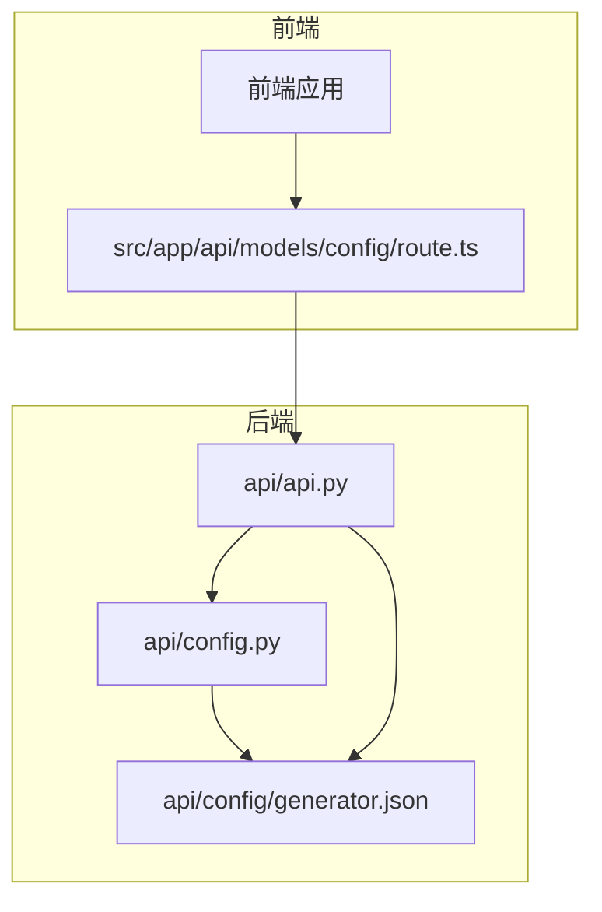
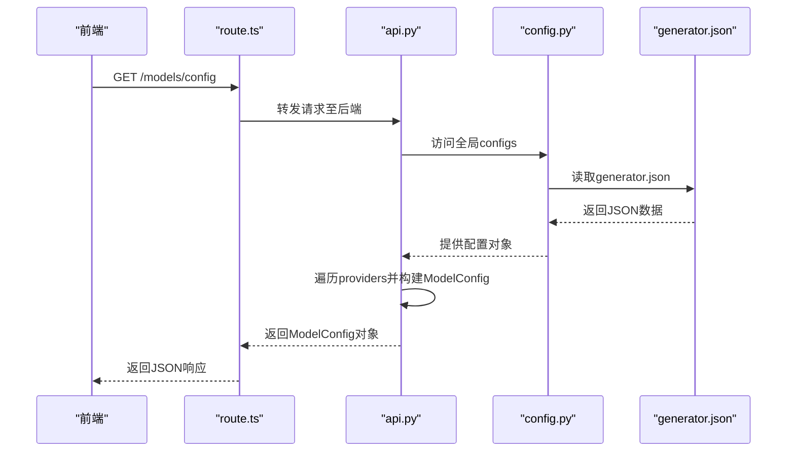
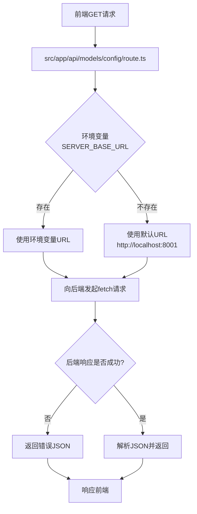
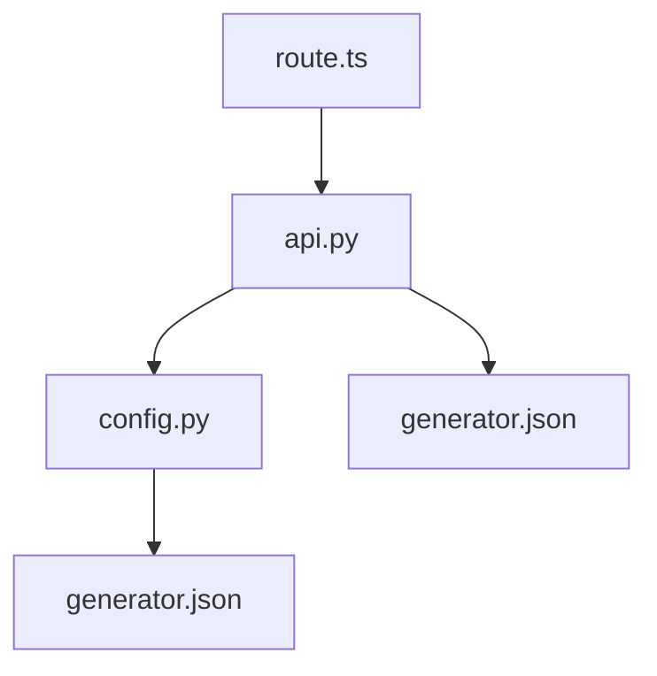

# 模型配置API

<cite>
**本文档中引用的文件**  
- [api.py](file://api/api.py)
- [config.py](file://api/config.py)
- [generator.json](file://api/config/generator.json)
- [route.ts](file://src/app/api/models/config/route.ts)
</cite>

## 目录
1. [简介](#简介)
2. [核心组件](#核心组件)
3. [架构概览](#架构概览)
4. [详细组件分析](#详细组件分析)
5. [依赖分析](#依赖分析)
6. [响应结构与JSON Schema](#响应结构与json-schema)
7. [前端代理机制](#前端代理机制)
8. [结论](#结论)

## 简介
`/models/config` API端点是系统中用于动态获取所有可用LLM（大语言模型）提供商及其支持模型列表的核心接口。该端点为前端应用提供了构建模型选择界面所需的关键配置信息。后端通过读取`api/config/generator.json`等配置文件，动态构建包含`providers`、`id`、`name`、`models`等字段的`ModelConfig`对象并返回。前端通过`src/app/api/models/config/route.ts`代理此请求，实现了对模型选择的动态渲染。

## 核心组件
该API的核心功能由后端`api/api.py`中的`get_model_config`函数实现，该函数从全局配置`configs`中提取数据，并将其格式化为符合`ModelConfig` Pydantic模型的响应。前端通过Next.js路由处理器代理此请求，确保了前后端的解耦和灵活性。

**Section sources**
- [api.py](file://api/api.py#L167-L224)
- [config.py](file://api/config.py#L303)

## 架构概览


**Diagram sources**
- [api.py](file://api/api.py#L167-L224)
- [config.py](file://api/config.py#L303)
- [generator.json](file://api/config/generator.json)

**Section sources**
- [api.py](file://api/api.py#L167-L224)
- [config.py](file://api/config.py#L303)
- [generator.json](file://api/config/generator.json)

## 详细组件分析

### 后端逻辑分析
后端`get_model_config`函数负责从配置文件中读取并组装模型配置信息。



**Diagram sources**
- [api.py](file://api/api.py#L167-L224)
- [config.py](file://api/config.py#L303)
- [generator.json](file://api/config/generator.json)

**Section sources**
- [api.py](file://api/api.py#L167-L224)
- [config.py](file://api/config.py#L303)

### 前端代理分析
前端通过Next.js API路由作为代理，将请求转发给后端服务。



**Diagram sources**
- [route.ts](file://src/app/api/models/config/route.ts)

**Section sources**
- [route.ts](file://src/app/api/models/config/route.ts)

## 依赖分析


**Diagram sources**
- [api.py](file://api/api.py)
- [config.py](file://api/config.py)
- [generator.json](file://api/config/generator.json)
- [route.ts](file://src/app/api/models/config/route.ts)

**Section sources**
- [api.py](file://api/api.py)
- [config.py](file://api/config.py)
- [generator.json](file://api/config/generator.json)
- [route.ts](file://src/app/api/models/config/route.ts)

## 响应结构与JSON Schema
该API返回一个`ModelConfig`对象，其结构定义了前端如何渲染模型选择界面。

```json
{
  "providers": [
    {
      "id": "google",
      "name": "Google",
      "supportsCustomModel": true,
      "models": [
        {
          "id": "gemini-2.5-flash",
          "name": "gemini-2.5-flash"
        },
        {
          "id": "gemini-2.5-pro",
          "name": "gemini-2.5-pro"
        }
      ]
    },
    {
      "id": "openai",
      "name": "OpenAI",
      "supportsCustomModel": true,
      "models": [
        {
          "id": "gpt-5-nano",
          "name": "gpt-5-nano"
        },
        {
          "id": "gpt-4o",
          "name": "gpt-4o"
        }
      ]
    }
  ],
  "defaultProvider": "google"
}
```

**字段说明**:
- `providers`: 包含所有可用LLM提供商的数组。
- `id`: 提供商的唯一标识符（如`google`, `openai`）。
- `name`: 提供商的显示名称。
- `models`: 该提供商支持的模型列表，每个模型有`id`和`name`。
- `supportsCustomModel`: 布尔值，指示该提供商是否支持自定义模型。此字段在前端可用于动态启用或禁用自定义模型输入框。

## 前端代理机制
前端`route.ts`文件作为反向代理，将来自浏览器的请求转发到实际的后端API服务器。这种设计允许前端应用独立部署，并通过环境变量`SERVER_BASE_URL`灵活配置后端地址。如果环境变量未设置，则默认使用`localhost:8001`，便于本地开发。

**Section sources**
- [route.ts](file://src/app/api/models/config/route.ts)

## 结论
`/models/config` API端点通过结合后端配置文件读取和前端代理机制，实现了模型配置的动态化和灵活性。后端`api.py`中的`get_model_config`函数是核心，它利用`config.py`加载的`generator.json`数据，构建出结构化的`ModelConfig`响应。前端通过简单的代理路由即可获取此信息，用于动态渲染模型选择界面。`supportsCustomModel`字段为前端提供了重要的元数据，以决定是否允许用户输入自定义模型名称。整个设计体现了配置驱动和前后端分离的良好实践。