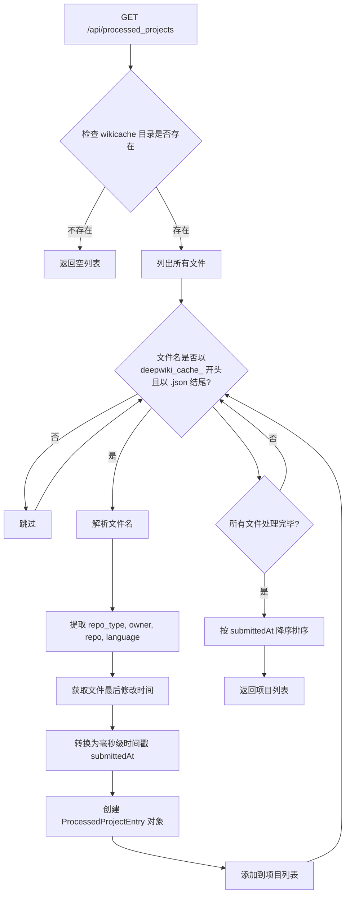

# 维基项目API

<cite>
**本文档引用的文件**
- [api/api.py](file://api/api.py)
- [src/app/api/wiki/projects/route.ts](file://src/app/api/wiki/projects/route.ts)
- [src/types/repoinfo.tsx](file://src/types/repoinfo.tsx)
</cite>

## 目录
1. [简介](#简介)
2. [核心API端点](#核心api端点)
3. [前端集成](#前端集成)
4. [请求与响应示例](#请求与响应示例)
5. [数据模型](#数据模型)

## 简介
本文档详细说明了用于管理已处理维基项目的两个核心API端点：`GET /api/processed_projects` 和 `DELETE /api/wiki_cache`。前者用于获取服务器上所有已缓存的项目列表，供前端展示；后者用于根据查询参数删除指定的缓存文件。文档还解释了前端如何通过 `src/app/api/wiki/projects/route.ts` 文件与这些后端端点进行交互。

**Section sources**
- [api/api.py](file://api/api.py#L577-L633)
- [api/api.py](file://api/api.py#L504-L537)

## 核心API端点

### GET /api/processed_projects
此端点用于扫描服务器上的 `wikicache` 目录，并返回一个 `ProcessedProjectEntry` 对象列表，以在前端展示所有已处理的项目。

#### 工作流程
1.  **目录扫描**：该端点会访问由 `get_adalflow_default_root_path()` 函数定义的 `~/.adalflow/wikicache` 目录。
2.  **文件过滤**：它会列出该目录下的所有文件，并筛选出以 `deepwiki_cache_` 开头且以 `.json` 结尾的文件。
3.  **信息解析**：对于每个匹配的文件，它会解析其文件名。文件名的格式为 `deepwiki_cache_{repo_type}_{owner}_{repo}_{language}.json`。系统会根据下划线 `_` 将文件名拆分，从而提取出 `repo_type`、`owner`、`repo` 和 `language` 等信息。
4.  **时间戳生成**：通过 `os.stat()` 获取文件的最后修改时间（`st_mtime`），并将其转换为毫秒级的时间戳，作为 `submittedAt` 字段的值。
5.  **结果排序**：最终的项目列表会根据 `submittedAt` 时间戳进行降序排序，确保最近处理的项目排在最前面。



**Diagram sources**
- [api/api.py](file://api/api.py#L577-L633)

**Section sources**
- [api/api.py](file://api/api.py#L577-L633)

### DELETE /api/wiki_cache
此端点用于根据提供的查询参数删除指定的维基缓存文件。

#### 关键特性
- **身份验证**：当服务器配置了 `WIKI_AUTH_MODE` 时，此端点需要一个有效的 `authorization_code` 查询参数。如果未提供或提供的代码与服务器配置的 `WIKI_AUTH_CODE` 不匹配，将返回401错误。
- **参数依赖**：删除操作依赖于 `owner`、`repo`、`repo_type` 和 `language` 四个查询参数来精确生成要删除的缓存文件路径。
- **幂等性**：如果指定的缓存文件不存在，端点会返回404错误，这有助于客户端了解操作状态。

```mermaid
sequenceDiagram
participant Frontend as 前端
participant API as 后端API
participant FS as 文件系统
Frontend->>API : DELETE /api/wiki_cache?<br/>owner=...&repo=...&<br/>repo_type=...&language=...&<br/>authorization_code=...
API->>API : 验证 language 参数
alt WIKI_AUTH_MODE 启用
API->>API : 验证 authorization_code
alt 代码无效
API-->>Frontend : HTTP 401 Unauthorized
return
end
end
API->>API : 调用 get_wiki_cache_path()<br/>生成文件路径
API->>FS : 检查文件是否存在
alt 文件存在
FS-->>API : 存在
API->>FS : 执行 os.remove() 删除文件
FS-->>API : 删除成功
API-->>Frontend : HTTP 200 OK<br/>{message : "..."}
else 文件不存在
FS-->>API : 不存在
API-->>Frontend : HTTP 404 Not Found
end
alt 删除失败
FS--xAPI : 抛出异常
API-->>Frontend : HTTP 500 Internal Server Error
end
```

**Diagram sources**
- [api/api.py](file://api/api.py#L504-L537)

**Section sources**
- [api/api.py](file://api/api.py#L504-L537)

## 前端集成
前端通过 `src/app/api/wiki/projects/route.ts` 文件中的API路由与后端进行交互，实现了项目列表的获取和删除功能。

### GET 请求处理
`GET` 函数向 `http://localhost:8001/api/processed_projects` 发起一个 `fetch` 请求。它设置了 `cache: 'no-store'` 以确保每次都能获取到最新的项目列表。如果请求成功，它会将后端返回的 `ProcessedProjectEntry` 对象数组直接返回给调用者。如果请求失败，它会捕获错误并返回相应的错误信息。

### DELETE 请求处理
`DELETE` 函数首先验证请求体（request body）是否符合 `DeleteProjectCachePayload` 接口的定义，确保 `owner`、`repo`、`repo_type` 和 `language` 四个字段都存在且为非空字符串。验证通过后，它会将这些参数作为查询参数（query parameters）附加到 `DELETE /api/wiki_cache` 的URL上，并发起删除请求。成功后返回成功消息，失败则返回错误详情。

**Section sources**
- [src/app/api/wiki/projects/route.ts](file://src/app/api/wiki/projects/route.ts#L50-L103)

## 请求与响应示例

### 获取已处理项目列表 (GET)
**请求**
```
GET /api/processed_projects HTTP/1.1
Host: localhost:8001
```

**响应**
```json
[
  {
    "id": "deepwiki_cache_github_AsyncFuncAI_deepwiki-open_en.json",
    "owner": "AsyncFuncAI",
    "repo": "deepwiki-open",
    "name": "AsyncFuncAI/deepwiki-open",
    "repo_type": "github",
    "submittedAt": 1701234567890,
    "language": "en"
  },
  {
    "id": "deepwiki_cache_gitlab_user_project_zh.json",
    "owner": "user",
    "repo": "project",
    "name": "user/project",
    "repo_type": "gitlab",
    "submittedAt": 1701234567000,
    "language": "zh"
  }
]
```

### 删除缓存 (DELETE)
**请求**
```
DELETE /api/wiki_cache?owner=AsyncFuncAI&repo=deepwiki-open&repo_type=github&language=en&authorization_code=your_secret_code HTTP/1.1
Host: localhost:8001
Content-Type: application/json
```

**成功响应**
```json
{
  "message": "Wiki cache for AsyncFuncAI/deepwiki-open (en) deleted successfully"
}
```

**失败响应 (授权失败)**
```json
{
  "detail": "Authorization code is invalid"
}
```

## 数据模型

### ProcessedProjectEntry
这是 `GET /api/processed_projects` 端点返回的核心数据模型。

| 属性 | 类型 | 描述 |
| :--- | :--- | :--- |
| `id` | `string` | 缓存文件的完整文件名。 |
| `owner` | `string` | 仓库所有者（例如，GitHub用户名）。 |
| `repo` | `string` | 仓库名称。 |
| `name` | `string` | `owner` 和 `repo` 的组合，格式为 `owner/repo`。 |
| `repo_type` | `string` | 仓库类型，可能的取值包括 `github`、`gitlab` 等。 |
| `submittedAt` | `number` | 时间戳，表示缓存文件的最后修改时间，单位为**毫秒**。 |
| `language` | `string` | 缓存内容的语言代码，例如 `en` (英语)、`zh` (中文)。 |

**Section sources**
- [api/api.py](file://api/api.py#L50-L57)