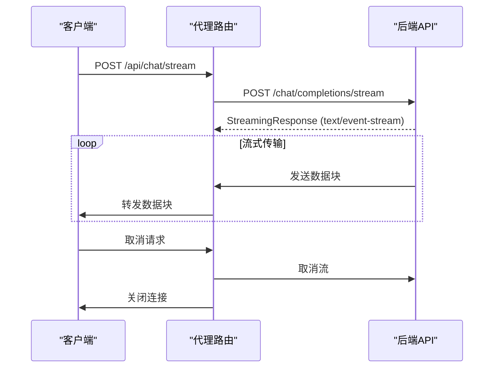
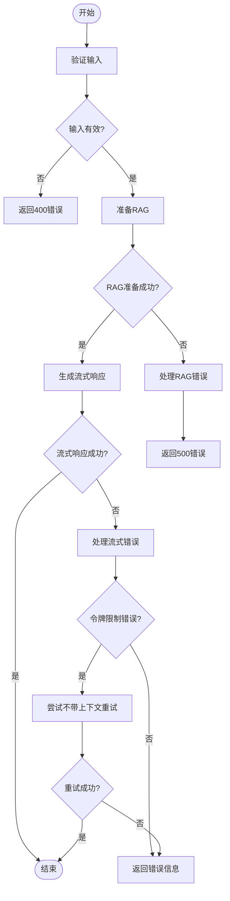

# 聊天API

<cite>
**本文档中引用的文件**  
- [simple_chat.py](file://api/simple_chat.py)
- [websocket_wiki.py](file://api/websocket_wiki.py)
- [dashscope_client.py](file://api/dashscope_client.py)
- [bedrock_client.py](file://api/bedrock_client.py)
</cite>

## 更新摘要
**已更新内容**  
- 在`simple_chat.py`和`websocket_wiki.py`中添加了对`dashscope`和`bedrock`作为provider的支持
- 更新了流式响应处理逻辑，以支持新的provider
- 添加了新的错误处理消息，针对Dashscope和AWS Bedrock API
- 更新了请求体结构，以反映新的provider选项

## 目录
1. [简介](#简介)
2. [API端点与SSE实现](#api端点与sse实现)
3. [请求结构](#请求结构)
4. [后端流式响应生成](#后端流式响应生成)
5. [前端代理调用](#前端代理调用)
6. [请求/响应示例](#请求响应示例)
7. [错误处理](#错误处理)
8. [性能优化建议](#性能优化建议)
9. [与WebSocket端点的关系](#与websocket端点的关系)

## 简介
`/chat/completions/stream` 是一个基于服务器发送事件（SSE）的流式聊天API端点，用于实时获取聊天补全响应。该API通过HTTP流式传输技术，允许客户端逐步接收大型响应内容，而无需等待整个响应生成完成。此文档详细说明了该API的实现机制、请求/响应格式、错误处理以及与WebSocket端点的关系。

## API端点与SSE实现
`/chat/completions/stream` API端点使用HTTP POST方法，通过SSE（Server-Sent Events）协议实现流式响应。SSE是一种允许服务器向客户端推送实时更新的技术，特别适用于需要持续传输数据的场景，如聊天应用。

该API的实现依赖于FastAPI框架的`StreamingResponse`类，它能够将异步生成器函数的输出作为流式响应返回。响应的媒体类型设置为`text/event-stream`，这是SSE的标准MIME类型。

**Section sources**
- [simple_chat.py](file://api/simple_chat.py#L75-L739)

## 请求结构
### HTTP方法
- **POST**: 用于发送聊天补全请求。

### 请求头
- **Content-Type**: `application/json` - 指定请求体为JSON格式。
- **Accept**: `text/event-stream` - 指示客户端期望接收SSE流式响应。

### 请求体
请求体是一个JSON对象，包含以下字段：

| 字段 | 类型 | 必需 | 描述 |
|------|------|------|------|
| repo_url | string | 是 | 要查询的仓库URL |
| messages | array | 是 | 聊天消息列表，每个消息包含role和content |
| filePath | string | 否 | 仓库中要包含在提示中的文件路径 |
| token | string | 否 | 私有仓库的个人访问令牌 |
| type | string | 否 | 仓库类型（如'github', 'gitlab', 'bitbucket'） |
| provider | string | 是 | 模型提供商（如'google', 'openai', 'openrouter', 'ollama', 'bedrock', 'azure', 'dashscope'） |
| model | string | 否 | 指定提供商的模型名称 |
| language | string | 否 | 内容生成的语言（如'en', 'ja', 'zh', 'es', 'kr', 'vi'） |
| excluded_dirs | string | 否 | 以逗号分隔的要排除的目录列表 |
| excluded_files | string | 否 | 以逗号分隔的要排除的文件模式列表 |
| included_dirs | string | 否 | 要独占包含的目录列表 |
| included_files | string | 否 | 要独占包含的文件模式列表 |

**Section sources**
- [simple_chat.py](file://api/simple_chat.py#L54-L72)

## 后端流式响应生成
后端`api/simple_chat.py`中的`chat_completions_stream`函数负责生成流式响应。该函数的主要流程如下：

1. **输入验证**: 检查请求是否包含消息，且最后一条消息的角色是否为"user"。
2. **RAG准备**: 创建RAG（Retrieval-Augmented Generation）实例，准备检索器以从指定仓库中检索相关文档。
3. **上下文构建**: 根据用户消息构建对话历史和系统提示，包括仓库信息、语言设置等。
4. **模型配置**: 根据指定的提供商和模型获取相应的配置参数。
5. **流式响应生成**: 创建一个异步生成器函数`response_stream`，该函数根据不同的模型提供商调用相应的API，并将响应逐块yield给客户端。

对于不同的模型提供商，响应处理方式有所不同：
- **Ollama**: 处理Ollama客户端的流式响应，过滤掉不必要的元数据。
- **OpenRouter**: 处理OpenRouter API的流式响应，捕获并处理可能的API错误。
- **OpenAI**: 处理OpenAI API的流式响应，提取delta中的内容。
- **AWS Bedrock**: 处理Bedrock API的响应（目前不支持流式）。
- **Azure AI**: 处理Azure AI服务的流式响应。
- **Google**: 使用Google Generative AI的`generate_content`方法生成流式响应。
- **Dashscope**: 处理阿里云通义千问API的流式响应，通过OpenAI兼容接口实现。

当遇到令牌限制错误时，系统会尝试使用简化提示（不包含上下文）重新生成响应。

**Section sources**
- [simple_chat.py](file://api/simple_chat.py#L75-L739)
- [dashscope_client.py](file://api/dashscope_client.py#L104-L649)
- [bedrock_client.py](file://api/bedrock_client.py#L20-L467)

## 前端代理调用
前端通过`src/app/api/chat/stream/route.ts`中的代理路由调用后端API。该代理路由的主要功能是：

1. 接收来自客户端的JSON请求。
2. 将请求转发到后端服务`/chat/completions/stream`端点。
3. 创建一个`ReadableStream`来从后端流式读取数据，并将其转发给客户端。
4. 处理可能出现的错误，并将错误信息转发给客户端。

代理路由还处理了客户端取消流请求的情况，确保资源得到正确释放。



**Diagram sources**
- [route.ts](file://src/app/api/chat/stream/route.ts#L1-L113)
- [simple_chat.py](file://api/simple_chat.py#L75-L739)

**Section sources**
- [route.ts](file://src/app/api/chat/stream/route.ts#L1-L113)

## 请求/响应示例
### 成功流示例
**请求**:
```json
{
  "repo_url": "https://github.com/example/repo",
  "messages": [
    {
      "role": "user",
      "content": "请解释这个项目的架构"
    }
  ],
  "provider": "dashscope",
  "model": "qwen-max"
}
```

**响应**:
服务器将开始发送SSE事件，每个事件包含响应的一部分文本，直到完整响应生成完毕。

### 客户端断开连接处理
当客户端断开连接时，代理路由会捕获`cancel`事件，并释放相关资源。后端API也会检测到连接中断，并停止生成响应。

**Section sources**
- [route.ts](file://src/app/api/chat/stream/route.ts#L1-L113)
- [simple_chat.py](file://api/simple_chat.py#L75-L739)

## 错误处理
API实现了全面的错误处理机制：

1. **HTTP异常**: 对于无效请求（如缺少消息或最后一条消息不是用户消息），抛出400 Bad Request错误。
2. **RAG准备错误**: 在准备检索器时，如果出现"没有找到有效的文档嵌入"或"嵌入大小不一致"等错误，抛出500 Internal Server Error，并提供详细的错误信息。
3. **流式响应错误**: 在流式响应过程中，捕获并处理各种提供商API的错误，如OpenRouter、OpenAI、AWS Bedrock和Azure AI的API调用错误。
4. **令牌限制错误**: 当请求超出推荐的令牌限制（8000 tokens）时，系统会尝试使用简化提示重新生成响应。
5. **其他错误**: 对于其他未预期的错误，抛出500 Internal Server Error，并记录错误日志。

新增的错误处理包括：
- **Dashscope API错误**: 当Dashscope API调用失败时，返回详细的错误信息，并提示用户检查`DASHSCOPE_API_KEY`和`DASHSCOPE_WORKSPACE_ID`环境变量。
- **AWS Bedrock API错误**: 当Bedrock API调用失败时，返回详细的错误信息，并提示用户检查`AWS_ACCESS_KEY_ID`和`AWS_SECRET_ACCESS_KEY`环境变量。



**Diagram sources**
- [simple_chat.py](file://api/simple_chat.py#L75-L739)

**Section sources**
- [simple_chat.py](file://api/simple_chat.py#L75-L739)

## 性能优化建议
1. **保持连接**: 由于SSE是长连接，建议客户端保持连接以减少连接建立的开销。
2. **处理延迟**: 对于大型响应，客户端应实现适当的缓冲和流式处理逻辑，以提供平滑的用户体验。
3. **输入大小控制**: 避免发送过大的输入，因为超过8000 tokens的请求可能会导致性能下降或需要重试。
4. **错误重试机制**: 实现客户端重试逻辑，以应对临时的网络问题或API错误。
5. **资源清理**: 确保在客户端断开连接时正确清理相关资源，避免内存泄漏。

**Section sources**
- [simple_chat.py](file://api/simple_chat.py#L75-L739)
- [route.ts](file://src/app/api/chat/stream/route.ts#L1-L113)

## 与WebSocket端点的关系
`/chat/completions/stream` API与WebSocket端点`/ws/chat`在功能上相似，都用于实现实时聊天。然而，它们在实现方式和使用场景上有所不同：

- **SSE端点** (`/chat/completions/stream`): 使用HTTP协议，适合简单的单向数据流（服务器到客户端）。实现简单，兼容性好，但不支持双向通信。
- **WebSocket端点** (`/ws/chat`): 使用WebSocket协议，支持全双工通信，允许客户端和服务器之间进行双向数据交换。适合需要复杂交互的场景，但实现相对复杂。

在当前实现中，`/api/chat/stream`代理路由注释中提到"Note: This endpoint now uses the HTTP fallback instead of WebSockets"，表明该端点作为WebSocket的HTTP回退方案使用。当WebSocket不可用或出现错误时，系统会自动切换到HTTP流式传输。

**Section sources**
- [route.ts](file://src/app/api/chat/stream/route.ts#L1-L113)
- [websocket_wiki.py](file://api/websocket_wiki.py#L62-L894)