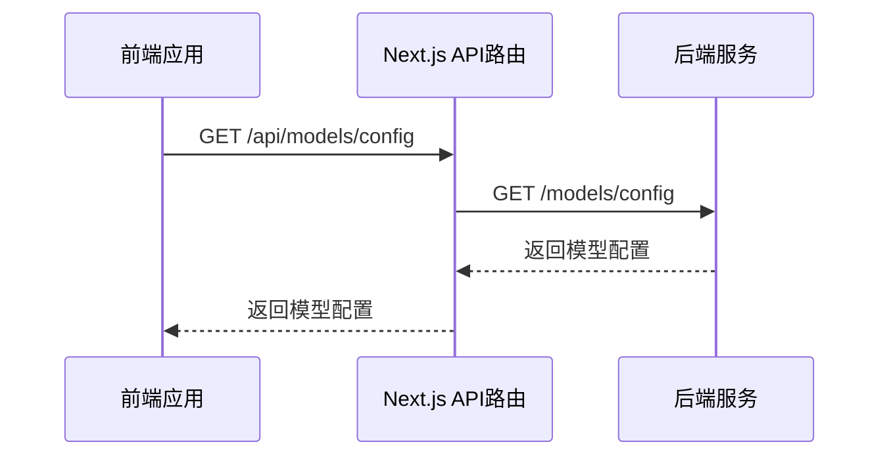
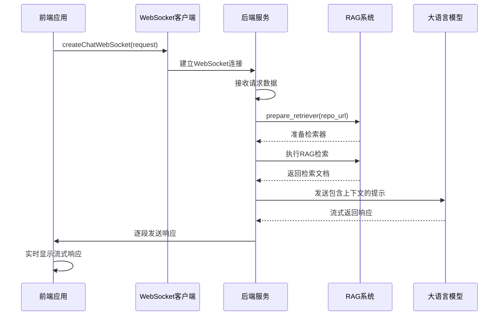
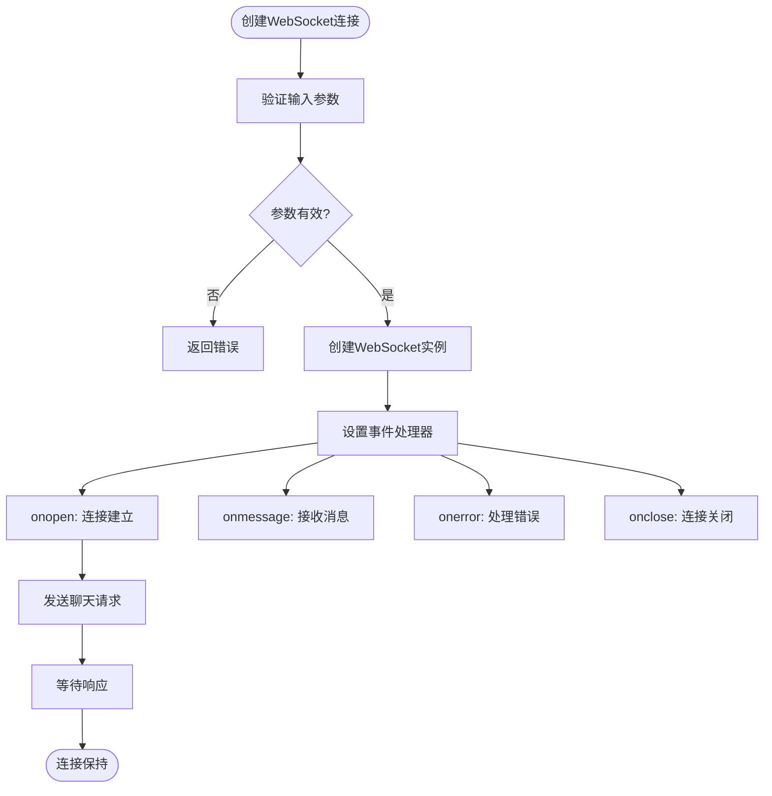
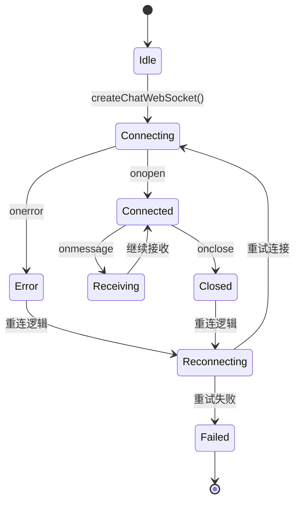
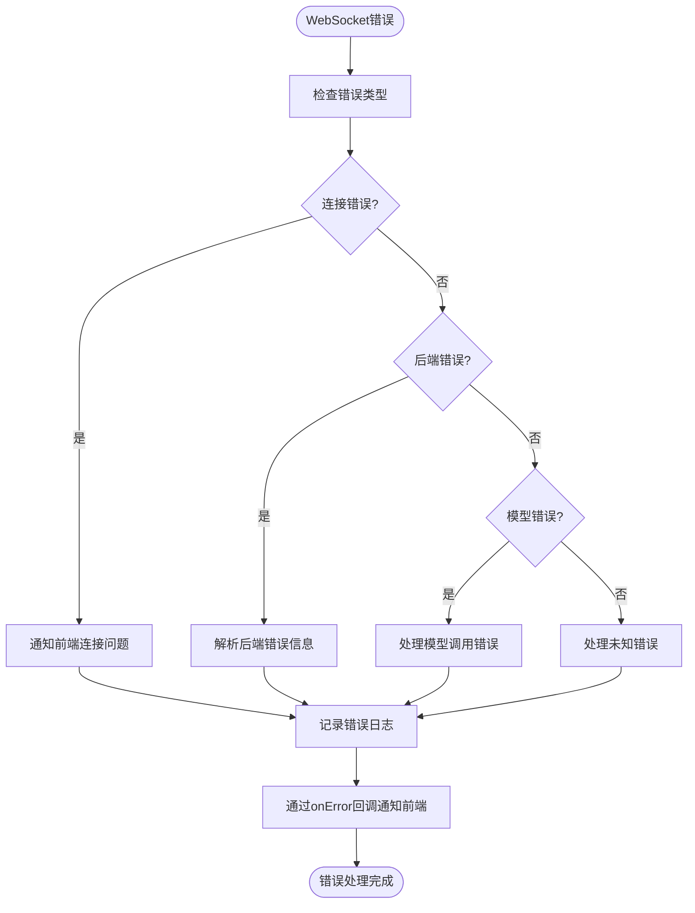

# API集成与通信

<cite>
**本文档中引用的文件**  
- [websocketClient.ts](file://src/utils/websocketClient.ts)
- [websocket_wiki.py](file://api/websocket_wiki.py)
- [route.ts](file://src/app/api/models/config/route.ts)
- [route.ts](file://src/app/api/chat/stream/route.ts)
- [config.py](file://api/config.py)
- [generator.json](file://api/config/generator.json)
- [api.py](file://api/api.py)
</cite>

## 目录
1. [简介](#简介)
2. [模型配置获取](#模型配置获取)
3. [聊天流式通信](#聊天流式通信)
4. [WebSocket客户端封装](#websocket客户端封装)
5. [消息格式与通信协议](#消息格式与通信协议)
6. [心跳机制与错误重连](#心跳机制与错误重连)
7. [常见网络错误处理](#常见网络错误处理)
8. [总结](#总结)

## 简介
本文档详细说明了前端与后端API的集成方式，重点介绍如何通过`/api/models/config`路由获取当前可用的模型配置，以及如何在聊天界面中通过`/api/chat/stream`路由建立流式通信。文档还解释了`websocketClient.ts`工具如何封装WebSocket连接，实现与`websocket_wiki.py`后端服务的实时消息收发，包括连接建立、消息格式、心跳机制与错误重连策略。同时提供API调用的代码片段路径、请求/响应示例及常见网络错误的处理方案。

## 模型配置获取
前端通过`/api/models/config`路由获取当前可用的模型配置。该路由作为代理，将请求转发到后端服务的`/models/config`端点。

**Diagram sources**
- [route.ts](file://src/app/api/models/config/route.ts#L1-L48)
- [api.py](file://api/api.py#L167-L224)

**Section sources**
- [route.ts](file://src/app/api/models/config/route.ts#L1-L48)
- [api.py](file://api/api.py#L167-L224)

## 聊天流式通信
聊天界面通过WebSocket建立流式通信，替代了传统的HTTP流式传输。前端使用`websocketClient.ts`中的`createChatWebSocket`函数建立连接，后端由`websocket_wiki.py`中的`handle_websocket_chat`函数处理。

**Diagram sources**
- [websocketClient.ts](file://src/utils/websocketClient.ts#L1-L85)
- [websocket_wiki.py](file://api/websocket_wiki.py#L51-L768)

**Section sources**
- [websocketClient.ts](file://src/utils/websocketClient.ts#L1-L85)
- [websocket_wiki.py](file://api/websocket_wiki.py#L51-L768)

## WebSocket客户端封装
`websocketClient.ts`文件封装了WebSocket连接的创建和管理，提供了简洁的API供前端组件使用。

### 连接建立
客户端通过`createChatWebSocket`函数建立WebSocket连接，该函数接收聊天请求、消息回调、错误回调和关闭回调作为参数。

**Diagram sources**
- [websocketClient.ts](file://src/utils/websocketClient.ts#L1-L85)

**Section sources**
- [websocketClient.ts](file://src/utils/websocketClient.ts#L1-L85)

## 消息格式与通信协议
前后端通过WebSocket传输JSON格式的消息，遵循特定的通信协议。

### 请求消息格式
前端向后端发送的请求消息包含以下字段：

| 字段 | 类型 | 描述 |
|------|------|------|
| repo_url | string | 仓库URL |
| messages | ChatMessage[] | 聊天消息数组 |
| filePath | string? | 文件路径 |
| token | string? | 访问令牌 |
| type | string? | 仓库类型 |
| provider | string | 模型提供商 |
| model | string? | 模型名称 |
| language | string? | 语言代码 |
| excluded_dirs | string? | 排除的目录 |
| excluded_files | string? | 排除的文件 |

### 响应消息格式
后端向前端发送的响应消息为纯文本流，包含以下类型：

| 类型 | 描述 |
|------|------|
| 文本流 | LLM生成的响应文本，逐段发送 |
| 错误消息 | 以"Error:"开头的错误信息 |
| 系统消息 | 连接状态信息 |

**Section sources**
- [websocketClient.ts](file://src/utils/websocketClient.ts#L1-L85)
- [websocket_wiki.py](file://api/websocket_wiki.py#L51-L768)

## 心跳机制与错误重连
系统实现了心跳机制和错误重连策略，确保连接的稳定性和可靠性。

### 心跳机制
WebSocket连接建立后，系统会定期检查连接状态。当前实现中，通过WebSocket的内置机制来维持连接，当连接中断时会触发相应的事件处理器。

### 错误重连策略
当连接出现错误或关闭时，前端可以根据业务需求实现重连逻辑。虽然`websocketClient.ts`中没有直接实现自动重连，但提供了必要的回调函数，便于上层应用实现重连策略。

**Diagram sources**
- [websocketClient.ts](file://src/utils/websocketClient.ts#L1-L85)

**Section sources**
- [websocketClient.ts](file://src/utils/websocketClient.ts#L1-L85)

## 常见网络错误处理
系统对常见的网络错误进行了处理，确保用户体验的流畅性。

### 错误类型与处理
| 错误类型 | 处理方式 |
|---------|---------|
| WebSocket连接错误 | 通过`onError`回调通知前端 |
| 后端服务不可用 | 前端显示连接失败提示 |
| 请求超时 | 后端在合理时间内响应或关闭连接 |
| 认证失败 | 返回相应的错误信息 |
| 模型调用错误 | 返回具体的错误描述 |

### 错误处理流程

**Diagram sources**
- [websocketClient.ts](file://src/utils/websocketClient.ts#L1-L85)
- [websocket_wiki.py](file://api/websocket_wiki.py#L51-L768)

**Section sources**
- [websocketClient.ts](file://src/utils/websocketClient.ts#L1-L85)
- [websocket_wiki.py](file://api/websocket_wiki.py#L51-L768)

## 总结
本文档详细介绍了前端与后端API的集成方式，包括模型配置获取、聊天流式通信、WebSocket客户端封装、消息格式与通信协议、心跳机制与错误重连策略，以及常见网络错误的处理方案。通过WebSocket实现的流式通信提供了更好的用户体验，而完善的错误处理机制确保了系统的稳定性和可靠性。