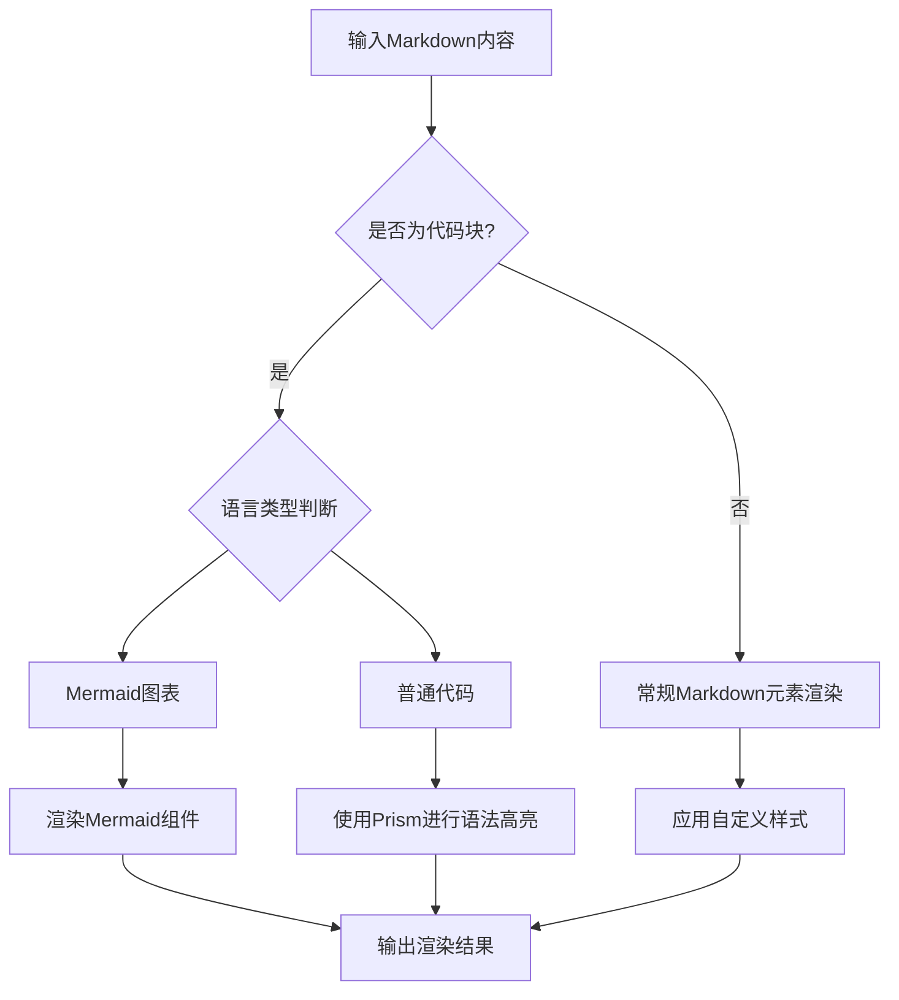
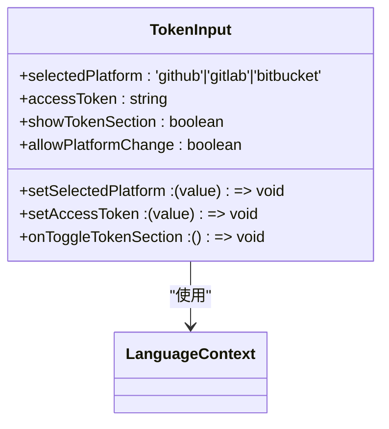
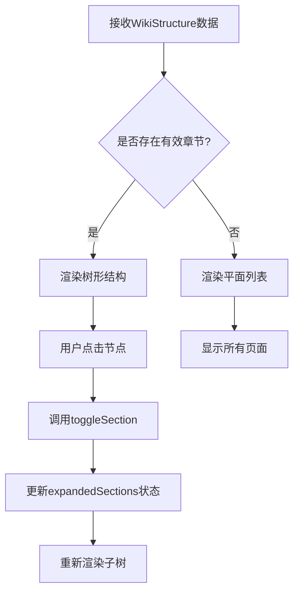
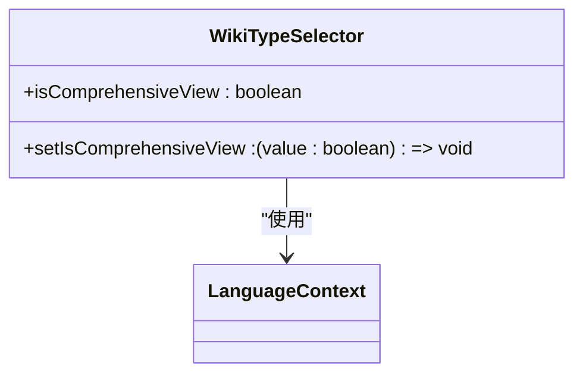
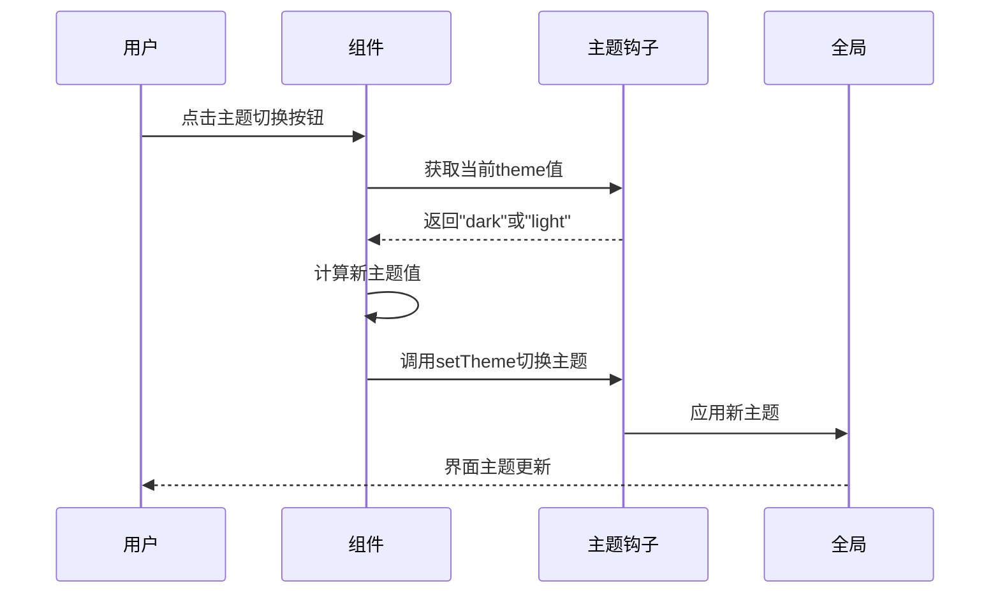
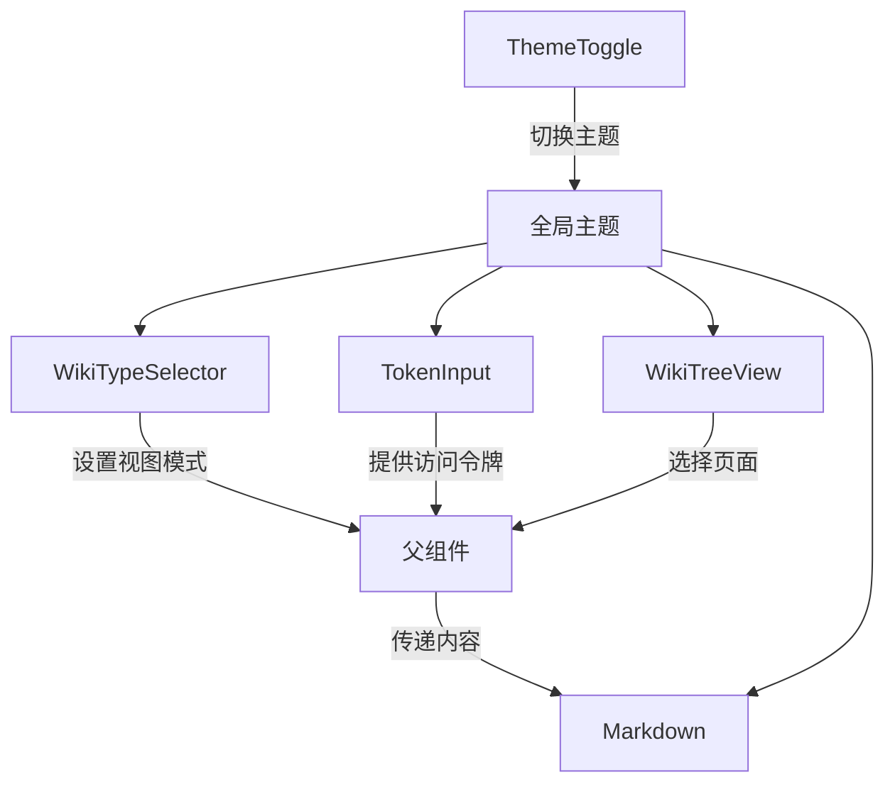

# UI组件库

<cite>
**本文档中引用的文件**  
- [Markdown.tsx](file://src/components/Markdown.tsx)
- [TokenInput.tsx](file://src/components/TokenInput.tsx)
- [WikiTreeView.tsx](file://src/components/WikiTreeView.tsx)
- [WikiTypeSelector.tsx](file://src/components/WikiTypeSelector.tsx)
- [theme-toggle.tsx](file://src/components/theme-toggle.tsx)
</cite>

## 目录
1. [简介](#简介)
2. [核心UI组件分析](#核心ui组件分析)
3. [Markdown渲染组件](#markdown渲染组件)
4. [令牌输入组件](#令牌输入组件)
5. [维基树形视图组件](#维基树形视图组件)
6. [维基类型选择器组件](#维基类型选择器组件)
7. [主题切换组件](#主题切换组件)
8. [组件组合与使用示例](#组件组合与使用示例)
9. [结论](#结论)

## 简介
本文档深入分析了DeepWiki项目中前端核心UI组件的设计与实现。重点说明了各组件的功能特性、接口定义、安全机制及交互逻辑，涵盖Markdown内容渲染、敏感信息输入、目录结构展示、文档类型切换和主题偏好管理等关键功能。

## 核心UI组件分析
本节对项目中的核心UI组件进行系统性分析，涵盖其设计目标、实现机制和集成方式。所有组件均位于`src/components`目录下，采用React函数式组件与TypeScript类型系统构建，确保类型安全与可维护性。

**Section sources**
- [Markdown.tsx](file://src/components/Markdown.tsx#L1-L207)
- [TokenInput.tsx](file://src/components/TokenInput.tsx#L1-L107)
- [WikiTreeView.tsx](file://src/components/WikiTreeView.tsx#L1-L183)
- [WikiTypeSelector.tsx](file://src/components/WikiTypeSelector.tsx#L1-L78)
- [theme-toggle.tsx](file://src/components/theme-toggle.tsx#L1-L49)

## Markdown渲染组件

### 功能概述
`Markdown.tsx`组件负责安全地渲染由大语言模型（LLM）生成的Markdown内容，并支持代码高亮、Mermaid图表渲染等高级功能。通过集成`react-markdown`、`remark-gfm`和`rehype-raw`等库，实现了对GitHub Flavored Markdown的完整支持。

### 安全渲染机制
组件通过以下方式确保渲染安全：
- 使用`rehype-raw`插件允许原始HTML解析，同时依赖React的内置XSS防护
- 对代码块进行语法高亮处理，使用`react-syntax-highlighter`库支持多种编程语言
- 特殊处理Mermaid图表代码块，将其转换为可交互的SVG图表

### 代码高亮实现


**Diagram sources**
- [Markdown.tsx](file://src/components/Markdown.tsx#L12-L205)

### Props接口定义
```typescript
interface MarkdownProps {
  content: string; // 要渲染的Markdown内容
}
```

**Section sources**
- [Markdown.tsx](file://src/components/Markdown.tsx#L10-L207)

## 令牌输入组件

### 功能概述
`TokenInput.tsx`组件用于处理GitHub、GitLab和Bitbucket等平台的个人访问令牌（PAT）输入与管理。该组件特别设计用于访问私有代码仓库时的身份验证。

### 敏感信息处理
组件通过以下机制保障敏感信息的安全：
- 输入字段类型为`password`，隐藏实际输入内容
- 令牌值通过React状态管理，仅在客户端内存中存在
- 明确提示用户"您的令牌仅存储在本地，不会发送到我们的服务器"

### 本地存储策略
组件本身不直接进行持久化存储，而是通过父组件的状态管理（`setAccessToken`）来控制令牌的生命周期。实际存储由调用方决定，通常结合浏览器的`localStorage`或`sessionStorage`实现。



**Diagram sources**
- [TokenInput.tsx](file://src/components/TokenInput.tsx#L15-L107)
- [LanguageContext.tsx](file://src/contexts/LanguageContext.tsx)

### Props接口定义
```typescript
interface TokenInputProps {
  selectedPlatform: 'github' | 'gitlab' | 'bitbucket';
  setSelectedPlatform: (value: 'github' | 'gitlab' | 'bitbucket') => void;
  accessToken: string;
  setAccessToken: (value: string) => void;
  showTokenSection?: boolean;
  onToggleTokenSection?: () => void;
  allowPlatformChange?: boolean;
}
```

**Section sources**
- [TokenInput.tsx](file://src/components/TokenInput.tsx#L3-L107)

## 维基树形视图组件

### 功能概述
`WikiTreeView.tsx`组件用于展示代码库的目录结构树形视图，支持交互式展开/折叠操作。该组件基于`WikiStructure`数据模型构建，能够清晰地呈现文档的层级关系。

### 交互式展开实现
组件使用React的`useState`钩子维护展开状态，通过`Set<string>`数据结构高效管理已展开的节点ID。点击节点时触发`toggleSection`函数，更新状态并重新渲染相应子树。

### 结构回退机制
当数据结构中缺少有效的章节定义时，组件会自动回退到平面列表视图，确保在数据不完整的情况下仍能正常显示内容。



**Diagram sources**
- [WikiTreeView.tsx](file://src/components/WikiTreeView.tsx#L44-L181)

### Props接口定义
```typescript
interface WikiTreeViewProps {
  wikiStructure: WikiStructure;
  currentPageId: string | undefined;
  onPageSelect: (pageId: string) => void;
  messages?: {
    pages?: string;
    [key: string]: string | undefined;
  };
}
```

**Section sources**
- [WikiTreeView.tsx](file://src/components/WikiTreeView.tsx#L34-L183)
- [wikistructure.tsx](file://src/types/wiki/wikistructure.tsx)

## 维基类型选择器组件

### 功能概述
`WikiTypeSelector.tsx`组件提供文档类型切换功能，允许用户在"综合"和"简洁"两种视图模式之间进行选择。该功能通过`isComprehensiveView`布尔值控制，影响后续的文档生成策略。

### 用户界面设计
组件采用卡片式布局，包含图标、标题和描述文本，提供清晰的视觉反馈。选中状态通过背景色、边框和选中标记进行突出显示。

### 国际化支持
组件通过`useLanguage`钩子获取多语言消息，支持包括中文在内的多种语言界面。



**Diagram sources**
- [WikiTypeSelector.tsx](file://src/components/WikiTypeSelector.tsx#L11-L75)
- [LanguageContext.tsx](file://src/contexts/LanguageContext.tsx)

### Props接口定义
```typescript
interface WikiTypeSelectorProps {
  isComprehensiveView: boolean;
  setIsComprehensiveView: (value: boolean) => void;
}
```

**Section sources**
- [WikiTypeSelector.tsx](file://src/components/WikiTypeSelector.tsx#L9-L78)

## 主题切换组件

### 功能概述
`theme-toggle.tsx`组件实现亮色/暗色主题的切换功能，基于系统偏好或用户选择动态调整界面外观。组件使用`next-themes`库管理主题状态。

### 切换机制
组件通过`useTheme`钩子获取当前主题状态，点击按钮时执行`setTheme(theme === "dark" ? "light" : "dark")`，实现主题切换。切换过程包含平滑的过渡动画。

### 视觉设计
采用日式风格的太阳/月亮图标，通过CSS类的透明度切换实现图标动画效果。图标设计简洁，符合现代UI审美。



**Diagram sources**
- [theme-toggle.tsx](file://src/components/theme-toggle.tsx#L4-L48)
- [next-themes](https://www.npmjs.com/package/next-themes)

### Props接口定义
该组件无外部Props，完全通过内部状态管理主题切换逻辑。

**Section sources**
- [theme-toggle.tsx](file://src/components/theme-toggle.tsx#L1-L49)

## 组件组合与使用示例

### 典型使用场景
以下示例展示各组件在页面中的组合方式：

```tsx
<WikiLayout>
  <WikiTypeSelector 
    isComprehensiveView={isComprehensive} 
    setIsComprehensiveView={setIsComprehensive} 
  />
  <TokenInput 
    selectedPlatform={platform}
    setSelectedPlatform={setPlatform}
    accessToken={token}
    setAccessToken={setToken}
    onToggleTokenSection={toggleTokenSection}
  />
  <div className="flex">
    <WikiTreeView 
      wikiStructure={wikiData}
      currentPageId={currentId}
      onPageSelect={handlePageSelect}
    />
    <div className="flex-1">
      <Markdown content={currentPageContent} />
    </div>
  </div>
  <ThemeToggle />
</WikiLayout>
```

### 组件交互关系


**Diagram sources**
- [Markdown.tsx](file://src/components/Markdown.tsx)
- [TokenInput.tsx](file://src/components/TokenInput.tsx)
- [WikiTreeView.tsx](file://src/components/WikiTreeView.tsx)
- [WikiTypeSelector.tsx](file://src/components/WikiTypeSelector.tsx)
- [theme-toggle.tsx](file://src/components/theme-toggle.tsx)

## 结论
本文档详细分析了DeepWiki项目中的核心UI组件，涵盖了从安全渲染到敏感信息处理，从结构展示到主题管理的各个方面。这些组件共同构成了一个功能完整、用户体验良好的前端界面，为代码库的智能文档生成提供了坚实的基础。各组件设计合理，接口清晰，具备良好的可复用性和扩展性。