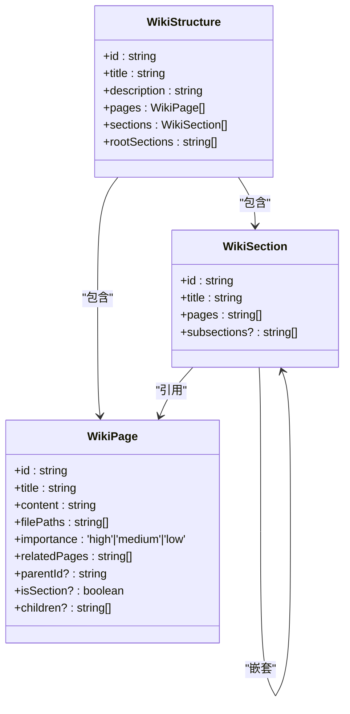
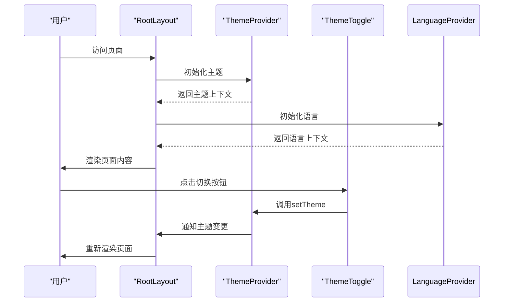
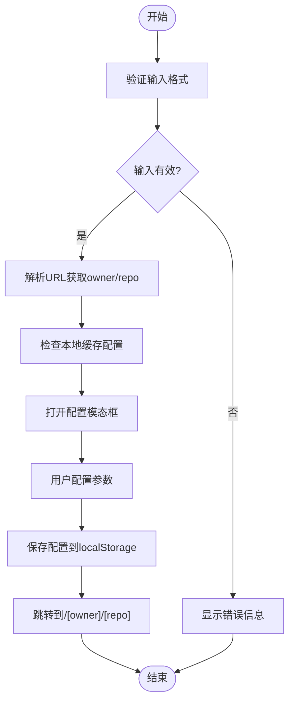
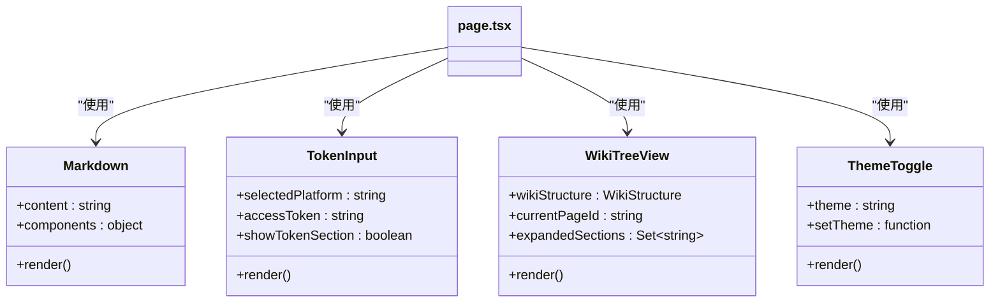
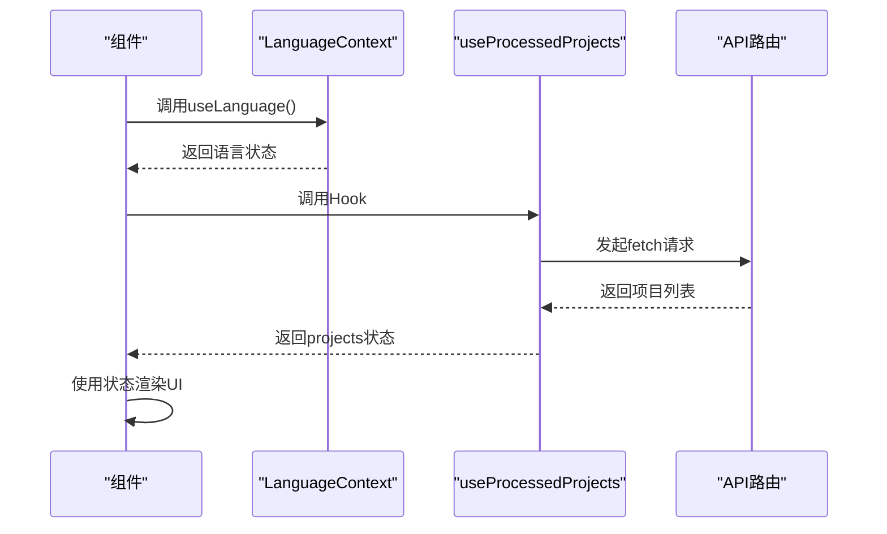

# 前端架构

<cite>
**本文档中引用的文件**  
- [layout.tsx](file://src/app/layout.tsx)
- [page.tsx](file://src/app/page.tsx)
- [\[owner\]/\[repo\]/page.tsx](file://src/app/[owner]/[repo]/page.tsx)
- [Markdown.tsx](file://src/components/Markdown.tsx)
- [TokenInput.tsx](file://src/components/TokenInput.tsx)
- [WikiTreeView.tsx](file://src/components/WikiTreeView.tsx)
- [theme-toggle.tsx](file://src/components/theme-toggle.tsx)
- [LanguageContext.tsx](file://src/contexts/LanguageContext.tsx)
- [useProcessedProjects.ts](file://src/hooks/useProcessedProjects.ts)
- [route.ts](file://src/app/api/chat/stream/route.ts)
- [route.ts](file://src/app/api/models/config/route.ts)
- [route.ts](file://src/app/api/wiki/projects/route.ts)
</cite>

## 目录
1. [简介](#简介)
2. [项目结构](#项目结构)
3. [核心组件](#核心组件)
4. [架构概述](#架构概述)
5. [详细组件分析](#详细组件分析)
6. [依赖分析](#依赖分析)
7. [性能考虑](#性能考虑)
8. [故障排除指南](#故障排除指南)
9. [结论](#结论)

## 简介
本项目是一个基于Next.js的开源前端应用，旨在为代码仓库生成智能维基文档。系统通过动态路由解析仓库信息，利用AI模型分析代码结构并生成包含架构图、流程图等可视化内容的技术文档。前端采用现代化的React组件架构，结合Next.js的服务器端渲染能力，提供流畅的用户体验。核心功能包括多语言支持、主题切换、仓库维基动态生成以及与后端API的实时通信。

## 项目结构
项目采用标准的Next.js应用结构，主要分为`src/app`目录下的页面路由、`src/components`中的UI组件、`src/contexts`中的状态管理上下文、`src/hooks`中的自定义Hook以及`src/utils`中的工具函数。`app/`目录实现了基于文件系统的路由，其中`[owner]/[repo]`动态路由用于处理任意GitHub/GitLab/BitBucket仓库的维基生成请求。`api/`子目录包含与后端通信的API路由，处理流式聊天、模型配置获取等异步操作。

```mermaid
graph TD
subgraph "页面路由"
A[app/page.tsx] --> B[app/[owner]/[repo]/page.tsx]
A --> C[app/api/chat/stream/route.ts]
A --> D[app/api/models/config/route.ts]
end
subgraph "UI组件"
E[components/Markdown.tsx]
F[components/WikiTreeView.tsx]
G[components/theme-toggle.tsx]
end
subgraph "状态管理"
H[contexts/LanguageContext.tsx]
I[hooks/useProcessedProjects.ts]
end
subgraph "工具函数"
J[utils/websocketClient.ts]
K[utils/urlDecoder.tsx]
end
A --> E
A --> F
A --> G
B --> E
B --> F
H --> A
I --> A
C --> J
D --> J
```

**图示来源**
- [app/page.tsx](file://src/app/page.tsx#L1-L625)
- [app/[owner]/[repo]/page.tsx](file://src/app/[owner]/[repo]/page.tsx#L1-L2272)
- [components/Markdown.tsx](file://src/components/Markdown.tsx#L1-L208)
- [components/WikiTreeView.tsx](file://src/components/WikiTreeView.tsx#L1-L184)
- [contexts/LanguageContext.tsx](file://src/contexts/LanguageContext.tsx#L1-L203)
- [hooks/useProcessedProjects.ts](file://src/hooks/useProcessedProjects.ts#L1-L47)

**本节来源**
- [src/app](file://src/app)
- [src/components](file://src/components)
- [src/contexts](file://src/contexts)
- [src/hooks](file://src/hooks)
- [src/utils](file://src/utils)

## 核心组件
核心组件包括`layout.tsx`提供的全局布局、`page.tsx`实现的首页交互逻辑、`[owner]/[repo]/page.tsx`处理的动态维基页面以及`Markdown.tsx`组件实现的富文本渲染。`LanguageContext`提供多语言支持，`useProcessedProjects` Hook管理已处理项目的状态。这些组件共同构成了应用的基础功能，支持用户输入仓库URL、选择配置参数、生成维基文档并进行浏览。

**本节来源**
- [layout.tsx](file://src/app/layout.tsx#L1-L51)
- [page.tsx](file://src/app/page.tsx#L1-L625)
- [[owner]/[repo]/page.tsx](file://src/app/[owner]/[repo]/page.tsx#L1-L2272)
- [Markdown.tsx](file://src/components/Markdown.tsx#L1-L208)
- [LanguageContext.tsx](file://src/contexts/LanguageContext.tsx#L1-L203)
- [useProcessedProjects.ts](file://src/hooks/useProcessedProjects.ts#L1-L47)

## 架构概述
系统采用分层架构，最上层是Next.js页面组件，中间层是可复用的UI组件和状态管理上下文，底层是与后端通信的API路由和工具函数。数据流从用户输入开始，经过页面组件的状态管理，通过API路由与后端服务通信，最终将生成的维基内容渲染到页面上。`layout.tsx`作为根布局组件，包裹所有页面并提供主题和语言上下文。`page.tsx`作为首页，负责引导用户输入仓库信息并跳转到动态维基页面。

```mermaid
graph TD
A[用户输入] --> B[page.tsx]
B --> C[API路由]
C --> D[后端服务]
D --> E[数据处理]
E --> F[维基生成]
F --> G[[owner]/[repo]/page.tsx]
G --> H[Markdown渲染]
H --> I[页面展示]
B --> J[ProcessedProjects]
J --> K[API/wiki/projects]
K --> L[项目列表]
L --> B
```

**图示来源**
- [page.tsx](file://src/app/page.tsx#L1-L625)
- [api/chat/stream/route.ts](file://src/app/api/chat/stream/route.ts#L1-L113)
- [[owner]/[repo]/page.tsx](file://src/app/[owner]/[repo]/page.tsx#L1-L2272)
- [Markdown.tsx](file://src/components/Markdown.tsx#L1-L208)
- [ProcessedProjects.tsx](file://src/components/ProcessedProjects.tsx#L1-L271)
- [api/wiki/projects/route.ts](file://src/app/api/wiki/projects/route.ts#L1-L104)

## 详细组件分析

### 动态路由与页面结构分析
`[owner]/[repo]/page.tsx`组件通过Next.js的动态路由功能实现仓库维基页的动态加载。组件使用`useParams`和`useSearchParams`钩子获取URL中的`owner`、`repo`参数以及查询参数，如语言设置、模型配置等。页面根据这些参数向后端API发起请求，获取仓库的维基结构和内容。维基结构以树形数据呈现，包含多个页面和章节，每个页面都有唯一的ID、标题、内容和相关文件路径。



**图示来源**
- [[owner]/[repo]/page.tsx](file://src/app/[owner]/[repo]/page.tsx#L1-L2272)
- [wikipage.tsx](file://src/types/wiki/wikipage.tsx#L1-L13)
- [wikistructure.tsx](file://src/types/wiki/wikistructure.tsx#L1-L11)

**本节来源**
- [[owner]/[repo]/page.tsx](file://src/app/[owner]/[repo]/page.tsx#L1-L2272)
- [wikipage.tsx](file://src/types/wiki/wikipage.tsx#L1-L13)
- [wikistructure.tsx](file://src/types/wiki/wikistructure.tsx#L1-L11)

### 全局布局与主题切换分析
`layout.tsx`组件作为应用的根布局，提供全局的HTML结构和上下文。它引入了`next-themes`的`ThemeProvider`和自定义的`LanguageProvider`，为整个应用提供主题和语言支持。布局中定义了日文字体`Noto_Sans_JP`和`Noto_Serif_JP`，确保日文内容的良好显示。`theme-toggle.tsx`组件实现主题切换功能，通过`useTheme`钩子读取和修改当前主题，在浅色和深色模式之间切换。



**图示来源**
- [layout.tsx](file://src/app/layout.tsx#L1-L51)
- [theme-toggle.tsx](file://src/components/theme-toggle.tsx#L1-L50)

**本节来源**
- [layout.tsx](file://src/app/layout.tsx#L1-L51)
- [theme-toggle.tsx](file://src/components/theme-toggle.tsx#L1-L50)

### 用户输入与导航处理分析
`page.tsx`组件处理用户输入和导航逻辑。它使用`useRouter`钩子实现页面跳转，当用户提交仓库URL后，组件解析URL获取仓库信息，并将用户重定向到对应的`[owner]/[repo]`动态路由页面。表单验证确保输入的URL格式正确，支持GitHub、GitLab、BitBucket的URL格式以及本地文件路径。配置模态框允许用户在生成维基前设置语言、模型、文件过滤等参数。



**图示来源**
- [page.tsx](file://src/app/page.tsx#L1-L625)
- [ConfigurationModal.tsx](file://src/components/ConfigurationModal.tsx#L1-L299)

**本节来源**
- [page.tsx](file://src/app/page.tsx#L1-L625)
- [ConfigurationModal.tsx](file://src/components/ConfigurationModal.tsx#L1-L299)

### 核心UI组件功能分析
核心UI组件包括`Markdown.tsx`、`TokenInput.tsx`、`WikiTreeView.tsx`和`theme-toggle.tsx`。`Markdown.tsx`组件使用`react-markdown`和`rehype-raw`渲染Markdown内容，支持代码高亮和Mermaid图表。`TokenInput.tsx`组件提供访问令牌输入功能，支持GitHub、GitLab、BitBucket平台。`WikiTreeView.tsx`组件以树形结构展示维基页面，支持展开/折叠章节。`theme-toggle.tsx`组件实现主题切换，提供日式风格的太阳/月亮图标。



**图示来源**
- [Markdown.tsx](file://src/components/Markdown.tsx#L1-L208)
- [TokenInput.tsx](file://src/components/TokenInput.tsx#L1-L108)
- [WikiTreeView.tsx](file://src/components/WikiTreeView.tsx#L1-L184)
- [theme-toggle.tsx](file://src/components/theme-toggle.tsx#L1-L50)

**本节来源**
- [Markdown.tsx](file://src/components/Markdown.tsx#L1-L208)
- [TokenInput.tsx](file://src/components/TokenInput.tsx#L1-L108)
- [WikiTreeView.tsx](file://src/components/WikiTreeView.tsx#L1-L184)
- [theme-toggle.tsx](file://src/components/theme-toggle.tsx#L1-L50)

### 状态管理机制分析
状态管理通过React Context和自定义Hook实现。`LanguageContext`提供多语言切换功能，使用`createContext`和`useContext`创建语言上下文，支持从localStorage读取用户偏好语言。`useProcessedProjects`是一个自定义Hook，封装了获取已处理项目列表的逻辑，使用`useState`和`useEffect`管理异步数据获取的状态。这些状态管理机制确保了应用状态的一致性和可维护性。



**图示来源**
- [LanguageContext.tsx](file://src/contexts/LanguageContext.tsx#L1-L203)
- [useProcessedProjects.ts](file://src/hooks/useProcessedProjects.ts#L1-L47)
- [api/wiki/projects/route.ts](file://src/app/api/wiki/projects/route.ts#L1-L104)

**本节来源**
- [LanguageContext.tsx](file://src/contexts/LanguageContext.tsx#L1-L203)
- [useProcessedProjects.ts](file://src/hooks/useProcessedProjects.ts#L1-L47)
- [api/wiki/projects/route.ts](file://src/app/api/wiki/projects/route.ts#L1-L104)

## 依赖分析
前端通过API路由与后端通信，主要依赖`/api/chat/stream`进行流式聊天，`/api/models/config`获取模型配置，`/api/wiki/projects`获取已处理项目列表。`websocketClient.ts`工具函数封装了WebSocket连接逻辑，用于实时获取AI生成的维基内容。`urlDecoder.tsx`工具函数解析仓库URL，提取域名和路径信息。这些依赖关系确保了前后端的高效通信和数据同步。

```mermaid
graph TD
A[page.tsx] --> B[/api/wiki/projects]
A --> C[/api/auth/status]
A --> D[/api/auth/validate]
E[[owner]/[repo]/page.tsx] --> F[/api/chat/stream]
E --> G[/api/models/config]
H[Ask.tsx] --> F
I[websocketClient.ts] --> J[WebSocket]
F --> I
G --> I
```

**图示来源**
- [page.tsx](file://src/app/page.tsx#L1-L625)
- [[owner]/[repo]/page.tsx](file://src/app/[owner]/[repo]/page.tsx#L1-L2272)
- [Ask.tsx](file://src/components/Ask.tsx#L1-L929)
- [websocketClient.ts](file://src/utils/websocketClient.ts#L1-L86)
- [api/chat/stream/route.ts](file://src/app/api/chat/stream/route.ts#L1-L113)
- [api/models/config/route.ts](file://src/app/api/models/config/route.ts#L1-L49)
- [api/wiki/projects/route.ts](file://src/app/api/wiki/projects/route.ts#L1-L104)

**本节来源**
- [page.tsx](file://src/app/page.tsx#L1-L625)
- [[owner]/[repo]/page.tsx](file://src/app/[owner]/[repo]/page.tsx#L1-L2272)
- [Ask.tsx](file://src/components/Ask.tsx#L1-L929)
- [websocketClient.ts](file://src/utils/websocketClient.ts#L1-L86)
- [api/chat/stream/route.ts](file://src/app/api/chat/stream/route.ts#L1-L113)
- [api/models/config/route.ts](file://src/app/api/models/config/route.ts#L1-L49)
- [api/wiki/projects/route.ts](file://src/app/api/wiki/projects/route.ts#L1-L104)

## 性能考虑
应用在性能方面进行了多项优化。使用`useMemo`和`useCallback`避免不必要的重新渲染，`localStorage`缓存用户配置和维基内容以减少重复请求。流式API响应允许内容逐步显示，提升用户体验。`Mermaid`组件实现全屏查看和缩放功能，优化大图的显示效果。错误处理机制确保在API请求失败时提供友好的降级体验。

## 故障排除指南
常见问题包括API连接失败、WebSocket错误、语言加载问题等。检查`SERVER_BASE_URL`环境变量是否正确配置，确保后端服务正在运行。清除浏览器缓存和localStorage可能解决配置相关问题。检查网络连接和防火墙设置，确保能够访问后端API。查看浏览器控制台日志获取详细的错误信息。

## 结论
本前端架构文档详细描述了Next.js应用的页面结构、组件设计与状态管理机制。通过动态路由实现仓库维基页的灵活加载，利用React Context和自定义Hook管理应用状态，结合API路由与后端服务通信。系统支持多语言、主题切换和丰富的可视化内容，为用户提供智能的代码仓库文档生成体验。架构设计注重可维护性和扩展性，为未来功能迭代奠定了良好基础。