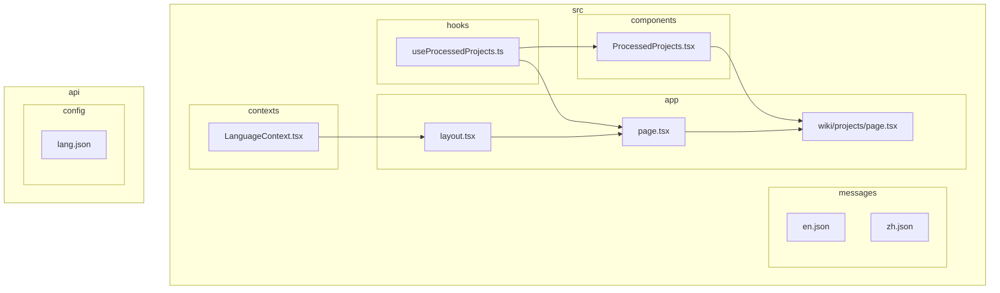
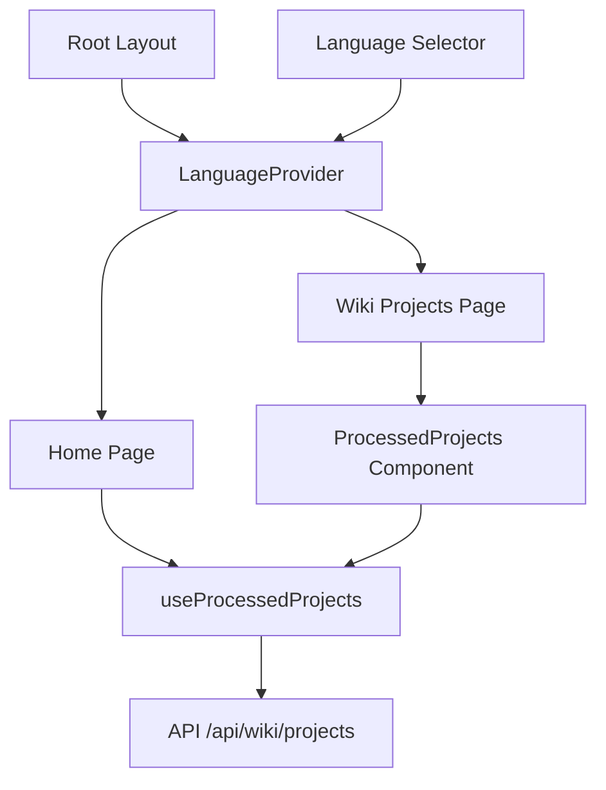
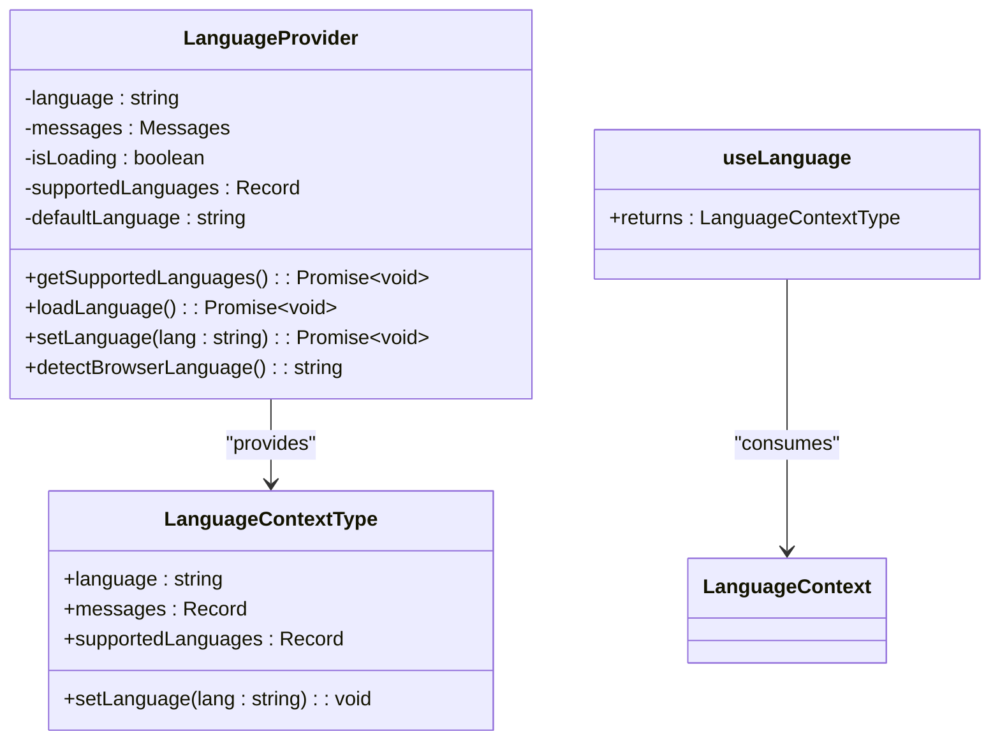
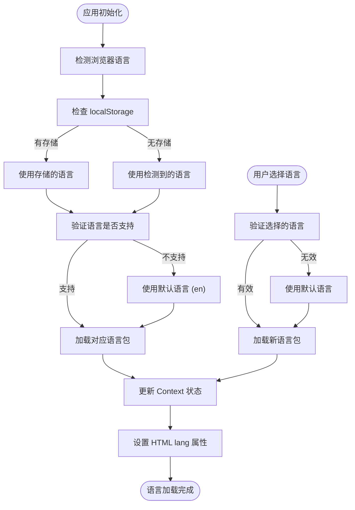
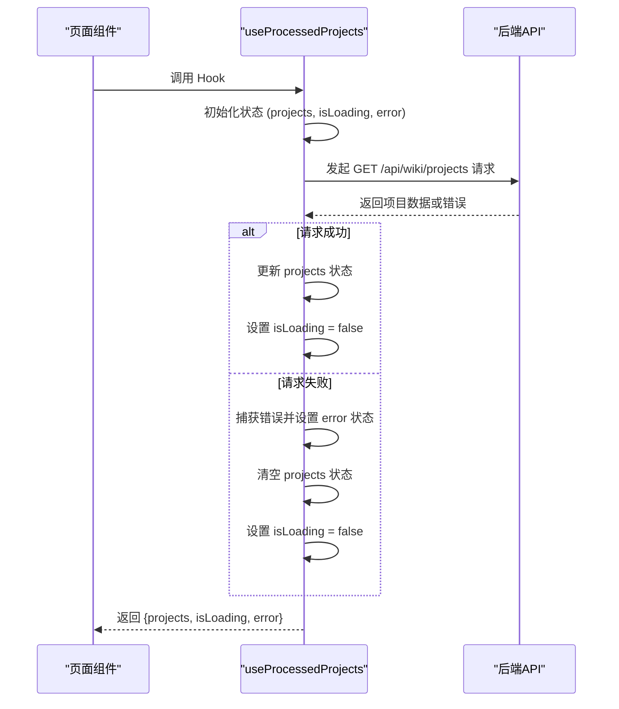
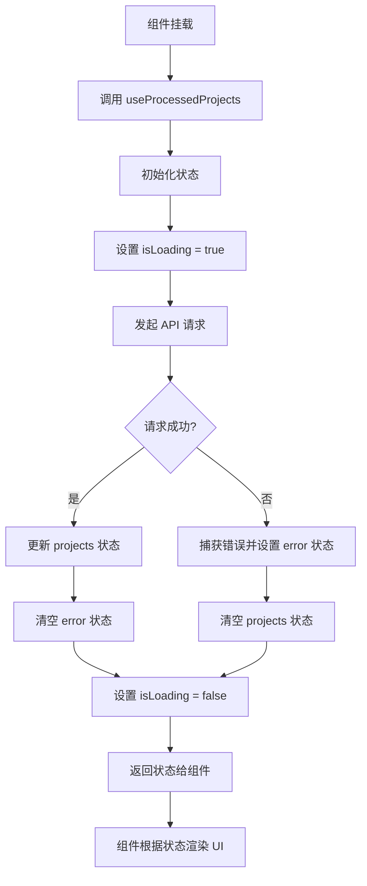

# 状态与上下文管理

<cite>
**Referenced Files in This Document**   
- [LanguageContext.tsx](file://src/contexts/LanguageContext.tsx)
- [useProcessedProjects.ts](file://src/hooks/useProcessedProjects.ts)
- [i18n.ts](file://src/i18n.ts)
- [layout.tsx](file://src/app/layout.tsx)
- [page.tsx](file://src/app/page.tsx)
- [lang.json](file://api/config/lang.json)
- [en.json](file://src/messages/en.json)
- [zh.json](file://src/messages/zh.json)
- [ProcessedProjects.tsx](file://src/components/ProcessedProjects.tsx)
- [wiki/projects/page.tsx](file://src/app/wiki/projects/page.tsx)
</cite>

## 目录
1. [引言](#引言)
2. [项目结构](#项目结构)
3. [核心组件](#核心组件)
4. [架构概览](#架构概览)
5. [详细组件分析](#详细组件分析)
6. [依赖分析](#依赖分析)
7. [性能考量](#性能考量)
8. [故障排除指南](#故障排除指南)
9. [结论](#结论)

## 引言
本文档全面阐述了前端应用中的状态与上下文管理机制。重点分析了`LanguageContext.tsx`如何利用React Context实现多语言切换功能，以及`useProcessedProjects.ts`自定义Hook如何通过API请求获取并管理项目列表的状态。文档详细说明了语言包加载、上下文提供者封装、消费者使用模式、数据获取流程、错误处理策略及组件复用机制，并提供了状态流图示和错误边界处理建议。

## 项目结构
项目采用标准的Next.js应用结构，将上下文（Contexts）、自定义Hook（Hooks）、组件（Components）和消息文件（Messages）分别组织在独立的目录中。这种结构清晰地分离了关注点，便于维护和扩展。



**Diagram sources**
- [LanguageContext.tsx](file://src/contexts/LanguageContext.tsx)
- [useProcessedProjects.ts](file://src/hooks/useProcessedProjects.ts)
- [ProcessedProjects.tsx](file://src/components/ProcessedProjects.tsx)
- [layout.tsx](file://src/app/layout.tsx)
- [page.tsx](file://src/app/page.tsx)
- [wiki/projects/page.tsx](file://src/app/wiki/projects/page.tsx)
- [lang.json](file://api/config/lang.json)

**Section sources**
- [LanguageContext.tsx](file://src/contexts/LanguageContext.tsx)
- [useProcessedProjects.ts](file://src/hooks/useProcessedProjects.ts)
- [ProcessedProjects.tsx](file://src/components/ProcessedProjects.tsx)
- [layout.tsx](file://src/app/layout.tsx)
- [page.tsx](file://src/app/page.tsx)
- [wiki/projects/page.tsx](file://src/app/wiki/projects/page.tsx)
- [lang.json](file://api/config/lang.json)

## 核心组件
本节深入分析两个核心组件：`LanguageContext`用于管理应用的多语言状态，`useProcessedProjects`用于获取和管理项目列表数据。这两个组件共同构成了应用前端状态管理的基础。

**Section sources**
- [LanguageContext.tsx](file://src/contexts/LanguageContext.tsx)
- [useProcessedProjects.ts](file://src/hooks/useProcessedProjects.ts)

## 架构概览
系统架构围绕React Context和自定义Hook构建，实现了全局状态管理和数据获取逻辑的复用。`LanguageContext`作为全局状态容器，为整个应用提供语言切换功能。`useProcessedProjects`则封装了与后端API的交互逻辑，为多个页面组件提供统一的数据访问接口。



**Diagram sources**
- [layout.tsx](file://src/app/layout.tsx#L1-L50)
- [LanguageContext.tsx](file://src/contexts/LanguageContext.tsx#L1-L200)
- [page.tsx](file://src/app/page.tsx#L1-L600)
- [wiki/projects/page.tsx](file://src/app/wiki/projects/page.tsx#L1-L20)
- [useProcessedProjects.ts](file://src/hooks/useProcessedProjects.ts#L1-L50)

## 详细组件分析
本节对`LanguageContext`和`useProcessedProjects`两个核心组件进行深入分析，包括其实现细节、数据流和使用模式。

### LanguageContext 组件分析
`LanguageContext`组件利用React Context API实现了应用的多语言支持。它通过`LanguageProvider`提供者组件封装应用，并通过`useLanguage` Hook供消费者组件使用。

#### 多语言上下文实现


**Diagram sources**
- [LanguageContext.tsx](file://src/contexts/LanguageContext.tsx#L1-L200)

**Section sources**
- [LanguageContext.tsx](file://src/contexts/LanguageContext.tsx#L1-L200)
- [i18n.ts](file://src/i18n.ts#L1-L15)
- [layout.tsx](file://src/app/layout.tsx#L1-L50)

#### 语言加载与切换流程


**Diagram sources**
- [LanguageContext.tsx](file://src/contexts/LanguageContext.tsx#L50-L190)

**Section sources**
- [LanguageContext.tsx](file://src/contexts/LanguageContext.tsx#L50-L190)
- [lang.json](file://api/config/lang.json#L1-L16)
- [en.json](file://src/messages/en.json)
- [zh.json](file://src/messages/zh.json)

### useProcessedProjects 组件分析
`useProcessedProjects`是一个自定义Hook，负责从后端API获取已处理的项目列表，并管理相关的状态。

#### 项目数据获取流程


**Diagram sources**
- [useProcessedProjects.ts](file://src/hooks/useProcessedProjects.ts#L1-L45)

**Section sources**
- [useProcessedProjects.ts](file://src/hooks/useProcessedProjects.ts#L1-L45)
- [ProcessedProjects.tsx](file://src/components/ProcessedProjects.tsx#L1-L270)

#### 状态管理与错误处理


**Diagram sources**
- [useProcessedProjects.ts](file://src/hooks/useProcessedProjects.ts#L1-L45)
- [ProcessedProjects.tsx](file://src/components/ProcessedProjects.tsx#L1-L270)

**Section sources**
- [useProcessedProjects.ts](file://src/hooks/useProcessedProjects.ts#L1-L45)
- [ProcessedProjects.tsx](file://src/components/ProcessedProjects.tsx#L1-L270)

## 依赖分析
本节分析组件间的依赖关系，确保理解各模块如何协同工作。

```mermaid
graph TD
A[layout.tsx] --> B[LanguageProvider]
B --> C[LanguageContext.tsx]
C --> D[i18n.ts]
C --> E[lang.json]
C --> F[en.json]
C --> G[zh.json]
H[page.tsx] --> I[useProcessedProjects.ts]
I --> J[/api/wiki/projects]
H --> K[ProcessedProjects.tsx]
L[wiki/projects/page.tsx] --> K
K --> I
```

**Diagram sources**
- [layout.tsx](file://src/app/layout.tsx#L1-L50)
- [LanguageContext.tsx](file://src/contexts/LanguageContext.tsx#L1-L200)
- [i18n.ts](file://src/i18n.ts#L1-L15)
- [lang.json](file://api/config/lang.json#L1-L16)
- [page.tsx](file://src/app/page.tsx#L1-L600)
- [useProcessedProjects.ts](file://src/hooks/useProcessedProjects.ts#L1-L50)
- [ProcessedProjects.tsx](file://src/components/ProcessedProjects.tsx#L1-L270)
- [wiki/projects/page.tsx](file://src/app/wiki/projects/page.tsx#L1-L20)

**Section sources**
- [layout.tsx](file://src/app/layout.tsx#L1-L50)
- [LanguageContext.tsx](file://src/contexts/LanguageContext.tsx#L1-L200)
- [i18n.ts](file://src/i18n.ts#L1-L15)
- [lang.json](file://api/config/lang.json#L1-L16)
- [page.tsx](file://src/app/page.tsx#L1-L600)
- [useProcessedProjects.ts](file://src/hooks/useProcessedProjects.ts#L1-L50)
- [ProcessedProjects.tsx](file://src/components/ProcessedProjects.tsx#L1-L270)
- [wiki/projects/page.tsx](file://src/app/wiki/projects/page.tsx#L1-L20)

## 性能考量
- `LanguageContext`在初始化时会进行异步操作（获取支持的语言列表和加载语言包），这可能导致应用启动时出现短暂的加载状态。
- `useProcessedProjects`在每次组件挂载时都会重新获取数据，可以考虑添加缓存机制以减少不必要的网络请求。
- 动态导入语言包（`import('../messages/${validLanguage}.json')`）有助于代码分割，但首次切换到新语言时会有加载延迟。

## 故障排除指南
当遇到状态管理相关问题时，可参考以下建议进行排查：

**Section sources**
- [LanguageContext.tsx](file://src/contexts/LanguageContext.tsx#L1-L200)
- [useProcessedProjects.ts](file://src/hooks/useProcessedProjects.ts#L1-L45)
- [ProcessedProjects.tsx](file://src/components/ProcessedProjects.tsx#L1-L270)

### 常见问题与解决方案
| 问题现象 | 可能原因 | 解决方案 |
|--------|--------|--------|
| 语言切换无效 | 选择的语言不受支持 | 检查`lang.json`中的`supported_languages`配置 |
| 页面显示加载中 | 语言包加载失败 | 检查网络连接和语言包文件路径 |
| 项目列表为空 | API请求失败 | 检查后端服务是否正常运行 |
| 语言未持久化 | localStorage访问受限 | 确保在浏览器环境中运行，检查隐私设置 |
| 状态更新不及时 | React渲染问题 | 检查依赖数组是否正确，避免不必要的重新渲染 |

### 错误边界处理建议
1. **语言加载错误**：当语言包加载失败时，应优雅降级到默认语言（英语），并记录错误日志。
2. **API请求错误**：在`useProcessedProjects`中已实现基本的错误处理，捕获错误并设置`error`状态，组件可根据此状态显示友好的错误信息。
3. **浏览器兼容性**：在服务端渲染（SSR）环境中，应避免访问`window`、`document`等浏览器特有对象，使用`typeof window !== 'undefined'`进行安全检查。
4. **网络异常**：对于网络请求失败的情况，可以实现重试机制或提供离线缓存数据作为备用。

## 结论
本文档详细分析了应用的前端状态管理机制。`LanguageContext`通过React Context实现了全局的多语言支持，能够根据浏览器语言自动检测并持久化用户选择。`useProcessedProjects`自定义Hook封装了项目数据的获取逻辑，实现了数据获取、状态管理和错误处理的复用。这两个组件的设计体现了良好的关注点分离原则，为应用的可维护性和可扩展性奠定了基础。建议未来可以考虑添加数据缓存机制和更完善的错误恢复策略，以进一步提升用户体验。