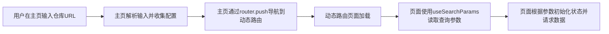

# 页面结构

<cite>
**Referenced Files in This Document**   
- [page.tsx](file://src/app/page.tsx)
- [\[owner\]/\[repo\]/page.tsx](file://src/app/[owner]/[repo]/page.tsx)
- [wiki/projects/page.tsx](file://src/app/wiki/projects/page.tsx)
- [layout.tsx](file://src/app/layout.tsx)
- [useProcessedProjects.ts](file://src/hooks/useProcessedProjects.ts)
- [ProcessedProjects.tsx](file://src/components/ProcessedProjects.tsx)
- [route.ts](file://src/app/api/wiki/projects/route.ts)
- [route.ts](file://src/app/api/auth/status/route.ts)
- [route.ts](file://src/app/api/auth/validate/route.ts)
</cite>

## 目录
1. [简介](#简介)
2. [核心页面结构](#核心页面结构)
3. [全局布局结构](#全局布局结构)
4. [数据流与用户工作流](#数据流与用户工作流)
5. [结论](#结论)

## 简介
本文件详细说明了DeepWiki应用的页面结构设计。该应用基于Next.js框架，采用现代化的客户端路由和数据获取策略。核心页面包括作为应用入口的主页、用于展示特定代码库维基内容的动态路由页面，以及用于管理已处理项目列表的专用页面。全局布局通过`layout.tsx`提供了一致的视觉风格和功能支持，包括主题切换和多语言支持。

## 核心页面结构

### 主页 (`page.tsx`)
主页是应用的根页面，负责处理用户输入和初始导航。它提供了一个输入框，允许用户输入GitHub、GitLab或Bitbucket仓库的URL或`owner/repo`格式的标识符。用户提交后，页面会解析输入，提取所有者（owner）和仓库（repo）信息，并通过`router.push`方法导航到动态路由页面`/[owner]/[repo]/page.tsx`，同时将配置参数（如语言、模型选择、文件过滤规则等）作为查询参数传递。

该页面还集成了`useProcessedProjects` Hook，用于获取服务器缓存中已处理的项目列表。如果存在已处理的项目，主页会优先展示一个项目列表，方便用户快速访问历史记录，否则则显示欢迎内容和快速入门指南。

**Section sources**
- [page.tsx](file://src/app/page.tsx#L44-L624)

### 动态路由页面 (`[owner]/[repo]/page.tsx`)
此页面利用Next.js的动态路由功能，能够加载任意指定代码库的维基内容。页面通过`useParams` Hook获取URL中的`owner`和`repo`参数，并通过`useSearchParams`获取查询参数（如`token`、`language`、`provider`等）。

页面的核心逻辑是根据仓库信息向后端API发起请求，获取仓库的文件树和README内容，然后由AI模型分析并生成一个结构化的维基结构（`WikiStructure`）。随后，页面会根据这个结构，为每一个维基页面（`WikiPage`）发起内容生成请求，并将结果存储在本地状态中。用户可以通过侧边栏的树形视图（`WikiTreeView`）在不同页面间导航。

**Section sources**
- [\[owner\]/\[repo\]/page.tsx](file://src/app/[owner]/[repo]/page.tsx#L176-L308)

### 已处理项目页面 (`wiki/projects/page.tsx`)
此页面专门用于展示所有已处理的项目列表。它是一个简单的客户端组件，主要职责是渲染`ProcessedProjects`组件。该页面通过`useLanguage` Hook获取当前语言环境，以便为组件提供翻译文本。

**Section sources**
- [wiki/projects/page.tsx](file://src/app/wiki/projects/page.tsx#L6-L18)

## 全局布局结构

### 全局布局 (`layout.tsx`)
`layout.tsx`文件定义了应用的根布局，为所有页面提供统一的HTML结构和全局功能。它通过`<html>`和`<body>`标签设置了文档的基本结构，并应用了从`next/font`导入的多种字体（如Noto Sans JP, Noto Serif JP），以确保在不同语言环境下都有良好的显示效果。

该布局的关键作用是作为多个上下文提供者（Context Provider）的容器：
- **`ThemeProvider`**: 来自`next-themes`，管理应用的明暗主题切换，并将主题状态持久化到`localStorage`。
- **`LanguageProvider`**: 来自`@/contexts/LanguageContext`，提供多语言支持，允许应用根据用户选择动态切换界面语言。

所有子页面的内容（`children`）都会被包裹在这两个提供者之内，从而继承主题和语言上下文。

**Section sources**
- [layout.tsx](file://src/app/layout.tsx#L1-L51)

## 数据流与用户工作流

### 数据传递与路由跳转
页面间的数据传递主要通过URL查询参数（Query Parameters）实现。当用户在主页提交一个仓库URL时，`handleGenerateWiki`函数会将所有相关的配置（如`provider`、`model`、`language`、`excludedDirs`等）序列化为查询字符串，并附加到目标动态路由的URL上。目标页面`[owner]/[repo]/page.tsx`在加载时，通过`useSearchParams`读取这些参数，并据此初始化其内部状态，确保用户的选择被正确应用。



**Diagram sources**
- [page.tsx](file://src/app/page.tsx#L44-L624)
- [\[owner\]/\[repo\]/page.tsx](file://src/app/[owner]/[repo]/page.tsx#L176-L308)

### 用户工作流
1.  **启动**: 用户访问应用主页。
2.  **输入**: 用户输入目标代码库的URL。
3.  **配置**: 用户在弹出的配置模态框中选择语言、AI模型等选项。
4.  **导航**: 用户确认后，应用导航至`/[owner]/[repo]`动态页面。
5.  **加载**: 动态页面向后端API请求仓库数据，并生成维基结构。
6.  **浏览**: 用户通过侧边栏的树形视图浏览和导航不同的维基页面。
7.  **管理**: 用户可以通过`/wiki/projects`页面查看和管理所有已处理的项目。

### 组件与数据流
`ProcessedProjects`组件是展示已处理项目列表的核心。它通过`fetch('/api/wiki/projects')`向后端API发起GET请求，获取项目列表。该请求最终由`src/app/api/wiki/projects/route.ts`中的`GET`函数处理，该函数会代理请求到Python后端服务。`useProcessedProjects` Hook封装了这一数据获取逻辑，为`ProcessedProjects`组件提供了一个简洁的接口。

```mermaid
flowchart TD
A[ProcessedProjects.tsx] --> B[调用useProcessedProjects Hook]
B --> C[Hook内发起fetch('/api/wiki/projects')]
C --> D[Next.js API路由: /api/wiki/projects/route.ts]
D --> E[代理请求到Python后端]
E --> F[Python后端返回项目列表]
F --> D
D --> C
C --> B
B --> A
A --> G[渲染项目列表]
```

**Diagram sources**
- [ProcessedProjects.tsx](file://src/components/ProcessedProjects.tsx#L35-L270)
- [useProcessedProjects.ts](file://src/hooks/useProcessedProjects.ts#L12-L45)
- [route.ts](file://src/app/api/wiki/projects/route.ts#L20-L40)

## 结论
DeepWiki应用的页面结构设计清晰且高效。通过Next.js的App Router，实现了静态路由、动态路由和API路由的有机结合。`layout.tsx`提供了强大的全局上下文支持，而各个页面组件则各司其职，共同构建了一个流畅的用户体验。数据流通过URL参数和API调用清晰地定义，使得应用的状态管理和用户导航变得直观且可预测。这种结构为应用的可维护性和可扩展性奠定了坚实的基础。