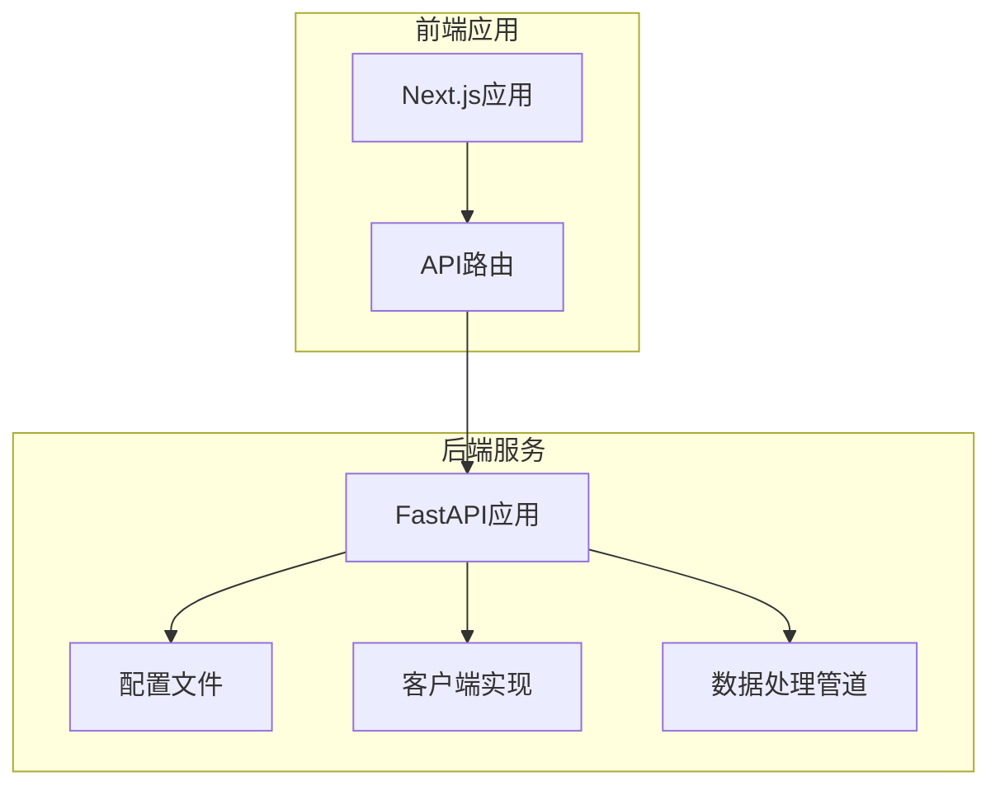
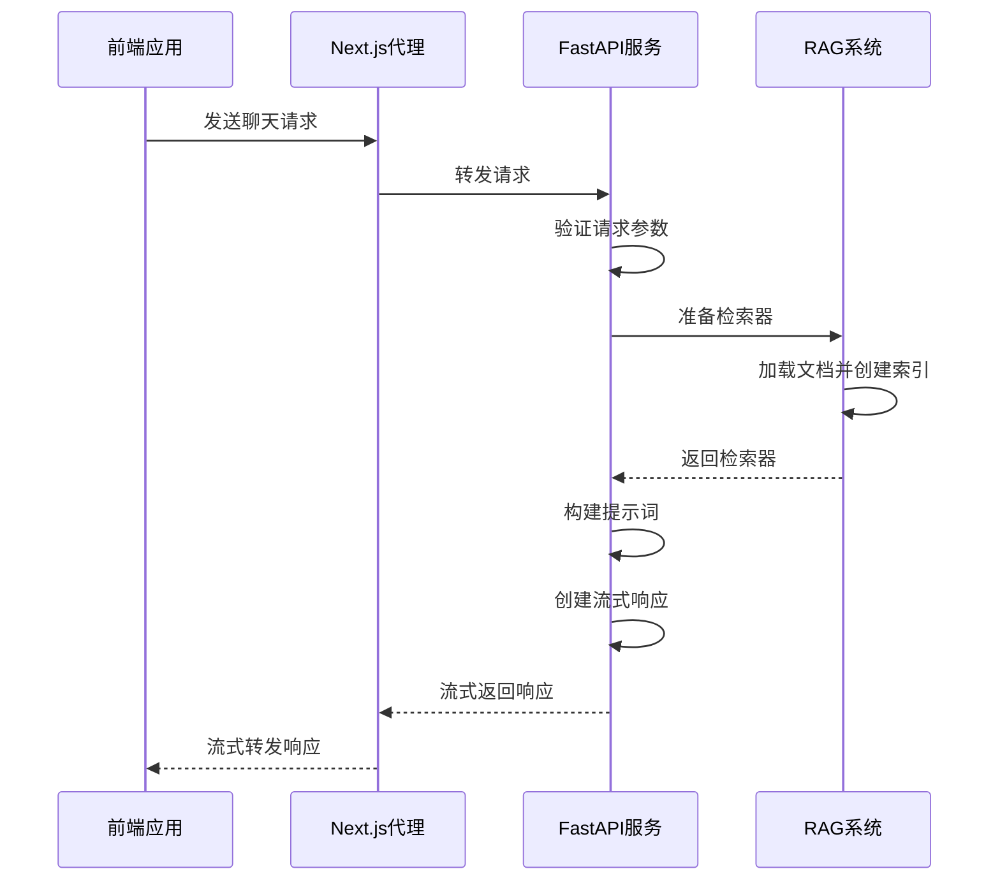
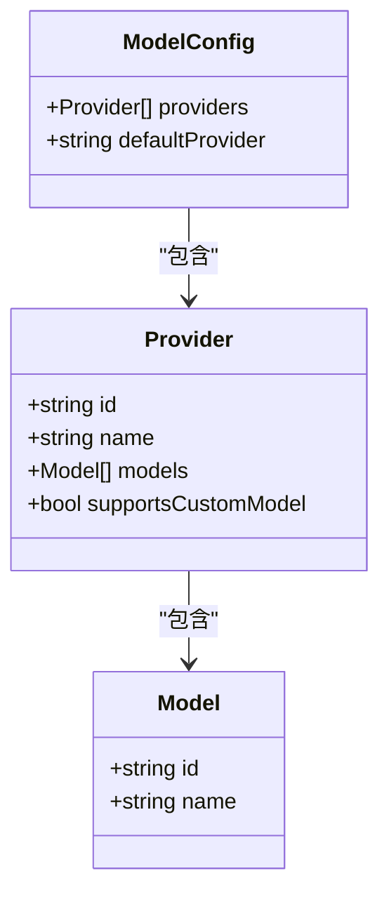
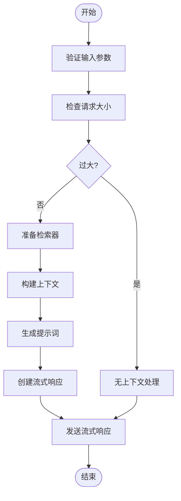
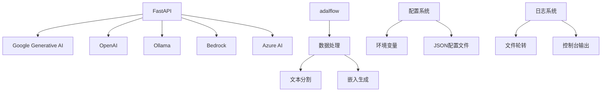

# API服务

<cite>
**本文档中引用的文件**   
- [api.py](file://api/api.py)
- [simple_chat.py](file://api/simple_chat.py)
- [route.ts](file://src/app/api/auth/status/route.ts)
- [route.ts](file://src/app/api/chat/stream/route.ts)
- [main.py](file://api/main.py)
- [config.py](file://api/config.py)
- [logging_config.py](file://api/logging_config.py)
- [prompts.py](file://api/prompts.py)
- [data_pipeline.py](file://api/data_pipeline.py)
- [rag.py](file://api/rag.py)
</cite>

## 目录
1. [简介](#简介)
2. [项目结构](#项目结构)
3. [核心组件](#核心组件)
4. [架构概述](#架构概述)
5. [详细组件分析](#详细组件分析)
6. [依赖分析](#依赖分析)
7. [性能考虑](#性能考虑)
8. [故障排除指南](#故障排除指南)
9. [结论](#结论)

## 简介
本API服务文档详细描述了基于FastAPI构建的流式聊天和知识库生成系统。该系统通过RESTful端点提供对代码仓库的智能分析功能，支持多种大语言模型提供商，并实现了前后端分离的架构设计。核心功能包括认证状态检查、模型配置获取、已处理项目列表查询以及流式聊天接口。前端使用Next.js作为代理服务器，将请求转发到后端FastAPI服务，实现了灵活的请求处理和错误处理机制。

## 项目结构
项目采用分层架构设计，主要分为API服务层和前端应用层。API服务位于`api/`目录下，包含核心的FastAPI应用、配置文件、客户端实现和数据处理管道。前端应用位于`src/app/`目录下，采用Next.js框架实现，通过API路由作为代理转发请求。配置文件分散在`api/config/`目录中，包括生成器、嵌入器、仓库和语言配置。日志系统独立配置，确保运行时信息的有效记录。

**Diagram sources**
- [api.py](file://api/api.py#L20-L23)
- [main.py](file://api/main.py#L75-L80)
- [route.ts](file://src/app/api/chat/stream/route.ts#L1-L112)

**Section sources**
- [api.py](file://api/api.py#L1-L634)
- [main.py](file://api/main.py#L1-L80)
- [route.ts](file://src/app/api/chat/stream/route.ts#L1-L112)

## 核心组件
系统的核心组件包括FastAPI应用实例、流式聊天处理器、认证管理器和缓存系统。FastAPI应用通过`api.py`和`simple_chat.py`两个模块构建，实现了RESTful API端点和流式响应功能。流式聊天接口支持多种模型提供商，包括Google、OpenAI、Ollama等，并通过RAG（检索增强生成）技术提供上下文感知的智能回答。认证系统通过环境变量配置，支持可选的访问码验证。缓存系统基于文件存储，保存已处理的项目数据以提高性能。

**Section sources**
- [api.py](file://api/api.py#L20-L23)
- [simple_chat.py](file://api/simple_chat.py#L35-L38)
- [config.py](file://api/config.py#L1-L387)

## 架构概述
系统采用微服务架构，前后端分离设计。后端FastAPI服务提供RESTful API，前端Next.js应用作为代理服务器转发请求。这种设计模式实现了关注点分离，提高了系统的可维护性和可扩展性。API服务通过CORS中间件配置允许所有来源的跨域请求，确保前端应用能够无缝访问后端服务。错误处理机制贯穿整个请求处理流程，从输入验证到异常捕获，确保系统的稳定性和可靠性。

**Diagram sources**
- [api.py](file://api/api.py#L20-L23)
- [simple_chat.py](file://api/simple_chat.py#L75-L683)
- [route.ts](file://src/app/api/chat/stream/route.ts#L1-L112)

## 详细组件分析

### 认证状态检查
认证状态检查端点`/auth/status`用于确定是否需要对知识库进行身份验证。该端点返回一个JSON对象，包含`auth_required`字段，指示是否启用了认证模式。认证模式通过环境变量`DEEPWIKI_AUTH_MODE`配置，支持布尔值设置。当认证模式启用时，用户需要提供有效的授权码才能访问受保护的资源。

**Section sources**
- [api.py](file://api/api.py#L153-L157)
- [config.py](file://api/config.py#L1-L387)

### 模型配置获取
模型配置端点`/models/config`返回可用的模型提供商及其模型列表。该端点动态读取配置文件中的提供商信息，包括Google、OpenAI、Ollama等，并构建相应的响应对象。每个提供商包含其ID、显示名称、是否支持自定义模型以及可用模型列表。默认提供商通过配置文件中的`default_provider`字段指定。

**Diagram sources**
- [api.py](file://api/api.py#L167-L224)
- [config.py](file://api/config.py#L333-L386)

### 流式聊天接口
流式聊天接口`/chat/completions/stream`是系统的核心功能，支持实时流式响应。该接口接受包含仓库URL、消息列表、提供商等参数的POST请求，并返回SSE（Server-Sent Events）流。请求处理流程包括：输入验证、检索器准备、上下文构建、提示词生成和流式响应。系统支持多种大语言模型提供商，并根据请求参数动态选择相应的客户端进行调用。

**Diagram sources**
- [simple_chat.py](file://api/simple_chat.py#L75-L683)
- [data_pipeline.py](file://api/data_pipeline.py#L1-L799)
- [rag.py](file://api/rag.py#L1-L445)

### 已处理项目列表
已处理项目端点`/api/processed_projects`列出缓存目录中所有已处理的项目。系统扫描`wikicache`目录下的JSON文件，解析文件名以提取项目信息，包括所有者、仓库名、提交时间等。项目按提交时间倒序排列，最近处理的项目排在前面。该功能为用户提供了一个查看历史处理记录的界面，便于管理和追踪项目状态。

**Section sources**
- [api.py](file://api/api.py#L577-L633)
- [config.py](file://api/config.py#L1-L387)

## 依赖分析
系统依赖关系复杂，涉及多个外部服务和内部组件。核心依赖包括FastAPI框架、Google Generative AI SDK、adalflow库以及各种云服务客户端。配置系统通过环境变量和JSON配置文件实现灵活的参数管理。日志系统独立配置，支持文件轮转和不同级别的日志记录。错误处理贯穿整个调用链，从API端点到数据处理管道，确保异常情况下的优雅降级。

**Diagram sources**
- [main.py](file://api/main.py#L1-L80)
- [config.py](file://api/config.py#L1-L387)
- [logging_config.py](file://api/logging_config.py#L1-L85)

## 性能考虑
系统在性能方面进行了多项优化。首先，采用异步I/O操作，如`asyncio.to_thread`包装的文件系统调用，避免阻塞事件循环。其次，实现缓存机制，将已处理的项目数据持久化存储，减少重复计算。第三，支持流式响应，客户端可以逐步接收响应数据，改善用户体验。此外，系统对大请求进行特殊处理，当输入过大时自动切换到无上下文模式，确保服务的可用性。

## 故障排除指南
常见问题包括认证失败、模型调用错误和文件读取异常。认证失败通常由错误的授权码或未正确设置认证模式引起。模型调用错误可能源于API密钥未配置或网络连接问题。文件读取异常通常与仓库权限或网络问题有关。日志系统记录详细的错误信息，帮助定位问题根源。建议检查环境变量配置、网络连接状态和相关服务的可用性。

**Section sources**
- [api.py](file://api/api.py#L1-L634)
- [simple_chat.py](file://api/simple_chat.py#L1-L689)
- [data_pipeline.py](file://api/data_pipeline.py#L1-L799)

## 结论
本API服务提供了一套完整的代码仓库智能分析解决方案，通过流式聊天接口和知识库生成功能，帮助用户深入理解代码库结构和内容。系统设计灵活，支持多种大语言模型提供商和嵌入模型，可根据实际需求进行配置。前后端分离的架构设计提高了系统的可维护性和可扩展性。通过合理的错误处理和性能优化，确保了服务的稳定性和响应速度。未来可进一步优化缓存策略和增加更多分析功能，提升用户体验。