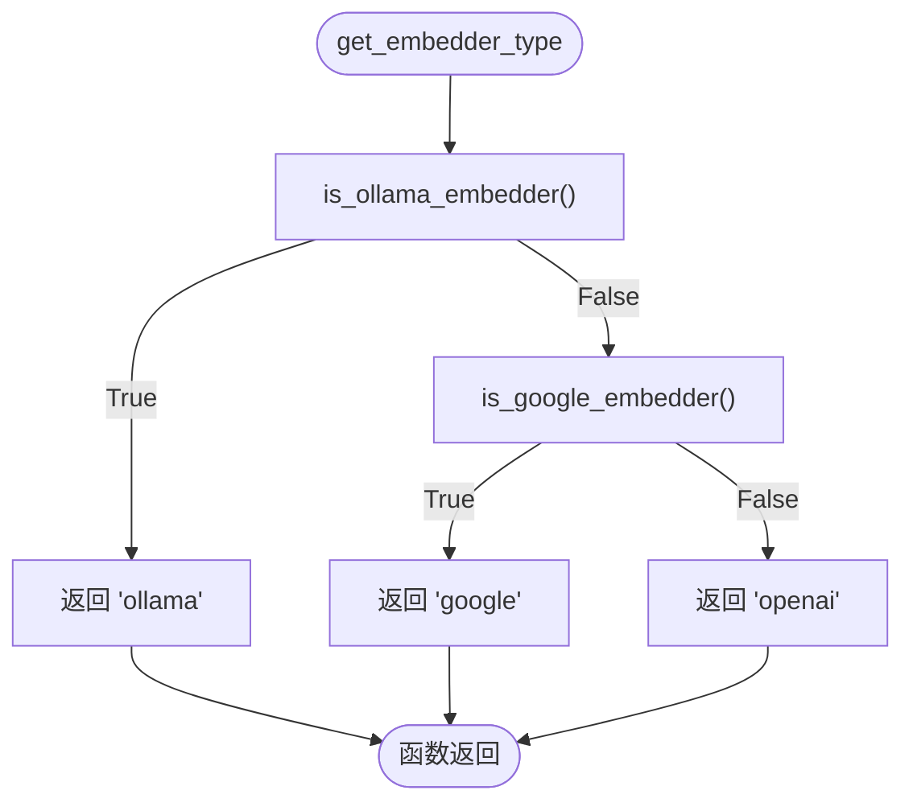
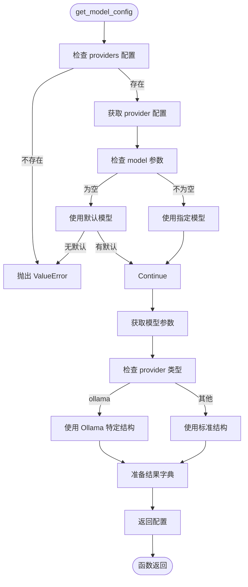
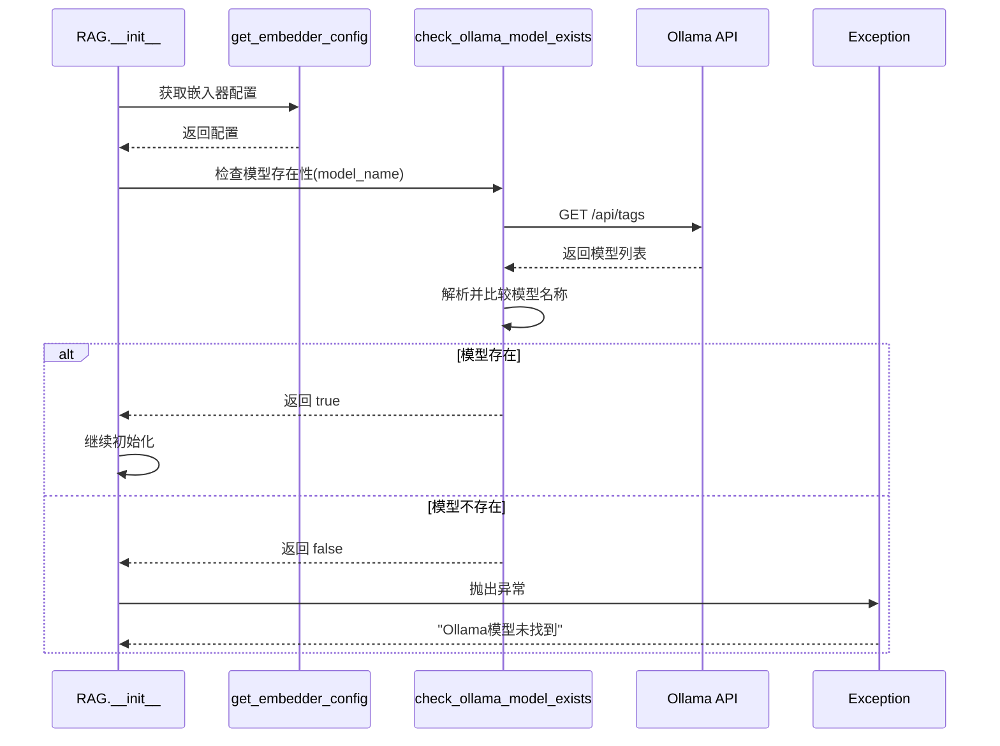
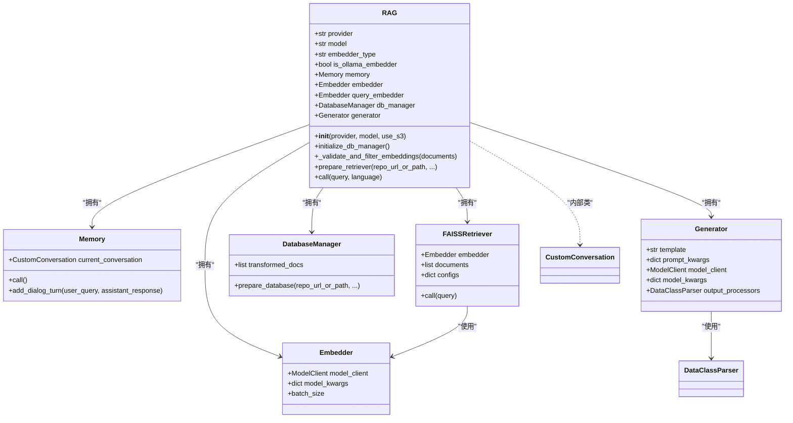
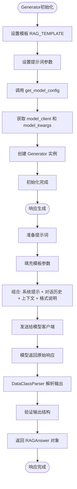

# RAG初始化

<cite>
**Referenced Files in This Document**   
- [rag.py](file://api/rag.py)
- [config.py](file://api/config.py)
- [embedder.py](file://api/tools/embedder.py)
- [ollama_patch.py](file://api/ollama_patch.py)
- [logging_config.py](file://api/logging_config.py)
</cite>

## 目录
1. [RAG引擎初始化流程](#rag引擎初始化流程)
2. [模型提供商与嵌入器类型动态选择](#模型提供商与嵌入器类型动态选择)
3. [配置加载函数分析](#配置加载函数分析)
4. [Ollama模型存在性检查机制](#ollama模型存在性检查机制)
5. [核心组件初始化顺序与依赖关系](#核心组件初始化顺序与依赖关系)
6. [Generator响应生成机制](#generator响应生成机制)
7. [配置错误排查指南](#配置错误排查指南)

## RAG引擎初始化流程

RAG引擎的初始化过程始于`RAG`类的`__init__`方法，该方法负责根据传入的参数和配置文件构建整个检索增强生成系统。初始化过程首先设置模型提供商和模型名称，然后通过配置系统确定嵌入器类型，并在必要时检查Ollama模型的存在性。随后，系统按特定顺序初始化`Memory`、`embedder`和`generator`等核心组件，确保各组件间的正确依赖关系。

**Section sources**
- [rag.py](file://api/rag.py#L156-L242)

## 模型提供商与嵌入器类型动态选择

RAG引擎能够根据配置动态选择模型提供商和嵌入器类型。在初始化过程中，系统通过环境变量`DEEPWIKI_EMBEDDER_TYPE`确定嵌入器类型，该变量可设置为`'ollama'`、`'google'`或`'openai'`。系统通过`get_embedder_type`函数解析此配置，并相应地设置`embedder_type`属性。对于模型提供商，初始化方法接受`provider`参数（默认为`"google"`），支持`google`、`openai`、`openrouter`、`ollama`等多种提供商，实现灵活的模型选择机制。

**Section sources**
- [rag.py](file://api/rag.py#L160-L165)
- [config.py](file://api/config.py#L214-L226)

## 配置加载函数分析

### get_embedder_type函数

`get_embedder_type`函数是嵌入器类型决策的核心，它通过一系列检查确定当前应使用的嵌入器类型。该函数首先调用`is_ollama_embedder`检查是否配置使用Ollama嵌入器，若是则返回`'ollama'`；否则检查是否配置使用Google嵌入器，若是则返回`'google'`；若以上条件均不满足，则默认返回`'openai'`。这种层级式的检查确保了配置的灵活性和向后兼容性。

**Diagram sources**
- [config.py](file://api/config.py#L214-L226)

### get_model_config函数

`get_model_config`函数负责根据指定的提供商和模型名称加载相应的配置。该函数首先从全局配置中获取提供商配置，若未找到则抛出异常。如果未指定模型名称，则使用提供商的默认模型。函数根据提供商类型（特别是Ollama）调整参数结构，最终返回包含`model_client`和`model_kwargs`的配置字典，为`Generator`的初始化提供必要参数。

**Diagram sources**
- [config.py](file://api/config.py#L333-L386)

**Section sources**
- [config.py](file://api/config.py#L333-L386)

## Ollama模型存在性检查机制

当系统检测到使用Ollama嵌入器时，会执行严格的模型存在性检查以防止运行时错误。该机制通过`check_ollama_model_exists`函数实现，该函数向Ollama服务的`/api/tags`端点发送HTTP GET请求，获取所有可用模型的列表。函数提取请求的模型名称（去除标签部分），并与可用模型列表进行比较。如果模型不存在，函数记录警告日志并返回`False`，导致`RAG`初始化过程中抛出异常，提示用户运行`ollama pull`命令安装缺失的模型。

**Diagram sources**
- [rag.py](file://api/rag.py#L177-L188)
- [ollama_patch.py](file://api/ollama_patch.py#L15-L50)

**Section sources**
- [rag.py](file://api/rag.py#L177-L188)
- [ollama_patch.py](file://api/ollama_patch.py#L15-L50)

## 核心组件初始化顺序与依赖关系

RAG引擎的核心组件按严格的顺序和依赖关系进行初始化，确保系统稳定运行。

### 初始化顺序

1. **Memory初始化**：首先创建`Memory`实例，用于管理对话历史。
2. **Embedder初始化**：调用`get_embedder`函数创建嵌入器实例。
3. **Query Embedder设置**：根据是否使用Ollama嵌入器，设置适当的查询嵌入器。
4. **Database Manager初始化**：调用`initialize_db_manager`方法设置数据库管理器。
5. **Generator初始化**：最后创建`Generator`实例，完成整个系统构建。

### 组件依赖关系

**Diagram sources**
- [rag.py](file://api/rag.py#L50-L140)
- [rag.py](file://api/rag.py#L189-L192)
- [rag.py](file://api/rag.py#L245-L248)
- [rag.py](file://api/rag.py#L230-L265)

**Section sources**
- [rag.py](file://api/rag.py#L189-L192)
- [rag.py](file://api/rag.py#L245-L248)
- [rag.py](file://api/rag.py#L230-L265)

## Generator响应生成机制

`Generator`组件基于`adalflow`框架，通过模板和模型客户端生成响应。其工作流程如下：首先，`Generator`使用预定义的`RAG_TEMPLATE`模板和从`get_model_config`获取的模型客户端及参数进行初始化。在响应生成时，`Generator`将对话历史、系统提示、检索到的上下文和输出格式指令组合成最终提示，发送给底层语言模型。`adalflow`框架的`DataClassParser`确保输出符合`RAGAnswer`数据类的结构，从而生成包含推理过程和答案的结构化响应。

**Diagram sources**
- [rag.py](file://api/rag.py#L230-L265)
- [config.py](file://api/config.py#L333-L386)

**Section sources**
- [rag.py](file://api/rag.py#L230-L265)

## 配置错误排查指南

当RAG引擎初始化失败时，可参考以下常见问题排查步骤：

### 1. Ollama模型未找到
**症状**：初始化时抛出`Exception`，提示"Ollama model 'xxx' not found"。
**解决方案**：
- 确认Ollama服务正在运行：`docker ps`或`systemctl status ollama`
- 拉取缺失的模型：`ollama pull <model_name>`
- 检查`embedder.json`配置文件中的模型名称拼写

### 2. API密钥缺失
**症状**：使用Google、OpenAI等提供商时出现认证错误。
**解决方案**：
- 检查环境变量：`OPENAI_API_KEY`、`GOOGLE_API_KEY`等
- 确认密钥已正确设置且未过期
- 验证`generator.json`配置文件中的提供商设置

### 3. 嵌入器类型配置错误
**症状**：系统未使用预期的嵌入器。
**解决方案**：
- 检查环境变量`DEEPWIKI_EMBEDDER_TYPE`的值
- 确认`embedder.json`、`embedder_ollama.json`、`embedder_google.json`配置文件存在且格式正确
- 验证`configs`全局变量是否正确加载了嵌入器配置

### 4. 日志文件路径错误
**症状**：启动时出现路径相关的`ValueError`。
**解决方案**：
- 检查`LOG_FILE_PATH`环境变量，确保路径在`logs/`目录内
- 确认日志目录有写入权限
- 验证路径无路径遍历风险

**Section sources**
- [rag.py](file://api/rag.py#L177-L188)
- [config.py](file://api/config.py#L15-L386)
- [ollama_patch.py](file://api/ollama_patch.py#L15-L50)
- [logging_config.py](file://api/logging_config.py#L15-L85)