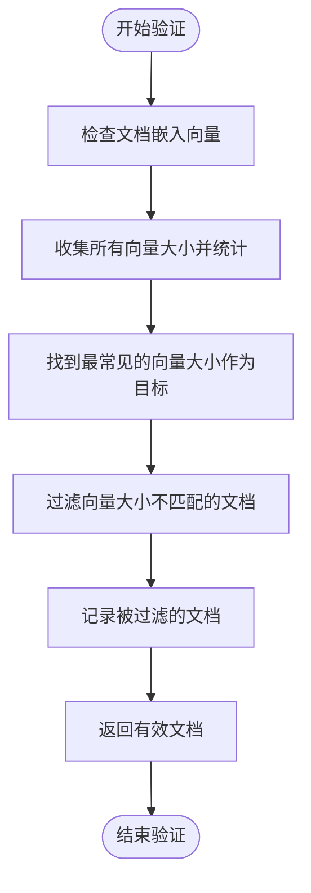

# RAG引擎

<cite>
**本文档引用的文件**   
- [rag.py](file://api/rag.py)
- [prompts.py](file://api/prompts.py)
- [config.py](file://api/config.py)
- [data_pipeline.py](file://api/data_pipeline.py)
- [embedder.py](file://api/tools/embedder.py)
</cite>

## 目录
1. [RAG类初始化](#rag类初始化)
2. [准备检索器](#准备检索器)
3. [执行查询](#执行查询)
4. [嵌入向量验证](#嵌入向量验证)
5. [提示词模板](#提示词模板)

## RAG类初始化

`RAG`类的初始化过程首先接收模型提供商（如google, openai等）和模型名称作为参数。通过`get_embedder_type()`函数确定嵌入器类型，该函数会检查环境变量`DEEPWIKI_EMBEDDER_TYPE`来决定使用Ollama、Google还是OpenAI嵌入器。如果使用Ollama嵌入器，会检查指定的模型是否已安装，若未安装则抛出异常提示用户安装。

初始化过程中会创建`Memory`实例用于管理对话历史，并通过`get_embedder()`函数获取相应的嵌入器实例。对于Ollama嵌入器，会创建一个特殊的`single_string_embedder`包装函数，确保查询始终以单个字符串形式传递。最后，通过`get_model_config()`函数获取生成器的配置，包括模型客户端和参数，并创建`Generator`实例用于生成最终响应。

**Section sources**
- [rag.py](file://api/rag.py#L156-L242)
- [config.py](file://api/config.py#L333-L386)
- [embedder.py](file://api/tools/embedder.py#L5-L53)

## 准备检索器

`prepare_retriever`方法负责加载或创建向量数据库。该方法首先调用`initialize_db_manager()`初始化数据库管理器，然后通过`DatabaseManager`的`prepare_database()`方法处理代码库文档。文档读取过程会根据配置排除特定目录和文件，主要处理代码文件（如.py, .js等）和文档文件（如.md, .txt等）。

文档读取后，会通过`prepare_data_pipeline()`创建数据转换管道，包含文本分割器和嵌入器。文档先被分割成较小的块，然后通过嵌入器转换为向量。对于Ollama嵌入器，使用`OllamaDocumentProcessor`进行单文档处理；对于其他嵌入器，则使用`ToEmbeddings`进行批量处理。处理后的文档和向量会被保存到本地数据库文件中，路径为`~/.adalflow/databases/{repo_name}.pkl`。

**Section sources**
- [rag.py](file://api/rag.py#L344-L413)
- [data_pipeline.py](file://api/data_pipeline.py#L701-L880)

## 执行查询

`call`方法是RAG引擎的核心执行流程。当接收到用户查询时，首先通过`FAISSRetriever`在向量数据库中检索相关文档。检索器使用与文档向量化时相同的嵌入器来确保一致性。检索结果包含文档索引，`call`方法会根据这些索引从`transformed_docs`中获取完整的文档内容。

检索到的相关文档会作为上下文填充到提示词模板中，然后传递给生成器。生成器结合系统提示、对话历史和检索到的上下文，生成最终的回答。如果在执行过程中发生错误，会返回一个预定义的错误响应，避免程序崩溃。

**Section sources**
- [rag.py](file://api/rag.py#L415-L444)

## 嵌入向量验证

`_validate_and_filter_embeddings`方法确保所有嵌入向量的大小一致，防止数据库错误。该方法首先遍历所有文档，收集每个文档嵌入向量的大小并统计出现频率。然后确定最常见的向量大小作为目标大小，这通常代表正确的嵌入维度。

在第二遍遍历中，只保留向量大小与目标大小匹配的文档，过滤掉大小不一致的文档。这种方法可以防止因不同嵌入模型产生的向量大小不一致而导致的FAISS索引错误。该方法还会记录被过滤的文档及其文件路径，便于调试和问题排查。

**Diagram sources**
- [rag.py](file://api/rag.py#L250-L342)

## 提示词模板

`prompts.py`文件中的模板定义了生成器如何构造提示词。`RAG_TEMPLATE`包含系统提示、对话历史、检索到的上下文和用户查询。系统提示`RAG_SYSTEM_PROMPT`指导模型作为代码助手回答用户问题，要求模型检测用户查询的语言并用相同语言回复。

生成器的输出格式通过`RAGAnswer`数据类定义，包含`rationale`（推理过程）和`answer`（最终答案）两个字段。格式指令明确要求不要包含markdown代码围栏，直接以内容开头，因为内容将由前端直接渲染为markdown。这确保了生成的响应可以直接在用户界面中正确显示。

**Section sources**
- [prompts.py](file://api/prompts.py#L0-L191)
- [rag.py](file://api/rag.py#L146-L150)