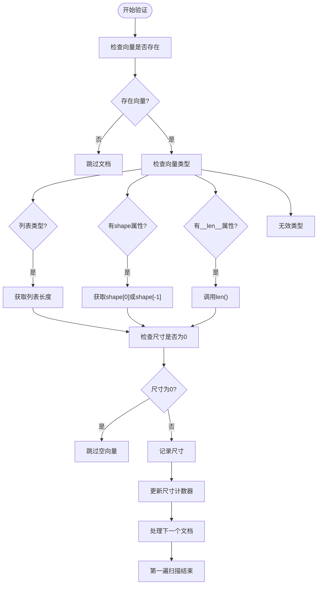
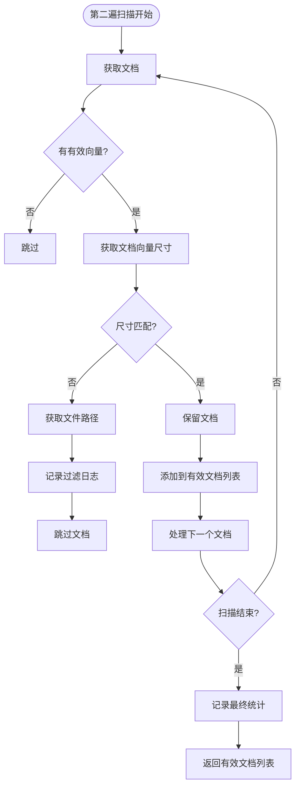
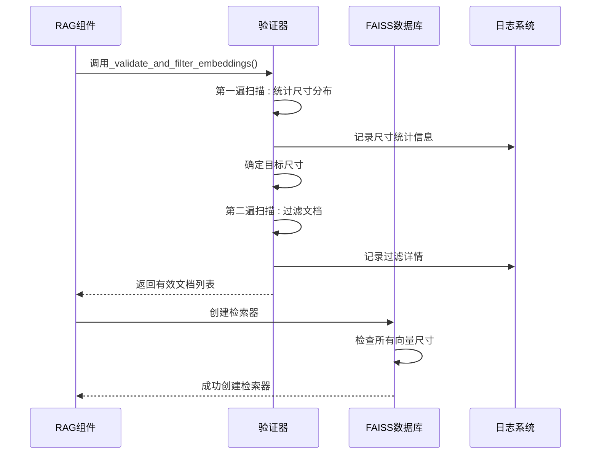
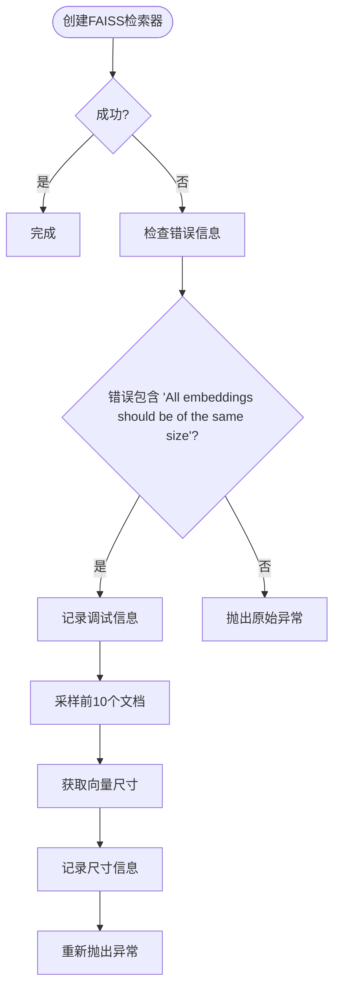

# 嵌入向量验证

<cite>
**Referenced Files in This Document**   
- [rag.py](file://api/rag.py)
- [data_pipeline.py](file://api/data_pipeline.py)
</cite>

## 目录
1. [方法概述](#方法概述)
2. [实现机制分析](#实现机制分析)
3. [与FAISS数据库的集成](#与faiss数据库的集成)
4. 故障排查与解决方案
5. 总结

## 方法概述

`_validate_and_filter_embeddings`方法是系统中确保嵌入向量一致性的核心组件。该方法负责验证文档列表中的嵌入向量，过滤掉尺寸不匹配的文档，从而防止向量数据库因尺寸不一致而崩溃。

**Section sources**
- [rag.py](file://api/rag.py#L250-L342)

## 实现机制分析

`_validate_and_filter_embeddings`方法通过两遍扫描机制来确保嵌入向量的一致性。

### 第一遍扫描：尺寸分布统计

第一遍扫描遍历所有文档，检查每个文档的嵌入向量是否存在且非空。对于有效的嵌入向量，方法会检测其尺寸并统计所有尺寸的出现频率。

**Diagram sources**
- [rag.py](file://api/rag.py#L260-L290)

### 第二遍扫描：过滤与日志记录

在确定目标尺寸后，方法进行第二遍扫描，只保留尺寸匹配的文档，并记录详细的警告日志。

**Diagram sources**
- [rag.py](file://api/rag.py#L300-L330)

**Section sources**
- [rag.py](file://api/rag.py#L250-L342)

## 与FAISS数据库的集成

该验证机制与FAISS数据库的集成是防止系统崩溃的关键。FAISS要求所有嵌入向量必须具有相同的尺寸，否则会抛出异常。

### 集成流程

**Diagram sources**
- [rag.py](file://api/rag.py#L344-L413)

### 异常处理机制

当FAISS创建失败时，系统会提供详细的调试信息：

**Diagram sources**
- [rag.py](file://api/rag.py#L394-L413)

**Section sources**
- [rag.py](file://api/rag.py#L344-L413)
- [rag.py](file://api/rag.py#L394-L413)

## 故障排查与解决方案

当大量文档被过滤时，需要进行系统性的故障排查。

### 故障排查步骤

1. **检查日志信息**：查看`_validate_and_filter_embeddings`方法输出的详细日志，了解哪些文档被过滤以及原因。
2. **验证嵌入模型**：确认使用的嵌入模型配置正确，没有在处理过程中发生变更。
3. **检查数据源**：验证文档来源是否一致，避免混合不同来源的文档。
4. **分析尺寸分布**：查看日志中记录的尺寸分布，确定是否存在多个主流尺寸。

### 解决方案

- **统一嵌入模型**：确保所有文档使用相同的嵌入模型生成向量。
- **预处理检查**：在生成嵌入向量前，对文档进行一致性检查。
- **批量处理**：对文档进行分批处理，避免混合不同批次的向量。
- **配置验证**：在系统启动时验证嵌入模型配置，防止配置错误。

**Section sources**
- [rag.py](file://api/rag.py#L250-L342)
- [data_pipeline.py](file://api/data_pipeline.py#L701-L880)

## 总结

`_validate_and_filter_embeddings`方法通过两遍扫描机制有效地解决了嵌入向量尺寸不一致的问题。该方法不仅过滤掉无效文档，还提供了详细的日志信息，便于故障排查。与FAISS数据库的集成确保了系统的稳定性，防止因向量尺寸不一致导致的崩溃。

**Section sources**
- [rag.py](file://api/rag.py#L250-L342)
- [data_pipeline.py](file://api/data_pipeline.py#L701-L880)