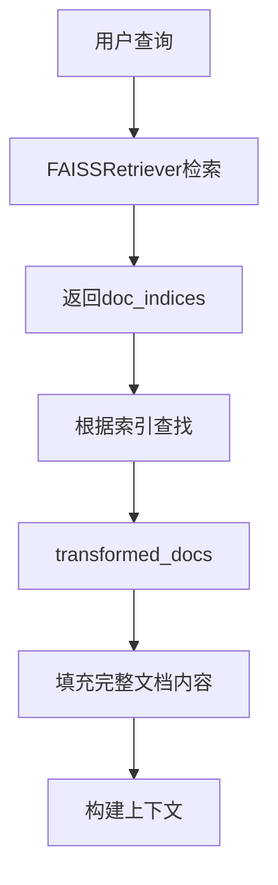
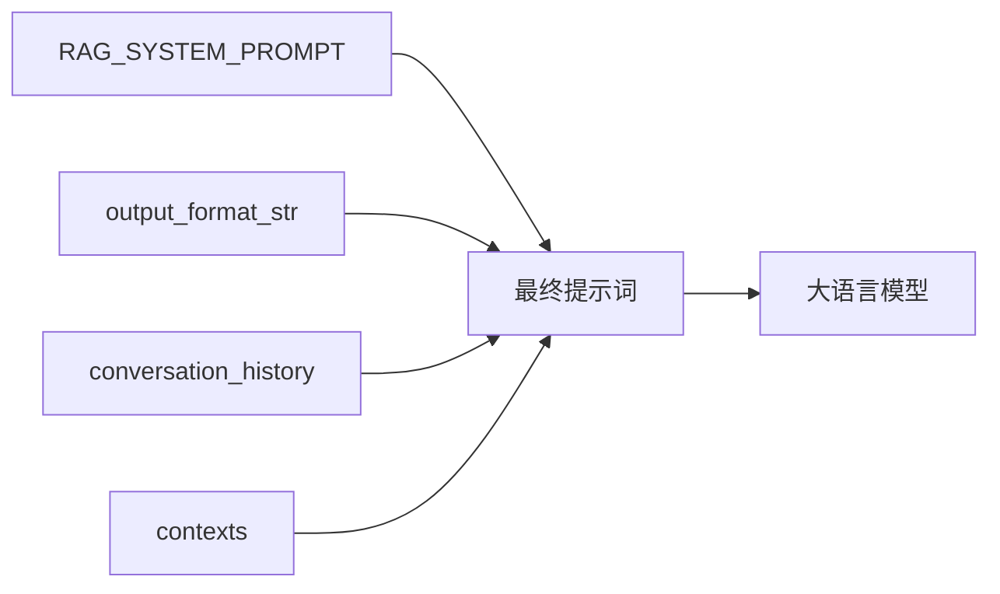
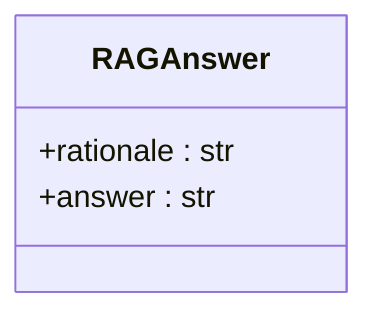

# 查询处理

<cite>
**Referenced Files in This Document**   
- [api/rag.py](file://api/rag.py)
- [api/prompts.py](file://api/prompts.py)
- [api/data_pipeline.py](file://api/data_pipeline.py)
</cite>

## Table of Contents
1. [核心查询处理流程](#核心查询处理流程)
2. [检索结果填充机制](#检索结果填充机制)
3. [提示词模板与上下文整合](#提示词模板与上下文整合)
4. [模型输出解析与结构化](#模型输出解析与结构化)
5. [错误处理与日志分析](#错误处理与日志分析)

## 核心查询处理流程

`call`方法是整个RAG系统的核心查询入口，负责协调从用户查询到最终答案生成的完整流程。该方法首先接收用户输入的查询字符串，并通过`FAISSRetriever`在向量数据库中执行相似性检索。`FAISSRetriever`利用预计算的文档嵌入向量，通过向量相似度计算，快速定位与用户查询语义最相关的文档片段。

在检索过程中，系统会将用户查询通过`query_embedder`转换为与文档向量相同维度的嵌入向量，然后在由`DatabaseManager`管理的向量索引中进行最近邻搜索。这一过程确保了即使用户的查询与文档中的原始文本不完全匹配，只要语义相近，也能被成功检索。

**Section sources**
- [api/rag.py](file://api/rag.py#L415-L444)

## 检索结果填充机制

检索操作返回的结果中包含一个关键的`doc_indices`字段，该字段存储了在向量数据库中找到的最相关文档的索引列表。这些索引并非指向原始文档，而是指向`transformed_docs`列表中的位置。`transformed_docs`是`DatabaseManager`在初始化阶段通过`prepare_database`方法处理并转换后的文档集合，其中包含了完整的文本内容、元数据以及嵌入向量。

`call`方法通过一个列表推导式，利用`doc_indices`中的索引，从`transformed_docs`中批量提取出完整的文档对象，并将其填充到检索结果的`documents`字段中。这一机制实现了从轻量级的向量索引到包含丰富上下文信息的完整文档的高效映射，为后续的提示词构建提供了必要的信息。

**Diagram sources **
- [api/rag.py](file://api/rag.py#L420-L424)
- [api/data_pipeline.py](file://api/data_pipeline.py#L773-L880)

**Section sources**
- [api/rag.py](file://api/rag.py#L420-L424)
- [api/data_pipeline.py](file://api/data_pipeline.py#L773-L880)

## 提示词模板与上下文整合

在获取到完整的相关文档后，系统利用`RAG_TEMPLATE`和`RAG_SYSTEM_PROMPT`来构建发送给大语言模型的最终提示词。`RAG_SYSTEM_PROMPT`定义了模型的角色和行为准则，要求模型作为一个代码助手，根据用户查询、相关上下文和对话历史来回答问题，并规定了响应格式（如使用Markdown）。

`RAG_TEMPLATE`则是一个Jinja2模板，它将`RAG_SYSTEM_PROMPT`、`output_format_str`（由`DataClassParser`生成的输出格式说明）、`conversation_history`（来自`Memory`组件的对话历史）以及`contexts`（即填充后的检索文档）动态地整合在一起。这个模板确保了所有相关信息都被结构化地组织，并以模型易于理解的格式呈现，从而引导模型生成准确且格式正确的回答。

**Diagram sources **
- [api/rag.py](file://api/rag.py#L228-L232)
- [api/prompts.py](file://api/prompts.py#L3-L30)

**Section sources**
- [api/rag.py](file://api/rag.py#L228-L232)
- [api/prompts.py](file://api/prompts.py#L3-L30)

## 模型输出解析与结构化

大语言模型生成的原始响应会被`DataClassParser`解析器处理。该解析器基于`RAGAnswer`数据类的定义，将模型的输出结构化为一个包含`rationale`（推理过程）和`answer`（最终答案）两个字段的Python对象。`RAGAnswer`是一个继承自`adal.DataClass`的数据类，其`answer`字段被特别标注为使用Markdown格式渲染，这确保了前端可以正确地展示代码块、列表等富文本内容。

通过这种结构化解析，系统能够将非结构化的自然语言响应转化为程序可操作的数据对象，便于后续的处理、验证和展示。

**Diagram sources **
- [api/rag.py](file://api/rag.py#L146-L150)

**Section sources**
- [api/rag.py](file://api/rag.py#L146-L150)

## 错误处理与日志分析

`call`方法被包裹在一个`try-except`块中，以捕获和处理任何在查询处理过程中可能发生的异常。当发生错误时，系统会记录详细的错误日志，包括错误类型和消息，这对于调试和监控系统健康状况至关重要。随后，系统会创建一个预定义的`RAGAnswer`错误响应对象，向用户返回一个友好的错误信息，而不是暴露内部错误细节。

这种错误处理机制保证了系统的健壮性，即使在部分组件（如数据库连接、模型调用）出现故障时，API也能返回一个有意义的响应，避免服务完全中断。

**Section sources**
- [api/rag.py](file://api/rag.py#L426-L444)