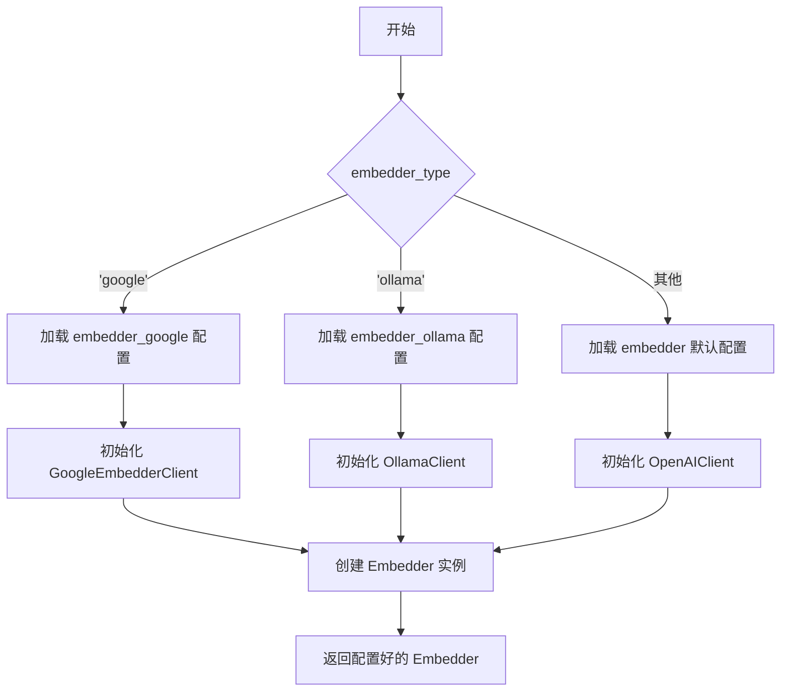
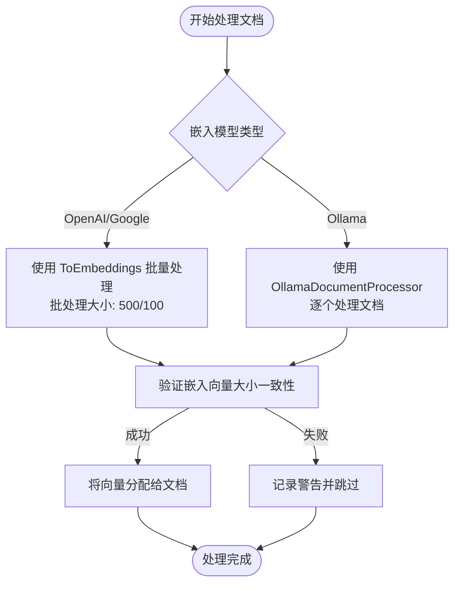
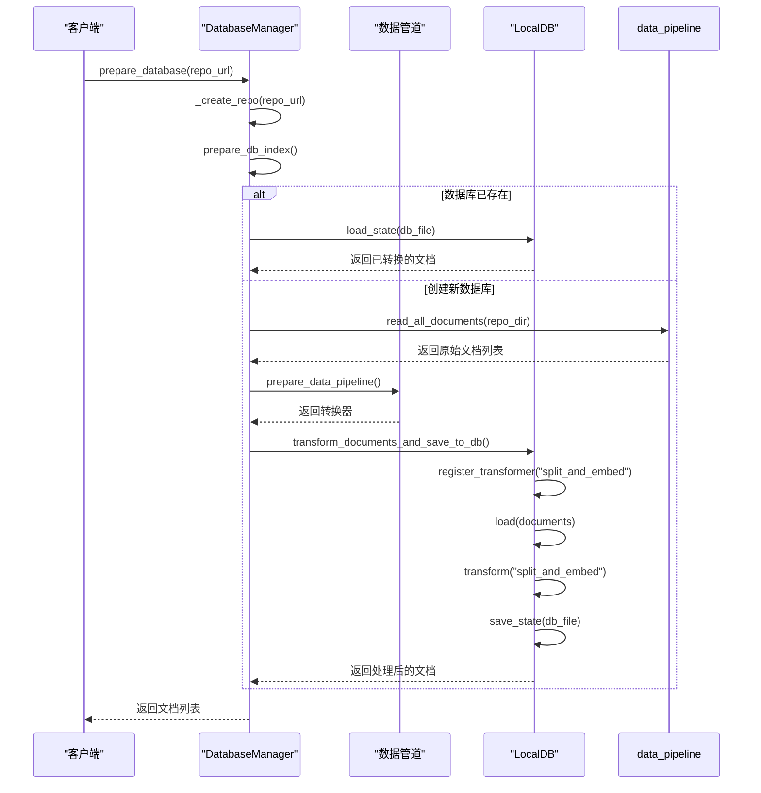

# 向量化处理

<cite>
**本文档引用的文件**
- [embedder.py](file://api/tools/embedder.py)
- [embedder.json](file://api/config/embedder.json)
- [data_pipeline.py](file://api/data_pipeline.py)
- [google_embedder_client.py](file://api/google_embedder_client.py)
- [ollama_patch.py](file://api/ollama_patch.py)
</cite>

## 目录
1. [简介](#简介)
2. [ToEmbeddings组件与嵌入模型调用机制](#toembeddings组件与嵌入模型调用机制)
3. [批处理、速率限制与错误重试策略](#批处理、速率限制与错误重试策略)
4. [向量与元数据的持久化存储](#向量与元数据的持久化存储)
5. [嵌入模型对检索质量的影响分析](#嵌入模型对检索质量的影响分析)
6. [嵌入模型切换与性能调优指南](#嵌入模型切换与性能调优指南)

## 简介
本文档详细阐述了`ToEmbeddings`组件如何调用配置指定的嵌入模型（如Google Embedder、Ollama）将文本块转换为向量表示。说明了嵌入过程中的批处理机制、速率限制处理和错误重试策略。解释了`transform_documents_and_save_to_db`函数如何将生成的向量与原始文档元数据关联并持久化到FAISS索引中。分析了不同嵌入模型对检索质量的影响，并提供了嵌入模型切换与性能调优的实用指南。

## ToEmbeddings组件与嵌入模型调用机制

`ToEmbeddings`组件是向量化处理的核心，负责将文本块转换为高维向量表示。该组件通过`get_embedder`函数根据配置动态选择并初始化指定的嵌入模型，支持OpenAI、Google和Ollama等多种模型。

嵌入模型的选择由配置文件`embedder.json`中的`embedder_type`参数决定。当`embedder_type`设置为`'google'`时，系统会加载`embedder_google`配置，初始化`GoogleEmbedderClient`；当设置为`'ollama'`时，则加载`embedder_ollama`配置，使用`OllamaClient`。对于未明确指定的类型，默认使用`embedder`配置，通常指向OpenAI模型。

**图示来源**
- [embedder.py](file://api/tools/embedder.py#L5-L53)
- [embedder.json](file://api/config/embedder.json#L1-L33)

**本节来源**
- [embedder.py](file://api/tools/embedder.py#L5-L53)
- [embedder.json](file://api/config/embedder.json#L1-L33)

## 批处理、速率限制与错误重试策略

向量化处理采用了差异化的批处理策略以优化性能。对于支持批量API的OpenAI和Google嵌入模型，系统使用`ToEmbeddings`组件进行批量处理，其批处理大小由配置文件中的`batch_size`参数控制。例如，OpenAI模型的默认批处理大小为500，而Google模型为100。

对于不支持批量API的Ollama模型，系统采用`OllamaDocumentProcessor`逐个处理文档。该处理器通过`__call__`方法遍历文档列表，对每个文档的文本内容单独调用嵌入模型，并在处理过程中验证嵌入向量的大小一致性，确保数据完整性。

在错误处理方面，`GoogleEmbedderClient`集成了`backoff`库实现指数退避重试机制。`call`方法使用`@backoff.on_exception`装饰器，在遇到API异常时自动进行重试，最大重试时间为5秒，有效应对临时性网络故障或服务过载。同时，系统在日志中记录详细的错误信息，便于问题排查。

**图示来源**
- [data_pipeline.py](file://api/data_pipeline.py#L372-L414)
- [ollama_patch.py](file://api/ollama_patch.py#L50-L104)
- [google_embedder_client.py](file://api/google_embedder_client.py#L180-L200)

**本节来源**
- [data_pipeline.py](file://api/data_pipeline.py#L372-L414)
- [ollama_patch.py](file://api/ollama_patch.py#L50-L104)
- [google_embedder_client.py](file://api/google_embedder_client.py#L180-L200)

## 向量与元数据的持久化存储

`transform_documents_and_save_to_db`函数是向量持久化的关键，它将生成的向量与原始文档的元数据关联，并保存到本地数据库中。该过程首先通过`prepare_data_pipeline`创建一个包含`TextSplitter`和`ToEmbeddings`（或`OllamaDocumentProcessor`）的数据转换管道。

随后，系统创建一个`LocalDB`实例，将转换管道注册为名为`"split_and_embed"`的转换器。原始文档列表被加载到数据库中，并通过`transform`方法执行整个转换流程：文档先被分割成块，然后每个文本块被转换为向量。最终，处理后的数据库状态被序列化并保存到由`repo_name`确定的`.pkl`文件中，路径通常为`~/.adalflow/databases/{owner}_{repo_name}.pkl`。

**图示来源**
- [data_pipeline.py](file://api/data_pipeline.py#L416-L440)
- [data_pipeline.py](file://api/data_pipeline.py#L815-L866)

**本节来源**
- [data_pipeline.py](file://api/data_pipeline.py#L416-L440)
- [data_pipeline.py](file://api/data_pipeline.py#L815-L866)

## 嵌入模型对检索质量的影响分析

不同的嵌入模型对检索质量有显著影响。Google的`text-embedding-004`模型专为语义相似性设计，其`task_type`被设置为`SEMANTIC_SIMILARITY`，在理解复杂语义和上下文方面表现出色，适合需要高精度语义匹配的应用场景。

Ollama模型（如`nomic-embed-text`）在本地运行，虽然可能在绝对精度上略逊于云端模型，但其优势在于低延迟、数据隐私和可定制性。对于特定领域或内部知识库，经过微调的Ollama模型可以提供非常相关的检索结果。

OpenAI的`text-embedding-3-small`模型在性能和成本之间取得了良好平衡，其`dimensions`设置为256，适合大多数通用检索任务。选择模型时，应权衡检索精度、响应速度、成本和数据隐私需求。

## 嵌入模型切换与性能调优指南

切换嵌入模型主要通过修改`embedder.json`配置文件实现。例如，要从OpenAI切换到Google，需将`embedder_type`设置为`'google'`，并确保`GOOGLE_API_KEY`环境变量已正确设置。切换到Ollama时，需确保Ollama服务正在运行，并且所需的模型（如`nomic-embed-text`）已通过`ollama pull`命令下载。

性能调优的关键在于合理配置`batch_size`。对于云端模型，增大批处理大小可以提高吞吐量，但需注意API的速率限制。对于Ollama，虽然不支持批量API，但可以通过调整系统资源（如GPU内存）来提升单个请求的处理速度。此外，通过`excluded_dirs`和`excluded_files`配置排除不必要的文件，可以显著减少处理时间和存储开销，从而提升整体性能。

**本节来源**
- [embedder.json](file://api/config/embedder.json#L1-L33)
- [data_pipeline.py](file://api/data_pipeline.py#L372-L414)
- [ollama_patch.py](file://api/ollama_patch.py#L1-L104)