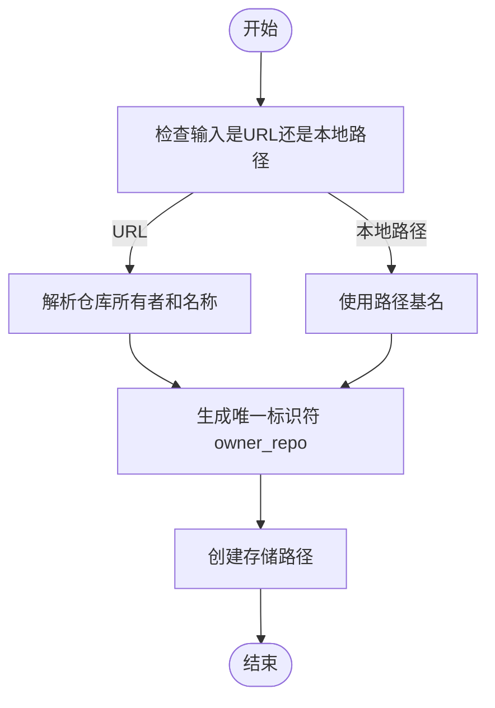
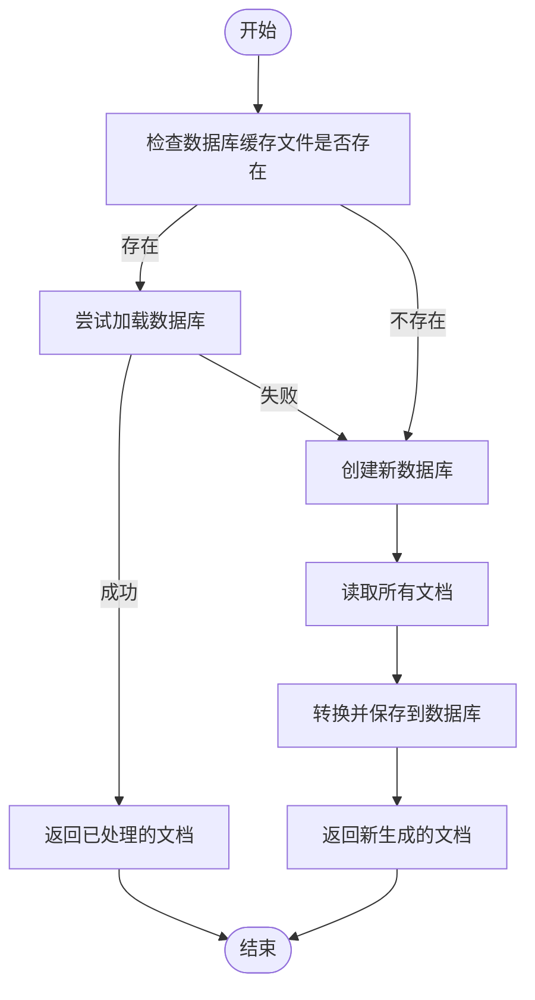
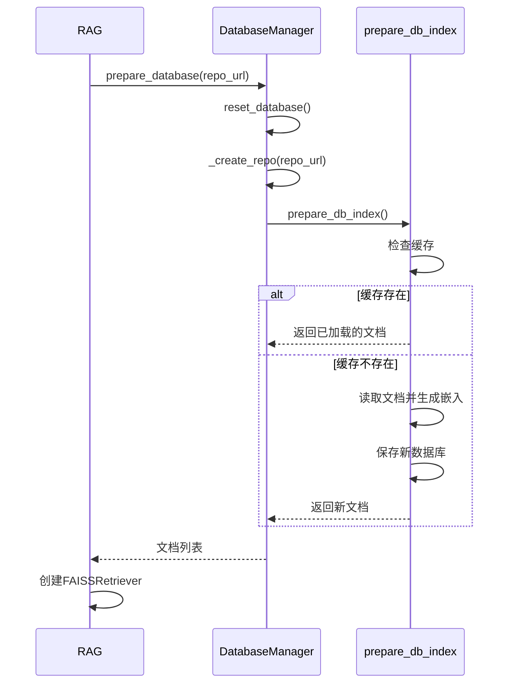

# 数据库准备

<cite>
**Referenced Files in This Document**   
- [data_pipeline.py](file://api/data_pipeline.py)
- [rag.py](file://api/rag.py)
- [config.py](file://api/config.py)
</cite>

## 目录
1. [简介](#简介)
2. [数据库初始化流程](#数据库初始化流程)
3. [缓存与加载机制](#缓存与加载机制)
4. [目录结构与元数据](#目录结构与元数据)
5. [异常处理机制](#异常处理机制)
6. [RAG流程中的前置作用](#rag流程中的前置作用)
7. [配置与清理策略](#配置与清理策略)

## 简介
`DatabaseManager.prepare_database` 方法是向量数据库初始化的核心入口，负责协调代码库获取、文档处理、嵌入生成和持久化存储等关键步骤。该方法通过智能缓存机制优化性能，仅在必要时触发完整的数据库构建流程，并为后续的检索增强生成（RAG）提供结构化数据支持。

**Section sources**
- [data_pipeline.py](file://api/data_pipeline.py#L711-L740)

## 数据库初始化流程
`prepare_database` 方法通过调用私有方法 `_create_repo` 来初始化数据库。该流程首先根据输入参数判断是远程仓库URL还是本地路径：

- **远程仓库处理**：对于以 `http://` 或 `https://` 开头的URL，系统会解析出仓库所有者和名称，生成唯一的标识符（如 `owner_repo`），并将其作为子目录名。
- **本地路径处理**：对于本地路径，直接使用路径的基名作为标识符。

此过程确保了不同来源的仓库能被统一管理，并为后续的缓存和检索操作提供一致的命名基础。

**Diagram sources**
- [data_pipeline.py](file://api/data_pipeline.py#L765-L813)

**Section sources**
- [data_pipeline.py](file://api/data_pipeline.py#L765-L813)

## 缓存与加载机制
系统采用高效的缓存策略来避免重复的数据库构建工作。`prepare_db_index` 方法在执行文档处理前，会首先检查本地缓存中是否存在有效的数据库文件。

- **缓存存在且有效**：如果在 `~/.adalflow/databases/{repo_name}.pkl` 路径下找到数据库文件，系统会尝试加载它。加载成功后，直接返回已处理的文档列表，跳过耗时的克隆和嵌入过程。
- **缓存不存在或加载失败**：如果数据库文件不存在，或加载过程中发生异常（如文件损坏），系统将触发完整的数据库创建流程，包括代码库克隆或本地扫描、文档读取、分块和嵌入生成。

这种“先检查后创建”的模式显著提升了系统响应速度，特别是在处理大型代码库时。

**Diagram sources**
- [data_pipeline.py](file://api/data_pipeline.py#L815-L866)

**Section sources**
- [data_pipeline.py](file://api/data_pipeline.py#L815-L866)

## 目录结构与元数据
数据库初始化过程中，系统会自动创建标准化的目录结构以组织数据：

- **代码库存储**：`~/.adalflow/repos/{owner}_{repo_name}` 用于存放克隆的代码库。
- **数据库存储**：`~/.adalflow/databases/{owner}_{repo_name}.pkl` 用于存放序列化的向量数据库。

`_create_repo` 方法负责创建这些目录，并通过 `os.makedirs` 确保父目录的存在。所有路径信息都被记录在 `self.repo_paths` 字典中，作为后续操作的元数据。这种结构化的存储方式便于管理和清理，同时也支持多仓库的并行处理。

**Section sources**
- [data_pipeline.py](file://api/data_pipeline.py#L765-L813)

## 异常处理机制
系统在数据库初始化的每个关键环节都实现了完善的异常处理：

- **路径权限问题**：在创建目录时，`os.makedirs` 的 `exist_ok=True` 参数确保了即使目录已存在也不会抛出错误。对于更严重的权限问题，`try-except` 块会捕获 `Exception` 并记录错误日志，然后重新抛出，确保调用者能感知到问题。
- **数据库加载失败**：在 `prepare_db_index` 中，加载现有数据库的代码被包裹在 `try-except` 块中。如果加载失败，系统会记录错误但继续执行，转而创建一个新的数据库，保证了流程的鲁棒性。
- **文档读取错误**：在读取单个文件时，系统会捕获 `Exception` 并记录错误，但不会中断整个流程，允许其他有效文件继续被处理。

这种分层的异常处理策略确保了系统在面对各种意外情况时仍能保持稳定运行。

**Section sources**
- [data_pipeline.py](file://api/data_pipeline.py#L765-L813)
- [data_pipeline.py](file://api/data_pipeline.py#L815-L866)

## RAG流程中的前置作用
`prepare_database` 方法是RAG（检索增强生成）流程的前置核心。`RAG.prepare_retriever` 方法直接调用它来准备检索器所需的文档数据。

- **调用链**：`RAG.prepare_retriever` → `DatabaseManager.prepare_database` → `DatabaseManager.prepare_db_index`。
- **数据准备**：`prepare_database` 返回的文档列表会被 `RAG` 类用于创建 `FAISSRetriever`，这是执行语义检索的关键组件。
- **前置条件**：在任何查询被处理之前，必须先通过此方法准备好检索器。这确保了RAG系统在响应用户查询时，能够从一个已构建好的、包含丰富上下文信息的向量数据库中进行高效检索。

因此，`prepare_database` 的成功执行是整个RAG功能正常运作的先决条件。

**Diagram sources**
- [rag.py](file://api/rag.py#L344-L413)
- [data_pipeline.py](file://api/data_pipeline.py#L711-L740)

**Section sources**
- [rag.py](file://api/rag.py#L344-L413)

## 配置与清理策略
### 数据库缓存位置配置
向量数据库的缓存位置由 `get_adalflow_default_root_path()` 函数决定，其默认路径为 `~/.adalflow`。用户可以通过设置环境变量或修改配置文件来改变此路径，但当前实现中未提供直接的配置选项。

### 清理策略实践建议
1. **手动清理**：用户可以直接删除 `~/.adalflow/databases/` 目录下的 `.pkl` 文件来清除特定仓库的缓存，或删除整个 `~/.adalflow` 目录来重置所有数据。
2. **自动化脚本**：建议编写脚本定期清理过期或不再使用的数据库文件，以节省磁盘空间。
3. **配置管理**：通过 `config.py` 中的 `DEFAULT_EXCLUDED_DIRS` 和 `DEFAULT_EXCLUDED_FILES` 列表，可以控制在文档读取阶段忽略哪些文件和目录，从而从源头上减少不必要的数据处理和存储。

**Section sources**
- [config.py](file://api/config.py#L300-L380)
- [data_pipeline.py](file://api/data_pipeline.py#L815-L866)