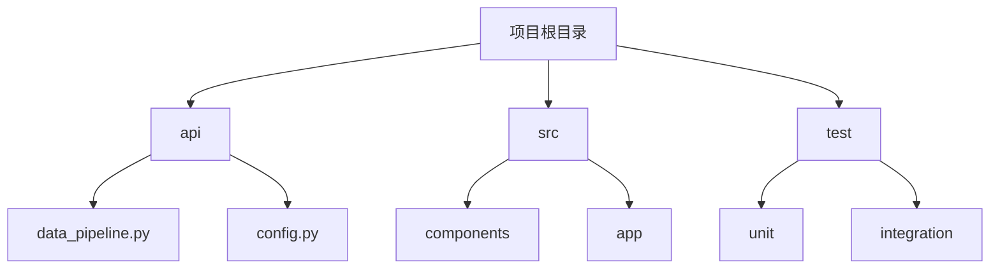
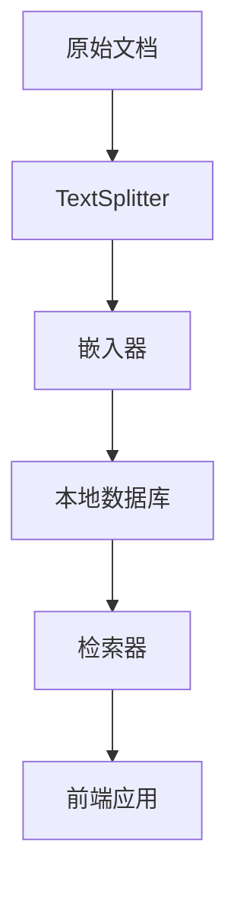
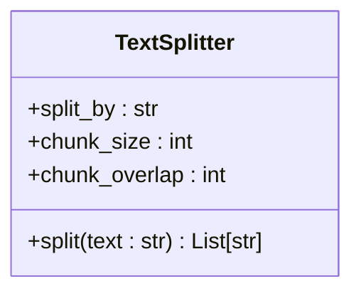
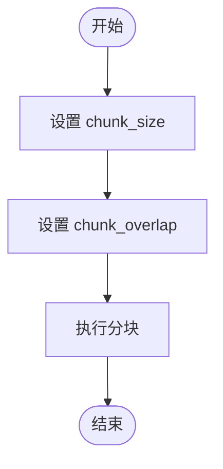
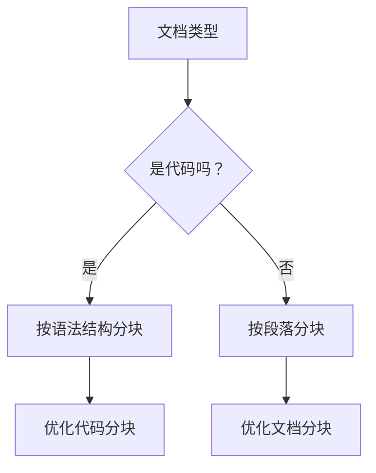
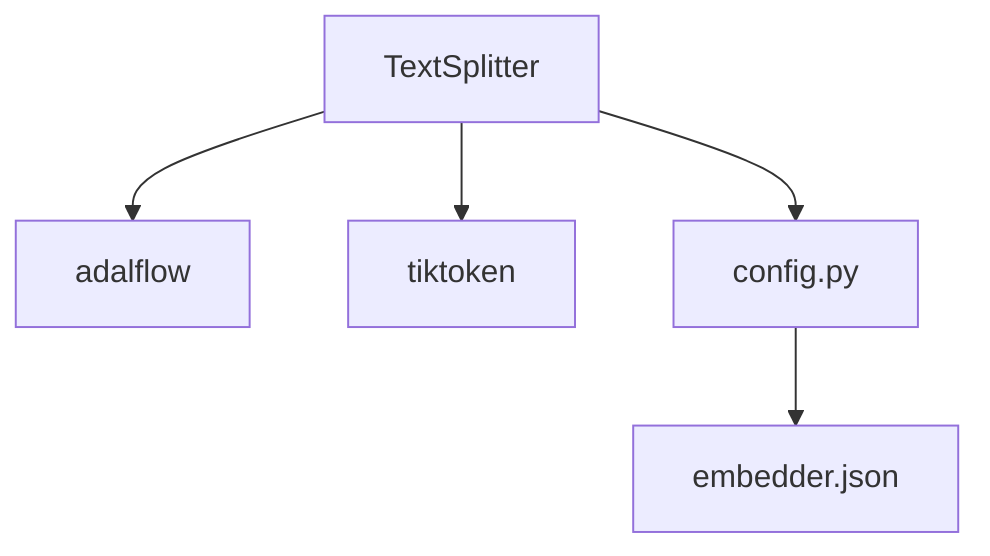

# 文本分块

<cite>
**本文档中引用的文件**  
- [data_pipeline.py](file://api/data_pipeline.py)
- [config.py](file://api/config.py)
- [embedder.json](file://api/config/embedder.json)
</cite>

## 目录
1. [简介](#简介)
2. [项目结构](#项目结构)
3. [核心组件](#核心组件)
4. [架构概述](#架构概述)
5. [详细组件分析](#详细组件分析)
6. [依赖分析](#依赖分析)
7. [性能考虑](#性能考虑)
8. [故障排除指南](#故障排除指南)
9. [结论](#结论)
10. [附录](#附录)（如有必要）

## 简介
本文档详细解释了 `TextSplitter` 组件如何将原始代码和文档内容分割为适合嵌入处理的语义块。文档涵盖了分块策略的选择依据、`chunk_size` 和 `chunk_overlap` 参数的配置影响、针对不同编程语言的优化策略，以及分块效果评估方法和调整建议。

## 项目结构
项目结构遵循典型的模块化设计，主要分为 `api`、`src`、`test` 等目录。`api` 目录包含核心数据处理逻辑，`src` 目录包含前端组件和页面，`test` 目录包含单元测试和集成测试。



**图源**  
- [data_pipeline.py](file://api/data_pipeline.py#L0-L882)
- [config.py](file://api/config.py#L0-L388)

**节源**  
- [data_pipeline.py](file://api/data_pipeline.py#L0-L882)
- [config.py](file://api/config.py#L0-L388)

## 核心组件
`TextSplitter` 组件是数据处理流水线的核心部分，负责将原始文档分割为适合嵌入处理的语义块。该组件通过配置文件中的参数进行配置，并与嵌入器协同工作。

**节源**  
- [data_pipeline.py](file://api/data_pipeline.py#L376-L409)
- [config.py](file://api/config.py#L302-L346)

## 架构概述
系统架构采用模块化设计，`TextSplitter` 组件作为数据处理流水线的一部分，与嵌入器和数据库管理器协同工作。数据流从原始文档读取开始，经过分块处理，最终存储到本地数据库中。



**图源**  
- [data_pipeline.py](file://api/data_pipeline.py#L376-L409)
- [config.py](file://api/config.py#L302-L346)

## 详细组件分析
### TextSplitter 分析
`TextSplitter` 组件通过配置文件中的 `text_splitter` 参数进行配置，支持按单词、句子或字符进行分块。分块策略的选择依据是文档的类型和内容结构。

#### 分块策略


**图源**  
- [data_pipeline.py](file://api/data_pipeline.py#L376-L409)

#### 分块参数


**图源**  
- [embedder.json](file://api/config/embedder.json#L30-L33)

**节源**  
- [data_pipeline.py](file://api/data_pipeline.py#L376-L409)
- [embedder.json](file://api/config/embedder.json#L30-L33)

### 概念概述
分块策略的选择需要考虑文档的语义完整性和嵌入模型的输入限制。`chunk_size` 和 `chunk_overlap` 参数的配置直接影响分块效果和检索性能。



## 依赖分析
`TextSplitter` 组件依赖于 `adalflow` 库中的 `TextSplitter` 和 `ToEmbeddings` 组件，以及 `tiktoken` 库进行令牌计数。配置文件中的参数通过 `config.py` 模块加载。



**图源**  
- [data_pipeline.py](file://api/data_pipeline.py#L0-L36)
- [config.py](file://api/config.py#L107-L121)

**节源**  
- [data_pipeline.py](file://api/data_pipeline.py#L0-L36)
- [config.py](file://api/config.py#L107-L121)

## 性能考虑
分块策略的选择和参数配置对系统性能有显著影响。较大的 `chunk_size` 可以提高语义完整性，但会增加嵌入模型的计算负担。适当的 `chunk_overlap` 可以减少语义断裂，但会增加存储开销。

## 故障排除指南
在使用 `TextSplitter` 组件时，常见的问题包括分块效果不佳、嵌入模型超时等。建议通过调整 `chunk_size` 和 `chunk_overlap` 参数来优化分块效果，并确保文档内容符合预期。

**节源**  
- [data_pipeline.py](file://api/data_pipeline.py#L149-L162)
- [config.py](file://api/config.py#L228-L259)

## 结论
`TextSplitter` 组件通过灵活的分块策略和参数配置，能够有效地将原始代码和文档内容分割为适合嵌入处理的语义块。针对不同编程语言的优化策略和分块效果评估方法，确保了检索时的上下文完整性。

## 附录
### 配置文件示例
```json
{
  "text_splitter": {
    "split_by": "word",
    "chunk_size": 350,
    "chunk_overlap": 100
  }
}
```

**节源**  
- [embedder.json](file://api/config/embedder.json#L30-L33)