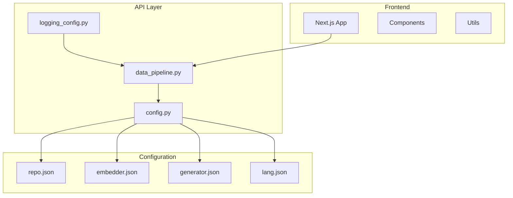
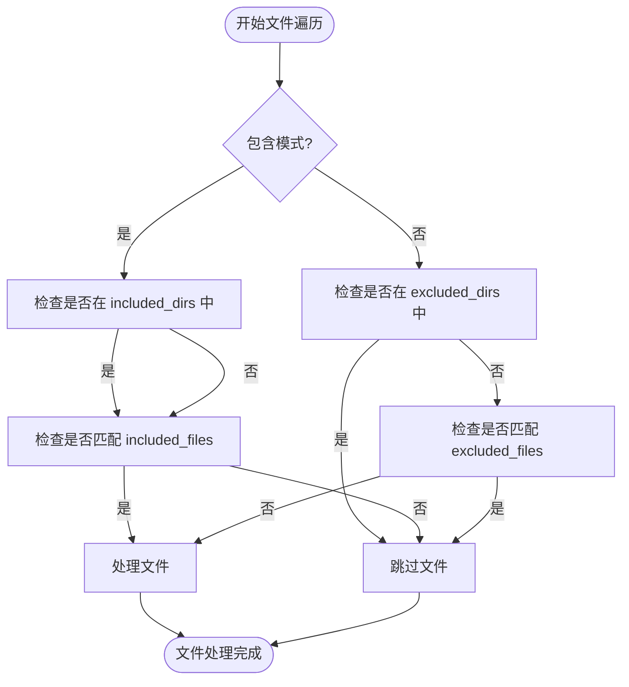
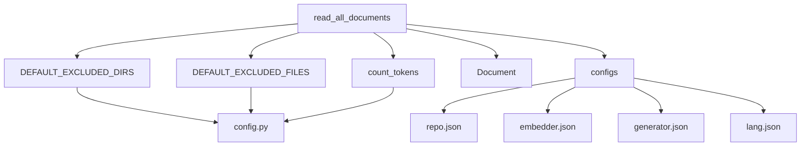

# 文档读取与过滤

<cite>
**Referenced Files in This Document**   
- [data_pipeline.py](file://api/data_pipeline.py)
- [config.py](file://api/config.py)
- [repo.json](file://api/config/repo.json)
- [logging_config.py](file://api/logging_config.py)
</cite>

## 目录
1. [简介](#简介)
2. [项目结构](#项目结构)
3. [核心组件](#核心组件)
4. [文件过滤机制](#文件过滤机制)
5. [文档读取与解析策略](#文档读取与解析策略)
6. [特殊文件处理](#特殊文件处理)
7. [配置与性能优化](#配置与性能优化)
8. [依赖分析](#依赖分析)
9. [结论](#结论)

## 简介
本文档深入解析 `read_all_documents` 方法如何递归遍历代码库文件系统，根据配置文件（如 `repo.json`）中的 `excluded_dirs`、`excluded_files` 等规则过滤无关文件。详细说明该方法如何区分代码文件与文档文件并应用不同的解析器，描述对 Git 子模块、符号链接和二进制文件的处理策略。同时提供自定义文件过滤规则的配置示例，并分析不同过滤策略对处理性能的影响。

## 项目结构
本项目采用模块化设计，主要分为 API 接口层、配置管理、数据处理管道和前端应用。核心数据处理逻辑位于 `api/` 目录下，其中 `data_pipeline.py` 文件实现了文档读取、过滤和转换的核心功能。配置文件集中存放在 `api/config/` 目录中，通过环境变量和 JSON 配置文件实现灵活的运行时配置。



**Diagram sources**
- [data_pipeline.py](file://api/data_pipeline.py)
- [config.py](file://api/config.py)
- [repo.json](file://api/config/repo.json)

**Section sources**
- [data_pipeline.py](file://api/data_pipeline.py)
- [config.py](file://api/config.py)
- [repo.json](file://api/config/repo.json)

## 核心组件
`read_all_documents` 函数是整个文档处理流程的核心入口，负责递归扫描指定路径下的所有文件，根据配置规则进行过滤，并将符合条件的文件内容加载为 `Document` 对象列表。该函数支持灵活的包含/排除模式，能够处理多种嵌入器类型，并对大文件进行自动跳过以防止内存溢出。

**Section sources**
- [data_pipeline.py](file://api/data_pipeline.py#L143-L370)

## 文件过滤机制
系统采用双层文件过滤机制，结合默认排除规则与用户自定义配置，确保只处理相关文件。

### 过滤模式
系统支持两种互斥的过滤模式：
- **排除模式（Exclusion Mode）**：默认模式，基于 `DEFAULT_EXCLUDED_DIRS` 和 `DEFAULT_EXCLUDED_FILES` 列表排除特定目录和文件。
- **包含模式（Inclusion Mode）**：当提供 `included_dirs` 或 `included_files` 参数时激活，仅处理明确指定的目录和文件。

### 配置优先级
过滤规则的优先级从高到低为：
1. 函数调用时直接传入的 `excluded_dirs`/`excluded_files`
2. `repo.json` 配置文件中的 `file_filters` 设置
3. 代码中定义的 `DEFAULT_EXCLUDED_*` 默认值



**Diagram sources**
- [data_pipeline.py](file://api/data_pipeline.py#L143-L370)
- [config.py](file://api/config.py#L262-L300)

**Section sources**
- [data_pipeline.py](file://api/data_pipeline.py#L143-L370)
- [config.py](file://api/config.py#L262-L300)
- [repo.json](file://api/config/repo.json)

## 文档读取与解析策略
系统采用分阶段处理策略，优先处理代码文件，然后处理文档文件，确保核心源码被优先索引。

### 文件类型识别
通过预定义的文件扩展名列表区分文件类型：

| 文件类型 | 扩展名 |
|---------|-------|
| 代码文件 | .py, .js, .ts, .java, .cpp, .go, .rs, .html, .css 等 |
| 文档文件 | .md, .txt, .rst, .json, .yaml, .yml |

### 元数据提取
为每个文档提取丰富的元数据，包括：
- `file_path`: 相对路径
- `type`: 文件类型（扩展名）
- `is_code`: 是否为代码文件
- `is_implementation`: 是否为实现文件（非测试/配置）
- `token_count`: 内容令牌数

**Section sources**
- [data_pipeline.py](file://api/data_pipeline.py#L143-L370)

## 特殊文件处理
系统对特殊类型的文件和路径进行了专门处理，以确保稳定性和安全性。

### Git 子模块处理
虽然 `read_all_documents` 本身不直接处理 Git 子模块，但其调用的 `download_repo` 函数在克隆仓库时使用 `--depth=1 --single-branch` 参数，这会忽略子模块。若需包含子模块，需在外部手动初始化。

### 符号链接处理
Python 的 `glob.glob` 和 `os.walk`（间接使用）默认会解析符号链接。这意味着如果符号链接指向一个目录，该目录的内容将被递归扫描；如果指向文件，则该文件将被包含在结果中。

### 二进制文件过滤
系统通过 `excluded_files` 列表中的通配符（如 `*.exe`, `*.dll`, `*.so`, `*.zip` 等）主动过滤常见的二进制文件和压缩包，防止尝试读取非文本内容导致的编码错误。

**Section sources**
- [data_pipeline.py](file://api/data_pipeline.py#L143-L370)
- [config.py](file://api/config.py#L280-L300)

## 配置与性能优化
合理的配置能显著提升处理性能和资源利用率。

### 自定义过滤规则示例
可在 `repo.json` 中添加自定义排除规则：

```json
{
  "file_filters": {
    "excluded_dirs": [
      "./.venv/",
      "./node_modules/",
      "./.git/",
      "./tests/"  // 新增：排除测试目录
    ],
    "excluded_files": [
      "yarn.lock",
      "package-lock.json",
      "*.log",     // 新增：排除日志文件
      "*.tmp"      // 新增：排除临时文件
    ]
  }
}
```

### 性能影响分析
不同过滤策略对性能的影响：

| 策略 | 扫描文件数 | 内存占用 | 处理时间 | 适用场景 |
|------|-----------|---------|---------|---------|
| 默认排除 | 中等 | 中等 | 中等 | 通用场景 |
| 包含模式 | 最少 | 最低 | 最快 | 精确处理特定模块 |
| 宽松排除 | 最多 | 最高 | 最慢 | 全面索引，资源充足 |

**Section sources**
- [repo.json](file://api/config/repo.json)
- [data_pipeline.py](file://api/data_pipeline.py#L143-L370)

## 依赖分析
核心功能依赖于多个配置和工具模块，形成清晰的依赖链。



**Diagram sources**
- [data_pipeline.py](file://api/data_pipeline.py)
- [config.py](file://api/config.py)
- [repo.json](file://api/config/repo.json)

**Section sources**
- [data_pipeline.py](file://api/data_pipeline.py)
- [config.py](file://api/config.py)
- [repo.json](file://api/config/repo.json)

## 结论
`read_all_documents` 方法通过灵活的包含/排除机制、分阶段处理策略和详尽的元数据提取，实现了高效且安全的代码库文档读取。其设计充分考虑了实际应用场景中的性能和稳定性需求，通过配置文件实现了高度的可定制性。对于特殊文件类型，系统采取了主动过滤策略，确保处理过程的健壮性。通过合理配置过滤规则，可以在处理速度、内存占用和索引完整性之间取得最佳平衡。