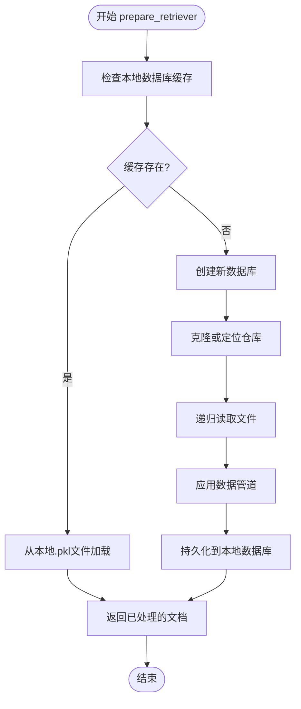
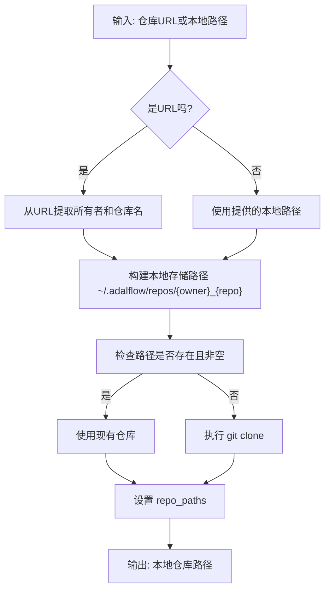

# 检索器准备

<cite>
**Referenced Files in This Document**   
- [api/rag.py](file://api/rag.py)
- [api/data_pipeline.py](file://api/data_pipeline.py)
- [api/config.py](file://api/config.py)
</cite>

## 目录
1. [方法执行流程](#方法执行流程)
2. [数据库管理与本地缓存](#数据库管理与本地缓存)
3. [仓库克隆与路径处理](#仓库克隆与路径处理)
4. [文档读取与文件过滤](#文档读取与文件过滤)
5. [数据管道与文档处理](#数据管道与文档处理)
6. [文档转换与持久化](#文档转换与持久化)
7. [文件过滤配置最佳实践](#文件过滤配置最佳实践)
8. [性能优化建议](#性能优化建议)

## 方法执行流程

`prepare_retriever`方法是检索器准备的核心入口，其执行流程始于`RAG`类的调用，通过`DatabaseManager`协调整个数据准备过程。该方法首先初始化数据库管理器，然后调用`DatabaseManager.prepare_database`方法来处理仓库数据。整个流程遵循一个清晰的顺序：确定仓库路径、检查本地缓存、读取文档、应用数据转换管道、最终持久化处理后的文档。

该方法支持从GitHub、GitLab或本地路径加载仓库，并通过访问令牌处理私有仓库。其设计允许在后续调用中复用已处理的数据库，从而避免重复的克隆和处理操作，显著提升性能。

**Section sources**
- [api/rag.py](file://api/rag.py#L344-L413)
- [api/data_pipeline.py](file://api/data_pipeline.py#L711-L740)

## 数据库管理与本地缓存

`DatabaseManager`类负责管理向量数据库的生命周期，其核心功能是利用本地文件系统作为缓存层。当`prepare_retriever`被调用时，`DatabaseManager`会首先检查本地是否存在已处理的数据库文件。数据库文件的存储路径遵循`~/.adalflow/databases/{owner}_{repo_name}.pkl`的命名约定，其中`{owner}`和`{repo_name}`是从仓库URL中提取的。

如果在指定路径下发现了有效的`.pkl`文件，`DatabaseManager`将直接从该文件加载预处理的文档，从而完全跳过克隆和处理阶段。这种机制极大地加速了重复查询的响应时间。只有在本地缓存不存在或加载失败时，系统才会进入创建新数据库的流程。

**Diagram sources**
- [api/data_pipeline.py](file://api/data_pipeline.py#L741-L881)

**Section sources**
- [api/data_pipeline.py](file://api/data_pipeline.py#L741-L881)

## 仓库克隆与路径处理

`prepare_retriever`方法通过`_create_repo`方法处理仓库的克隆与本地路径解析。对于远程仓库（以`http://`或`https://`开头的URL），系统会使用`git clone`命令将其克隆到本地。克隆的目标路径为`~/.adalflow/repos/{owner}_{repo_name}`。

在克隆之前，系统会检查目标目录是否已存在且非空，以避免不必要的网络操作。对于私有仓库，访问令牌会通过URL重写的方式注入到克隆命令中（例如，`https://token@github.com/user/repo`）。对于已经存在于本地的仓库路径，系统会直接使用该路径，无需进行任何克隆操作。

**Diagram sources**
- [api/data_pipeline.py](file://api/data_pipeline.py#L741-L881)

**Section sources**
- [api/data_pipeline.py](file://api/data_pipeline.py#L741-L881)

## 文档读取与文件过滤

文档读取的核心是`read_all_documents`函数，它负责递归遍历仓库目录并加载所有符合条件的文件。该函数实现了两种文件过滤模式：**排除模式**和**包含模式**。

在**排除模式**下（默认），系统会应用一个预定义的排除列表（`DEFAULT_EXCLUDED_DIRS`和`DEFAULT_EXCLUDED_FILES`），该列表包含了常见的虚拟环境、版本控制、构建产物和日志文件目录。用户可以通过`excluded_dirs`和`excluded_files`参数添加额外的排除规则。

在**包含模式**下，当用户提供了`included_dirs`或`included_files`参数时，系统将只处理这些指定的目录或文件，忽略所有其他内容。这种模式适用于只想分析仓库中特定模块的场景。

文件读取过程优先处理代码文件（如`.py`, `.js`, `.java`等），然后处理文档文件（如`.md`, `.txt`等）。读取的每个文件都会被封装成一个`Document`对象，并附带包含文件路径、类型、是否为代码等元数据。

**Section sources**
- [api/data_pipeline.py](file://api/data_pipeline.py#L143-L370)

## 数据管道与文档处理

数据管道由`TextSplitter`和`ToEmbeddings`（或`OllamaDocumentProcessor`）两个核心组件构成，它们在`prepare_data_pipeline`函数中被组合成一个`adal.Sequential`对象。

`TextSplitter`负责将原始文档分割成更小的块（chunks），这是为了适应嵌入模型的输入长度限制。分割策略由配置文件中的`text_splitter`部分定义。

`ToEmbeddings`组件负责调用嵌入模型（如OpenAI、Google）将文本块转换为向量表示。对于Ollama嵌入器，系统使用专门的`OllamaDocumentProcessor`以适应其单文档处理的特性。此步骤是整个流程中计算成本最高的部分。

**Diagram sources**
- [api/data_pipeline.py](file://api/data_pipeline.py#L371-L415)

**Section sources**
- [api/data_pipeline.py](file://api/data_pipeline.py#L371-L415)

## 文档转换与持久化

`transform_documents_and_save_to_db`函数是数据管道的执行者和持久化机制。它接收一个原始文档列表和一个数据库文件路径，然后执行以下步骤：

1.  **获取数据转换器**：调用`prepare_data_pipeline`获取预配置的`TextSplitter`和`ToEmbeddings`管道。
2.  **注册转换器**：将数据转换器注册到一个`LocalDB`实例中，并赋予一个唯一的键（如`"split_and_embed"`）。
3.  **加载与转换**：将原始文档加载到数据库中，然后调用`transform`方法应用注册的管道。
4.  **持久化**：将处理后的数据库状态（包含分块和向量化的文档）保存到指定的`.pkl`文件中。

这个过程确保了昂贵的向量化计算结果被缓存，以便后续的`prepare_retriever`调用可以直接复用。

**Section sources**
- [api/data_pipeline.py](file://api/data_pipeline.py#L416-L440)

## 文件过滤配置最佳实践

为了优化`prepare_retriever`的性能和相关性，建议遵循以下文件过滤配置最佳实践：

1.  **利用包含模式进行精确分析**：当您只关心仓库的特定部分时（例如，仅`src/`目录或`README.md`文件），使用`included_dirs`或`included_files`参数。这可以显著减少处理时间和计算成本。
2.  **扩展排除列表**：如果您的仓库包含大型数据集、二进制文件或生成的代码，将它们的目录或文件模式添加到`excluded_dirs`或`excluded_files`中，以避免不必要的处理。
3.  **避免处理大型文件**：`read_all_documents`函数会跳过超过`MAX_EMBEDDING_TOKENS`（约8192个token）10倍的文件。确保您的代码和文档文件保持合理大小。
4.  **理解默认排除规则**：系统内置的`DEFAULT_EXCLUDED_DIRS`和`DEFAULT_EXCLUDED_FILES`列表已经覆盖了大多数不需要分析的文件类型，通常无需修改。

## 性能优化建议

为了最大化`prepare_retriever`方法的性能，请考虑以下建议：

1.  **充分利用本地缓存**：这是最重要的优化。一旦一个仓库被处理过，后续的所有调用都将从本地`.pkl`文件加载，速度极快。确保`~/.adalflow/databases/`目录有足够的存储空间。
2.  **选择合适的嵌入模型**：Ollama模型在本地运行，避免了网络延迟，但可能比云服务慢。对于需要低延迟的场景，本地Ollama是首选；对于高吞吐量，云服务可能更合适。
3.  **优化网络操作**：对于远程仓库，确保网络连接稳定。使用访问令牌可以避免克隆时的交互式认证。
4.  **监控日志**：系统日志记录了克隆、读取、转换等各个阶段的详细信息。通过分析日志，可以识别性能瓶颈，例如哪些文件处理时间过长。
5.  **预处理大型仓库**：对于非常大的仓库，建议在非高峰时段手动触发`prepare_retriever`，以便在用户查询时能立即提供结果。