# 后端架构

<cite>
**本文档引用的文件**
- [api.py](file://api/api.py)
- [rag.py](file://api/rag.py)
- [data_pipeline.py](file://api/data_pipeline.py)
- [config.py](file://api/config.py)
- [simple_chat.py](file://api/simple_chat.py)
- [prompts.py](file://api/prompts.py)
- [main.py](file://api/main.py)
</cite>

## 目录
1. [简介](#简介)
2. [项目结构](#项目结构)
3. [核心模块职责](#核心模块职责)
4. [REST端点详解](#rest端点详解)
5. [RAG引擎工作流程](#rag引擎工作流程)
6. [数据管道处理流程](#数据管道处理流程)
7. [配置系统与模型初始化](#配置系统与模型初始化)
8. [LLM提供商支持](#llm提供商支持)
9. [后端组件交互图](#后端组件交互图)
10. [总结](#总结)

## 简介

本项目是一个基于FastAPI的后端服务，旨在为代码仓库提供智能问答和文档生成能力。系统采用RAG（检索增强生成）架构，通过分析代码库内容，为用户提供精准的代码解释和文档生成服务。后端架构设计注重模块化和可扩展性，核心组件包括API服务、RAG引擎、数据管道和配置系统。

系统支持多种大型语言模型（LLM）提供商，包括Google、OpenAI、Ollama等，并通过灵活的配置系统实现模型和嵌入器的动态初始化。整个架构围绕代码仓库的智能分析展开，从数据采集、向量化存储到智能问答，形成完整的处理链路。

**Section sources**
- [api.py](file://api/api.py#L1-L50)
- [main.py](file://api/main.py#L1-L20)

## 项目结构

项目采用分层架构设计，主要分为API层、工具层和配置层。API层包含核心服务入口和业务逻辑，工具层提供数据处理和模型调用功能，配置层管理系统的各项配置。

```
.
├── api
│   ├── config              # JSON配置文件
│   ├── tools               # 工具模块
│   ├── api.py              # 主API定义
│   ├── azureai_client.py   # Azure AI客户端
│   ├── bedrock_client.py   # AWS Bedrock客户端
│   ├── config.py           # 配置管理
│   ├── dashscope_client.py # 阿里云通义千问客户端
│   ├── data_pipeline.py    # 数据管道
│   ├── google_embedder_client.py # Google嵌入器客户端
│   ├── logging_config.py   # 日志配置
│   ├── main.py             # 应用入口
│   ├── ollama_patch.py     # Ollama补丁
│   ├── openai_client.py    # OpenAI客户端
│   ├── openrouter_client.py # OpenRouter客户端
│   ├── prompts.py          # 提示词模板
│   ├── rag.py              # RAG引擎
│   ├── simple_chat.py      # 简化聊天实现
│   └── websocket_wiki.py   # WebSocket处理
```

这种结构设计实现了关注点分离，使各模块职责清晰，便于维护和扩展。API层负责请求处理和路由，数据管道负责数据采集和处理，RAG引擎负责检索和生成，配置系统负责统一管理各项配置。

**Section sources**
- [api.py](file://api/api.py#L1-L50)
- [data_pipeline.py](file://api/data_pipeline.py#L1-L50)
- [rag.py](file://api/rag.py#L1-L50)

## 核心模块职责

### API服务模块

API服务模块是系统的入口点，基于FastAPI框架构建，负责处理所有HTTP请求。该模块定义了系统的REST端点，包括认证、模型配置、缓存管理等功能。通过FastAPI的依赖注入系统，实现了请求验证、日志记录和错误处理等横切关注点。

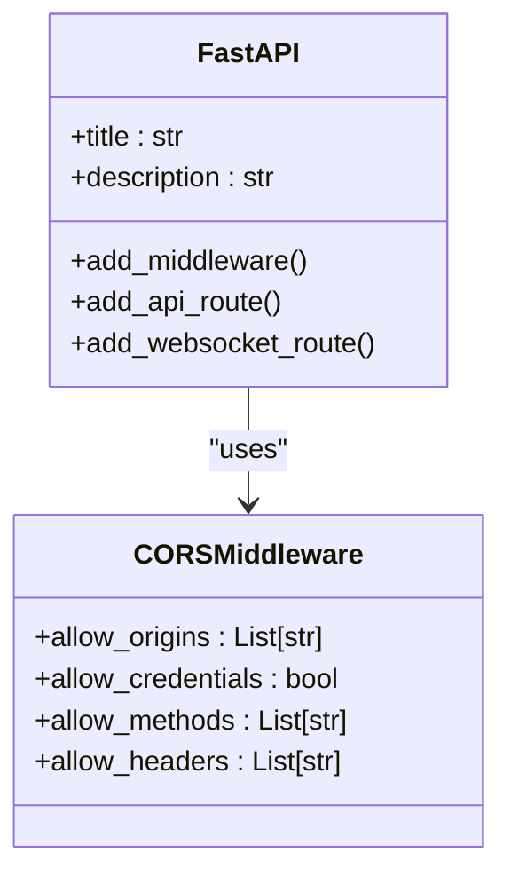

**Diagram sources**
- [api.py](file://api/api.py#L15-L30)

### RAG引擎模块

RAG引擎模块是系统的核心智能组件，负责实现检索增强生成功能。该模块通过FAISS向量数据库进行相似性检索，结合大型语言模型生成回答。引擎设计考虑了对话历史管理、上下文增强和错误恢复等关键功能。

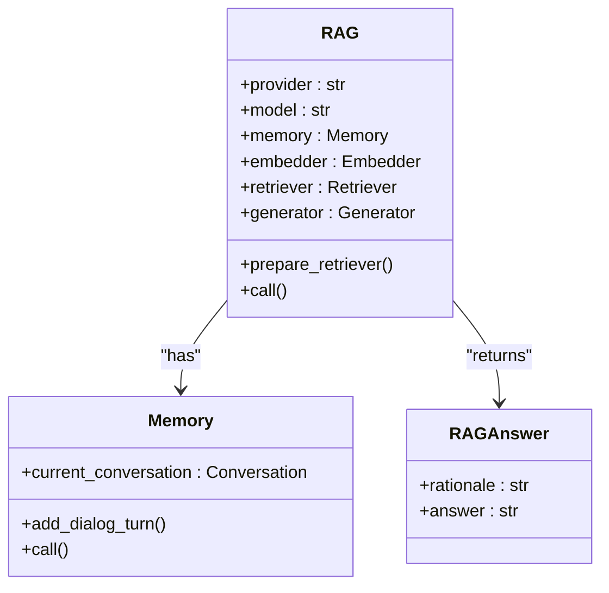

**Diagram sources**
- [rag.py](file://api/rag.py#L152-L444)

### 数据管道模块

数据管道模块负责代码库的数据采集和预处理，是RAG引擎的数据基础。该模块实现了从代码库克隆、文件读取、文本分割到向量嵌入的完整处理流程。通过灵活的过滤机制，支持对特定目录和文件的包含或排除。

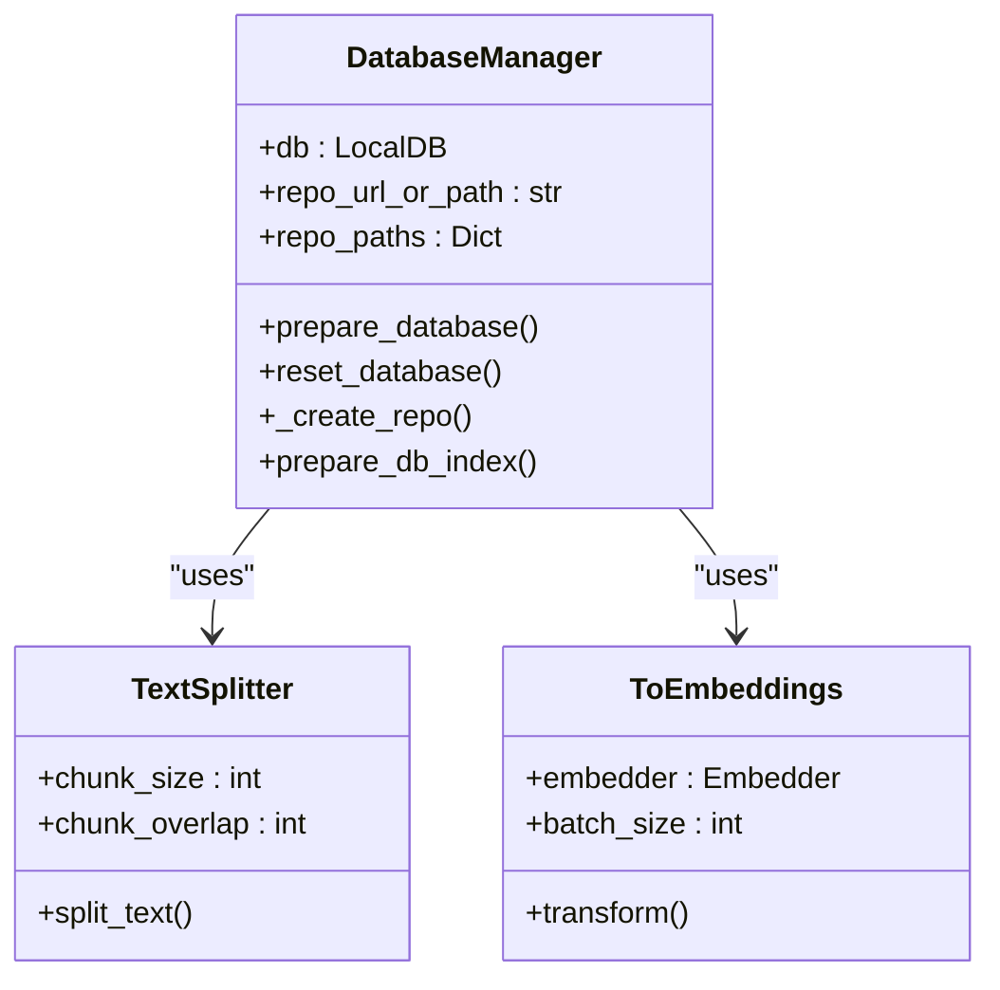

**Diagram sources**
- [data_pipeline.py](file://api/data_pipeline.py#L701-L880)

## REST端点详解

### 认证相关端点

系统提供基于代码的认证机制，通过环境变量配置认证模式和授权码。`/auth/status`端点检查是否需要认证，`/auth/validate`端点验证提供的授权码。

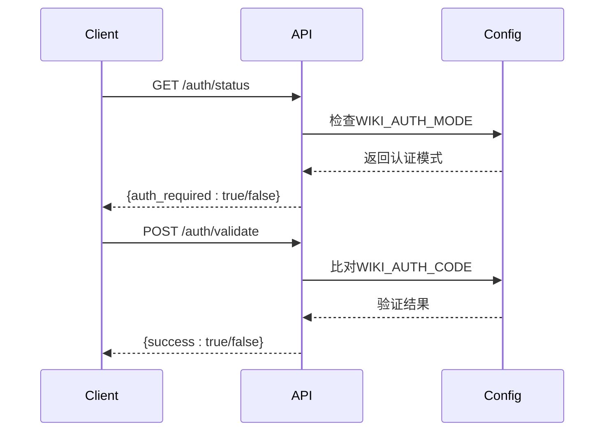

**Diagram sources**
- [api.py](file://api/api.py#L142-L150)
- [config.py](file://api/config.py#L15-L20)

### 模型配置端点

`/models/config`端点提供可用模型提供商及其模型的配置信息。该端点从配置文件中读取提供商信息，包括支持的模型列表和是否支持自定义模型等特性。

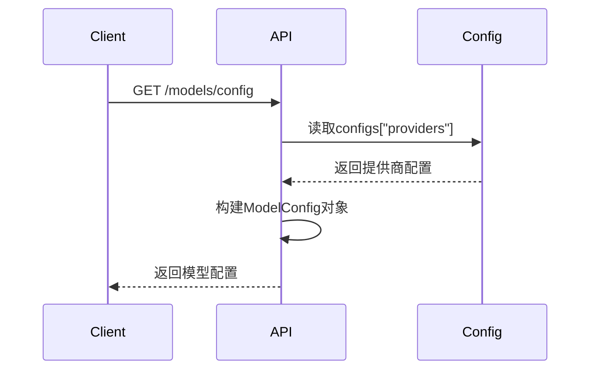

**Diagram sources**
- [api.py](file://api/api.py#L167-L224)
- [config.py](file://api/config.py#L333-L386)

### 流式响应端点

`/chat/completions/stream`端点提供流式聊天完成功能，支持实时响应生成。该端点通过SSE（Server-Sent Events）技术实现流式传输，用户可以实时看到回答的生成过程。

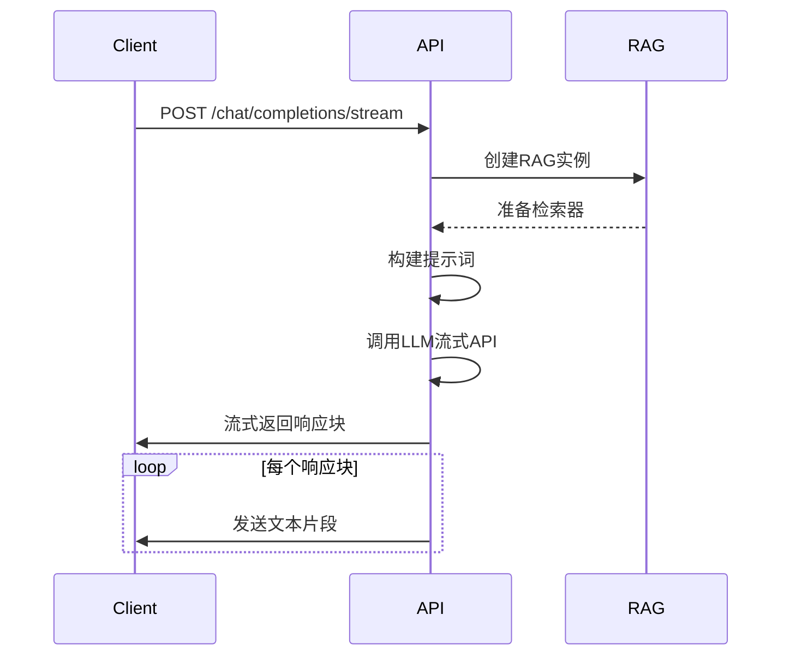

**Diagram sources**
- [api.py](file://api/api.py#L500-L510)
- [simple_chat.py](file://api/simple_chat.py#L75-L683)

### 缓存管理端点

系统提供完整的缓存管理功能，包括获取、存储和删除缓存。缓存数据以JSON格式存储在本地文件系统中，文件名包含仓库类型、所有者、仓库名和语言等信息。

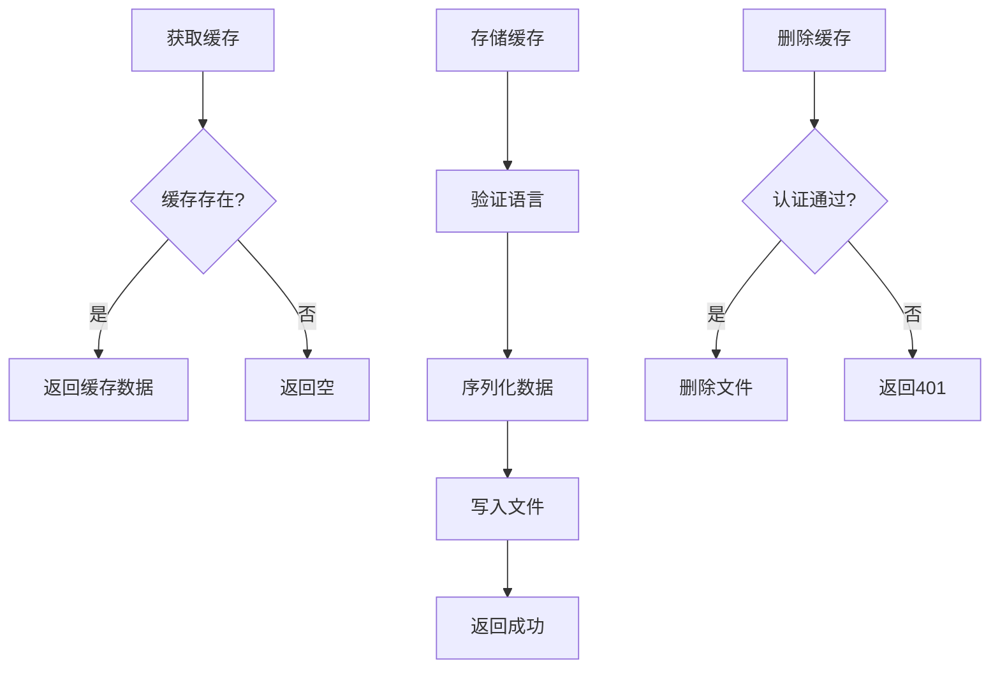

**Section sources**
- [api.py](file://api/api.py#L350-L450)

## RAG引擎工作流程

RAG引擎的工作流程从用户查询开始，经过检索、生成到最终回答的完整过程。该流程充分利用了检索增强技术，确保回答的准确性和相关性。

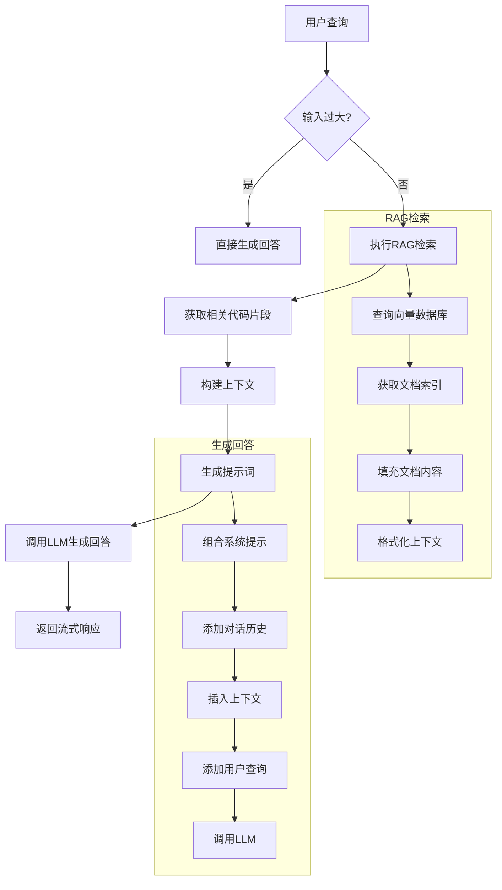

**Diagram sources**
- [rag.py](file://api/rag.py#L152-L444)
- [simple_chat.py](file://api/simple_chat.py#L75-L683)

### 查询处理流程

当用户提交查询时，RAG引擎首先检查输入大小。如果输入过大（超过8000个token），则跳过检索步骤，直接生成回答以避免上下文长度限制。对于正常大小的查询，引擎会执行完整的RAG流程。

查询处理过程中，系统会检查是否为"深度研究"请求。如果是，则使用特定的系统提示词，引导模型进行多轮深入分析。系统还支持文件路径查询，当提供文件路径时，会优先检索相关文件的内容。

### 对话历史管理

RAG引擎通过Memory组件管理对话历史，保持多轮对话的上下文连贯性。每次用户提问后，系统会将用户查询和助手回答作为对话轮次存储。在后续查询中，这些历史对话会被包含在提示词中，使模型能够理解对话上下文。

对话历史以结构化格式存储，包括用户查询和助手回答。在生成新回答时，系统会将所有历史对话按顺序插入提示词，确保模型能够参考之前的对话内容。

**Section sources**
- [rag.py](file://api/rag.py#L152-L444)

## 数据管道处理流程

数据管道是RAG系统的数据基础，负责将代码库转换为可用于检索的向量数据库。该流程从代码库克隆开始，经过文件读取、文本分割到向量嵌入的完整处理链路。

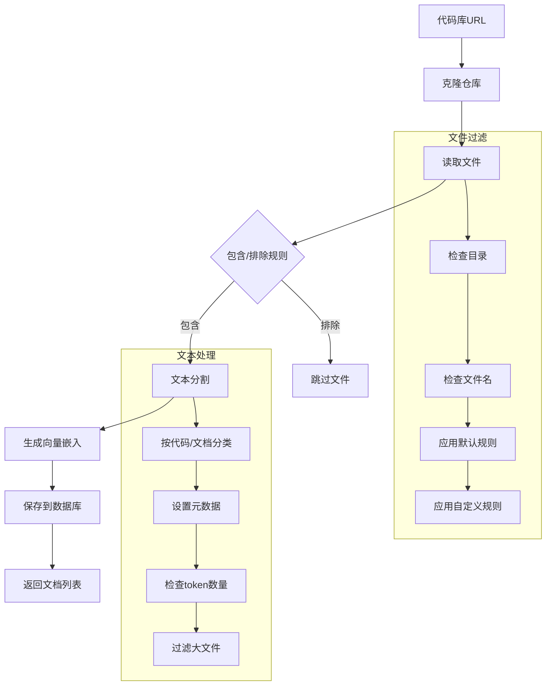

**Diagram sources**
- [data_pipeline.py](file://api/data_pipeline.py#L701-L880)

### 代码库克隆

数据管道首先通过`download_repo`函数克隆代码库。系统支持GitHub、GitLab和Bitbucket等多种代码托管平台，并通过访问令牌支持私有仓库。克隆时使用`--depth=1`参数进行浅克隆，只获取最新提交，提高效率。

克隆的仓库存储在`~/.adalflow/repos/`目录下，以`{owner}_{repo}`命名。如果仓库已存在且非空，则直接使用现有仓库，避免重复克隆。这种设计既保证了数据的一致性，又提高了处理效率。

### 文件读取与过滤

文件读取过程支持包含和排除两种模式。默认情况下使用排除模式，根据配置文件中的规则过滤特定目录和文件。用户也可以通过API参数指定包含的目录和文件，实现更精确的控制。

系统优先读取代码文件（如.py、.js等），然后读取文档文件（如.md、.txt等）。对于每个文件，系统会检查token数量，过滤过大的文件以避免嵌入模型的token限制。文件元数据包括文件路径、类型、是否为代码等信息。

### 文本分割与嵌入

文本分割使用`TextSplitter`组件，根据配置的chunk大小和重叠量将文件分割成较小的文本块。这种分割策略既保持了上下文的完整性，又适应了嵌入模型的输入限制。

嵌入生成使用配置的嵌入器客户端，支持OpenAI、Google和Ollama等多种提供商。系统会验证生成的嵌入向量大小，确保所有文档的嵌入向量具有相同的维度，避免FAISS检索器的兼容性问题。

**Section sources**
- [data_pipeline.py](file://api/data_pipeline.py#L1-L880)

## 配置系统与模型初始化

配置系统是整个应用的中枢，负责管理所有配置项和初始化相关组件。系统采用分层配置策略，支持环境变量覆盖和JSON配置文件。

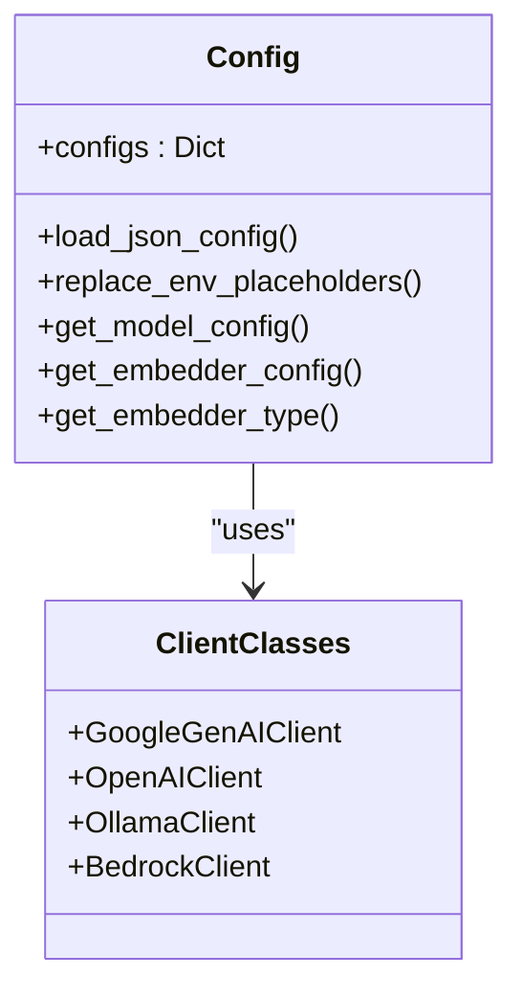

**Diagram sources**
- [config.py](file://api/config.py#L1-L388)

### 配置加载流程

配置系统首先从环境变量读取关键设置，如API密钥和认证模式。然后加载JSON配置文件，包括生成器、嵌入器、仓库和语言配置。配置文件支持环境变量占位符（如`${ENV_VAR}`），在加载时自动替换。

系统通过`CLIENT_CLASSES`映射将配置中的客户端类名转换为实际的类对象。这种设计实现了配置与实现的解耦，便于扩展新的客户端实现。所有配置最终合并到全局`configs`字典中，供其他模块使用。

### 模型动态初始化

`get_model_config`函数根据指定的提供商和模型名称动态生成模型配置。该函数首先获取提供商配置，然后查找对应的模型客户端类。对于Ollama提供商，配置结构略有不同，需要特殊处理。

模型初始化时，系统会根据提供商类型调整参数结构。例如，Ollama使用`options`字段包含温度、top_p等参数，而其他提供商直接将这些参数放在顶层。这种灵活性使系统能够兼容不同提供商的API差异。

**Section sources**
- [config.py](file://api/config.py#L333-L386)

## LLM提供商支持

系统支持多种大型语言模型提供商，每种提供商都有相应的客户端实现。这种设计实现了模型提供商的可插拔性，用户可以根据需求选择最适合的提供商。

### 支持的提供商

| 提供商 | 客户端类 | 环境变量 | 特点 |
|-------|---------|---------|------|
| Google | GoogleGenAIClient | GOOGLE_API_KEY | Gemini模型，适合代码理解 |
| OpenAI | OpenAIClient | OPENAI_API_KEY | GPT系列模型，通用性强 |
| OpenRouter | OpenRouterClient | OPENROUTER_API_KEY | 聚合多种模型，灵活选择 |
| Ollama | OllamaClient | 无 | 本地运行，隐私性好 |
| AWS Bedrock | BedrockClient | AWS_ACCESS_KEY_ID等 | 企业级服务，集成度高 |
| Azure AI | AzureAIClient | AZURE_OPENAI_API_KEY等 | 微软云服务，企业集成 |

### 客户端实现差异

不同提供商的客户端实现在参数结构和错误处理上存在差异。例如，Ollama客户端需要在提示词末尾添加`/no_think`指令，而Google客户端直接使用生成内容API。OpenAI和Azure客户端支持流式响应，通过`choices[0].delta.content`获取增量内容。

错误处理策略也因提供商而异。当遇到token限制错误时，系统会尝试移除上下文重新请求。对于认证错误，系统会返回友好的错误提示，指导用户设置相应的API密钥。

**Section sources**
- [config.py](file://api/config.py#L1-L388)
- [api.py](file://api/api.py#L167-L224)

## 后端组件交互图

后端组件通过清晰的接口进行交互，形成完整的请求处理链路。从API接收请求开始，经过RAG引擎处理，最终返回响应。

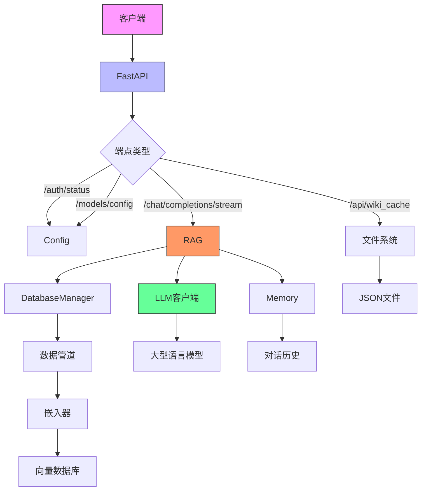

**Diagram sources**
- [api.py](file://api/api.py#L1-L635)
- [rag.py](file://api/rag.py#L1-L446)
- [data_pipeline.py](file://api/data_pipeline.py#L1-L882)

### 请求处理链路

当客户端发送聊天请求时，FastAPI路由到`chat_completions_stream`端点。该端点创建RAG实例，准备检索器，然后构建包含系统提示、对话历史和检索上下文的完整提示词。

RAG引擎调用配置的LLM客户端，根据提供商类型使用相应的API参数结构。对于支持流式响应的提供商，系统通过异步生成器逐块返回响应，实现低延迟的实时交互体验。

### 错误处理与降级

系统实现了多层次的错误处理和降级策略。当RAG检索失败时，系统会尝试直接生成回答。当遇到token限制错误时，会移除上下文重新请求。对于认证错误，返回明确的错误信息指导用户配置。

日志系统记录关键操作和错误信息，便于问题排查。所有外部API调用都包含异常处理，避免单点故障影响整个系统稳定性。

**Section sources**
- [api.py](file://api/api.py#L1-L635)
- [simple_chat.py](file://api/simple_chat.py#L1-L690)

## 总结

本后端架构设计充分考虑了可扩展性、灵活性和可靠性。通过模块化设计，各组件职责清晰，便于维护和升级。RAG引擎与数据管道的分离设计，使得系统能够高效处理大规模代码库。

系统支持多种LLM提供商和嵌入器，用户可以根据需求和预算选择最适合的组合。配置系统的设计使得模型切换和参数调整变得简单，无需修改代码。流式响应的支持提供了良好的用户体验，使交互更加自然流畅。

未来可以考虑增加缓存策略优化、性能监控和自动化测试等特性，进一步提升系统的稳定性和可维护性。整体架构为代码智能分析应用提供了坚实的基础，具有良好的扩展潜力。