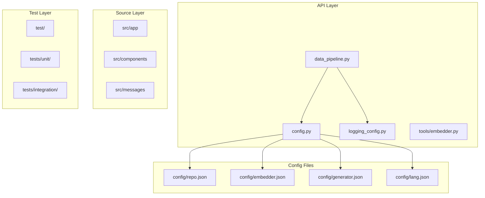
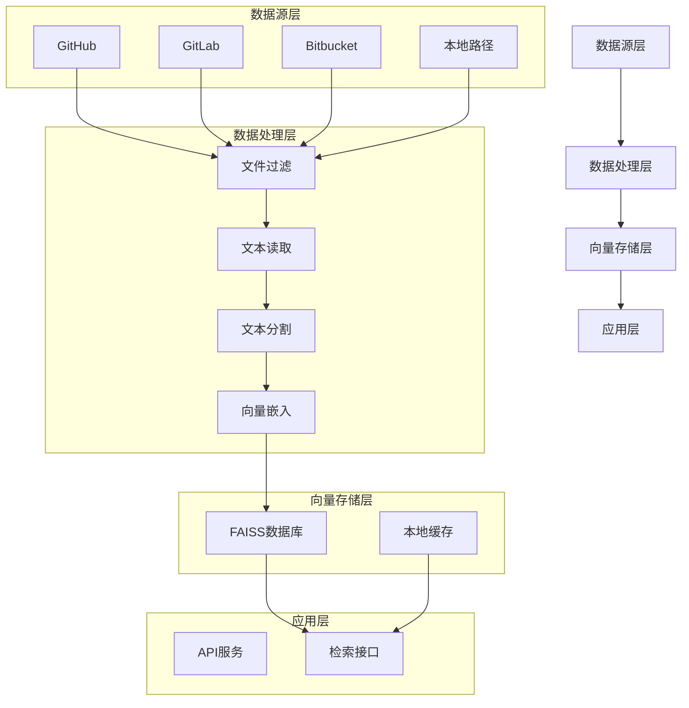
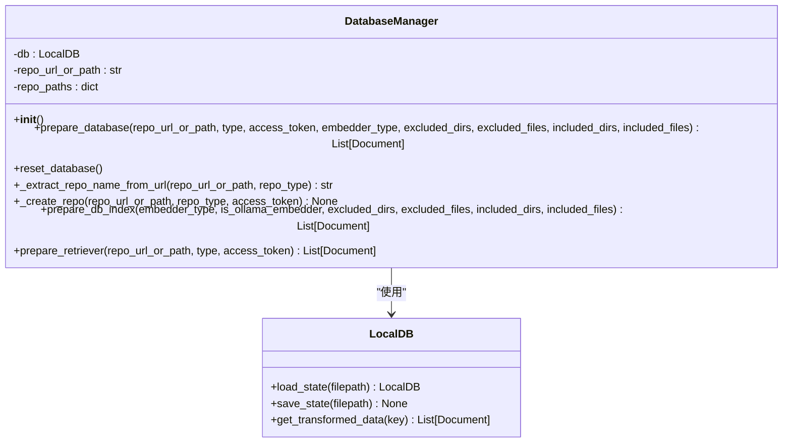
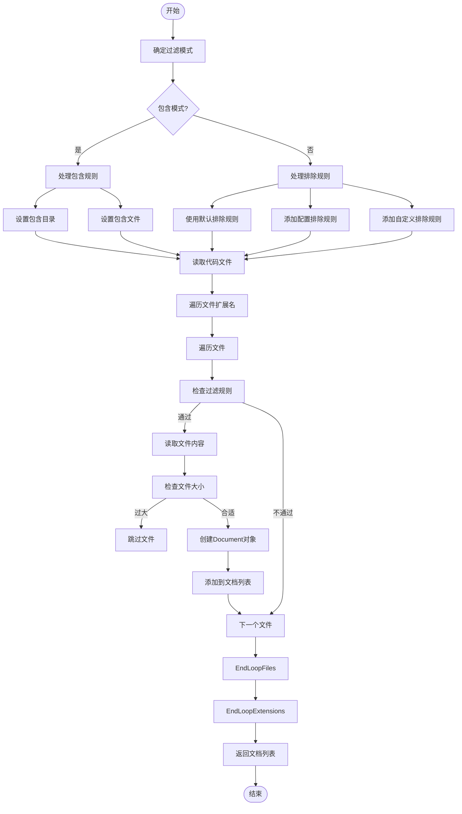
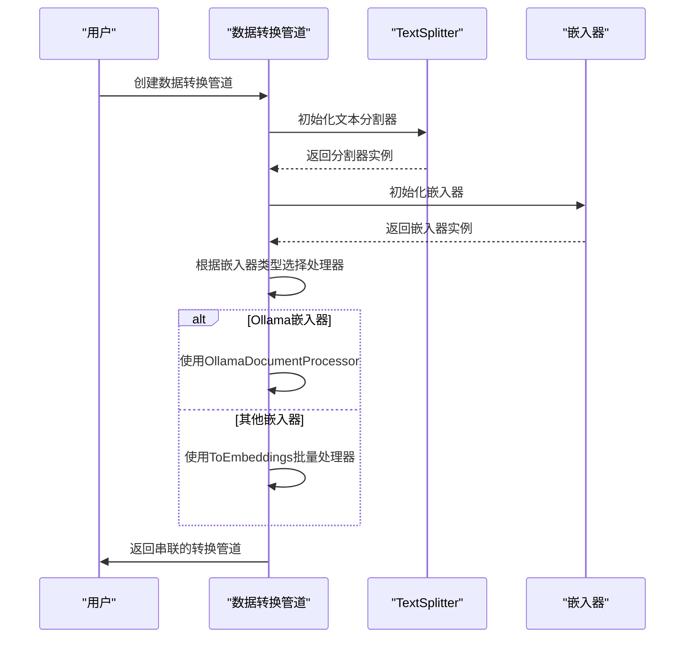
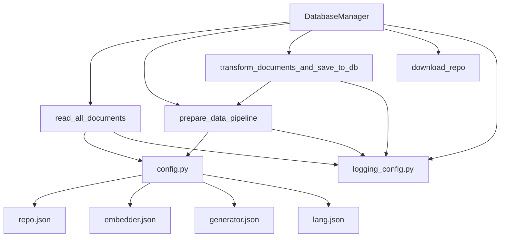

# 数据管道

<cite>
**本文档中引用的文件**  
- [data_pipeline.py](file://api/data_pipeline.py)
- [config.py](file://api/config.py)
- [repo.json](file://api/config/repo.json)
</cite>

## 目录
1. [简介](#简介)
2. [项目结构](#项目结构)
3. [核心组件](#核心组件)
4. [架构概述](#架构概述)
5. [详细组件分析](#详细组件分析)
6. [依赖分析](#依赖分析)
7. [性能考虑](#性能考虑)
8. [故障排除指南](#故障排除指南)
9. [结论](#结论)

## 简介
本文档全面分析了数据管道的实现机制，重点描述了 `DataPipeline` 类如何根据 `repo.json` 配置过滤文件、读取源码文件、分割文本内容、生成嵌入向量并存储到 FAISS 数据库的全过程。文档详细说明了 `DatabaseManager` 如何管理本地缓存以实现数据持久化，避免重复处理。通过深入分析代码库，本文档为理解数据处理流程、优化性能和排查问题提供了完整的参考。

## 项目结构
该项目采用模块化设计，主要分为 API 层、源代码层、测试层和配置文件。API 层包含数据处理、配置管理、日志记录等核心功能模块。源代码层包含前端应用组件和国际化消息。测试层包含单元测试和集成测试。配置文件定义了嵌入模型、生成器、语言支持和仓库过滤规则。

**Diagram sources**
- [data_pipeline.py](file://api/data_pipeline.py#L1-L882)
- [config.py](file://api/config.py#L1-L388)
- [repo.json](file://api/config/repo.json#L1-L129)

**Section sources**
- [data_pipeline.py](file://api/data_pipeline.py#L1-L882)
- [config.py](file://api/config.py#L1-L388)
- [repo.json](file://api/config/repo.json#L1-L129)

## 核心组件
核心组件包括 `DatabaseManager` 类，负责管理数据处理流程；`read_all_documents` 函数，负责读取和过滤源文件；`prepare_data_pipeline` 函数，负责创建文本分割和嵌入转换管道；以及 `transform_documents_and_save_to_db` 函数，负责将文档转换为向量并保存到数据库。这些组件协同工作，实现了从原始代码库到向量数据库的完整转换流程。

**Section sources**
- [data_pipeline.py](file://api/data_pipeline.py#L701-L880)
- [data_pipeline.py](file://api/data_pipeline.py#L143-L370)
- [data_pipeline.py](file://api/data_pipeline.py#L372-L414)
- [data_pipeline.py](file://api/data_pipeline.py#L416-L440)

## 架构概述
系统架构采用分层设计，从下到上依次为数据源层、数据处理层、向量存储层和应用层。数据源层支持 GitHub、GitLab 和 Bitbucket 仓库。数据处理层负责文件过滤、文本读取、分割和嵌入。向量存储层使用 FAISS 数据库进行高效存储和检索。应用层通过 API 提供检索服务。

**Diagram sources**
- [data_pipeline.py](file://api/data_pipeline.py#L701-L880)
- [data_pipeline.py](file://api/data_pipeline.py#L143-L370)

## 详细组件分析

### DatabaseManager 分析
`DatabaseManager` 类是数据管道的核心控制器，负责协调整个数据处理流程。它通过一系列方法管理仓库的下载、文档读取、向量生成和数据库持久化。

**Diagram sources**
- [data_pipeline.py](file://api/data_pipeline.py#L701-L880)

**Section sources**
- [data_pipeline.py](file://api/data_pipeline.py#L701-L880)

### 文件读取与过滤分析
`read_all_documents` 函数实现了复杂的文件过滤逻辑，支持包含模式和排除模式两种过滤方式。它根据 `repo.json` 配置文件中的规则，递归遍历目录并读取符合条件的源码文件。

**Diagram sources**
- [data_pipeline.py](file://api/data_pipeline.py#L143-L370)
- [config.py](file://api/config.py#L370-L387)
- [repo.json](file://api/config/repo.json#L1-L129)

**Section sources**
- [data_pipeline.py](file://api/data_pipeline.py#L143-L370)

### 数据转换管道分析
`prepare_data_pipeline` 函数创建了数据转换管道，将文本分割器和嵌入转换器串联起来。该管道根据配置的嵌入器类型选择不同的处理策略，对 Ollama 嵌入器使用单文档处理，对 OpenAI 和 Google 嵌入器使用批量处理。

**Diagram sources**
- [data_pipeline.py](file://api/data_pipeline.py#L372-L414)
- [config.py](file://api/config.py#L300-L320)

**Section sources**
- [data_pipeline.py](file://api/data_pipeline.py#L372-L414)

## 依赖分析
系统依赖关系清晰，`DatabaseManager` 类依赖于 `read_all_documents`、`prepare_data_pipeline` 和 `transform_documents_and_save_to_db` 等函数。配置文件通过 `config.py` 模块被各个组件引用。日志系统被所有模块共享使用。

**Diagram sources**
- [data_pipeline.py](file://api/data_pipeline.py#L701-L880)
- [config.py](file://api/config.py#L1-L388)

**Section sources**
- [data_pipeline.py](file://api/data_pipeline.py#L701-L880)
- [config.py](file://api/config.py#L1-L388)

## 性能考虑
系统在性能方面进行了多项优化。首先，通过文件过滤机制避免处理不必要的文件，减少 I/O 操作。其次，对大文件进行跳过处理，防止内存溢出。再者，使用批量处理模式提高嵌入生成效率。最后，通过本地数据库缓存避免重复处理相同的仓库。

## 故障排除指南
常见问题包括仓库克隆失败、文件读取错误和嵌入生成超时。对于仓库克隆失败，应检查网络连接和访问令牌。对于文件读取错误，应检查文件编码和权限。对于嵌入生成超时，应检查 API 配额和网络延迟。系统日志记录了详细的处理过程，可用于诊断问题。

**Section sources**
- [data_pipeline.py](file://api/data_pipeline.py#L1-L882)
- [logging_config.py](file://api/logging_config.py#L1-L86)

## 结论
本文档详细分析了数据管道的实现机制，涵盖了从代码库分析到向量化存储的全过程。`DatabaseManager` 类通过协调文件过滤、文本读取、分割和嵌入等组件，实现了高效的数据处理流程。系统通过本地缓存机制避免了重复处理，提高了整体性能。该设计具有良好的可扩展性，支持多种嵌入器和代码托管平台。