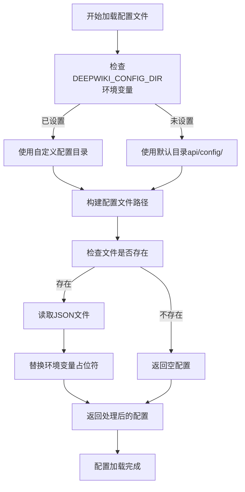
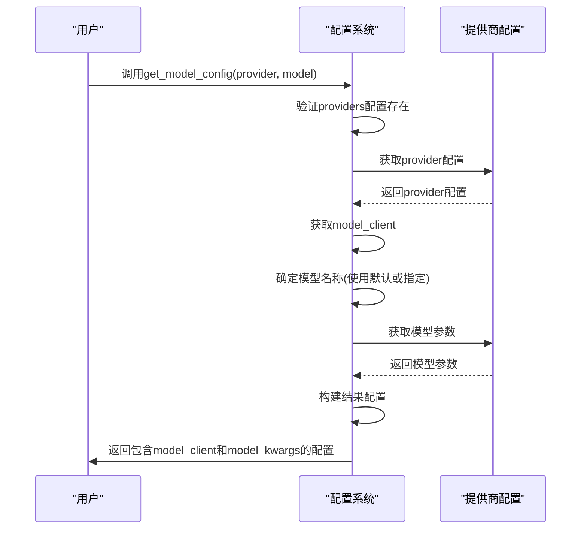
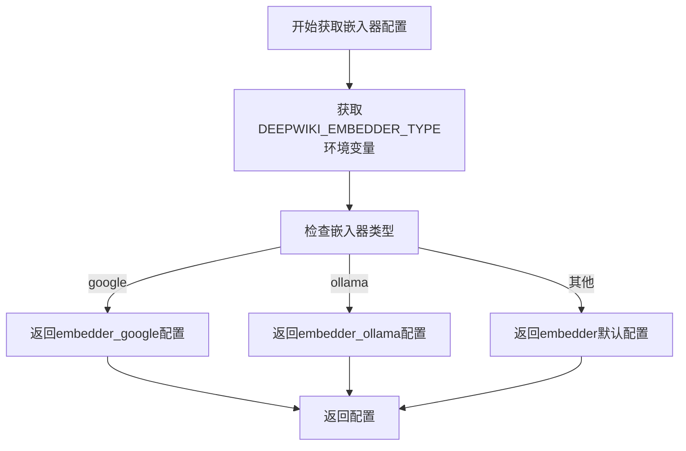

# 配置系统

<cite>
**本文档中引用的文件**  
- [config.py](file://api/config.py)
- [generator.json](file://api/config/generator.json)
- [embedder.json](file://api/config/embedder.json)
- [lang.json](file://api/config/lang.json)
- [repo.json](file://api/config/repo.json)
- [rag.py](file://api/rag.py)
- [data_pipeline.py](file://api/data_pipeline.py)
</cite>

## 目录
1. [简介](#简介)
2. [配置文件加载机制](#配置文件加载机制)
3. [核心配置文件详解](#核心配置文件详解)
4. [动态配置获取函数](#动态配置获取函数)
5. [配置对RAG引擎的影响](#配置对rag引擎的影响)
6. [自定义配置示例](#自定义配置示例)

## 简介
本文档详细说明了DeepWiki系统的配置工作机制。系统通过`config.py`模块加载多个JSON配置文件，包括`generator.json`（定义LLM提供商和模型参数）、`embedder.json`（定义嵌入模型配置）、`lang.json`（多语言支持）和`repo.json`（代码库文件过滤规则）。这些配置共同决定了系统的生成、嵌入、语言支持和数据处理行为。

**Section sources**
- [config.py](file://api/config.py#L1-L50)

## 配置文件加载机制
系统通过`load_json_config`函数统一加载所有JSON配置文件。该函数首先检查`DEEPWIKI_CONFIG_DIR`环境变量以确定配置目录，若未设置则使用默认路径`api/config/`。加载过程中会递归替换配置中的环境变量占位符（如`${OPENAI_API_KEY}`），并处理配置文件缺失或加载错误的情况。



**Diagram sources**
- [config.py](file://api/config.py#L96-L117)

**Section sources**
- [config.py](file://api/config.py#L96-L117)

## 核心配置文件详解

### 生成器配置 (generator.json)
`generator.json`文件定义了可用的LLM提供商及其模型参数。每个提供商包含默认模型、是否支持自定义模型以及具体模型的参数（如temperature、top_p等）。支持的提供商包括Google、OpenAI、OpenRouter、Ollama、Bedrock和Azure。

```json
{
  "default_provider": "google",
  "providers": {
    "google": {
      "default_model": "gemini-2.5-flash",
      "supportsCustomModel": true,
      "models": {
        "gemini-2.5-flash": {
          "temperature": 1.0,
          "top_p": 0.8,
          "top_k": 20
        }
      }
    }
  }
}
```

**Section sources**
- [generator.json](file://api/config/generator.json#L1-L200)

### 嵌入器配置 (embedder.json)
`embedder.json`文件定义了嵌入模型的配置，支持多种嵌入器类型（OpenAI、Ollama、Google）。每种类型包含客户端类、批处理大小和模型参数。还定义了检索器的top_k值和文本分割器的参数。

```json
{
  "embedder": {
    "client_class": "OpenAIClient",
    "batch_size": 500,
    "model_kwargs": {
      "model": "text-embedding-3-small",
      "dimensions": 256,
      "encoding_format": "float"
    }
  },
  "retriever": {
    "top_k": 20
  },
  "text_splitter": {
    "split_by": "word",
    "chunk_size": 350,
    "chunk_overlap": 100
  }
}
```

**Section sources**
- [embedder.json](file://api/config/embedder.json#L1-L34)

### 多语言配置 (lang.json)
`lang.json`文件定义了系统支持的语言及其显示名称。包含支持的语言列表和默认语言设置。系统通过此配置实现多语言界面支持。

```json
{
  "supported_languages": {
    "en": "English",
    "zh": "Mandarin Chinese (中文)",
    "ja": "Japanese (日本語)"
  },
  "default": "en"
}
```

**Section sources**
- [lang.json](file://api/config/lang.json#L1-L16)

### 代码库配置 (repo.json)
`repo.json`文件定义了代码库处理的过滤规则，包括排除的目录和文件模式。这些规则用于在处理代码库时过滤掉不需要的文件和目录，如虚拟环境、版本控制目录、构建产物等。

```json
{
  "file_filters": {
    "excluded_dirs": [
      "./.venv/", 
      "./node_modules/", 
      "./.git/"
    ],
    "excluded_files": [
      "yarn.lock", 
      ".env", 
      "*.pyc"
    ]
  },
  "repository": {
    "max_size_mb": 50000
  }
}
```

**Section sources**
- [repo.json](file://api/config/repo.json#L1-L129)

## 动态配置获取函数

### get_model_config 函数
`get_model_config`函数根据指定的提供商和模型名称动态返回生成器配置。函数首先验证提供商配置是否存在，然后获取模型客户端和模型参数。对于Ollama提供商，会特殊处理其参数结构。



**Diagram sources**
- [config.py](file://api/config.py#L333-L386)

**Section sources**
- [config.py](file://api/config.py#L333-L386)

### get_embedder_config 函数
`get_embedder_config`函数根据`DEEPWIKI_EMBEDDER_TYPE`环境变量的值返回相应的嵌入器配置。支持'google'、'ollama'和默认的'openai'三种类型，分别对应不同的嵌入器配置。



**Diagram sources**
- [config.py](file://api/config.py#L159-L172)

**Section sources**
- [config.py](file://api/config.py#L159-L172)

## 配置对RAG引擎的影响
配置系统直接影响RAG（检索增强生成）引擎的行为。RAG组件在初始化时根据配置确定生成器和嵌入器，这些配置决定了文档处理、检索和生成的具体行为。

```mermaid
classDiagram
class RAG {
+str provider
+str model
+str embedder_type
+Memory memory
+embedder
+query_embedder
+db_manager
+generator
+__init__(provider, model)
+prepare_retriever(repo_url)
+call(query)
}
class Memory {
+CustomConversation current_conversation
+call()
+add_dialog_turn()
}
class DatabaseManager {
+LocalDB db
+str repo_url_or_path
+dict repo_paths
+prepare_database()
+prepare_db_index()
}
RAG --> Memory : "使用"
RAG --> DatabaseManager : "使用"
RAG --> "get_model_config" : "调用"
RAG --> "get_embedder_config" : "调用"
RAG --> "get_embedder_type" : "调用"
```

**Diagram sources**
- [rag.py](file://api/rag.py#L152-L444)
- [data_pipeline.py](file://api/data_pipeline.py#L701-L880)

**Section sources**
- [rag.py](file://api/rag.py#L152-L444)
- [data_pipeline.py](file://api/data_pipeline.py#L701-L880)

## 自定义配置示例

### 添加新的OpenAI兼容模型
要添加新的OpenAI兼容模型，可以在`generator.json`中为`openai`提供商添加新的模型配置：

```json
"openai": {
  "default_model": "gpt-5-nano",
  "supportsCustomModel": true,
  "models": {
    "gpt-5-nano": {
      "temperature": 1.0
    },
    "my-custom-model": {
      "temperature": 0.8,
      "top_p": 0.9
    }
  }
}
```

### 修改文件排除模式
要修改文件排除模式，可以在`repo.json`中调整`excluded_dirs`和`excluded_files`数组：

```json
"file_filters": {
  "excluded_dirs": [
    "./.venv/", 
    "./node_modules/", 
    "./.git/",
    "./temp/"
  ],
  "excluded_files": [
    "yarn.lock", 
    ".env", 
    "*.log",
    "*.tmp"
  ]
}
```

**Section sources**
- [generator.json](file://api/config/generator.json#L1-L200)
- [repo.json](file://api/config/repo.json#L1-L129)