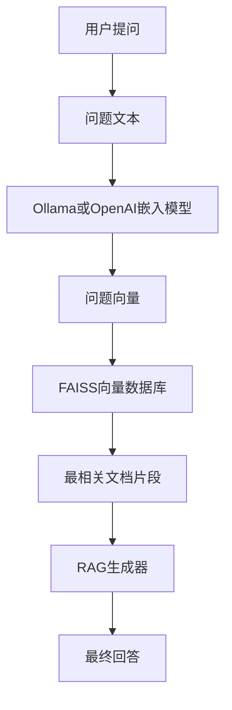

# 技术栈

<cite>
**本文档中引用的文件**  
- [pyproject.toml](file://pyproject.toml)
- [package.json](file://package.json)
- [api/main.py](file://api/main.py)
- [api/rag.py](file://api/rag.py)
- [api/config.py](file://api/config.py)
- [api/data_pipeline.py](file://api/data_pipeline.py)
- [api/ollama_patch.py](file://api/ollama_patch.py)
- [api/tools/embedder.py](file://api/tools/embedder.py)
- [src/app/page.tsx](file://src/app/page.tsx)
</cite>

## 目录
1. [后端技术栈](#后端技术栈)
2. [AI相关库](#ai相关库)
3. [前端技术栈](#前端技术栈)
4. [依赖版本与兼容性](#依赖版本与兼容性)
5. [环境初始化与依赖安装](#环境初始化与依赖安装)
6. [依赖管理最佳实践](#依赖管理最佳实践)

## 后端技术栈

本项目后端采用Python生态构建，核心框架包括FastAPI、adalflow和uvicorn，共同支撑系统的高性能API服务与AI流程处理。

### FastAPI
FastAPI作为现代Python Web框架，负责构建高性能的RESTful API接口。其基于Starlette和Pydantic，提供自动化的API文档（Swagger UI和ReDoc）、数据验证、依赖注入等特性。在`api/api.py`中，FastAPI被初始化为应用实例，并配置了CORS中间件以支持跨域请求，确保前端Next.js应用能够无缝调用后端API。

### adalflow
adalflow是本项目AI功能的核心框架，用于构建复杂的检索增强生成（RAG）流程。在`api/rag.py`中，`RAG`类继承自`adal.Component`，利用adalflow的组件化设计，将嵌入（embedding）、检索（retrieval）和生成（generation）等步骤有机整合。`Memory`类管理对话历史，`RAGAnswer`数据类定义输出结构，通过`Generator`组件调用大模型生成响应，实现了端到端的智能问答系统。

### uvicorn
uvicorn作为ASGI（Asynchronous Server Gateway Interface）服务器，负责运行和部署FastAPI应用。在`api/main.py`中，通过`uvicorn.run()`启动服务器，监听指定端口（默认8001）。在开发模式下，它还启用了热重载功能，当API代码发生变化时自动重启服务，极大提升了开发效率。

**Section sources**
- [api/main.py](file://api/main.py#L75-L79)
- [api/api.py](file://api/api.py#L10-L15)

## AI相关库

项目集成了多个AI库，以实现本地化、高性能的向量检索与大模型推理能力。

### google-generativeai
`google-generativeai`库用于调用Google的Gemini系列大模型。在`api/main.py`中，通过`genai.configure(api_key=GOOGLE_API_KEY)`进行初始化，使系统能够利用Gemini的强大生成能力。该库在`pyproject.toml`中被列为必需依赖，是系统默认的生成模型提供者。

### openai
`openai`库用于与OpenAI的API进行交互，支持调用GPT系列模型。在`api/config.py`中，通过`OpenAIClient`类封装了对OpenAI API的调用。尽管项目支持OpenAI，但其使用依赖于环境变量`OPENAI_API_KEY`的配置，体现了多模型提供商的灵活支持。

### faiss-cpu
`faiss-cpu`是Facebook AI开发的高效相似性搜索库，用于实现本地向量检索。在`api/rag.py`中，`FAISSRetriever`类被实例化，以`self.transformed_docs`中的文档向量为基础构建索引。当用户提问时，系统会将问题嵌入为向量，并在FAISS索引中快速检索最相关的文档片段，为后续的RAG生成提供上下文。



**Diagram sources**
- [api/rag.py](file://api/rag.py#L381-L390)
- [api/rag.py](file://api/rag.py#L150-L175)

### ollama
`ollama`库用于与本地Ollama服务进行交互，实现本地大模型的推理。在`pyproject.toml`中，`ollama>=0.4.8`被列为依赖。`api/ollama_patch.py`中的`OllamaDocumentProcessor`类专门处理Ollama嵌入，因为Ollama客户端不支持批量嵌入，需要逐个处理文档。`check_ollama_model_exists`函数在初始化时检查所需模型是否存在，确保服务的健壮性。

**Section sources**
- [api/ollama_patch.py](file://api/ollama_patch.py#L40-L104)
- [api/rag.py](file://api/rag.py#L165-L168)

## 前端技术栈

前端采用现代化的React技术栈，基于Next.js框架构建，提供流畅的用户体验和强大的国际化支持。

### Next.js
Next.js是React的全栈框架，提供了服务端渲染（SSR）、静态生成（SSG）和API路由等特性。在`package.json`中，`next`是核心依赖。`src/app/page.tsx`作为应用的入口页面，利用Next.js的App Router功能，实现了动态路由和数据获取。`next.config.ts`文件配置了项目的构建选项。

### React
React作为UI库，用于构建组件化的用户界面。`src/app/page.tsx`中使用了React Hooks（如`useState`, `useEffect`, `useRouter`）来管理组件状态和生命周期。`src/components`目录下的`Markdown.tsx`、`WikiTreeView.tsx`等文件定义了可复用的UI组件。

### Tailwind CSS
Tailwind CSS是一个功能优先的CSS框架，用于快速构建自定义用户界面。在`tailwind.config.js`中进行了配置。`src/app/page.tsx`中的大量`className`属性使用了Tailwind的实用类，如`bg-[var(--card-bg)]`、`rounded-lg`、`shadow-custom`等，实现了高度定制化的视觉效果。

### TypeScript
TypeScript为JavaScript添加了静态类型，提高了代码的可维护性和可靠性。`package.json`中列出了`typescript`作为开发依赖。`src/app/page.tsx`文件以`'use client';`开头，并使用`React.FC`和`useState<string>`等类型注解，确保了类型安全。

**Section sources**
- [src/app/page.tsx](file://src/app/page.tsx#L1-L624)
- [package.json](file://package.json#L1-L38)

## 依赖版本与兼容性

项目通过`pyproject.toml`和`package.json`精确管理依赖版本，确保环境的一致性。

### Python依赖
后端Python依赖在`pyproject.toml`中定义，关键版本要求如下：
- **fastapi**: `>=0.95.0`，要求Python 3.12+
- **uvicorn**: `>=0.21.1`
- **adalflow**: `>=0.1.0`
- **google-generativeai**: `>=0.3.0`
- **faiss-cpu**: `>=1.7.4`，在`uv.lock`中实际解析为`1.11.0`
- **ollama**: `>=0.4.8`

### Node.js依赖
前端Node.js依赖在`package.json`中定义，关键版本要求如下：
- **next**: `15.3.1`，与React 19兼容
- **react**: `^19.0.0`
- **react-dom**: `^19.0.0`
- **tailwindcss**: `^4`
- **typescript**: `^5`

**Section sources**
- [pyproject.toml](file://pyproject.toml#L0-L27)
- [package.json](file://package.json#L1-L38)
- [uv.lock](file://uv.lock#L408-L425)

## 环境初始化与依赖安装

### 安装Python依赖
使用`uv`包管理器（推荐）或`pip`安装Python依赖：
```bash
# 使用uv（推荐，更快）
uv pip install -r api/requirements.txt

# 或使用pip
pip install -r api/requirements.txt
```

### 安装Node.js依赖
使用`yarn`安装前端依赖：
```bash
yarn install
```

### 配置环境变量
创建`.env`文件并配置必要的API密钥：
```env
GOOGLE_API_KEY=your_google_api_key
OPENAI_API_KEY=your_openai_api_key
DEEPWIKI_EMBEDDER_TYPE=openai # 或 ollama, google
```

### 启动Ollama服务（如使用本地模型）
```bash
# 启动Ollama服务
ollama serve

# 拉取嵌入模型（例如）
ollama pull nomic-embed-text
```

### 启动应用
```bash
# 启动后端API
python api/main.py

# 启动前端开发服务器
yarn dev
```

## 依赖管理最佳实践

### 使用uv.lock锁定Python依赖
项目使用`uv.lock`文件来锁定所有Python依赖的精确版本，确保在不同环境中安装的依赖完全一致。建议始终使用`uv`而非`pip`来安装依赖，以保证锁定文件的有效性。

### 分离开发与生产依赖
`package.json`清晰地将依赖分为`dependencies`和`devDependencies`。生产环境只需安装`dependencies`，而开发工具（如`eslint`、`typescript`）仅在开发时安装，优化了生产镜像的大小。

### 配置文件与环境变量分离
敏感信息（如API密钥）通过环境变量注入，而非硬编码在代码或配置文件中。`api/config.py`中的`load_json_config`函数支持`${ENV_VAR}`占位符替换，实现了配置的动态化。

### 统一的配置管理
项目通过`api/config.py`集中管理所有配置，包括模型提供商、嵌入器类型、文件过滤规则等。这避免了配置的分散，提高了可维护性。

**Section sources**
- [pyproject.toml](file://pyproject.toml#L0-L27)
- [package.json](file://package.json#L1-L38)
- [api/config.py](file://api/config.py#L0-L387)