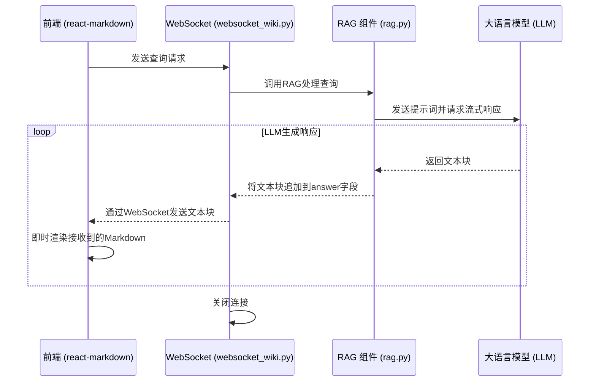

# RAGAnswer 响应模型

<cite>
**Referenced Files in This Document**   
- [rag.py](file://api/rag.py)
- [websocket_wiki.py](file://api/websocket_wiki.py)
</cite>

## 目录
1. [引言](#引言)
2. [RAGAnswer 类设计](#raganswer-类设计)
3. [字段详解](#字段详解)
4. [序列化机制](#序列化机制)
5. [前端渲染要求](#前端渲染要求)
6. [流式传输流程](#流式传输流程)
7. [调试与常见错误](#调试与常见错误)
8. [透明化决策支持](#透明化决策支持)

## 引言
`RAGAnswer` 类是检索增强生成（RAG）系统中的核心响应载体，负责封装大语言模型（LLM）对用户查询的完整响应。该类设计旨在分离模型的推理过程与最终输出，确保响应既具备可解释性又符合前端渲染要求。通过 `rationale` 字段记录思维链，`answer` 字段提供格式化的最终答案，并利用 `__output_fields__` 机制控制序列化输出，`RAGAnswer` 在保证功能完整性的同时，优化了与前端的集成效率。

## RAGAnswer 类设计

`RAGAnswer` 类继承自 `adal.DataClass`，采用数据类（DataClass）模式定义其结构。该类作为 RAG 流程的最终输出容器，其设计体现了关注点分离的原则：`rationale` 字段用于内部调试和透明化展示模型的思考过程，而 `answer` 字段则专注于向用户提供最终的、格式化的答案。

**Section sources**
- [rag.py](file://api/rag.py#L146-L150)

## 字段详解

### rationale 字段
`rationale` 字段是一个字符串类型，其元数据描述为“Chain of thoughts for the answer.”（回答的思维链）。此字段存储了模型在生成最终答案前所进行的内部推理、分析和决策过程。它对于调试模型行为、理解答案来源以及实现AI决策的透明化至关重要。该字段的默认值为空字符串。

### answer 字段
`answer` 字段同样为字符串类型，其元数据明确指定了格式要求：“Answer to the user query, formatted in markdown for beautiful rendering with react-markdown. DO NOT include ``` triple backticks fences at the beginning or end of your answer.”（用户查询的答案，以Markdown格式化，以便使用react-markdown进行美观渲染。请勿在答案的开头或结尾包含```三重反引号围栏）。此字段包含直接呈现给用户的最终答案，必须是纯Markdown文本，且不能包含代码块围栏。

**Section sources**
- [rag.py](file://api/rag.py#L147-L148)

## 序列化机制

`RAGAnswer` 类通过定义 `__output_fields__` 类变量来精确控制其序列化行为。该变量被设置为一个包含两个字符串的列表：`["rationale", "answer"]`。这意味着当 `RAGAnswer` 对象被序列化（例如，通过网络传输）时，只有 `rationale` 和 `answer` 这两个字段会被包含在输出中。这种机制确保了流式传输的效率，避免了传输不必要的元数据或内部状态，同时保证了响应结构的稳定性和可预测性。

**Section sources**
- [rag.py](file://api/rag.py#L150)

## 前端渲染要求

`answer` 字段的格式要求是确保前端正确渲染的关键。前端使用 `react-markdown` 组件来解析和显示 `answer` 字段的内容。由于 `react-markdown` 组件本身会将整个 `answer` 字段的内容视为Markdown进行渲染，因此在 `answer` 内部再包裹一层Markdown代码块围栏（```）会导致渲染错误或显示异常。例如，如果 `answer` 包含 ```markdown\n# 标题\n```，`react-markdown` 会尝试将 `# 标题` 作为代码块内的纯文本显示，而不是将其渲染为一级标题。因此，LLM在生成答案时必须严格遵守规则，直接以Markdown语法开始内容，如 `# 标题`。

## 流式传输流程

`RAGAnswer` 对象的流式传输主要在 `websocket_wiki.py` 文件中的 `handle_websocket_chat` 函数内实现。当用户发起查询后，后端处理逻辑会生成一个 `RAGAnswer` 实例。随后，系统通过WebSocket连接，将 `answer` 字段的内容分块（chunk）发送至前端。这一过程是异步流式的，意味着答案的各个部分在生成后会立即被发送，而无需等待整个答案完全生成，从而显著提升了用户体验，实现了“边生成边显示”的效果。



**Diagram sources**
- [rag.py](file://api/rag.py#L146-L150)
- [websocket_wiki.py](file://api/websocket_wiki.py#L0-L769)

**Section sources**
- [websocket_wiki.py](file://api/websocket_wiki.py#L0-L769)

## 调试与常见错误

### 常见格式错误
1.  **包含代码围栏**：最常见的错误是LLM在生成答案时，自动在开头添加了 ```markdown 或在结尾添加了 ```。这会导致前端渲染出错。
2.  **非纯Markdown内容**：答案中包含了不应出现的指令性文本，如“好的，这是答案：”或“根据检索到的信息...”，这些内容破坏了纯Markdown的简洁性。
3.  **特殊字符转义**：错误地转义了Markdown中的特殊字符，如将 `[链接](url)` 写成 `\[链接\]\(url\)`，导致链接无法正确解析。

### 修复方法
修复此类问题主要依赖于对LLM的提示词（prompt）工程进行优化。在 `rag.py` 的 `__init__` 方法中，通过 `format_instructions` 变量向LLM明确传达了严格的格式要求，其中明确列出了9条“IMPORTANT FORMATTING RULES”，包括“DO NOT include ```markdown fences at the beginning or end of your answer”和“Start your response directly with the content”。通过强化这些规则，可以有效引导LLM生成符合要求的纯Markdown文本。

**Section sources**
- [rag.py](file://api/rag.py#L165-L175)

## 透明化决策支持

`RAGAnswer` 模型通过 `rationale` 字段为AI决策过程的透明化提供了直接支持。开发人员和高级用户可以通过访问 `rationale` 字段的内容，了解模型是如何从检索到的上下文文档中推导出最终答案的。这不仅有助于发现和纠正模型的逻辑错误或偏见，也增强了用户对AI系统的信任。例如，当答案出现偏差时，检查 `rationale` 可以揭示是检索到了错误的文档，还是模型在推理过程中出现了谬误，从而为系统优化提供明确的方向。

**Section sources**
- [rag.py](file://api/rag.py#L147)