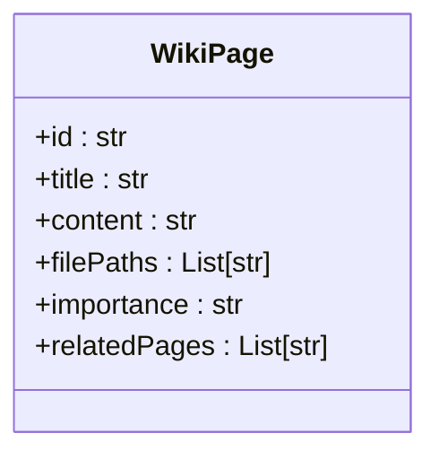
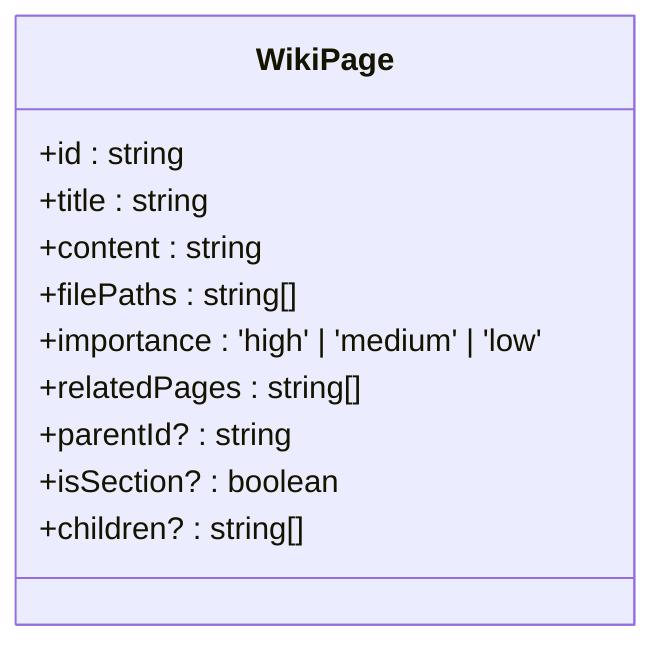
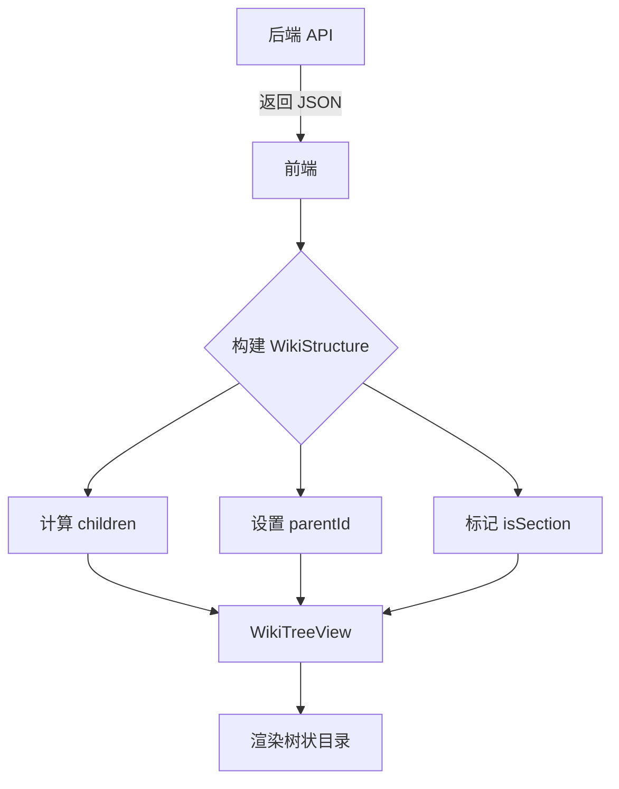

# WikiPage 数据模型

<cite>
**Referenced Files in This Document**   
- [api/api.py](file://api/api.py)
- [src/types/wiki/wikipage.tsx](file://src/types/wiki/wikipage.tsx)
- [src/components/WikiTreeView.tsx](file://src/components/WikiTreeView.tsx)
</cite>

## 目录
1. [简介](#简介)
2. [后端数据模型](#后端数据模型)
3. [前端数据模型](#前端数据模型)
4. [前后端数据模型对比](#前后端数据模型对比)
5. [序列化与反序列化](#序列化与反序列化)
6. [WikiTreeView 组件中的数据使用](#wikitreeview-组件中的数据使用)
7. [结论](#结论)

## 简介
本文档详细解释了 `WikiPage` 数据模型在前后端的定义与差异。后端使用 Python 的 Pydantic 模型定义 `WikiPage`，而前端使用 TypeScript 接口进行扩展。文档重点分析了 `importance` 字段的枚举值约束，以及前端扩展的 `parentId`、`isSection` 和 `children` 字段如何支持维基的树状结构渲染。同时，文档还探讨了前后端数据传递时的序列化/反序列化处理逻辑，确保字段一致性，并结合 `WikiTreeView` 组件的使用场景，说明这些字段在构建目录树时的作用。

## 后端数据模型
后端 `WikiPage` 类定义在 `api/api.py` 文件中，作为 Pydantic 模型用于数据验证和 API 接口。该模型定义了维基页面的核心属性，确保数据在处理过程中的类型安全和结构一致性。

**Section sources**
- [api/api.py](file://api/api.py#L39-L48)

### 字段定义与类型约束
后端 `WikiPage` 模型包含以下字段：

- **id**: `str` - 页面的唯一标识符。
- **title**: `str` - 页面的标题。
- **content**: `str` - 页面的正文内容。
- **filePaths**: `List[str]` - 与该页面相关的文件路径列表。
- **importance**: `str` - 页面的重要性等级。**注意**：虽然代码注释建议应为 `'high'/'medium'/'low'` 的字面量联合类型，但当前实现仍为 `str` 类型，这在运行时可能缺乏严格的枚举值检查。
- **relatedPages**: `List[str]` - 相关页面 ID 的列表。

这些字段共同构成了维基页面的基础数据结构，用于存储、检索和在 API 间传递页面信息。

**Diagram sources**
- [api/api.py](file://api/api.py#L39-L48)

## 前端数据模型
前端 `WikiPage` 接口定义在 `src/types/wiki/wikipage.tsx` 文件中，它在后端模型的基础上进行了扩展，以支持更复杂的用户界面需求，特别是树状结构的渲染。

**Section sources**
- [src/types/wiki/wikipage.tsx](file://src/types/wiki/wikipage.tsx#L1-L12)

### 扩展的层次化字段
前端接口不仅包含了后端的所有字段，还引入了三个可选的扩展字段来构建层级关系：

- **parentId?**: `string` - 指向父页面的 ID。如果该页面是顶级页面，则此字段为空或未定义。
- **isSection?**: `boolean` - 标记该页面是否为一个章节（section）。这有助于在 UI 中区分普通页面和作为容器的章节。
- **children?**: `string[]` - 子页面 ID 的列表。这个字段是构建树形结构的关键，它直接定义了页面的子节点。

此外，前端模型对 `importance` 字段进行了更精确的类型定义，使用了 TypeScript 的字面量联合类型 `'high' | 'medium' | 'low'`，这在编译时就能确保该字段的值只能是这三个字符串之一，提供了更强的类型安全。

**Diagram sources**
- [src/types/wiki/wikipage.tsx](file://src/types/wiki/wikipage.tsx#L1-L12)

## 前后端数据模型对比
下表总结了前后端 `WikiPage` 数据模型的字段差异：

**字段映射表与类型对比**

| 字段名 | 后端 (Python) | 前端 (TypeScript) | 说明 |
| :--- | :--- | :--- | :--- |
| **id** | `str` | `string` | 唯一标识符，类型等价。 |
| **title** | `str` | `string` | 页面标题，类型等价。 |
| **content** | `str` | `string` | 页面内容，类型等价。 |
| **filePaths** | `List[str]` | `string[]` | 相关文件路径列表，类型等价。 |
| **importance** | `str` | `'high' \| 'medium' \| 'low'` | 重要性等级。**关键差异**：后端为宽松的字符串类型，而前端为严格的字面量联合类型，提供编译时验证。 |
| **relatedPages** | `List[str]` | `string[]` | 相关页面ID列表，类型等价。 |
| **parentId** | 不存在 | `string?` | 父页面ID。前端扩展字段，用于构建树形结构。 |
| **isSection** | 不存在 | `boolean?` | 是否为章节。前端扩展字段，用于UI渲染逻辑。 |
| **children** | 不存在 | `string[]?` | 子页面ID列表。前端扩展字段，是构建目录树的核心。 |

**Section sources**
- [api/api.py](file://api/api.py#L39-L48)
- [src/types/wiki/wikipage.tsx](file://src/types/wiki/wikipage.tsx#L1-L12)

## 序列化与反序列化
当数据在前后端之间传递时，需要进行序列化（后端 -> 前端）和反序列化（前端 -> 后端）处理。

- **序列化 (后端 -> 前端)**：后端的 `WikiPage` 实例通过 FastAPI 自动序列化为 JSON。此时，JSON 数据只包含后端模型定义的五个字段。前端在接收到这些数据后，会根据业务逻辑（例如，通过 `WikiStructure` 中的 `sections` 和 `rootSections` 信息）动态计算并填充 `parentId`、`isSection` 和 `children` 字段。`importance` 字段的值（如 "high"）会被直接传递，前端的 TypeScript 类型系统会验证其是否符合 `'high' | 'medium' | 'low'` 的约束。
- **反序列化 (前端 -> 后端)**：当前端需要将数据发送回后端（例如，保存编辑后的页面）时，它会发送一个符合后端 `WikiPage` 模型的 JSON 对象。在这个过程中，前端会忽略 `parentId`、`isSection` 和 `children` 这些前端专用的扩展字段，只发送核心的五个字段。这确保了发送的数据与后端的 Pydantic 模型完全兼容。

这种设计模式实现了关注点分离：后端专注于数据的持久化和核心业务逻辑，而前端则负责利用这些数据构建丰富的用户界面。

**Section sources**
- [api/api.py](file://api/api.py#L39-L48)
- [src/types/wiki/wikipage.tsx](file://src/types/wiki/wikipage.tsx#L1-L12)

## WikiTreeView 组件中的数据使用
`WikiTreeView` 组件是前端实现维基目录树渲染的核心。它接收一个包含 `pages` 和 `sections` 的 `wikiStructure` 对象作为输入。

**Section sources**
- [src/components/WikiTreeView.tsx](file://src/components/WikiTreeView.tsx#L44-L181)

### `children` 和 `parentId` 在构建目录树中的作用
尽管 `WikiTreeView` 的 `renderSection` 函数直接使用了 `wikiStructure.sections` 来递归渲染树结构，但 `children` 字段在数据准备阶段扮演了至关重要的角色。`wikiStructure` 对象很可能是由一个服务或钩子（hook）根据原始的 `WikiPage` 列表和 `sections` 信息构建的。在这个构建过程中：
1.  系统会遍历 `sections`，确定每个章节的 `pages` 和 `subsections`。
2.  对于 `pages` 列表中的每一个 `pageId`，系统会创建一个 `WikiPage` 对象，并为其设置 `parentId`（指向其所属的 `sectionId`）和 `isSection`（为 `false`）。
3.  对于 `subsections` 列表中的每一个 `subsectionId`，系统会将其父 `section` 的 `children` 列表中添加该 `subsectionId`，并可能创建一个 `isSection` 为 `true` 的虚拟页面或直接在树中表示。
4.  最终，这个包含了 `children` 和 `parentId` 信息的 `wikiStructure` 被传递给 `WikiTreeView`。

在 `WikiTreeView` 内部，`children` 字段（通过 `section.subsections` 体现）被用来递归调用 `renderSection`，从而实现树的展开。`parentId` 字段虽然在此组件中没有直接使用，但它在数据层面上清晰地定义了父子关系，对于其他需要查询页面层级的组件或逻辑非常有用。

**Diagram sources**
- [src/components/WikiTreeView.tsx](file://src/components/WikiTreeView.tsx#L44-L181)

## 结论
`WikiPage` 数据模型在前后端之间存在明确的分工。后端模型保持简洁，专注于核心数据的存储和验证。前端模型通过扩展 `parentId`、`isSection` 和 `children` 字段，为复杂的 UI 功能（如树状导航）提供了必要的数据支持。通过严格的序列化/反序列化规则，系统确保了数据在传输过程中的兼容性和一致性。`importance` 字段从后端的宽松字符串到前端的严格枚举类型，体现了前后端在类型安全上的不同侧重点。这种设计模式使得系统既灵活又健壮，能够有效地支持维基应用的复杂需求。