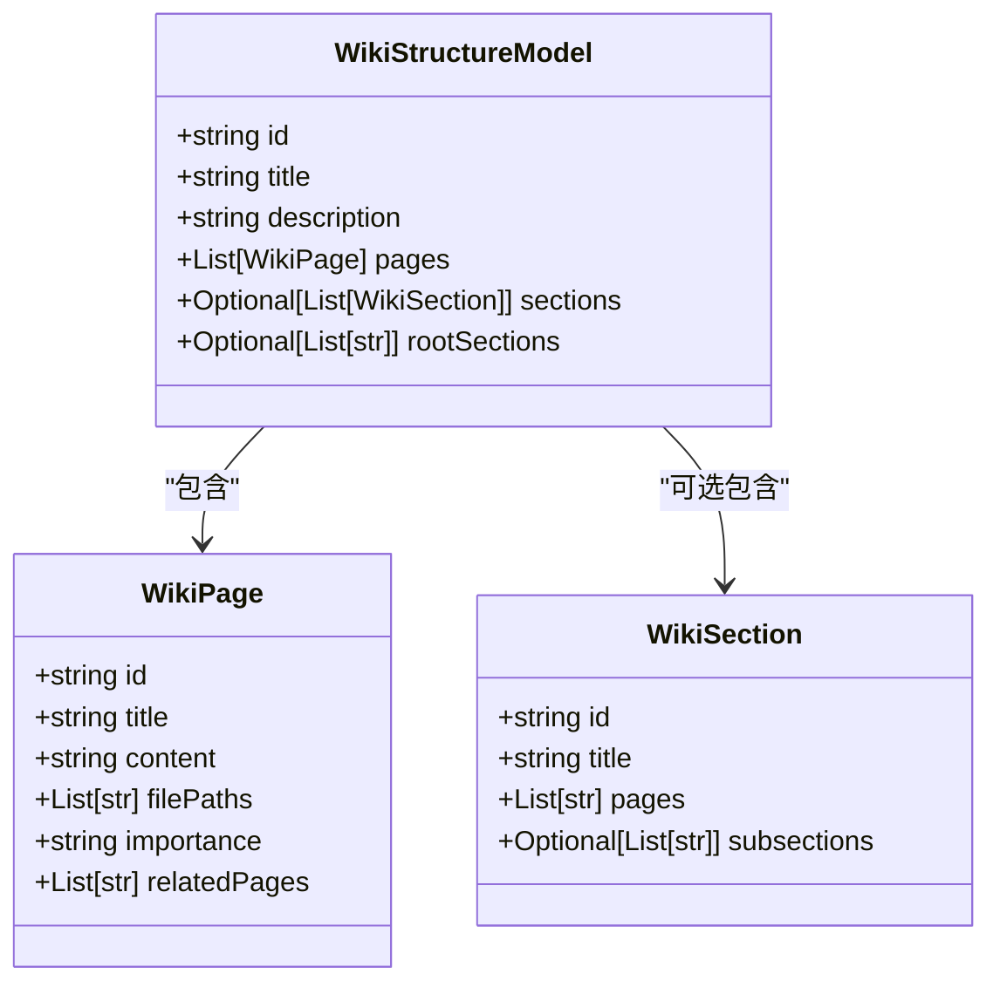
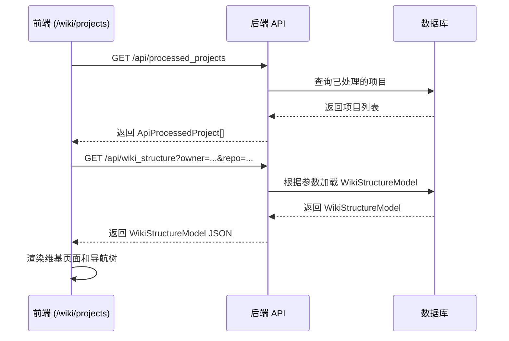

# WikiStructureModel 数据模型

<cite>
**Referenced Files in This Document**   
- [api.py](file://api/api.py#L78-L87)
- [wikistructure.tsx](file://src/types/wiki/wikistructure.tsx#L0-L10)
- [data_pipeline.py](file://api/data_pipeline.py#L0-L881)
- [route.ts](file://src/app/api/wiki/projects/route.ts#L0-L103)
- [wikipage.tsx](file://src/types/wiki/wikipage.tsx#L1-L12)
- [WikiSection](file://api/api.py#L68-L75)
</cite>

## 目录
1. [简介](#简介)
2. [核心结构与字段](#核心结构与字段)
3. [层级组织机制](#层级组织机制)
4. [生成流程分析](#生成流程分析)
5. [JSON输出示例](#json输出示例)
6. [前端使用方式](#前端使用方式)

## 简介
`WikiStructureModel` 是维基文档系统中的顶层数据容器，负责将从代码库中提取的扁平化页面集合组织成一个具有逻辑层次的完整文档体系。该模型不仅包含文档的元信息，还定义了页面间的层级关系和导航结构，是整个系统生成、存储和展示知识的核心数据结构。

**Section sources**
- [api.py](file://api/api.py#L78-L87)

## 核心结构与字段
`WikiStructureModel` 类定义了维基文档的完整结构，其核心字段包括：

- **id**: 文档结构的唯一标识符。
- **title**: 文档的主标题，通常来源于代码库的名称。
- **description**: 对文档内容的简要描述。
- **pages**: `WikiPage` 对象的列表，包含了所有生成的页面内容，是模型的核心数据承载字段。
- **sections**: 可选的 `WikiSection` 对象列表，定义了文档的章节结构。
- **rootSections**: 可选的字符串列表，指定了根级别章节的ID，用于构建初始的导航树。

该模型在系统中作为数据传输的核心载体，贯穿于数据处理、缓存和API响应的全过程。



**Diagram sources **
- [api.py](file://api/api.py#L78-L87)
- [api.py](file://api/api.py#L39-L48)
- [api.py](file://api/api.py#L68-L75)

**Section sources**
- [api.py](file://api/api.py#L78-L87)
- [api.py](file://api/api.py#L39-L48)
- [api.py](file://api/api.py#L68-L75)

## 层级组织机制
`WikiStructureModel` 通过 `sections` 和 `rootSections` 字段将扁平的 `WikiPage` 集合组织成一个树状的逻辑层次。

- **`sections` 字段**：定义了文档中所有章节的集合。每个 `WikiSection` 包含一个 `title` 和一个 `pages` 列表（存储页面ID），以及一个可选的 `subsections` 列表（存储子章节ID），从而形成一个递归的树形结构。
- **`rootSections` 字段**：指定了哪些章节ID属于根级别。前端应用通过读取此列表，可以构建出文档的初始导航结构，用户可以从这些顶级章节开始浏览。

这种设计将内容（`pages`）与结构（`sections`）分离，使得内容的生成和结构的组织可以独立进行，提高了系统的灵活性和可维护性。

**Section sources**
- [api.py](file://api/api.py#L86-L87)
- [api.py](file://api/api.py#L68-L75)

## 生成流程分析
`WikiStructureModel` 的构建和填充主要在 `data_pipeline.py` 文件中完成，其流程如下：

1.  **数据准备**：`DatabaseManager` 类负责管理代码库的下载和文档的读取。`read_all_documents` 函数会递归扫描代码库，提取所有相关的代码和文档文件，并将其转换为 `Document` 对象。
2.  **内容处理**：`prepare_data_pipeline` 函数创建了一个数据处理流水线，该流水线首先使用 `TextSplitter` 将大文档分割成更小的块，然后使用 `ToEmbeddings` 或 `OllamaDocumentProcessor` 将这些文本块转换为向量嵌入，以便进行语义搜索。
3.  **模型构建**：虽然 `data_pipeline.py` 主要负责底层数据处理，但 `WikiStructureModel` 的最终构建是由 `api.py` 中的逻辑完成的。在文档被处理和索引后，系统会调用大语言模型（LLM）来分析这些内容，生成 `WikiPage` 和 `WikiSection` 对象，并将它们组装成一个完整的 `WikiStructureModel` 实例。
4.  **持久化**：构建好的 `WikiStructureModel` 会被序列化并存储在缓存中，以供后续的API请求快速访问。

整个流程确保了 `WikiStructureModel` 中的数据是基于对原始代码库内容的深度分析而生成的。

**Section sources**
- [data_pipeline.py](file://api/data_pipeline.py#L0-L881)

## JSON输出示例
一个典型的 `WikiStructureModel` 序列化后的JSON输出如下所示：

```json
{
  "id": "github_user_repo",
  "title": "My Project",
  "description": "A description of the project.",
  "pages": [
    {
      "id": "page1",
      "title": "Introduction",
      "content": "This is the introduction...",
      "filePaths": ["README.md"],
      "importance": "high",
      "relatedPages": ["page2"]
    }
  ],
  "sections": [
    {
      "id": "sec1",
      "title": "Getting Started",
      "pages": ["page1"],
      "subsections": []
    }
  ],
  "rootSections": ["sec1"]
}
```

这个JSON对象清晰地展示了文档的元信息、单个页面内容、一个章节定义以及该章节作为根节点的导航关系。

**Section sources**
- [api.py](file://api/api.py#L78-L87)

## 前端使用方式
在前端，`/wiki/projects` 页面通过调用API来获取 `WikiStructureModel` 数据。

- **API端点**：前端通过 `GET /api/processed_projects` 请求从Python后端获取已处理的项目列表。该请求的响应数据结构与 `ApiProcessedProject` 接口相匹配。
- **数据流**：当用户选择一个项目时，前端会向后端发起另一个请求（例如 `GET /api/wiki_structure`），以获取该项目完整的 `WikiStructureModel`。这个模型随后被用于渲染维基页面的导航树（通过 `rootSections` 和 `sections`）和主要内容区域（通过 `pages`）。
- **组件**：前端的 `WikiTreeView` 组件利用 `WikiStructureModel` 中的 `sections` 和 `rootSections` 字段来动态生成可交互的树形导航菜单。



**Diagram sources **
- [route.ts](file://src/app/api/wiki/projects/route.ts#L0-L103)
- [api.py](file://api/api.py#L78-L87)

**Section sources**
- [route.ts](file://src/app/api/wiki/projects/route.ts#L0-L103)
- [api.py](file://api/api.py#L78-L87)
- [wikistructure.tsx](file://src/types/wiki/wikistructure.tsx#L0-L10)