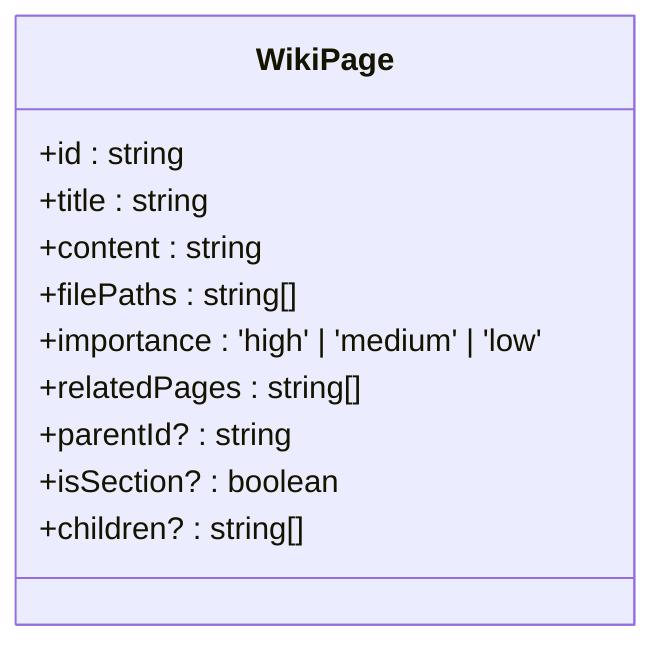
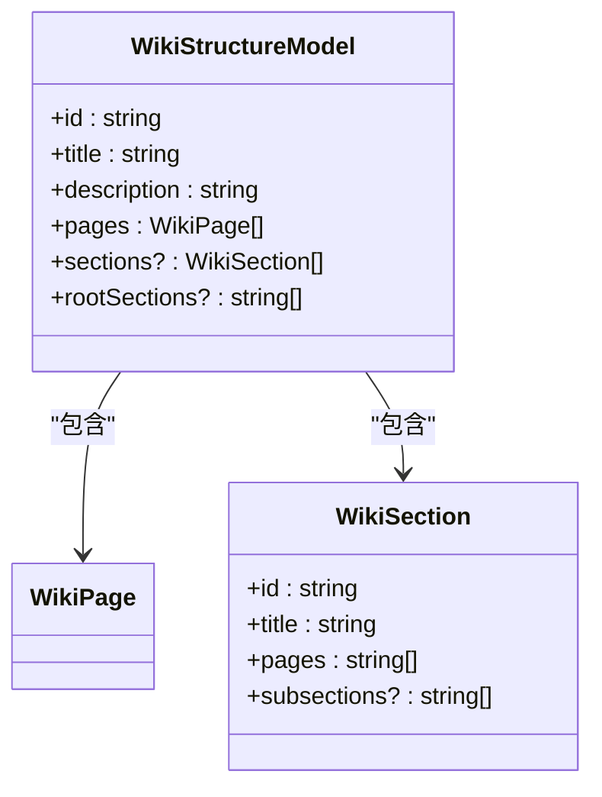
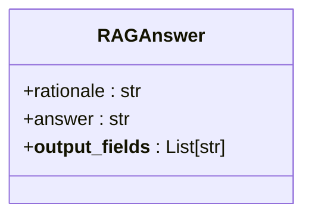
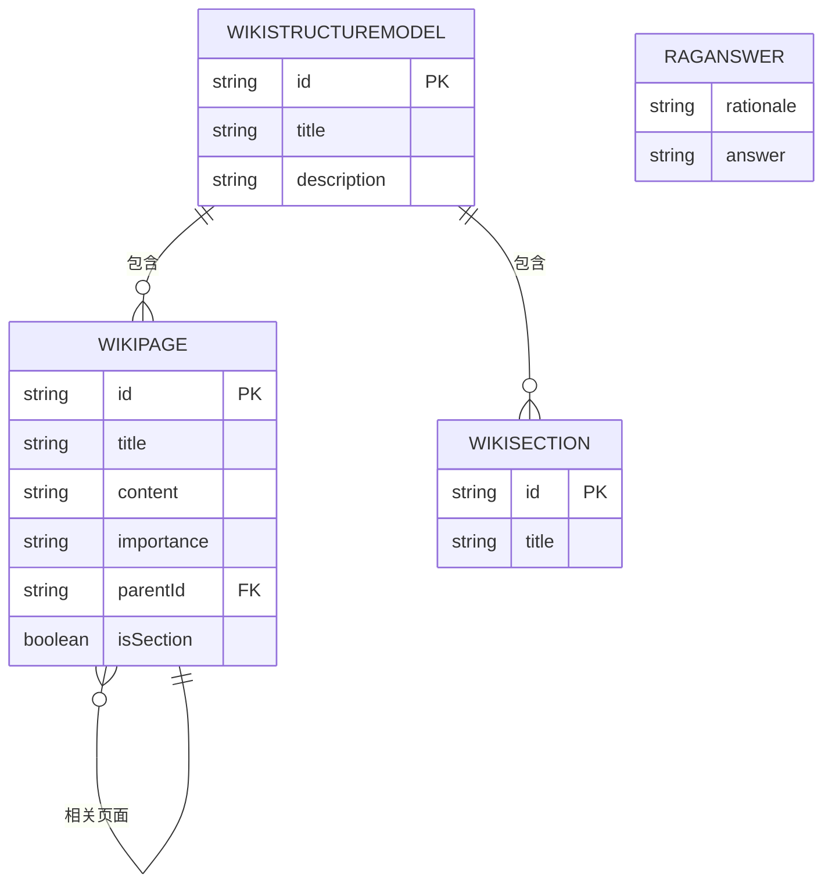

# 数据模型

<cite>
**Referenced Files in This Document**   
- [wikipage.tsx](file://src/types/wiki/wikipage.tsx)
- [wikistructure.tsx](file://src/types/wiki/wikistructure.tsx)
- [api.py](file://api/api.py)
- [rag.py](file://api/rag.py)
</cite>

## 目录
1. [简介](#简介)
2. [核心数据结构](#核心数据结构)
3. [WikiPage 数据模型](#wikipage-数据模型)
4. [WikiStructureModel 数据模型](#wikistructuremodel-数据模型)
5. [RAGAnswer 数据模型](#raganswer-数据模型)
6. [实体关系图](#实体关系图)

## 简介
本文档全面阐述了 DeepWiki 系统中的核心数据模型。系统采用前后端分离架构，通过 TypeScript 和 Python 分别定义数据结构，确保了跨语言数据传递的一致性。核心模型包括 `WikiPage`（维基页面）、`WikiStructureModel`（维基结构）和 `RAGAnswer`（检索增强生成答案），它们共同支撑了知识的组织、存储与智能问答功能。

## 核心数据结构
系统的核心数据结构围绕维基内容的组织与检索展开。`WikiPage` 定义了单个页面的属性，`WikiStructureModel` 则负责组织整个维基的层次结构，而 `RAGAnswer` 用于封装智能问答的响应。这些模型通过 API 进行数据交换，实现了前后端的无缝集成。

## WikiPage 数据模型

`WikiPage` 模型是系统中最基本的单元，用于表示一个维基页面。该模型在前端（TypeScript）和后端（Python）有相似但不完全相同的定义，体现了前后端职责的分离与协作。

在前端，`WikiPage` 接口定义在 `src/types/wiki/wikipage.tsx` 中，包含了用于构建用户界面的所有字段。在后端，`WikiPage` 类定义在 `api/api.py` 中，作为 API 请求和响应的数据载体。

**统一字段**：
- **id**: 页面的唯一标识符（字符串）。
- **title**: 页面的标题（字符串）。
- **content**: 页面的主体内容，通常为 Markdown 格式（字符串）。
- **filePaths**: 与该页面相关的源代码文件路径列表（字符串数组）。
- **importance**: 页面的重要性等级，前端使用字面量类型 `'high' | 'medium' | 'low'` 以保证类型安全，而后端使用普通字符串，注释中建议使用 `Literal` 类型。
- **relatedPages**: 与该页面相关的其他页面的 ID 列表（字符串数组）。

**层次化字段**：
为了支持维基页面的树状结构，前端 `WikiPage` 模型引入了三个新的可选字段：
- **parentId**: 指向其父页面的 ID（字符串，可选）。如果为空，则该页面为顶级页面。
- **isSection**: 布尔值，标记该页面是否为一个章节（可选）。这有助于在 UI 中区分内容页面和结构节点。
- **children**: 其子页面 ID 的列表（字符串数组，可选）。这为构建树形视图提供了直接的数据支持。

这些层次化字段主要在前端用于构建 `WikiTreeView` 组件，实现了页面的嵌套展示。后端 API 在返回数据时，会包含这些字段，以确保前端能正确渲染页面结构。

**Diagram sources**
- [wikipage.tsx](file://src/types/wiki/wikipage.tsx)

**Section sources**
- [wikipage.tsx](file://src/types/wiki/wikipage.tsx)
- [api.py](file://api/api.py#L39-L48)

## WikiStructureModel 数据模型

`WikiStructureModel` 模型定义了整个维基项目的整体结构，是组织和管理多个 `WikiPage` 的容器。

该模型包含以下核心字段：
- **id**: 维基结构的唯一标识符（字符串）。
- **title**: 维基的标题（字符串）。
- **description**: 维基的描述信息（字符串）。
- **pages**: 包含所有 `WikiPage` 对象的列表（`WikiPage[]`）。这是模型的核心，存储了维基的全部内容。

此外，模型还支持更复杂的结构划分：
- **sections**: 一个可选的 `WikiSection` 对象列表。`WikiSection` 模型本身包含 `id`、`title`、`pages`（子页面 ID 列表）和 `subsections`（子章节 ID 列表），允许创建多级章节。
- **rootSections**: 一个可选的字符串列表，存储顶级章节的 ID。这为快速定位维基的主干结构提供了便利。

`WikiStructureModel` 在系统中扮演着关键角色。它不仅用于在前端渲染维基的目录结构，还作为 `WikiCacheData` 的一部分被持久化存储在服务器上，实现了维基结构的缓存，避免了重复生成。

**Diagram sources**
- [wikistructure.tsx](file://src/types/wiki/wikistructure.tsx)
- [api.py](file://api/api.py#L78-L87)

**Section sources**
- [wikistructure.tsx](file://src/types/wiki/wikistructure.tsx)
- [api.py](file://api/api.py#L78-L87)

## RAGAnswer 数据模型

`RAGAnswer` 类是系统智能问答功能的核心输出模型，定义在 `api/rag.py` 中。它继承自 `adal.DataClass`，并用于 `adalflow` 框架的输出解析。

该模型包含两个主要字段：
- **rationale**: 字符串类型，用于存储模型生成最终答案的“思维链”（Chain of thoughts）。这代表了模型在检索和推理过程中的内部逻辑，对于调试和理解模型行为非常有价值。
- **answer**: 字符串类型，存储最终返回给用户的答案。该字段的元数据明确指出，答案应以 Markdown 格式呈现，以便前端的 `react-markdown` 组件进行美观渲染。

一个关键的设计是 `__output_fields__` 类变量，它指定了在序列化响应时应包含的字段。这确保了流式响应（streaming response）能够正确地将 `rationale` 和 `answer` 两个字段传递给前端。

在流式响应中，`RAGAnswer` 的序列化过程由 `adalflow` 的 `DataClassParser` 处理。当后端通过 WebSocket 或流式 HTTP 接口返回答案时，`answer` 字段的内容会以 Markdown 片段的形式逐步发送，前端可以实时地将这些片段拼接并渲染，从而实现流畅的“打字机”效果。同时，`rationale` 字段通常不直接展示给最终用户，而是用于日志记录或高级调试。

**Diagram sources**
- [rag.py](file://api/rag.py#L146-L150)

**Section sources**
- [rag.py](file://api/rag.py#L146-L150)

## 实体关系图

以下实体关系图（ERD）总结了系统中主要数据实体之间的关系。

**Diagram sources**
- [wikipage.tsx](file://src/types/wiki/wikipage.tsx)
- [wikistructure.tsx](file://src/types/wiki/wikistructure.tsx)
- [api.py](file://api/api.py)
- [rag.py](file://api/rag.py)