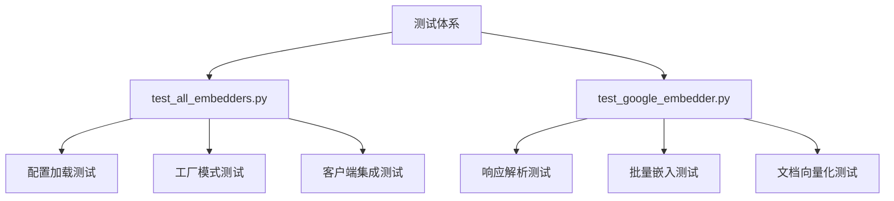
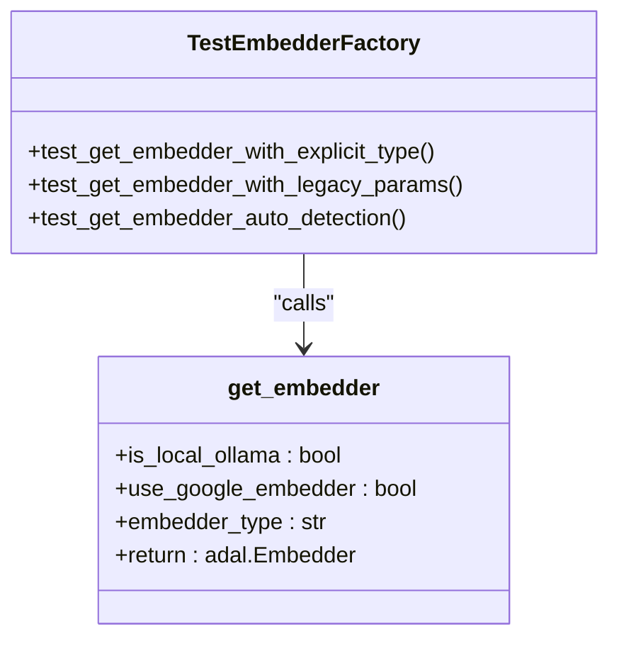
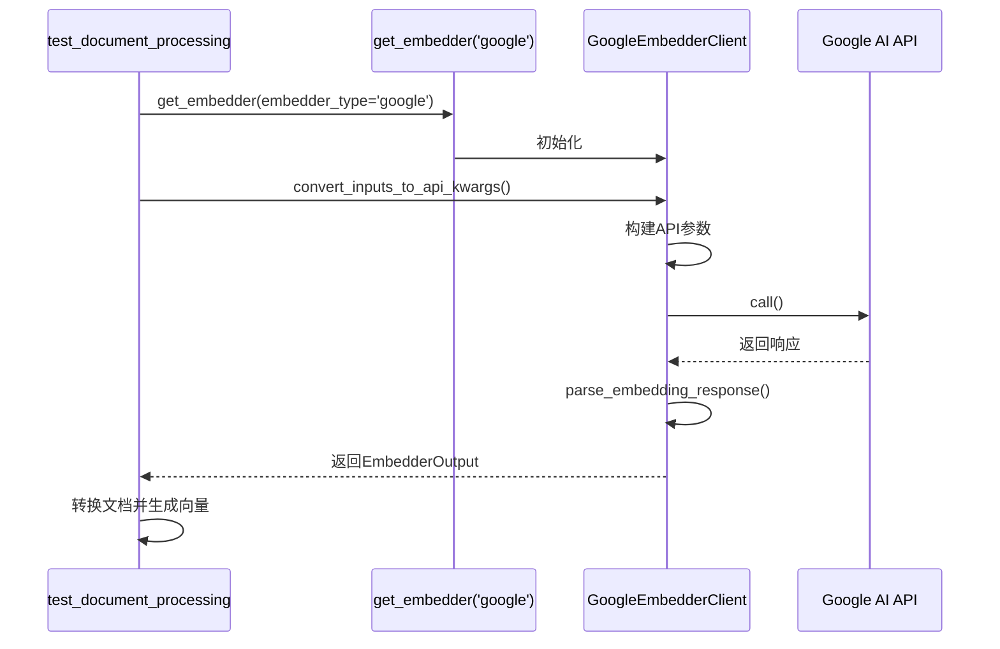

# 单元测试

<cite>
**Referenced Files in This Document**   
- [test_all_embedders.py](file://tests/unit/test_all_embedders.py)
- [test_google_embedder.py](file://tests/unit/test_google_embedder.py)
- [config.py](file://api/config.py)
- [embedder.py](file://api/tools/embedder.py)
- [google_embedder_client.py](file://api/google_embedder_client.py)
- [data_pipeline.py](file://api/data_pipeline.py)
- [rag.py](file://api/rag.py)
</cite>

## 目录
1. [简介](#简介)
2. [测试体系概览](#测试体系概览)
3. [核心测试文件分析](#核心测试文件分析)
4. [配置与工厂模式测试](#配置与工厂模式测试)
5. [Google嵌入器测试](#google嵌入器测试)
6. [依赖隔离与异常处理](#依赖隔离与异常处理)
7. [测试可重复性与环境变量](#测试可重复性与环境变量)
8. [为新嵌入器添加测试](#为新嵌入器添加测试)
9. [测试覆盖率与关键指标](#测试覆盖率与关键指标)

## 简介
本文档详细说明了`deepwiki-open`项目中嵌入器客户端的单元测试体系。重点分析了`test_all_embedders.py`和`test_google_embedder.py`两个核心测试文件，它们共同构成了对Google、OpenAI和Ollama等嵌入器客户端功能正确性的全面验证。文档将深入探讨配置加载、工厂模式、客户端实例化以及环境变量处理等关键测试逻辑，并为编写新的单元测试提供指导原则。

## 测试体系概览
项目的单元测试体系位于`tests/unit/`目录下，采用Python内置的`unittest`框架的变体进行构建。测试的核心目标是验证嵌入器系统的各个组件在不同配置和环境下的行为一致性。测试体系通过模拟、参数化测试和集成测试等多种手段，确保了从配置解析到实际API调用的整个流程的可靠性。

**Diagram sources**
- [test_all_embedders.py](file://tests/unit/test_all_embedders.py)
- [test_google_embedder.py](file://tests/unit/test_google_embedder.py)

## 核心测试文件分析
单元测试体系由两个主要文件构成：`test_all_embedders.py`和`test_google_embedder.py`。前者是一个综合性的测试套件，负责验证所有嵌入器类型的通用逻辑，包括配置、工厂和环境变量处理。后者则是一个专门针对Google嵌入器的测试脚本，旨在复现和修复特定的响应解析错误，如“list object has no attribute 'embedding'”。

**Section sources**
- [test_all_embedders.py](file://tests/unit/test_all_embedders.py)
- [test_google_embedder.py](file://tests/unit/test_google_embedder.py)

## 配置与工厂模式测试
`test_all_embedders.py`文件中的`TestEmbedderConfiguration`和`TestEmbedderFactory`类是测试体系的基石。

### 配置加载测试
`TestEmbedderConfiguration`类中的`test_config_loading`方法验证了`api/config.py`中定义的配置系统。它确保`embedder.json`配置文件中的所有嵌入器配置（如`embedder`、`embedder_google`、`embedder_ollama`）都能被正确加载，并且`CLIENT_CLASSES`映射中包含了所有必要的客户端类（如`OpenAIClient`、`GoogleEmbedderClient`、`OllamaClient`）。这保证了系统在启动时能够获取到正确的配置信息。

### 工厂模式测试
`TestEmbedderFactory`类通过`test_get_embedder_with_explicit_type`等方法，验证了`api/tools/embedder.py`中`get_embedder`工厂函数的正确性。该函数是创建嵌入器实例的统一入口，它根据`embedder_type`参数（'openai', 'google', 'ollama'）或遗留的布尔参数（`use_google_embedder`, `is_local_ollama`）来决定实例化哪个具体的嵌入器。测试确保了无论通过哪种方式调用，都能成功创建对应的嵌入器对象。

**Diagram sources**
- [embedder.py](file://api/tools/embedder.py#L5-L53)
- [test_all_embedders.py](file://tests/unit/test_all_embedders.py#L138-L184)

## Google嵌入器测试
`test_google_embedder.py`文件专注于Google嵌入器的详细功能验证。

### 响应解析测试
`test_google_embedder_client`函数直接测试`api/google_embedder_client.py`中的`GoogleEmbedderClient`。它模拟了单次和批量嵌入请求，并重点验证了`parse_embedding_response`方法。该方法负责将Google AI API返回的原始响应（可能是一个包含`embedding`字段的字典，或一个包含`embeddings`列表的字典）解析为`adalflow`框架所需的`EmbedderOutput`格式。测试确保了无论API返回何种结构，解析逻辑都能正确处理，避免了“list object has no attribute 'embedding'”这类错误。

### 批量嵌入与文档向量化
`test_document_processing`函数测试了文档向量化的完整流程。它创建了`adalflow`的`Document`对象，通过`get_embedder`获取Google嵌入器实例，并使用`ToEmbeddings`转换器对文档进行批量处理。此测试验证了从文档加载、分块到最终生成向量的整个数据管道的连贯性。

**Diagram sources**
- [test_google_embedder.py](file://tests/unit/test_google_embedder.py#L100-L182)
- [google_embedder_client.py](file://api/google_embedder_client.py#L19-L230)

## 依赖隔离与异常处理
测试体系通过多种方式实现了依赖隔离和异常处理的验证。

### 依赖隔离
`test_all_embedders.py`中的`TestRunner`类提供了一个简单的测试框架，它通过`patch`装饰器（来自`unittest.mock`）来模拟环境变量和配置。例如，在`test_embedder_type_env_var`方法中，它会临时修改`DEEPWIKI_EMBEDDER_TYPE`环境变量，并重新加载`api.config`模块，以验证配置系统能正确响应环境变化，而无需实际修改系统环境。

### 异常处理
测试代码中广泛使用了`try-except`块来验证异常处理路径。例如，在`test_google_embedder_client`中，如果`GOOGLE_API_KEY`环境变量未设置，测试会优雅地跳过相关测试并记录警告，而不是导致整个测试套件失败。这确保了测试的健壮性和可重复性。

**Section sources**
- [test_all_embedders.py](file://tests/unit/test_all_embedders.py#L345-L400)
- [test_google_embedder.py](file://tests/unit/test_google_embedder.py#L20-L45)

## 测试可重复性与环境变量
`test_all_embedders.py`中的`TestEnvironmentVariableHandling`类专门负责测试环境变量对嵌入器选择的影响。它通过`_test_single_embedder_type`方法，系统地测试了`DEEPWIKI_EMBEDDER_TYPE`环境变量设置为'openai'、'google'、'ollama'时，`api.config`模块中的`EMBEDDER_TYPE`和`get_embedder_type()`函数是否能返回预期的值。测试结束后，它会恢复环境变量的原始状态，保证了测试的可重复性，不会对后续测试或开发环境造成污染。

**Section sources**
- [test_all_embedders.py](file://tests/unit/test_all_embedders.py#L345-L400)
- [config.py](file://api/config.py#L159-L172)

## 为新嵌入器添加测试
为新的嵌入器类型添加单元测试应遵循以下原则：

1.  **创建专用测试文件**：在`tests/unit/`目录下创建类似`test_new_embedder.py`的文件。
2.  **验证配置**：编写测试确保新嵌入器的配置能被`load_embedder_config()`正确加载。
3.  **测试工厂模式**：在`test_all_embedders.py`中添加新的测试方法，验证`get_embedder(embedder_type='new')`能成功创建实例。
4.  **实现端到端测试**：模仿`test_google_embedder.py`，编写一个测试函数，验证从客户端初始化、API调用到响应解析的完整流程。
5.  **使用mock进行隔离**：对于需要外部API调用的测试，使用`unittest.mock`来模拟网络请求，确保测试不依赖于外部服务的可用性。

## 测试覆盖率与关键指标
测试覆盖率的关键指标包括：
-   **配置路径覆盖率**：确保所有可能的`embedder_type`和环境变量组合都被测试到。
-   **客户端实例化**：验证所有嵌入器客户端都能被成功创建。
-   **API调用与响应解析**：覆盖单次嵌入、批量嵌入以及各种可能的API响应格式。
-   **错误路径**：测试API密钥缺失、网络错误、无效输入等异常情况。
-   **数据管道集成**：验证嵌入器能与`data_pipeline.py`中的`prepare_data_pipeline`和`count_tokens`函数无缝集成。

通过全面的测试，可以确保任何对嵌入器系统的修改都不会破坏现有功能，从而保障系统的稳定性和可靠性。