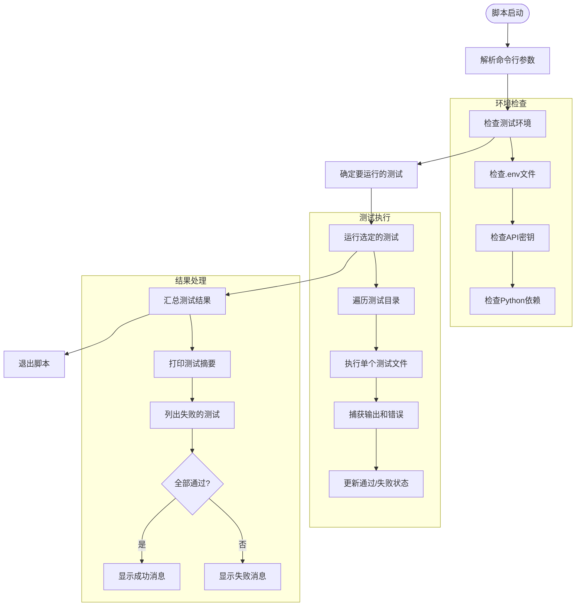

# 测试执行与运行配置

<cite>
**本文档中引用的文件**  
- [pytest.ini](file://pytest.ini)
- [run_tests.py](file://tests/run_tests.py)
- [test_all_embedders.py](file://tests/unit/test_all_embedders.py)
- [test_full_integration.py](file://tests/integration/test_full_integration.py)
- [test_api.py](file://tests/api/test_api.py)
</cite>

## 目录
1. [简介](#简介)
2. [项目测试结构](#项目测试结构)
3. [pytest配置详解](#pytest配置详解)
4. [测试标记分类与筛选机制](#测试标记分类与筛选机制)
5. [命令行选项与执行策略](#命令行选项与执行策略)
6. [run_tests.py测试协调脚本分析](#run_tests.py测试协调脚本分析)
7. [实用测试命令示例](#实用测试命令示例)
8. [开发阶段测试策略建议](#开发阶段测试策略建议)
9. [结论](#结论)

## 简介
本文档系统化地文档化DeepWiki项目的测试执行机制与配置管理。通过深入分析`pytest.ini`配置文件和`run_tests.py`协调脚本，全面阐述测试路径、文件匹配模式、标记分类、命令行选项的作用，以及这些配置如何支持精细化的测试筛选与执行策略。同时提供实用的测试运行命令示例，指导开发者根据不同的开发阶段选择合适的测试运行模式。

## 项目测试结构
DeepWiki项目采用分层的测试结构，将测试用例组织在不同的目录中，以支持不同类型的测试：

- **unit/**: 存放单元测试，验证单个函数、类或模块的正确性
- **integration/**: 存放集成测试，验证多个组件协同工作的正确性
- **api/**: 存放API测试，验证后端接口的功能和性能
- **test/**: 传统测试目录，与`tests/`目录并存

这种结构化的组织方式使得测试用例易于管理和维护，同时也支持按类别进行精细化的测试执行。

**Section sources**
- [pytest.ini](file://pytest.ini#L0-L14)
- [run_tests.py](file://tests/run_tests.py#L127-L162)

## pytest配置详解
`pytest.ini`文件是DeepWiki项目的核心测试配置文件，定义了测试发现、执行和报告的关键参数。

### 测试路径与文件匹配
配置文件通过以下参数精确控制测试的发现范围：
- `testpaths = test`: 指定测试搜索的根目录为`test/`
- `python_files = test_*.py *_test.py`: 定义匹配的测试文件模式，以`test_`开头或以`_test.py`结尾的Python文件被视为测试文件
- `python_classes = Test*`: 指定以`Test`开头的类被视为测试类
- `python_functions = test_*`: 指定以`test_`开头的函数被视为测试函数

### 执行选项配置
`addopts`部分定义了默认的命令行选项，确保测试执行的一致性和可读性：
- `-v`: 启用详细输出模式，显示每个测试用例的执行结果
- `--strict-markers`: 启用标记严格模式，防止使用未定义的标记
- `--disable-warnings`: 禁用pytest警告信息，保持输出简洁
- `--tb=short`: 使用简短的追溯格式，减少错误信息的冗余

**Section sources**
- [pytest.ini](file://pytest.ini#L0-L14)

## 测试标记分类与筛选机制
DeepWiki项目通过自定义标记（markers）实现测试用例的分类和精细化筛选，支持不同场景下的测试执行策略。

### 标记定义
在`pytest.ini`中定义了四种核心标记：
- `unit`: 标识单元测试，通常执行速度快，不依赖外部系统
- `integration`: 标识集成测试，验证多个组件的协同工作
- `slow`: 标识执行时间较长的测试（超过几秒钟）
- `network`: 标识需要网络访问的测试，可能依赖外部API或服务

### 标记应用与筛选
开发者可以在测试函数或类上使用`@pytest.mark`装饰器来应用标记。通过`-m`选项，可以灵活地筛选和执行特定标记的测试：
- `pytest -m unit`: 仅运行单元测试
- `pytest -m integration`: 仅运行集成测试
- `pytest -m "not network"`: 运行所有不依赖网络的测试
- `pytest -m "unit and not slow"`: 运行快速的单元测试

这种标记机制使得开发者可以根据环境条件（如是否有网络连接）和时间约束，选择最合适的测试子集进行执行。

**Section sources**
- [pytest.ini](file://pytest.ini#L0-L14)
- [test_all_embedders.py](file://tests/unit/test_all_embedders.py#L24-L60)
- [test_full_integration.py](file://tests/integration/test_full_integration.py#L115-L151)

## 命令行选项与执行策略
除了`pytest.ini`中定义的默认选项，开发者还可以使用丰富的命令行选项来定制测试执行。

### 常用命令行选项
- `-v` (verbose): 详细输出，显示每个测试用例的名称和结果
- `-x`: 遇到第一个失败时停止执行
- `--tb=long`: 显示完整的错误追溯信息
- `--collect-only`: 仅收集测试用例，不执行
- `-k EXPRESSION`: 通过关键字表达式筛选测试用例

### 执行策略组合
通过组合不同的选项，可以实现多种执行策略：
- **快速反馈**: `pytest -m unit -v` - 快速运行所有单元测试，获得即时反馈
- **全面验证**: `pytest --disable-warnings` - 运行所有测试，忽略警告信息
- **问题排查**: `pytest --tb=long -x` - 详细追溯第一个失败的测试，便于调试

**Section sources**
- [pytest.ini](file://pytest.ini#L0-L14)
- [run_tests.py](file://tests/run_tests.py#L127-L162)

## run_tests.py测试协调脚本分析
`run_tests.py`是一个自定义的测试协调脚本，提供了比直接使用pytest更高级的测试管理功能。

### 脚本功能概述
该脚本的主要功能包括：
- 环境检查：验证必要的环境变量和依赖项
- 测试分类执行：支持按类别（单元、集成、API）运行测试
- 结果汇总：提供统一的测试结果摘要
- 失败重试：支持单独运行失败的测试用例

### 核心组件分析


**Diagram sources**
- [run_tests.py](file://tests/run_tests.py#L0-L162)

### 命令行接口
脚本提供了直观的命令行接口：
- `--unit`: 仅运行单元测试
- `--integration`: 仅运行集成测试
- `--api`: 仅运行API测试
- `--check-env`: 仅检查环境配置
- `--verbose`: 启用详细输出

当未指定任何类别时，脚本默认运行所有类别的测试。

**Section sources**
- [run_tests.py](file://tests/run_tests.py#L127-L162)

## 实用测试命令示例
以下是一些常用的测试运行命令示例，适用于不同的开发场景。

### 基本测试命令
```bash
# 运行所有测试
python tests/run_tests.py

# 仅运行单元测试
python tests/run_tests.py --unit

# 仅运行集成测试
python tests/run_tests.py --integration

# 检查测试环境配置
python tests/run_tests.py --check-env
```

### pytest直接调用
```bash
# 运行所有单元测试
pytest -m unit

# 运行所有不慢的测试
pytest -m "not slow"

# 运行需要网络的集成测试
pytest -m "integration and network"

# 生成覆盖率报告
pytest --cov=api --cov-report=html

# 并行执行测试（需安装pytest-xdist）
pytest -n auto
```

### 高级测试场景
```bash
# 运行特定文件的测试
pytest tests/unit/test_all_embedders.py

# 通过关键字筛选测试
pytest -k "google"  # 运行包含"google"的测试

# 生成详细的测试报告
pytest --html=report.html --self-contained-html

# 在调试模式下运行单个测试
pytest tests/unit/test_all_embedders.py::TestEmbedderClients::test_google_embedder_client -s -v
```

**Section sources**
- [run_tests.py](file://tests/run_tests.py#L127-L162)
- [pytest.ini](file://pytest.ini#L0-L14)

## 开发阶段测试策略建议
根据不同的开发阶段，建议采用相应的测试策略以提高开发效率。

### 日常开发阶段
- **快速反馈循环**: 使用`python tests/run_tests.py --unit`快速验证代码修改
- **持续集成**: 在提交代码前运行所有相关测试，确保不破坏现有功能
- **针对性测试**: 使用`-k`选项运行与修改代码相关的特定测试

### 功能集成阶段
- **全面验证**: 运行`python tests/run_tests.py`执行所有测试类别
- **集成测试重点**: 特别关注`integration`标记的测试，确保组件间协同正常
- **环境验证**: 使用`--check-env`确保测试环境配置正确

### 发布准备阶段
- **完整测试套件**: 运行所有测试，包括`slow`和`network`标记的测试
- **覆盖率分析**: 使用`--cov`选项生成代码覆盖率报告，确保关键路径被充分测试
- **并行执行**: 使用`pytest-xdist`插件并行执行测试，缩短整体测试时间

### 故障排查阶段
- **详细输出**: 使用`-v --tb=long`获取详细的执行信息和错误追溯
- **逐个验证**: 单独运行失败的测试文件，隔离问题
- **环境隔离**: 使用`--check-env`验证是否为环境配置问题

**Section sources**
- [run_tests.py](file://tests/run_tests.py#L0-L162)
- [pytest.ini](file://pytest.ini#L0-L14)

## 结论
DeepWiki项目通过`pytest.ini`配置文件和`run_tests.py`协调脚本构建了一个灵活、可扩展的测试执行体系。`pytest.ini`提供了标准化的测试发现和执行配置，而`run_tests.py`则在此基础上增加了环境检查、分类执行和结果汇总等高级功能。

测试标记机制（unit、integration、slow、network）使得开发者能够根据不同的需求和约束条件，精细化地筛选和执行测试用例。结合丰富的命令行选项，开发者可以在日常开发、功能集成、发布准备和故障排查等不同阶段，选择最合适的测试策略。

建议开发者熟悉这些测试工具和配置，根据具体的开发场景选择适当的测试命令，以提高开发效率和代码质量。同时，随着项目的发展，可以进一步扩展测试标记和协调脚本的功能，以满足更复杂的测试需求。