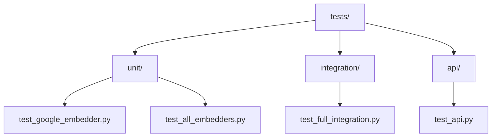
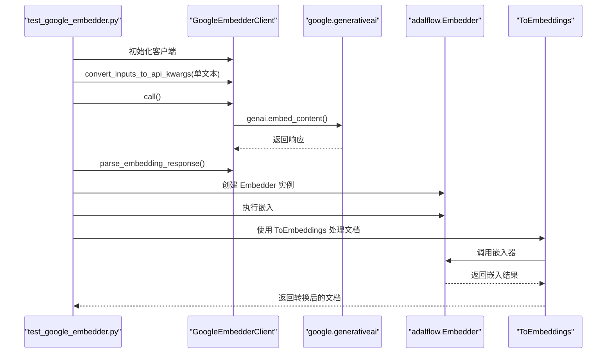
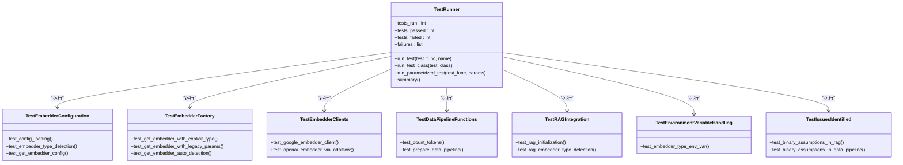
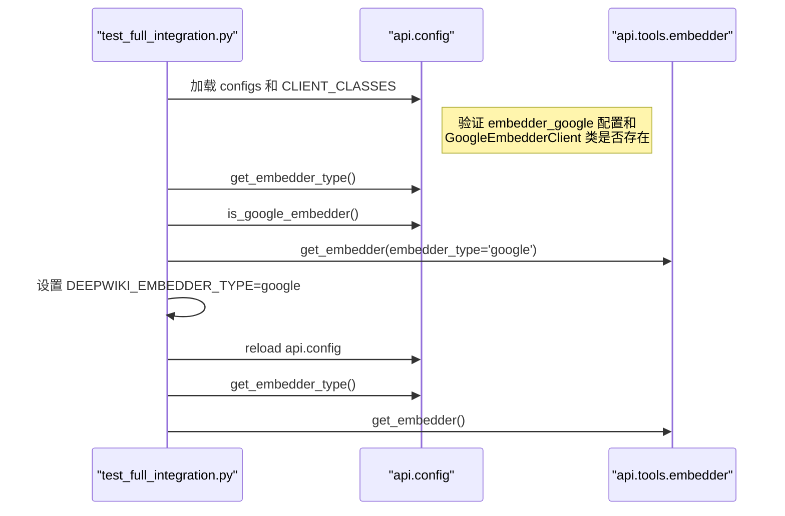
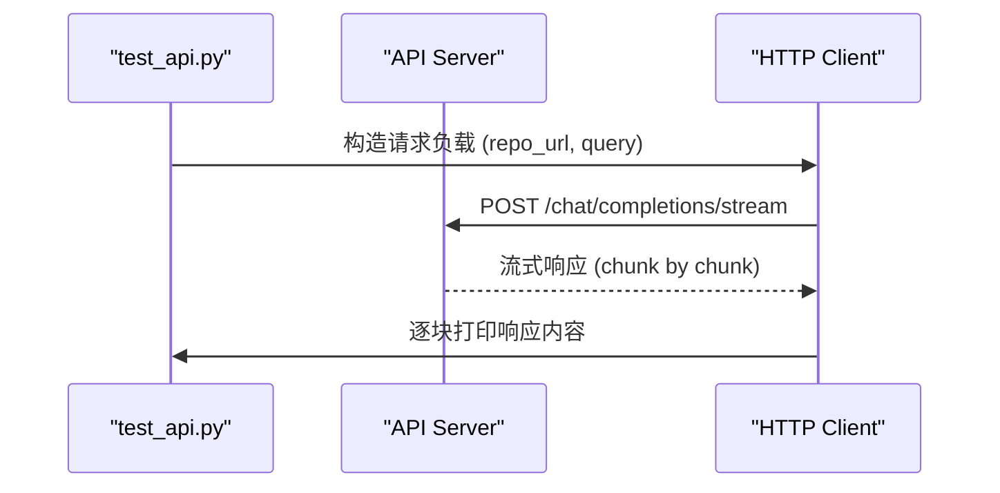

# 测试策略

<cite>
**本文档中引用的文件**  
- [pytest.ini](file://pytest.ini)
- [run_tests.py](file://tests/run_tests.py)
- [test_google_embedder.py](file://tests/unit/test_google_embedder.py)
- [test_all_embedders.py](file://tests/unit/test_all_embedders.py)
- [test_full_integration.py](file://tests/integration/test_full_integration.py)
- [test_api.py](file://tests/api/test_api.py)
- [google_embedder_client.py](file://api/google_embedder_client.py)
- [embedder.py](file://api/tools/embedder.py)
- [config.py](file://api/config.py)
</cite>

## 目录
1. [简介](#简介)
2. [测试目录结构](#测试目录结构)
3. [测试配置与执行](#测试配置与执行)
4. [单元测试分析](#单元测试分析)
5. [集成测试分析](#集成测试分析)
6. [API测试分析](#api测试分析)
7. [编写新测试用例的指导原则](#编写新测试用例的指导原则)
8. [测试运行与结果解读](#测试运行与结果解读)

## 简介
本项目采用分层测试体系，涵盖单元测试、集成测试和API测试，确保嵌入器客户端（如Google Embedder）的正确性以及完整API调用流程的稳定性。测试框架基于Python的`pytest`构建，并通过自定义脚本`run_tests.py`统一管理测试执行。测试体系重点关注外部API调用的模拟、配置加载的正确性以及不同嵌入器类型（OpenAI、Google、Ollama）的兼容性。

## 测试目录结构
项目的测试目录结构清晰地划分为`unit`、`integration`和`api`三个子目录，体现了分层测试的设计理念。



**Diagram sources**
- [tests/unit/test_google_embedder.py](file://tests/unit/test_google_embedder.py)
- [tests/unit/test_all_embedders.py](file://tests/unit/test_all_embedders.py)
- [tests/integration/test_full_integration.py](file://tests/integration/test_full_integration.py)
- [tests/api/test_api.py](file://tests/api/test_api.py)

**Section sources**
- [tests/unit/test_google_embedder.py](file://tests/unit/test_google_embedder.py)
- [tests/unit/test_all_embedders.py](file://tests/unit/test_all_embedders.py)
- [tests/integration/test_full_integration.py](file://tests/integration/test_full_integration.py)
- [tests/api/test_api.py](file://tests/api/test_api.py)

## 测试配置与执行
项目使用`pytest.ini`文件进行测试框架的配置，并通过`run_tests.py`脚本提供更灵活的测试执行方式。

### pytest.ini 配置项解析
`pytest.ini`文件定义了测试发现和执行的核心规则。

```ini
[tool:pytest]
testpaths = test
python_files = test_*.py *_test.py
python_classes = Test*
python_functions = test_*
addopts = 
    -v
    --strict-markers
    --disable-warnings
    --tb=short
markers =
    unit: Unit tests
    integration: Integration tests
    slow: Slow tests that take more than a few seconds
    network: Tests that require network access
```

- **testpaths**: 指定测试的根目录为`test`，但项目实际使用的是`tests`目录，此配置可能未生效或为历史遗留。
- **python_files**: 定义了测试文件的命名模式，即以`test_`开头或以`_test.py`结尾的Python文件。
- **python_classes**: 指定测试类的命名模式，必须以`Test`开头。
- **python_functions**: 指定测试函数的命名模式，必须以`test_`开头。
- **addopts**: 为`pytest`命令行添加默认参数。
  - `-v`: 启用详细输出模式。
  - `--strict-markers`: 要求所有使用的标记（markers）都必须在`markers`部分预先声明，避免拼写错误。
  - `--disable-warnings`: 禁用pytest的警告输出。
  - `--tb=short`: 简化失败测试的回溯信息。
- **markers**: 定义了可用的测试标记及其描述，用于对测试进行分类和筛选。

**Section sources**
- [pytest.ini](file://pytest.ini)

### 测试执行脚本 (run_tests.py)
`run_tests.py`是一个自定义的测试运行器，提供了比直接使用`pytest`更直观的命令行接口。

```mermaid
flowchart TD
Start([开始]) --> ParseArgs["解析命令行参数"]
ParseArgs --> CheckEnv["检查测试环境"]
CheckEnv --> DetermineTests["确定要运行的测试目录"]
DetermineTests --> RunTests["执行测试"]
RunTests --> CollectResults["收集测试结果"]
CollectResults --> PrintSummary["打印测试摘要"]
PrintSummary --> End([结束])
subgraph "CheckEnv"
CheckEnv --> CheckDotEnv["检查 .env 文件"]
CheckDotEnv --> CheckAPIKeys["检查 API 密钥环境变量"]
CheckAPIKeys --> CheckDependencies["检查 Python 依赖"]
end
subgraph "DetermineTests"
DetermineTests --> CheckArgs["检查 --unit, --integration, --api 参数"]
CheckArgs --> IfNoArgs["如果无参数"]
IfNoArgs --> RunAll["运行所有测试: unit, integration, api"]
CheckArgs --> IfArgs["如果有参数"]
IfArgs --> RunSelected["仅运行指定的测试"]
end
subgraph "RunTests"
RunTests --> ForEachDir["遍历每个测试目录"]
ForEachDir --> FindTestFiles["查找 test_*.py 文件"]
FindTestFiles --> ForEachFile["遍历每个测试文件"]
ForEachFile --> RunSubprocess["使用 subprocess 运行单个测试文件"]
RunSubprocess --> CaptureOutput["捕获输出并判断成功/失败"]
end
```

**Diagram sources**
- [run_tests.py](file://tests/run_tests.py)

**Section sources**
- [run_tests.py](file://tests/run_tests.py)

## 单元测试分析
单元测试位于`tests/unit/`目录下，主要验证单个组件的内部逻辑，特别是嵌入器客户端的正确性。

### Google Embedder 单元测试
`test_google_embedder.py`文件对`GoogleEmbedderClient`进行了端到端的测试，验证了其核心功能。



该测试流程包括：
1.  **直接客户端测试**：直接调用`GoogleEmbedderClient`的`convert_inputs_to_api_kwargs`、`call`和`parse_embedding_response`方法，验证其处理单个和批量文本输入的能力。
2.  **AdalFlow集成测试**：通过`adalflow.Embedder`包装`GoogleEmbedderClient`，测试其在AdalFlow框架下的可用性。
3.  **文档处理测试**：使用`ToEmbeddings`组件处理包含元数据的文档列表，验证整个数据处理管道的正确性。

**Diagram sources**
- [tests/unit/test_google_embedder.py](file://tests/unit/test_google_embedder.py)
- [api/google_embedder_client.py](file://api/google_embedder_client.py)

**Section sources**
- [tests/unit/test_google_embedder.py](file://tests/unit/test_google_embedder.py)
- [api/google_embedder_client.py](file://api/google_embedder_client.py)

### 所有嵌入器的综合单元测试
`test_all_embedders.py`是一个更全面的测试套件，它使用一个自定义的`TestRunner`类来验证所有嵌入器类型（OpenAI, Google, Ollama）的配置和工厂函数。



该测试套件的关键点包括：
- **配置加载验证**：确保`embedder.json`中的配置能正确加载，并且`CLIENT_CLASSES`映射正确。
- **工厂函数验证**：测试`get_embedder`函数能根据`embedder_type`、`use_google_embedder`等参数正确返回对应的嵌入器实例。
- **环境变量处理**：验证`DEEPWIKI_EMBEDDER_TYPE`环境变量能否正确影响嵌入器的选择。
- **问题识别**：专门的测试类用于记录和验证代码中已知的问题，例如`RAG`类对嵌入器类型的二元假设。

**Diagram sources**
- [tests/unit/test_all_embedders.py](file://tests/unit/test_all_embedders.py)
- [api/tools/embedder.py](file://api/tools/embedder.py)
- [api/config.py](file://api/config.py)

**Section sources**
- [tests/unit/test_all_embedders.py](file://tests/unit/test_all_embedders.py)
- [api/tools/embedder.py](file://api/tools/embedder.py)
- [api/config.py](file://api/config.py)

## 集成测试分析
集成测试位于`tests/integration/`目录下，主要验证多个组件协同工作时的正确性，特别是配置加载和环境变量的交互。

### 全流程集成测试
`test_full_integration.py`文件模拟了使用Google Embedder的完整流程。



该测试的核心是验证：
1.  **配置加载**：`embedder_google`配置和`GoogleEmbedderClient`类能否被正确加载。
2.  **嵌入器选择机制**：`get_embedder_type`和`is_google_embedder`函数能否正确返回当前配置。
3.  **环境变量优先级**：当设置`DEEPWIKI_EMBEDDER_TYPE=google`环境变量时，`get_embedder`函数能否返回Google嵌入器实例，即使默认配置是OpenAI。

**Diagram sources**
- [tests/integration/test_full_integration.py](file://tests/integration/test_full_integration.py)
- [api/config.py](file://api/config.py)
- [api/tools/embedder.py](file://api/tools/embedder.py)

**Section sources**
- [tests/integration/test_full_integration.py](file://tests/integration/test_full_integration.py)
- [api/config.py](file://api/config.py)
- [api/tools/embedder.py](file://api/tools/embedder.py)

## API测试分析
API测试位于`tests/api/`目录下，主要验证后端API端点的功能。

### API端点测试
`test_api.py`文件提供了一个用于测试流式API端点的实用脚本。



该脚本的主要功能是：
- **模拟用户请求**：向`/chat/completions/stream`端点发送包含仓库URL和查询的POST请求。
- **处理流式响应**：使用`requests`库的`stream=True`功能，逐块接收和打印服务器的流式响应，模拟真实用户交互。
- **错误处理**：检查HTTP状态码并打印错误详情。

**Diagram sources**
- [tests/api/test_api.py](file://tests/api/test_api.py)

**Section sources**
- [tests/api/test_api.py](file://tests/api/test_api.py)

## 编写新测试用例的指导原则
为了保持测试代码的一致性和可维护性，请遵循以下指导原则：

1.  **目录组织**：根据测试的范围和目的，将新测试文件放入`unit`、`integration`或`api`目录中。
2.  **文件命名**：遵循`test_*.py`的命名模式。
3.  **模拟外部API调用**：对于单元测试，应使用`unittest.mock`或`pytest-mock`来模拟外部API调用（如`google.generativeai`），以避免依赖网络和消耗API配额。例如，在`test_all_embedders.py`中，虽然没有显式使用`@patch`，但其设计允许在不实际调用API的情况下验证配置逻辑。
4.  **测试覆盖率要求**：新功能应尽可能达到高测试覆盖率，特别是核心逻辑和边界条件。对于`GoogleEmbedderClient`，应覆盖`convert_inputs_to_api_kwargs`、`call`和`parse_embedding_response`方法的各种输入情况。
5.  **环境变量处理**：在测试中，如果需要改变环境变量（如`DEEPWIKI_EMBEDDER_TYPE`），请确保在测试结束后恢复其原始值，如`test_full_integration.py`中所示。

## 测试运行与结果解读
### 如何运行测试
1.  **使用自定义脚本 (推荐)**：
    ```bash
    # 运行所有测试
    python tests/run_tests.py

    # 仅运行单元测试
    python tests/run_tests.py --unit

    # 仅运行集成测试
    python tests/run_tests.py --integration

    # 仅运行API测试
    python tests/run_tests.py --api

    # 检查环境
    python tests/run_tests.py --check-env
    ```
2.  **使用pytest**：
    ```bash
    # 运行所有测试
    pytest

    # 运行特定目录的测试
    pytest tests/unit/
    pytest tests/integration/

    # 使用标记运行测试
    pytest -m "unit"
    pytest -m "integration"
    ```

### 测试结果解读
- **成功**：测试脚本会输出`✅ PASSED`或`🎉 All tests passed!`。`run_tests.py`会提供详细的测试摘要，包括总测试数、通过数和失败数。
- **失败**：测试脚本会输出`❌ FAILED`，并显示错误信息和堆栈跟踪。`run_tests.py`会列出所有失败的测试文件，便于定位问题。
- **环境警告**：`run_tests.py`在运行前会检查`.env`文件和API密钥。如果缺少`GOOGLE_API_KEY`或`OPENAI_API_KEY`，相关测试可能会跳过或失败，这在结果中会有明确提示。