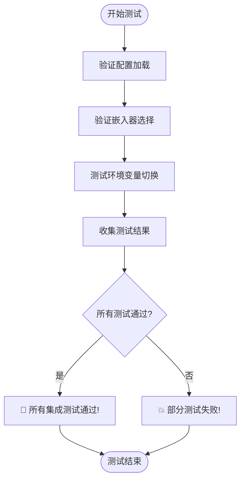
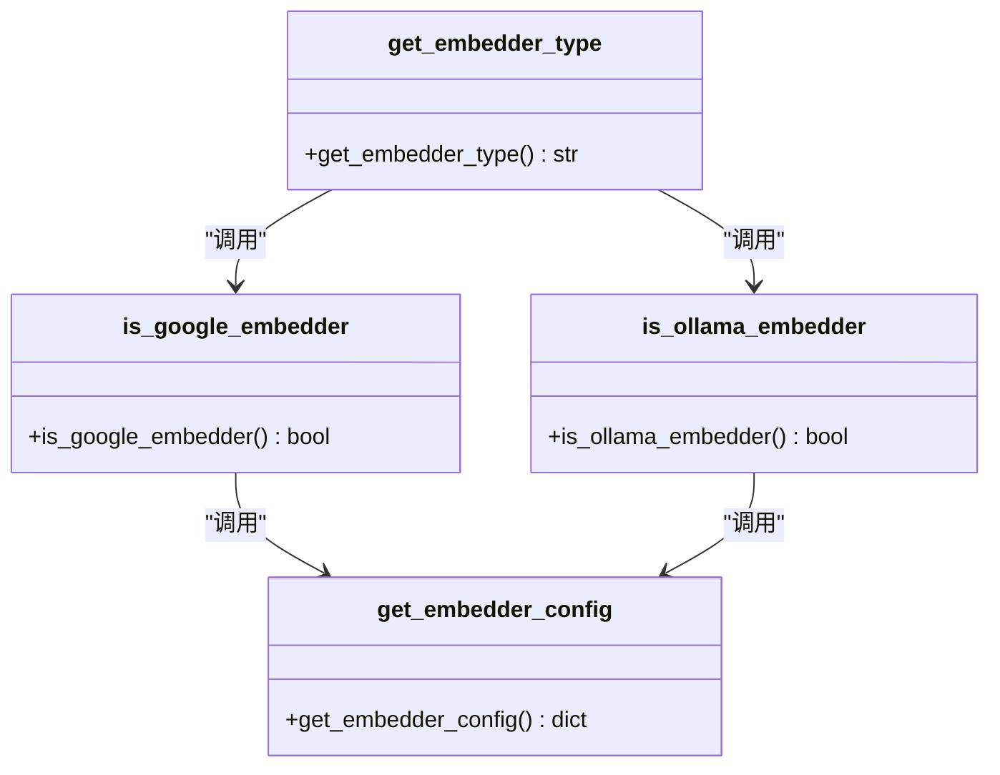
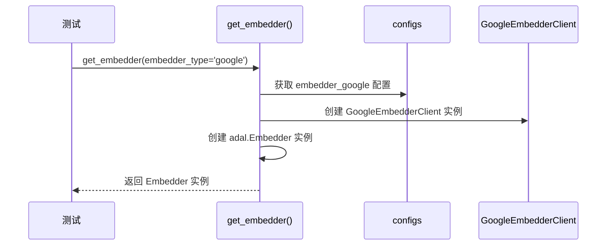

# 集成测试

<cite>
**Referenced Files in This Document**   
- [test_full_integration.py](file://tests/integration/test_full_integration.py)
- [config.py](file://api/config.py)
- [embedder.py](file://api/tools/embedder.py)
- [google_embedder_client.py](file://api/google_embedder_client.py)
- [embedder.json](file://api/config/embedder.json)
</cite>

## 目录
1. [集成测试概述](#集成测试概述)
2. [核心测试流程](#核心测试流程)
3. [配置加载验证](#配置加载验证)
4. [嵌入器选择机制](#嵌入器选择机制)
5. [环境变量切换测试](#环境变量切换测试)
6. [Google AI嵌入器初始化](#google-ai嵌入器初始化)
7. [响应处理验证](#响应处理验证)
8. [新集成测试构建指南](#新集成测试构建指南)
9. [结论](#结论)

## 集成测试概述

`test_full_integration.py`文件实现了对Google AI嵌入服务的完整端到端集成测试策略。该测试套件通过模拟真实的服务调用链路，系统性地验证了从配置加载、嵌入器选择、环境变量切换到实际API调用的整个流程。测试设计旨在确保系统在不同配置模式下能够正确初始化Google AI嵌入器并处理其响应。

测试流程由`main()`函数驱动，依次执行三个核心测试函数：`test_config_loading`、`test_embedder_selection`和`test_google_embedder_with_env`。这种分阶段的测试方法允许开发者逐步验证系统的各个关键组件，从基础配置的正确性到复杂运行时环境变更的处理能力。

**Section sources**
- [test_full_integration.py](file://tests/integration/test_full_integration.py#L115-L151)

## 核心测试流程

集成测试的核心流程遵循一个清晰的验证路径，从静态配置检查开始，逐步过渡到动态运行时行为的测试。测试首先验证配置文件是否正确加载，然后检查嵌入器选择逻辑是否按预期工作，最后通过修改环境变量来模拟运行时配置变更，并验证系统能否正确响应。

测试流程的入口点是`main()`函数，它负责协调所有测试用例的执行。每个测试函数都设计为独立的验证单元，返回布尔值表示测试成功或失败。测试框架会捕获所有异常并提供详细的失败信息，便于快速诊断问题。测试结果以清晰的统计信息呈现，包括总测试数、通过数和最终状态。

**Diagram sources **
- [test_full_integration.py](file://tests/integration/test_full_integration.py#L115-L151)

**Section sources**
- [test_full_integration.py](file://tests/integration/test_full_integration.py#L115-L151)

## 配置加载验证

`test_config_loading`函数负责验证系统配置的正确加载。该测试首先检查`api.config`模块中的`configs`字典是否包含`embedder_google`配置项，这是使用Google AI嵌入器的前提条件。测试还验证`CLIENT_CLASSES`映射中是否注册了`GoogleEmbedderClient`类，确保系统能够正确实例化该客户端。

配置加载是整个系统正常运行的基础。如果`embedder_google`配置缺失，系统将无法使用Google的嵌入服务；如果`GoogleEmbedderClient`未在`CLIENT_CLASSES`中注册，即使配置存在也无法创建客户端实例。该测试通过直接访问配置模块的全局变量来验证这些关键组件的存在性，为后续的集成测试提供了必要的前提保证。

**Section sources**
- [test_full_integration.py](file://tests/integration/test_full_integration.py#L0-L41)

## 嵌入器选择机制

`test_embedder_selection`函数验证了系统的嵌入器选择机制。测试首先调用`get_embedder_type()`函数获取当前的嵌入器类型，然后使用`is_google_embedder()`函数检查当前配置是否指向Google嵌入器。最后，测试通过显式指定`embedder_type='google'`参数来调用`get_embedder()`函数，验证能否成功创建Google嵌入器实例。

嵌入器选择机制依赖于`api.config`模块中的一系列函数。`get_embedder_type()`函数根据`is_ollama_embedder()`和`is_google_embedder()`的返回值来决定当前的嵌入器类型。`is_google_embedder()`函数通过检查`get_embedder_config()`返回的配置中`model_client`是否为`GoogleEmbedderClient`类来判断当前是否使用Google嵌入器。这种分层的判断逻辑确保了配置变更能够被正确传播到整个系统。

**Diagram sources **
- [config.py](file://api/config.py#L214-L226)
- [config.py](file://api/config.py#L194-L212)
- [config.py](file://api/config.py#L174-L192)
- [config.py](file://api/config.py#L159-L172)

**Section sources**
- [test_full_integration.py](file://tests/integration/test_full_integration.py#L43-L70)
- [config.py](file://api/config.py#L159-L226)

## 环境变量切换测试

`test_google_embedder_with_env`函数通过修改`DEEPWIKI_EMBEDDER_TYPE`环境变量来模拟运行时配置变更。测试首先保存原始环境变量值，然后将其设置为`google`，接着使用`importlib.reload()`重新加载`api.config`模块，强制系统重新读取配置。这种技术允许测试验证系统在运行时动态切换嵌入器的能力。

环境变量切换测试是验证系统灵活性和健壮性的关键。它模拟了真实场景中可能发生的配置变更，例如从开发环境切换到生产环境，或在不同部署之间切换服务提供商。测试验证了`get_embedder_config()`函数能够根据新的环境变量值返回正确的配置，并且`get_embedder()`函数能够基于更新后的配置创建相应的嵌入器实例。测试结束后，环境变量会被恢复到原始状态，确保测试的隔离性。

**Section sources**
- [test_full_integration.py](file://tests/integration/test_full_integration.py#L72-L113)

## Google AI嵌入器初始化

Google AI嵌入器的初始化过程由`get_embedder()`函数协调完成。当`embedder_type`参数设置为`google`时，函数会从`configs`字典中获取`embedder_google`配置。该配置包含`client_class`字段，其值为`GoogleEmbedderClient`，指向具体的客户端实现类。

初始化过程首先根据配置中的`client_class`获取对应的类，然后检查是否存在`initialize_kwargs`。如果存在，这些参数将被传递给类的构造函数；否则，将使用默认构造函数创建客户端实例。随后，`get_embedder()`函数使用客户端实例和`model_kwargs`创建一个`adal.Embedder`对象。`embedder.json`配置文件中还指定了`batch_size`为100，该值会被设置为`Embedder`对象的属性，影响批处理行为。

**Diagram sources **
- [embedder.py](file://api/tools/embedder.py#L5-L53)
- [embedder.json](file://api/config/embedder.json#L14-L20)

**Section sources**
- [embedder.py](file://api/tools/embedder.py#L5-L53)
- [embedder.json](file://api/config/embedder.json#L14-L20)

## 响应处理验证

`GoogleEmbedderClient`类负责处理来自Google AI API的原始响应。`call()`方法负责发起API调用，支持单个文本（通过`content`参数）和批量文本（通过`contents`参数）的嵌入请求。该方法使用`backoff`库实现指数退避重试机制，以应对网络不稳定或API限流等临时性故障。

`parse_embedding_response()`方法是响应处理的核心，它将Google AI API返回的原始响应转换为统一的`EmbedderOutput`格式。该方法能够处理多种响应格式，包括单个嵌入（`{'embedding': [float, ...]}`）、批量嵌入（`{'embedding': [[float, ...], [float, ...]]}`）和另一种批量格式（`{'embeddings': [{'embedding': [float, ...]}, ...]}`）。转换后的`EmbedderOutput`对象包含`data`（嵌入数据列表）、`error`（错误信息）和`raw_response`（原始响应）三个字段，为上层应用提供了结构化的数据访问接口。

**Section sources**
- [google_embedder_client.py](file://api/google_embedder_client.py#L19-L230)

## 新集成测试构建指南

构建新的集成测试应遵循`test_full_integration.py`中确立的模式。首先，测试应从验证基础配置开始，确保所有必要的依赖项都已正确加载。其次，测试应模拟真实的使用场景，通过调用高层API来验证跨组件的数据流。对于涉及外部服务的测试，应使用环境变量来控制服务选择，并在测试前后妥善管理这些变量的状态。

测试代码应保持高可读性和自解释性。使用清晰的打印语句（如`print("🔧 Testing...")`）来标记测试阶段，有助于在测试失败时快速定位问题。每个测试函数应尽可能独立，返回布尔值表示成功或失败，并捕获所有可能的异常以提供详细的错误信息。对于需要重载模块以反映配置变更的场景，应使用`importlib.reload()`并确保在`finally`块中恢复任何修改的环境变量。

**Section sources**
- [test_full_integration.py](file://tests/integration/test_full_integration.py#L0-L151)

## 结论

`test_full_integration.py`提供了一个全面的集成测试框架，有效验证了系统与Google AI嵌入服务的集成。测试策略覆盖了从配置加载到API调用的完整链路，特别强调了通过环境变量动态切换运行时配置的能力。通过分阶段的测试设计和详细的诊断输出，该测试套件为系统的稳定性和可靠性提供了强有力的保障。遵循此测试模式构建新的集成测试，可以确保新功能和配置变更在部署前得到充分验证。