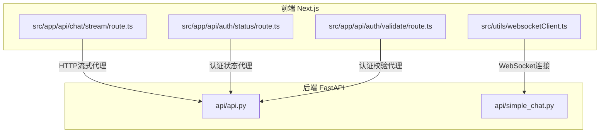
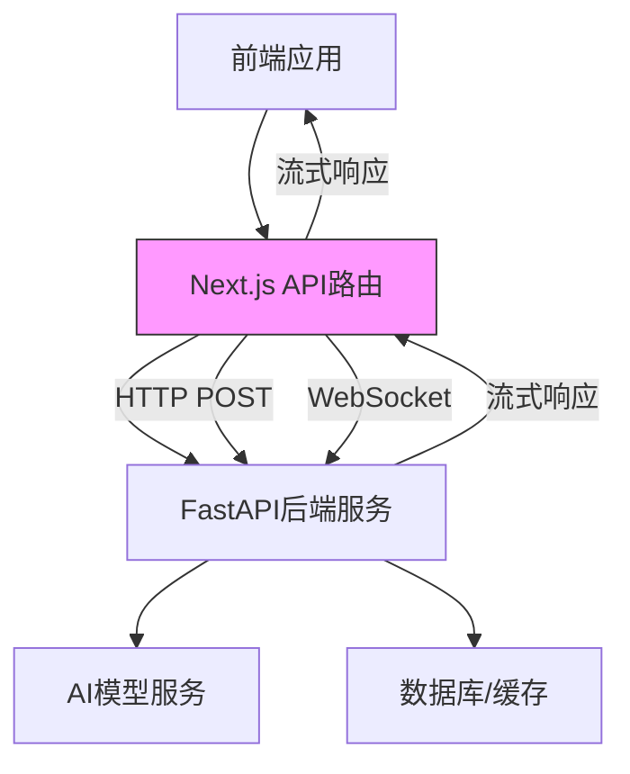
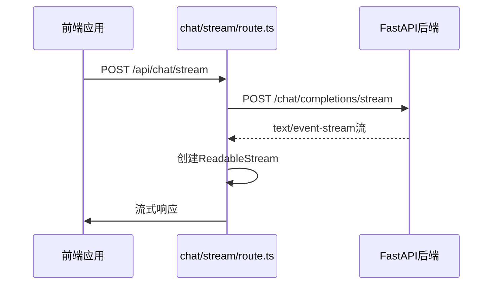
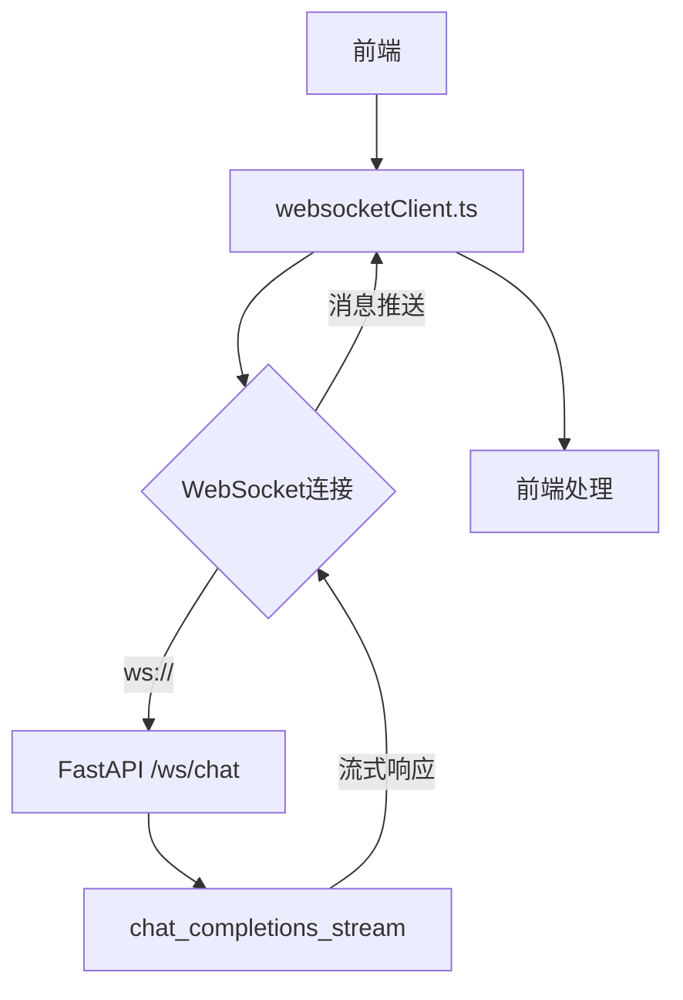
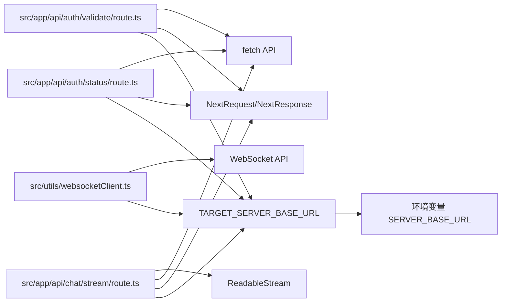

# API路由代理

<cite>
**本文档中引用的文件**  
- [chat/stream/route.ts](file://src/app/api/chat/stream/route.ts)
- [auth/status/route.ts](file://src/app/api/auth/status/route.ts)
- [auth/validate/route.ts](file://src/app/api/auth/validate/route.ts)
- [api.py](file://api/api.py)
- [simple_chat.py](file://api/simple_chat.py)
- [websocketClient.ts](file://src/utils/websocketClient.ts)
</cite>

## 目录
1. [项目结构](#项目结构)
2. [核心组件](#核心组件)
3. [架构概述](#架构概述)
4. [详细组件分析](#详细组件分析)
5. [依赖分析](#依赖分析)

## 项目结构

本项目采用前后端分离架构，前端基于Next.js构建，后端使用FastAPI实现。核心API代理逻辑位于`src/app/api`目录下，作为前端与后端服务之间的中间层。



**Diagram sources**
- [src/app/api/chat/stream/route.ts](file://src/app/api/chat/stream/route.ts)
- [src/app/api/auth/status/route.ts](file://src/app/api/auth/status/route.ts)
- [src/app/api/auth/validate/route.ts](file://src/app/api/auth/validate/route.ts)
- [src/utils/websocketClient.ts](file://src/utils/websocketClient.ts)
- [api/api.py](file://api/api.py)
- [api/simple_chat.py](file://api/simple_chat.py)

**Section sources**
- [src/app/api/chat/stream/route.ts](file://src/app/api/chat/stream/route.ts)
- [src/app/api/auth/status/route.ts](file://src/app/api/auth/status/route.ts)
- [src/app/api/auth/validate/route.ts](file://src/app/api/auth/validate/route.ts)
- [api/api.py](file://api/api.py)
- [api/simple_chat.py](file://api/simple_chat.py)

## 核心组件

Next.js的API路由在本项目中扮演着关键的代理角色，主要功能包括：
- 请求转发：将前端请求代理至后端FastAPI服务
- 流式处理：处理SSE（Server-Sent Events）流式响应
- 认证管理：实现认证状态检查和验证
- 跨域处理：通过CORS配置解决跨域问题
- 错误拦截：统一处理后端服务异常

这些路由处理器作为中间层，有效解耦了前端应用与后端服务，提供了请求预处理、错误处理和协议转换的能力。

**Section sources**
- [src/app/api/chat/stream/route.ts](file://src/app/api/chat/stream/route.ts)
- [src/app/api/auth/status/route.ts](file://src/app/api/auth/status/route.ts)
- [src/app/api/auth/validate/route.ts](file://src/app/api/auth/validate/route.ts)

## 架构概述

系统采用分层架构设计，Next.js API路由层作为中间代理，连接前端应用与后端FastAPI服务。



**Diagram sources**
- [src/app/api/chat/stream/route.ts](file://src/app/api/chat/stream/route.ts)
- [src/app/api/auth/status/route.ts](file://src/app/api/auth/status/route.ts)
- [src/app/api/auth/validate/route.ts](file://src/app/api/auth/validate/route.ts)
- [api/api.py](file://api/api.py)

## 详细组件分析

### chat/stream路由分析

`chat/stream/route.ts`文件实现了HTTP流式响应的代理功能，处理客户端与后端之间的流式通信。



该路由处理器通过`ReadableStream`创建流式响应，将后端返回的SSE流直接转发给前端，同时处理错误情况和连接关闭。

**Diagram sources**
- [src/app/api/chat/stream/route.ts](file://src/app/api/chat/stream/route.ts)
- [api/simple_chat.py](file://api/simple_chat.py)

**Section sources**
- [src/app/api/chat/stream/route.ts](file://src/app/api/chat/stream/route.ts)

### WebSocket连接分析

虽然`chat/stream/route.ts`使用HTTP流作为备用方案，但主要的实时通信通过WebSocket实现。



`websocketClient.ts`文件负责建立和管理WebSocket连接，提供创建、发送、接收和关闭连接的功能。

**Diagram sources**
- [src/utils/websocketClient.ts](file://src/utils/websocketClient.ts)
- [api/simple_chat.py](file://api/simple_chat.py)

**Section sources**
- [src/utils/websocketClient.ts](file://src/utils/websocketClient.ts)

### 认证状态校验分析

`auth/status`和`auth/validate`路由处理器实现了认证相关的功能。

```mermaid
classDiagram
class AuthStatusRoute {
+GET /auth/status
+返回{auth_required : boolean}
}
class AuthValidateRoute {
+POST /auth/validate
+接收AuthorizationConfig
+返回{success : boolean}
}
class BackendAuth {
+get_auth_status()
+validate_auth_code()
+WIKI_AUTH_MODE
+WIKI_AUTH_CODE
}
AuthStatusRoute --> BackendAuth : 代理
AuthValidateRoute --> BackendAuth : 代理
```

`auth/status/route.ts`检查系统是否需要认证，而`auth/validate/route.ts`验证提供的授权码是否正确。

**Diagram sources**
- [src/app/api/auth/status/route.ts](file://src/app/api/auth/status/route.ts)
- [src/app/api/auth/validate/route.ts](file://src/app/api/auth/validate/route.ts)
- [api/api.py](file://api/api.py)

**Section sources**
- [src/app/api/auth/status/route.ts](file://src/app/api/auth/status/route.ts)
- [src/app/api/auth/validate/route.ts](file://src/app/api/auth/validate/route.ts)

## 依赖分析



Next.js API路由依赖于环境变量`SERVER_BASE_URL`来确定后端服务地址，若未设置则默认指向`http://localhost:8001`。各路由处理器均使用Next.js提供的`NextRequest`和`NextResponse`进行请求处理，并通过`fetch` API与后端服务通信。

**Diagram sources**
- [src/app/api/chat/stream/route.ts](file://src/app/api/chat/stream/route.ts)
- [src/app/api/auth/status/route.ts](file://src/app/api/auth/status/route.ts)
- [src/app/api/auth/validate/route.ts](file://src/app/api/auth/validate/route.ts)
- [src/utils/websocketClient.ts](file://src/utils/websocketClient.ts)

**Section sources**
- [src/app/api/chat/stream/route.ts](file://src/app/api/chat/stream/route.ts)
- [src/app/api/auth/status/route.ts](file://src/app/api/auth/status/route.ts)
- [src/app/api/auth/validate/route.ts](file://src/app/api/auth/validate/route.ts)
- [src/utils/websocketClient.ts](file://src/utils/websocketClient.ts)