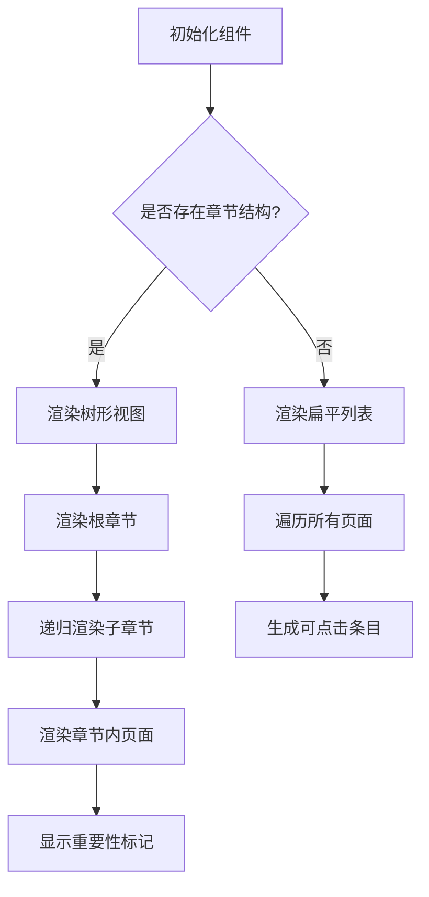
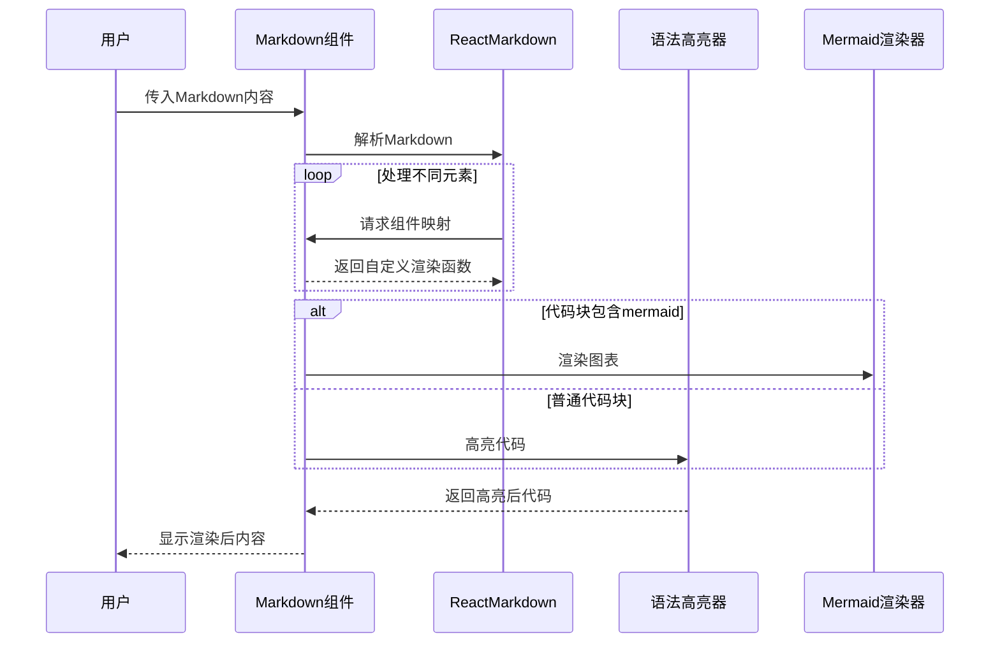
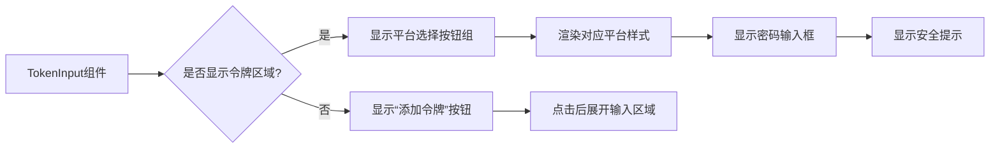
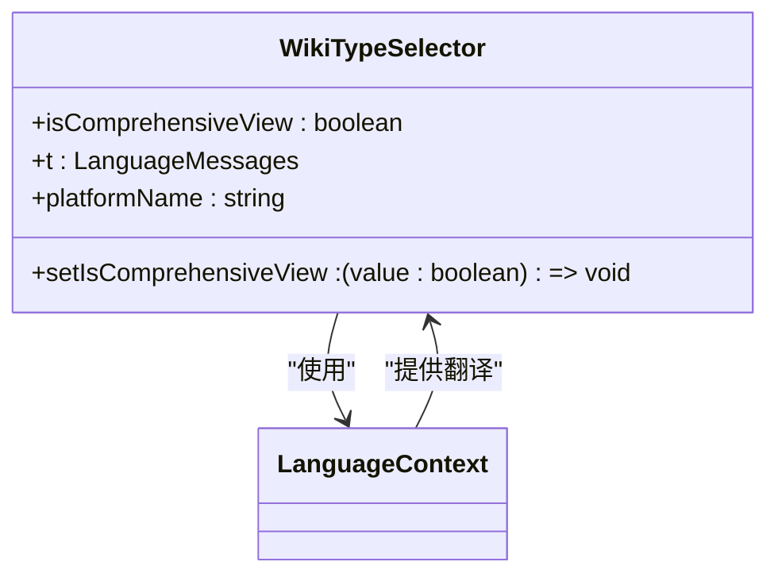
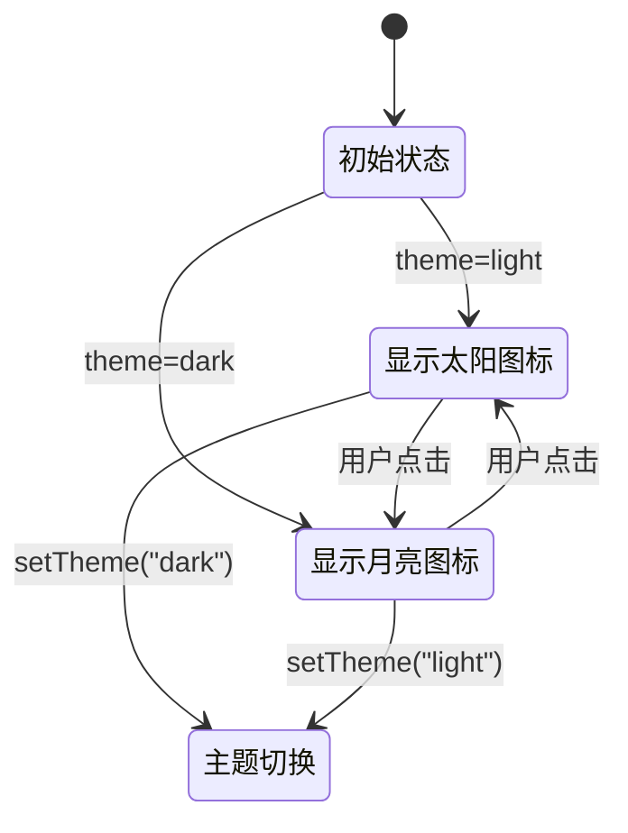

# UI组件体系

<cite>
**本文档中引用的文件**  
- [WikiTreeView.tsx](file://src/components/WikiTreeView.tsx)
- [Markdown.tsx](file://src/components/Markdown.tsx)
- [TokenInput.tsx](file://src/components/TokenInput.tsx)
- [WikiTypeSelector.tsx](file://src/components/WikiTypeSelector.tsx)
- [theme-toggle.tsx](file://src/components/theme-toggle.tsx)
</cite>

## 目录
1. [简介](#简介)
2. [核心组件分析](#核心组件分析)
3. [组件属性与接口](#组件属性与接口)
4. [事件回调机制](#事件回调机制)
5. [样式定制方法](#样式定制方法)
6. [集成示例](#集成示例)
7. [总结](#总结)

## 简介
本文档深入介绍前端UI组件库的设计与实现，重点分析`WikiTreeView.tsx`如何构建可交互的维基文档树形导航结构，`Markdown.tsx`如何安全渲染LLM生成的Markdown内容，`TokenInput.tsx`如何处理API密钥等敏感输入。说明`WikiTypeSelector.tsx`在文档类型切换中的作用，以及`theme-toggle.tsx`如何实现亮暗主题切换。

## 核心组件分析

### WikiTreeView 组件分析
`WikiTreeView`组件用于构建可交互的维基文档树形导航结构，支持多级嵌套的章节与页面展示。该组件通过递归渲染实现树形结构的展开与折叠功能，用户可点击章节标题切换展开状态。

组件根据`wikiStructure`数据结构动态生成导航树，支持高亮当前选中页面，并通过颜色标记页面重要性等级（高、中、低）。当未定义章节结构时，自动回退到扁平化列表视图。



**图示来源**  
- [WikiTreeView.tsx](file://src/components/WikiTreeView.tsx#L44-L181)

**章节来源**  
- [WikiTreeView.tsx](file://src/components/WikiTreeView.tsx#L1-L183)

### Markdown 组件分析
`Markdown`组件负责安全渲染由LLM生成的Markdown内容，支持标准Markdown语法及扩展功能（如表格、任务列表）。组件集成`react-markdown`和`remark-gfm`，并通过`rehype-raw`允许原始HTML解析。

特别地，该组件支持Mermaid图表渲染和代码块语法高亮（使用Prism），并为ReAct推理模式的标题（Thought/Action/Observation/Answer）提供特殊样式。所有代码块均提供一键复制功能。



**图示来源**  
- [Markdown.tsx](file://src/components/Markdown.tsx#L12-L205)

**章节来源**  
- [Markdown.tsx](file://src/components/Markdown.tsx#L1-L207)

### TokenInput 组件分析
`TokenInput`组件用于处理GitHub、GitLab、Bitbucket等平台的API密钥输入，支持平台选择与密钥安全输入。组件采用密码输入框防止明文显示，并提供安全提示说明令牌仅存储于本地。

该组件支持动态切换显示/隐藏令牌输入区域，允许用户选择目标平台，并根据选择的平台动态更新标签文本。所有文本内容通过国际化上下文获取，支持多语言。



**图示来源**  
- [TokenInput.tsx](file://src/components/TokenInput.tsx#L15-L107)

**章节来源**  
- [TokenInput.tsx](file://src/components/TokenInput.tsx#L1-L107)

### WikiTypeSelector 组件分析
`WikiTypeSelector`组件提供文档类型切换功能，允许用户在“综合视图”与“简洁视图”之间切换。组件通过两个可点击的选项卡实现交互，选中状态通过视觉反馈（边框、背景色、选中标记）清晰呈现。

该组件使用图标辅助说明（书本代表综合，列表代表简洁），并提供简短描述帮助用户理解两种模式的区别。所有文本内容支持国际化，通过`LanguageContext`获取对应语言的翻译。



**图示来源**  
- [WikiTypeSelector.tsx](file://src/components/WikiTypeSelector.tsx#L11-L75)

**章节来源**  
- [WikiTypeSelector.tsx](file://src/components/WikiTypeSelector.tsx#L1-L78)

### theme-toggle 组件分析
`theme-toggle`组件实现亮暗主题切换功能，基于`next-themes`库管理主题状态。组件通过按钮触发主题切换，内部使用SVG图标表示太阳（亮色）与月亮（暗色），并通过CSS过渡实现平滑的图标切换动画。

该组件采用绝对定位的双图层设计，通过控制不透明度实现图标淡入淡出效果。所有样式使用CSS变量，确保与整体设计系统的一致性。点击事件处理函数简洁高效，直接调用`setTheme`切换主题。



**图示来源**  
- [theme-toggle.tsx](file://src/components/theme-toggle.tsx#L4-L48)

**章节来源**  
- [theme-toggle.tsx](file://src/components/theme-toggle.tsx#L1-L49)

## 组件属性与接口

### WikiTreeView 属性接口
```typescript
interface WikiTreeViewProps {
  wikiStructure: WikiStructure;
  currentPageId: string | undefined;
  onPageSelect: (pageId: string) => void;
  messages?: {
    pages?: string;
    [key: string]: string | undefined;
  };
}
```

### Markdown 属性接口
```typescript
interface MarkdownProps {
  content: string;
}
```

### TokenInput 属性接口
```typescript
interface TokenInputProps {
  selectedPlatform: 'github' | 'gitlab' | 'bitbucket';
  setSelectedPlatform: (value: 'github' | 'gitlab' | 'bitbucket') => void;
  accessToken: string;
  setAccessToken: (value: string) => void;
  showTokenSection?: boolean;
  onToggleTokenSection?: () => void;
  allowPlatformChange?: boolean;
}
```

### WikiTypeSelector 属性接口
```typescript
interface WikiTypeSelectorProps {
  isComprehensiveView: boolean;
  setIsComprehensiveView: (value: boolean) => void;
}
```

**章节来源**  
- [WikiTreeView.tsx](file://src/components/WikiTreeView.tsx#L30-L42)
- [Markdown.tsx](file://src/components/Markdown.tsx#L10-L11)
- [TokenInput.tsx](file://src/components/TokenInput.tsx#L5-L14)
- [WikiTypeSelector.tsx](file://src/components/WikiTypeSelector.tsx#L9-L10)

## 事件回调机制

### 页面选择回调
`WikiTreeView`通过`onPageSelect`回调通知父组件页面选择变化，参数为被选中页面的ID。

### 平台切换回调
`TokenInput`通过`setSelectedPlatform`回调更新当前选择的平台，支持GitHub、GitLab、Bitbucket三种选项。

### 视图模式回调
`WikiTypeSelector`通过`setIsComprehensiveView`回调通知视图模式变化，参数为布尔值（true表示综合视图，false表示简洁视图）。

### 主题切换回调
`theme-toggle`内部使用`useTheme`的`setTheme`函数实现主题切换，无需外部回调。

**章节来源**  
- [WikiTreeView.tsx](file://src/components/WikiTreeView.tsx#L44-L181)
- [TokenInput.tsx](file://src/components/TokenInput.tsx#L15-L107)
- [WikiTypeSelector.tsx](file://src/components/WikiTypeSelector.tsx#L11-L75)
- [theme-toggle.tsx](file://src/components/theme-toggle.tsx#L4-L48)

## 样式定制方法

### CSS变量使用
所有组件使用CSS变量进行样式定义，包括：
- `--foreground`: 前景色
- `--background`: 背景色
- `--accent-primary`: 主要强调色
- `--border-color`: 边框颜色
- `--muted`: 弱化文本色

### Tailwind CSS集成
组件基于Tailwind CSS框架构建，结合`className`属性实现响应式设计与状态样式（hover、focus等）。

### 主题感知样式
通过`dark:`前缀类名实现暗色主题适配，确保在不同主题下均有良好视觉效果。

**章节来源**  
- [WikiTreeView.tsx](file://src/components/WikiTreeView.tsx#L44-L181)
- [Markdown.tsx](file://src/components/Markdown.tsx#L12-L205)
- [TokenInput.tsx](file://src/components/TokenInput.tsx#L15-L107)
- [WikiTypeSelector.tsx](file://src/components/WikiTypeSelector.tsx#L11-L75)
- [theme-toggle.tsx](file://src/components/theme-toggle.tsx#L4-L48)

## 集成示例

### 基本集成结构
```tsx
<WikiTypeSelector 
  isComprehensiveView={isComprehensive} 
  setIsComprehensiveView={setIsComprehensive} 
/>
<WikiTreeView 
  wikiStructure={wikiData} 
  currentPageId={currentId} 
  onPageSelect={handlePageSelect} 
/>
<Markdown content={currentPageContent} />
<TokenInput 
  selectedPlatform={platform} 
  setSelectedPlatform={setPlatform} 
  accessToken={token} 
  setAccessToken={setToken} 
/>
<ThemeToggle />
```

### 状态管理集成
组件间通过React状态（useState）和回调函数进行通信，形成完整的工作流。

**章节来源**  
- [WikiTreeView.tsx](file://src/components/WikiTreeView.tsx#L44-L181)
- [Markdown.tsx](file://src/components/Markdown.tsx#L12-L205)
- [TokenInput.tsx](file://src/components/TokenInput.tsx#L15-L107)
- [WikiTypeSelector.tsx](file://src/components/WikiTypeSelector.tsx#L11-L75)
- [theme-toggle.tsx](file://src/components/theme-toggle.tsx#L4-L48)

## 总结
本文档详细分析了前端UI组件库的核心组件，包括树形导航、Markdown渲染、敏感信息输入、视图切换和主题管理等功能。各组件设计遵循可复用、可定制、可访问的原则，通过清晰的属性接口和事件回调机制实现灵活集成。