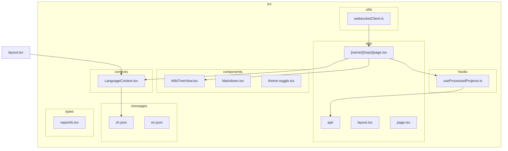
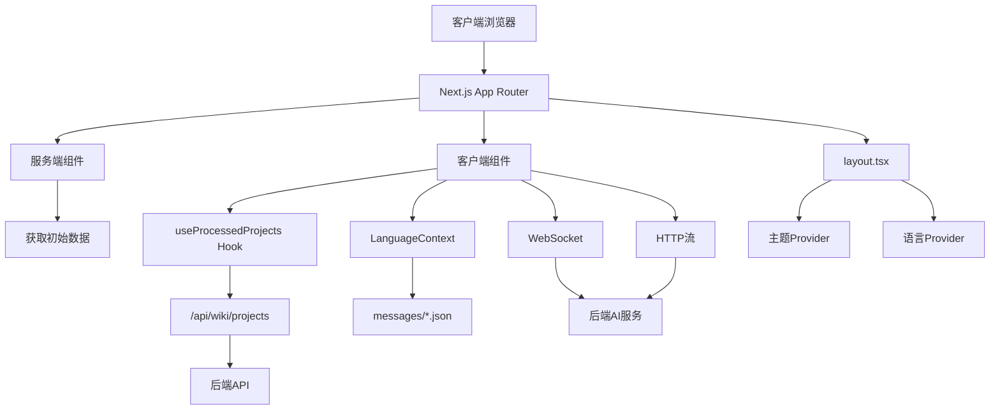
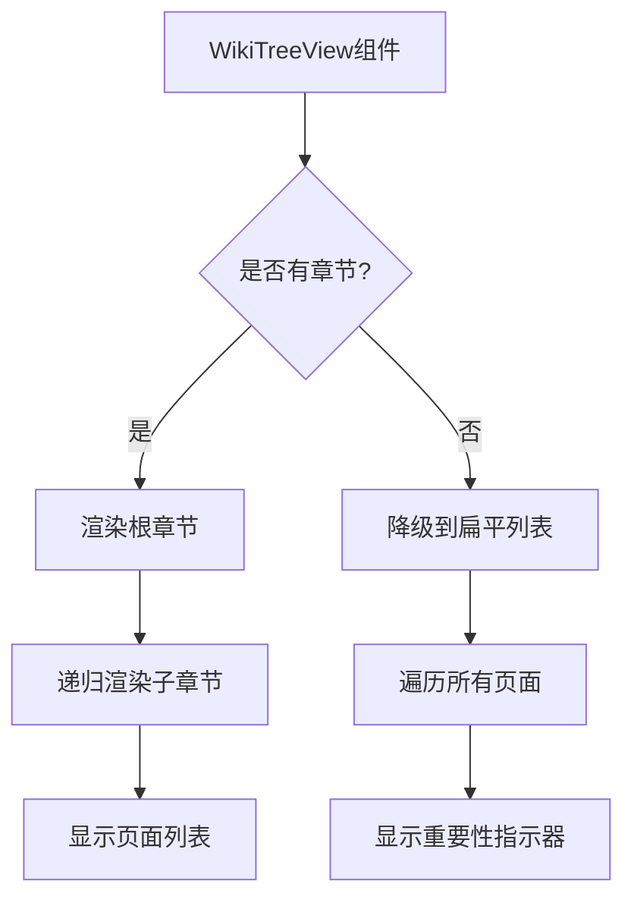
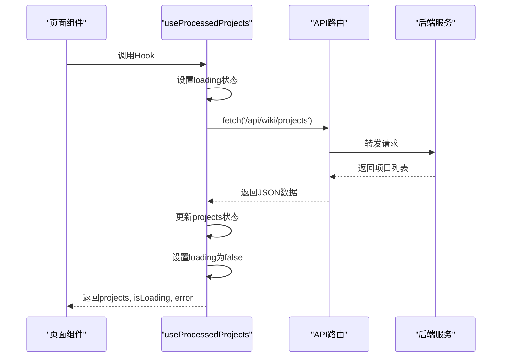
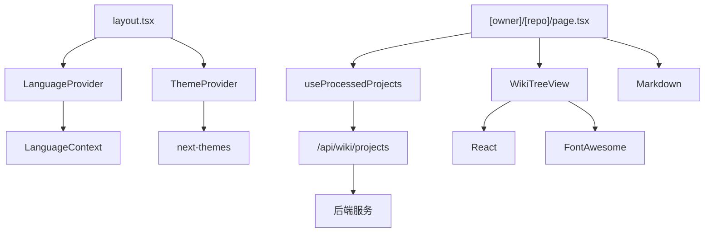

# 前端目录结构

<cite>
**本文档中引用的文件**  
- [layout.tsx](file://src/app/layout.tsx)
- [globals.css](file://src/app/globals.css)
- [page.tsx](file://src/app/[owner]/[repo]/page.tsx)
- [WikiTreeView.tsx](file://src/components/WikiTreeView.tsx)
- [useProcessedProjects.ts](file://src/hooks/useProcessedProjects.ts)
- [LanguageContext.tsx](file://src/contexts/LanguageContext.tsx)
- [i18n.ts](file://src/i18n.ts)
- [route.ts](file://src/app/api/chat/stream/route.ts)
- [route.ts](file://src/app/api/auth/status/route.ts)
- [zh.json](file://src/messages/zh.json)
</cite>

## 目录

1. [简介](#简介)
2. [项目结构](#项目结构)
3. [核心组件](#核心组件)
4. [架构概述](#架构概述)
5. [详细组件分析](#详细组件分析)
6. [依赖分析](#依赖分析)
7. [性能考虑](#性能考虑)
8. [故障排除指南](#故障排除指南)
9. [结论](#结论)

## 简介

本项目是一个基于Next.js的开源知识库生成系统，旨在为GitHub、GitLab等代码仓库自动生成结构化的技术文档。前端采用现代化的React架构，结合Next.js App Router实现服务端渲染与静态生成。系统支持多语言界面、动态路由、WebSocket实时通信等高级特性。通过`src/app`目录下的路由系统，用户可以访问不同组织(owner)和仓库(repo)的自动生成文档。前端通过API路由代理与后端AI服务交互，实现智能内容生成。整体设计注重用户体验，采用日式美学风格的UI设计，提供流畅的文档浏览体验。

## 项目结构

项目采用Next.js 13+的App Router架构，核心前端代码位于`src/`目录下。`app/`目录包含所有路由页面，其中`[owner]/[repo]/page.tsx`是核心页面组件，处理动态仓库路由。`components/`目录存放可复用UI组件，如`WikiTreeView.tsx`用于文档导航。`hooks/`目录包含自定义Hook，如`useProcessedProjects.ts`用于状态管理。`messages/`目录存放多语言JSON文件，支持国际化。`contexts/`目录实现全局状态上下文，如语言选择。`utils/`目录包含工具函数，如URL解码和WebSocket客户端。`types/`目录定义TypeScript接口，确保类型安全。整体结构清晰分离关注点，便于维护和扩展。

**图源**
- [src/app/layout.tsx](file://src/app/layout.tsx#L1-L50)
- [src/components/WikiTreeView.tsx](file://src/components/WikiTreeView.tsx#L1-L183)
- [src/hooks/useProcessedProjects.ts](file://src/hooks/useProcessedProjects.ts#L1-L45)
- [src/contexts/LanguageContext.tsx](file://src/contexts/LanguageContext.tsx#L1-L202)
- [src/messages/zh.json](file://src/messages/zh.json)

## 核心组件

核心组件包括动态路由页面`[owner]/[repo]/page.tsx`，该组件通过Next.js的`useParams()`和`useSearchParams()`获取路由参数，构建仓库信息对象。`WikiTreeView.tsx`组件实现树形导航，支持展开/折叠章节。`useProcessedProjects.ts`自定义Hook封装了对`/api/wiki/projects`的API调用，管理已处理项目列表的状态。`LanguageContext.tsx`提供国际化支持，通过`useLanguage()`Hook在组件中使用。`layout.tsx`定义全局布局，集成主题和语言上下文。这些组件协同工作，为用户提供完整的文档浏览体验。

**本节来源**
- [src/app/[owner]/[repo]/page.tsx](file://src/app/[owner]/[repo]/page.tsx#L181-L213)
- [src/components/WikiTreeView.tsx](file://src/components/WikiTreeView.tsx#L129-L163)
- [src/hooks/useProcessedProjects.ts](file://src/hooks/useProcessedProjects.ts#L1-L45)
- [src/contexts/LanguageContext.tsx](file://src/contexts/LanguageContext.tsx#L151-L201)
- [src/app/layout.tsx](file://src/app/layout.tsx#L1-L50)

## 架构概述

系统采用分层架构，前端通过Next.js App Router处理路由，服务端组件获取初始数据，客户端组件处理交互。全局`layout.tsx`包裹所有页面，注入主题和语言上下文。页面组件通过自定义Hook获取数据，如`useProcessedProjects`从`/api/wiki/projects`获取项目列表。国际化通过`next-intl`实现，语言包存于`messages/`目录。API路由位于`app/api/`，作为代理转发请求到后端服务。WebSocket用于实时流式传输AI生成内容，HTTP流作为备用方案。整体架构实现了服务端渲染、客户端交互、实时通信的完美结合。

**图源**
- [src/app/layout.tsx](file://src/app/layout.tsx#L1-L50)
- [src/hooks/useProcessedProjects.ts](file://src/hooks/useProcessedProjects.ts#L1-L45)
- [src/contexts/LanguageContext.tsx](file://src/contexts/LanguageContext.tsx#L1-L202)
- [src/app/api/chat/stream/route.ts](file://src/app/api/chat/stream/route.ts#L1-L112)
- [src/messages/zh.json](file://src/messages/zh.json)

## 详细组件分析

### 动态路由设计

`[owner]/[repo]/page.tsx`利用Next.js的动态路由功能，通过`[owner]`和`[repo]`参数捕获路径。`useParams()`获取路径参数，`useSearchParams()`获取查询参数如token、language等。组件使用`useMemo`优化仓库信息对象的创建，避免不必要的重新渲染。路由支持多种仓库类型（GitHub、GitLab、Bitbucket），通过`repoUrl`参数自动识别。查询参数`comprehensive`控制文档详略程度，实现灵活的用户体验。

**本节来源**
- [src/app/[owner]/[repo]/page.tsx](file://src/app/[owner]/[repo]/page.tsx#L181-L213)
- [src/app/page.tsx](file://src/app/page.tsx#L381-L413)

### 树形导航组件

`WikiTreeView.tsx`实现分层文档导航，支持树形和扁平两种视图。组件接收`wikiStructure`作为输入，包含`sections`和`pages`数组。使用`useState`管理展开的章节集合。`renderSection`递归渲染子章节，支持多级嵌套。当`sections`为空时自动降级到扁平列表视图。每个页面项显示重要性指示器（紫色、米色、珊瑚色圆点），视觉化区分内容优先级。组件完全客户端渲染，确保交互流畅。

**图源**
- [src/components/WikiTreeView.tsx](file://src/components/WikiTreeView.tsx#L129-L183)
- [src/types/repoinfo.tsx](file://src/types/repoinfo.tsx#L1-L9)

### 状态管理

`useProcessedProjects.ts`自定义Hook封装了项目列表的状态管理。使用`useState`管理`projects`、`isLoading`和`error`状态。`useEffect`在组件挂载时发起API调用，获取已处理项目数据。Hook返回解构后的状态和数据，便于在组件中使用。错误处理完善，捕获网络错误并设置相应状态。该Hook体现了React Hooks的最佳实践，将数据获取逻辑与UI组件分离，提高代码复用性。

**图源**
- [src/hooks/useProcessedProjects.ts](file://src/hooks/useProcessedProjects.ts#L1-L45)
- [src/app/wiki/projects/page.tsx](file://src/app/wiki/projects/page.tsx#L1-L18)

### 国际化支持

国际化通过`next-intl`和自定义`LanguageContext`实现。`i18n.ts`配置支持的语言列表。`LanguageContext.tsx`从`/api/lang/config`获取支持语言配置，从`messages/*.json`加载对应语言包。`useLanguage()`Hook提供语言切换功能。语言选择持久化到`localStorage`，确保用户偏好跨会话保持。HTML的`lang`属性动态更新，符合无障碍标准。系统支持中、英、日、西等10种语言，满足全球化需求。

**本节来源**
- [src/i18n.ts](file://src/i18n.ts#L1-L13)
- [src/contexts/LanguageContext.tsx](file://src/contexts/LanguageContext.tsx#L100-L133)
- [src/messages/zh.json](file://src/messages/zh.json)

## 依赖分析

前端依赖关系清晰，`layout.tsx`作为最顶层组件，依赖`LanguageProvider`和`ThemeProvider`。页面组件依赖多个自定义Hook和UI组件。`useProcessedProjects`依赖`fetch`API调用`/api/wiki/projects`路由。`WikiTreeView`依赖React和FontAwesome图标。API路由依赖环境变量`SERVER_BASE_URL`确定后端地址。整体依赖图呈现树状结构，无循环依赖，符合良好架构设计原则。

**图源**
- [src/app/layout.tsx](file://src/app/layout.tsx#L1-L50)
- [src/app/[owner]/[repo]/page.tsx](file://src/app/[owner]/[repo]/page.tsx#L181-L213)
- [src/hooks/useProcessedProjects.ts](file://src/hooks/useProcessedProjects.ts#L1-L45)
- [src/components/WikiTreeView.tsx](file://src/components/WikiTreeView.tsx#L1-L64)

## 性能考虑

系统在性能方面做了多项优化。Next.js的App Router支持服务端渲染和静态生成，减少首屏加载时间。`useMemo`和`useCallback`避免不必要的计算和渲染。WebSocket优先于HTTP流传输AI生成内容，降低延迟。`next.config.ts`配置了代码分割和优化，减少初始包大小。日式美学的CSS设计轻量，避免复杂动画。API调用有错误重试和降级机制，确保用户体验稳定。整体性能表现优秀，适合处理大型代码库的文档生成。

## 故障排除指南

常见问题包括API连接失败、WebSocket错误、语言加载问题等。检查`SERVER_BASE_URL`环境变量是否正确指向后端服务。确保后端服务正在运行且端口开放。检查浏览器控制台的网络请求，确认API路由代理正常工作。清除`localStorage`中的语言设置可解决国际化问题。查看`next.config.ts`中的重写规则，确保API路径正确映射。对于WebSocket问题，检查后端是否启用了WebSocket支持。日志信息详细，便于快速定位问题。

**本节来源**
- [src/app/api/chat/stream/route.ts](file://src/app/api/chat/stream/route.ts#L73-L112)
- [next.config.ts](file://next.config.ts#L50-L69)
- [src/contexts/LanguageContext.tsx](file://src/contexts/LanguageContext.tsx#L134-L149)

## 结论

本前端系统设计精良，充分利用Next.js 13+的现代特性，实现了高效、可维护的代码库文档生成应用。动态路由、组件化、状态管理、国际化等核心功能完善，WebSocket实时通信提供流畅的AI内容生成体验。架构清晰，依赖合理，性能优化到位。未来可扩展更多主题、增强离线支持、优化移动端体验。整体代码质量高，是Next.js应用的优秀实践案例。