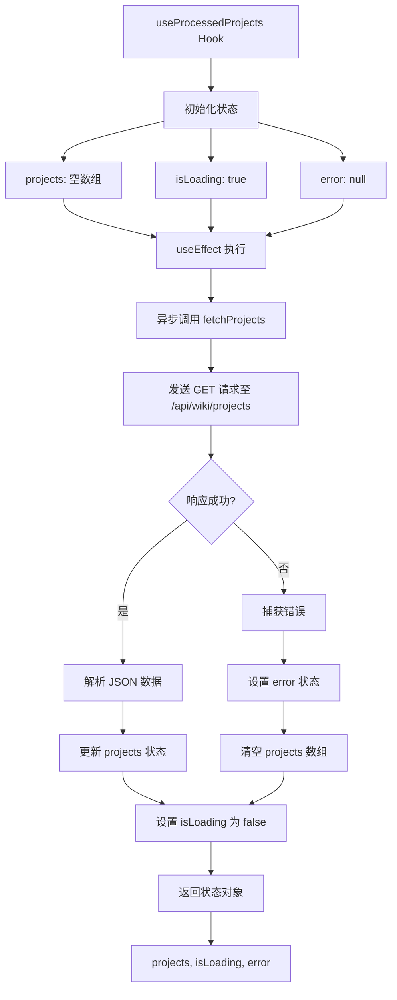
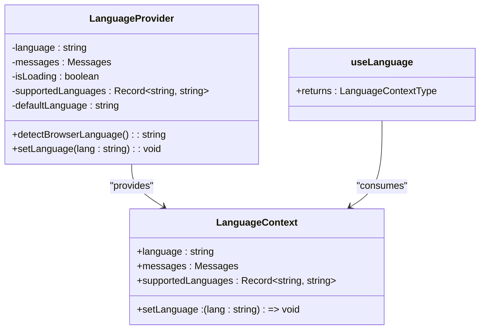
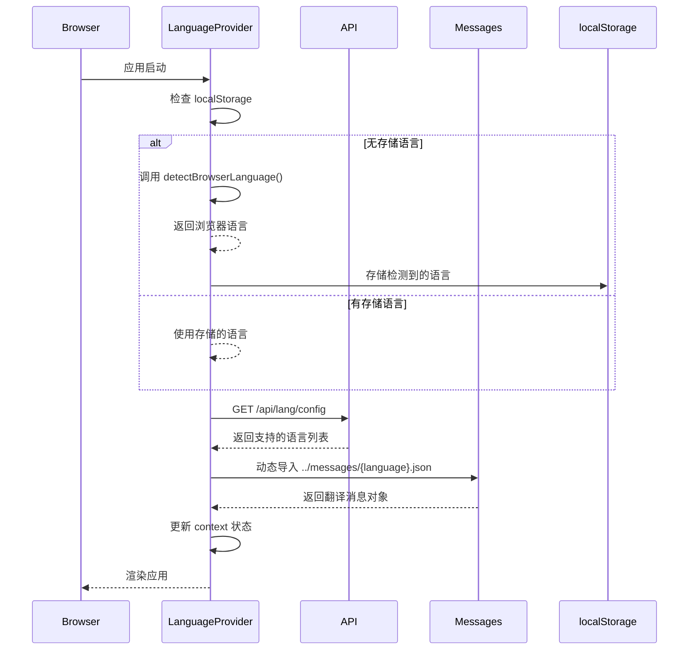

# 状态管理与国际化

<cite>
**Referenced Files in This Document**   
- [useProcessedProjects.ts](file://src/hooks/useProcessedProjects.ts)
- [LanguageContext.tsx](file://src/contexts/LanguageContext.tsx)
- [i18n.ts](file://src/i18n.ts)
- [repoinfo.tsx](file://src/types/repoinfo.tsx)
- [wikipage.tsx](file://src/types/wiki/wikipage.tsx)
- [route.ts](file://src/app/api/wiki/projects/route.ts)
- [lang.json](file://api/config/lang.json)
</cite>

## 目录
1. [简介](#简介)
2. [项目状态管理](#项目状态管理)
3. [多语言支持机制](#多语言支持机制)
4. [类型安全与数据结构](#类型安全与数据结构)
5. [集成与工作流](#集成与工作流)
6. [结论](#结论)

## 简介
本文档系统阐述了 `deepwiki-open` 项目的前端状态管理与多语言支持机制。核心内容包括 `useProcessedProjects` 自定义 Hook 如何封装对 `/api/wiki/projects` 的请求逻辑并管理项目列表状态，`LanguageContext` 上下文如何实现全局语言状态共享，以及 `i18n.ts` 如何集成 `messages/*.json` 文件实现国际化翻译。同时，文档解析了 `repoinfo.tsx` 和 `wikipage.tsx` 等类型定义文件如何确保前后端数据结构的一致性。

## 项目状态管理

本节分析 `useProcessedProjects` 自定义 Hook 的实现，该 Hook 负责从后端 API 获取已处理的项目列表，并管理其加载状态和错误信息。

**Diagram sources**
- [useProcessedProjects.ts](file://src/hooks/useProcessedProjects.ts#L12-L45)
- [route.ts](file://src/app/api/wiki/projects/route.ts#L47-L103)

**Section sources**
- [useProcessedProjects.ts](file://src/hooks/useProcessedProjects.ts#L1-L46)

## 多语言支持机制

本节详细解析 `LanguageContext` 和 `i18n.ts` 文件，它们共同构成了应用的多语言支持体系。

### 语言上下文与状态共享

`LanguageContext` 使用 React Context API 实现了全局语言状态的共享。`LanguageProvider` 组件负责初始化和管理语言状态，包括当前语言、翻译消息和受支持的语言列表。

**Diagram sources**
- [LanguageContext.tsx](file://src/contexts/LanguageContext.tsx#L14-L193)

**Section sources**
- [LanguageContext.tsx](file://src/contexts/LanguageContext.tsx#L1-L202)
- [i18n.ts](file://src/i18n.ts#L1-L14)

### 国际化配置与消息加载

`i18n.ts` 文件定义了应用支持的语言列表，并通过 `getRequestConfig` 函数为服务端渲染提供语言配置。`lang.json` 配置文件则定义了前端可支持的语言及其显示名称。

**Diagram sources**
- [LanguageContext.tsx](file://src/contexts/LanguageContext.tsx#L70-L180)
- [lang.json](file://api/config/lang.json#L1-L15)

## 类型安全与数据结构

本节说明类型定义文件如何确保前后端数据结构的一致性，从而实现类型安全。

### 项目与仓库信息类型

`repoinfo.tsx` 定义了 `RepoInfo` 接口，用于描述仓库的基本信息，如所有者、仓库名、类型和认证令牌等。

**Section sources**
- [repoinfo.tsx](file://src/types/repoinfo.tsx#L1-L10)

### 维基页面类型

`wikipage.tsx` 定义了 `WikiPage` 接口，用于描述维基页面的数据结构，包括标题、内容、重要性等级以及页面间的父子关系，支持构建层次化的文档结构。

**Section sources**
- [wikipage.tsx](file://src/types/wiki/wikipage.tsx#L3-L12)

## 集成与工作流

本节描述了前端状态管理、多语言支持和类型系统如何协同工作。

### API 路由集成

`useProcessedProjects` Hook 调用的 `/api/wiki/projects` 路由在 `route.ts` 中定义。该路由作为前端与 Python 后端的代理，将请求转发至 `PYTHON_BACKEND_URL`，并处理响应和错误。

**Section sources**
- [route.ts](file://src/app/api/wiki/projects/route.ts#L1-L103)

### 全局状态初始化

`LanguageProvider` 在应用启动时执行一系列异步操作来初始化语言状态，包括获取支持的语言列表、检测浏览器语言、从 `localStorage` 读取偏好设置，并动态加载相应的翻译文件。

**Section sources**
- [LanguageContext.tsx](file://src/contexts/LanguageContext.tsx#L70-L155)

## 结论

`deepwiki-open` 项目通过 `useProcessedProjects` Hook 实现了对项目列表的高效状态管理，利用 React Context 和动态导入机制构建了灵活的多语言支持系统。类型定义文件确保了前后端数据交互的类型安全。整个系统设计清晰，各组件职责分明，为应用的可维护性和可扩展性奠定了坚实基础。