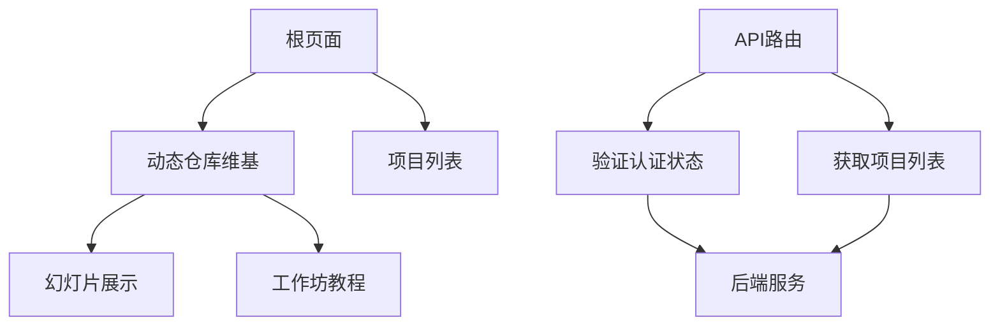
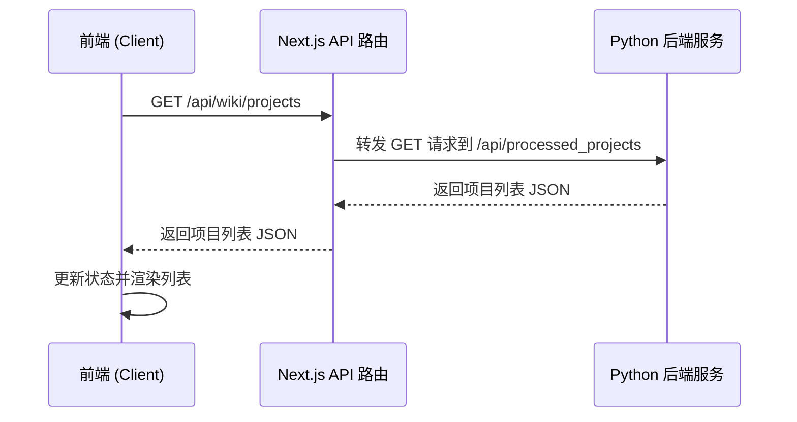

# 页面结构与路由

<cite>
**本文档中引用的文件**  
- [src/app/[owner]/[repo]/page.tsx](file://src/app/[owner]/[repo]/page.tsx)
- [src/app/wiki/projects/page.tsx](file://src/app/wiki/projects/page.tsx)
- [src/app/[owner]/[repo]/slides/page.tsx](file://src/app/[owner]/[repo]/slides/page.tsx)
- [src/app/[owner]/[repo]/workshop/page.tsx](file://src/app/[owner]/[repo]/workshop/page.tsx)
- [src/hooks/useProcessedProjects.ts](file://src/hooks/useProcessedProjects.ts)
- [src/components/ProcessedProjects.tsx](file://src/components/ProcessedProjects.tsx)
- [src/app/api/wiki/projects/route.ts](file://src/app/api/wiki/projects/route.ts)
</cite>

## 目录
1. [简介](#简介)
2. [项目结构概览](#项目结构概览)
3. [核心页面与动态路由](#核心页面与动态路由)
4. [数据获取与状态管理](#数据获取与状态管理)
5. [子页面功能与使用场景](#子页面功能与使用场景)
6. [后端API交互流程](#后端api交互流程)
7. [页面生命周期与渲染策略](#页面生命周期与渲染策略)
8. [导航逻辑](#导航逻辑)

## 简介
本项目是一个基于Next.js的开源知识库生成工具，能够为GitHub、GitLab等代码仓库自动生成结构化的维基页面。系统通过动态路由实现对任意仓库的维基内容生成，并提供项目列表、幻灯片展示和工作坊教程等多种视图。本文档将详细解析其页面结构、动态路由机制、数据流以及核心功能的实现原理。

## 项目结构概览
项目采用标准的Next.js App Router架构，核心功能集中在`src/app`目录下。主要结构包括：
- `src/app/[owner]/[repo]`：基于URL参数的动态路由，用于生成特定仓库的维基页面。
- `src/app/wiki/projects`：展示已处理项目的列表页面。
- `src/app/[owner]/[repo]/slides`：为仓库生成营销风格的幻灯片展示。
- `src/app/[owner]/[repo]/workshop`：生成交互式学习工作坊教程。
- `src/hooks`：存放自定义Hook，如`useProcessedProjects`用于获取项目列表。
- `src/components`：可复用的UI组件。

**图表来源**
- [src/app/page.tsx](file://src/app/page.tsx#L1-L625)
- [src/app/wiki/projects/page.tsx](file://src/app/wiki/projects/page.tsx#L1-L19)
- [src/app/[owner]/[repo]/page.tsx](file://src/app/[owner]/[repo]/page.tsx#L1-L2272)

## 核心页面与动态路由

### 动态维基页面 `[owner]/[repo]/page.tsx`
该页面是系统的核心，利用Next.js的动态路由功能，通过`[owner]`和`[repo]`两个参数动态加载任意GitHub/GitLab仓库的维基内容。当用户访问`/owner/repo`时，页面会从URL的搜索参数中提取仓库类型、访问令牌、语言等配置，并初始化`RepoInfo`对象。页面通过WebSocket或HTTP流式请求与后端API通信，根据仓库的文件树和README生成结构化的维基内容，包括架构图、数据流等。生成的内容被缓存，以提高后续访问的性能。

### 项目列表页面 `wiki/projects/page.tsx`
该页面用于展示服务器缓存中所有已处理过的仓库项目列表。它通过`useProcessedProjects` Hook获取数据，并使用`ProcessedProjects`组件进行渲染。用户可以在此页面搜索、浏览和删除缓存的项目。该页面作为应用的入口之一，方便用户快速访问之前生成的维基内容。

**页面来源**
- [src/app/[owner]/[repo]/page.tsx](file://src/app/[owner]/[repo]/page.tsx#L1-L2272)
- [src/app/wiki/projects/page.tsx](file://src/app/wiki/projects/page.tsx#L1-L19)

## 数据获取与状态管理

### `useProcessedProjects` Hook
此自定义Hook封装了从后端API获取已处理项目列表的逻辑。它使用React的`useState`和`useEffect`来管理`projects`、`isLoading`和`error`状态。在组件挂载时，它会向`/api/wiki/projects`端点发起GET请求。请求成功后，将返回的JSON数据解析为`ProcessedProject`数组并更新状态。该Hook被`wiki/projects/page.tsx`和`ProcessedProjects`组件所使用，实现了数据获取逻辑的复用。

**图表来源**
- [src/hooks/useProcessedProjects.ts](file://src/hooks/useProcessedProjects.ts#L12-L45)
- [src/app/api/wiki/projects/route.ts](file://src/app/api/wiki/projects/route.ts#L37-L72)

## 子页面功能与使用场景

### 幻灯片页面 `slides/page.tsx`
该页面为指定仓库生成一个营销性质的幻灯片演示。它首先从缓存中获取该仓库的维基内容，然后通过LLM生成一个包含7-8个创意幻灯片标题的提纲。接着，逐个请求生成每张幻灯片的HTML内容，最终组合成一个完整的演示文稿。此功能适用于向潜在用户或投资者展示项目的核心价值和独特卖点。

### 工作坊页面 `workshop/page.tsx`
该页面生成一个交互式的学习工作坊，旨在帮助新用户快速上手。它同样基于缓存的维基内容，通过LLM生成一系列渐进式的练习，包括概念解释、步骤指导、挑战任务和解决方案。工作坊内容以Markdown格式呈现，并包含进度指示器和预计耗时，非常适合用于项目文档和社区贡献指南。

**页面来源**
- [src/app/[owner]/[repo]/slides/page.tsx](file://src/app/[owner]/[repo]/slides/page.tsx#L1-L1300)
- [src/app/[owner]/[repo]/workshop/page.tsx](file://src/app/[owner]/[repo]/workshop/page.tsx#L1-L634)

## 后端API交互流程
前端通过Next.js的API路由与后端Python服务进行通信，实现了请求的代理和转发。例如，`/api/wiki/projects/route.ts`会将请求转发到`http://localhost:8001/api/processed_projects`。这种设计将前端与后端解耦，前端无需直接暴露后端地址，同时可以在API路由中添加额外的逻辑，如请求验证、日志记录和错误处理。数据获取主要通过`fetch` API完成，支持流式响应以实现内容的渐进式渲染。

**API来源**
- [src/app/api/wiki/projects/route.ts](file://src/app/api/wiki/projects/route.ts#L1-L104)

## 页面生命周期与渲染策略
项目主要采用客户端渲染（CSR）策略。`[owner]/[repo]/page.tsx`等页面标记为`'use client'`，表明它们是客户端组件。页面的初始化逻辑（如获取认证状态、解析URL参数）在`useEffect`钩子中执行。数据获取是异步的，页面在加载时会显示加载状态，待数据获取完成后更新UI。这种策略提供了良好的交互性，但牺牲了部分SEO优势。对于静态内容，如首页的演示图表，则可以直接在服务端生成。

**页面来源**
- [src/app/[owner]/[repo]/page.tsx](file://src/app/[owner]/[repo]/page.tsx#L1-L2272)
- [src/app/page.tsx](file://src/app/page.tsx#L1-L625)

## 导航逻辑
应用的导航主要通过Next.js的`Link`组件和`useRouter`钩子实现。在首页，用户提交仓库URL后，`handleGenerateWiki`函数会解析URL，构建查询参数，并使用`router.push`导航到动态维基页面。在幻灯片和工作坊页面，顶部的返回按钮使用`Link`组件导航回主维基页面。项目列表中的每个项目项也通过`Link`组件链接到其对应的维基页面，实现了流畅的页面跳转体验。

**页面来源**
- [src/app/page.tsx](file://src/app/page.tsx#L1-L625)
- [src/app/[owner]/[repo]/slides/page.tsx](file://src/app/[owner]/[repo]/slides/page.tsx#L1-L1300)
- [src/app/[owner]/[repo]/workshop/page.tsx](file://src/app/[owner]/[repo]/workshop/page.tsx#L1-L634)