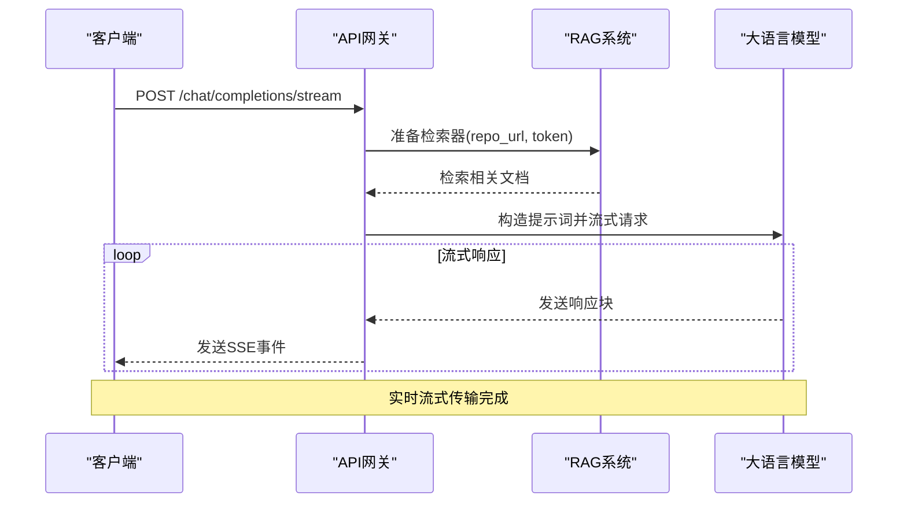
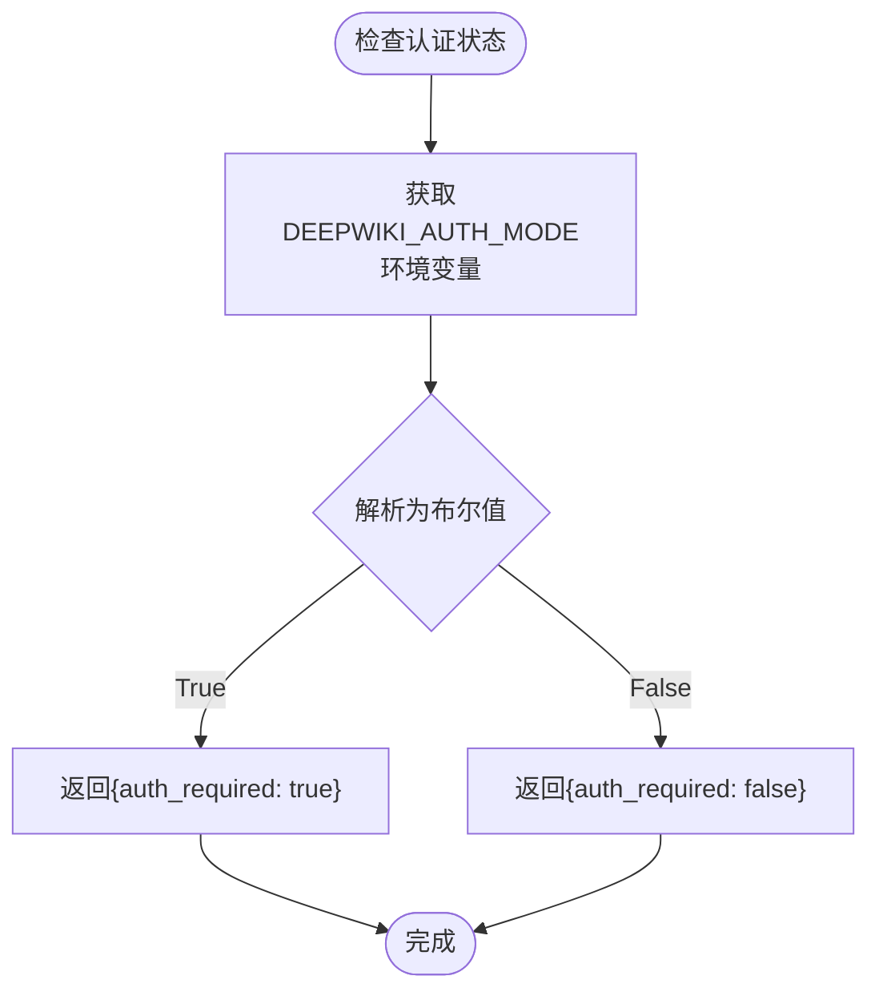
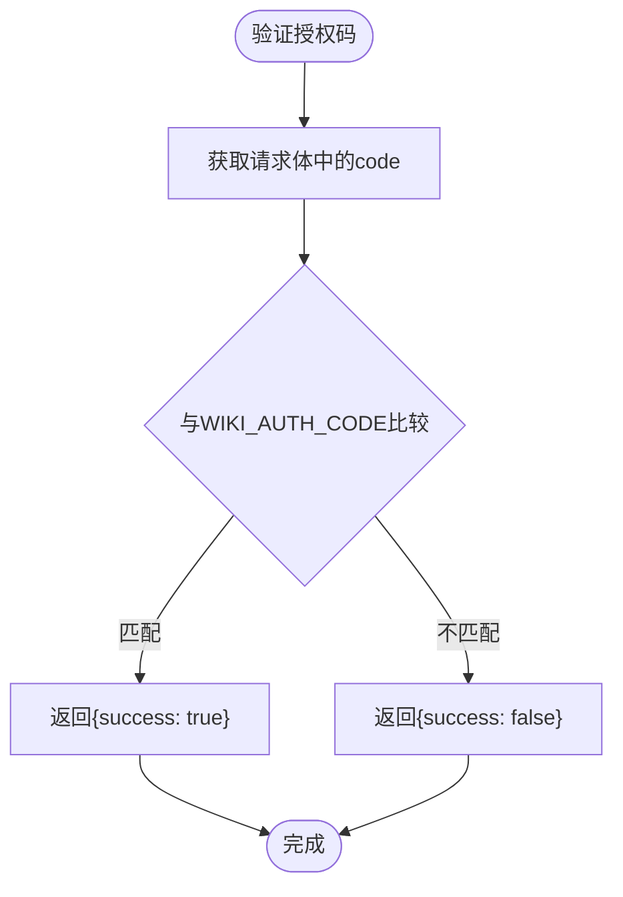
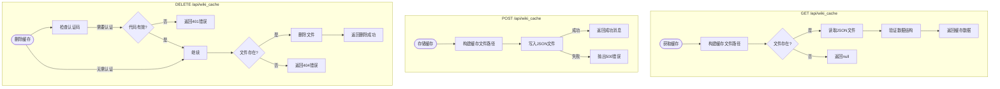
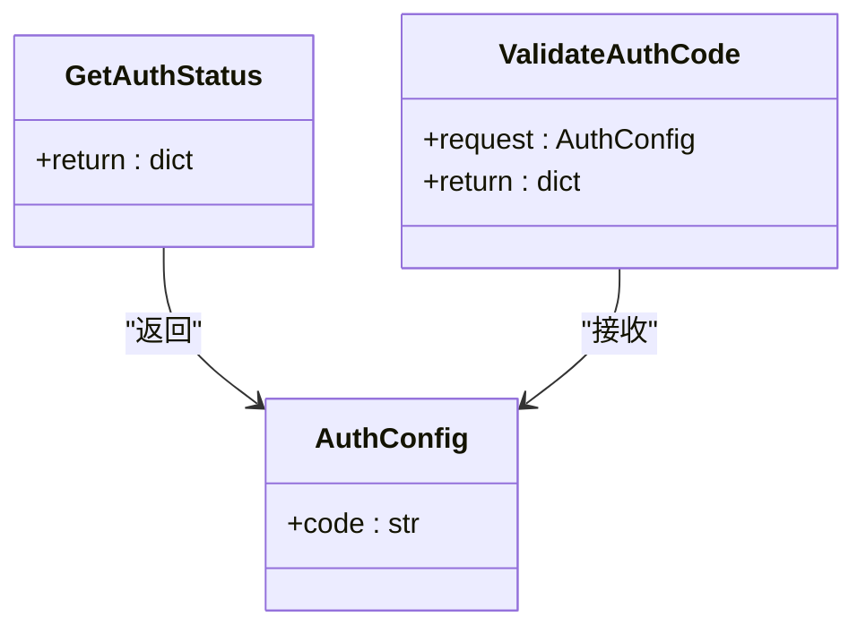
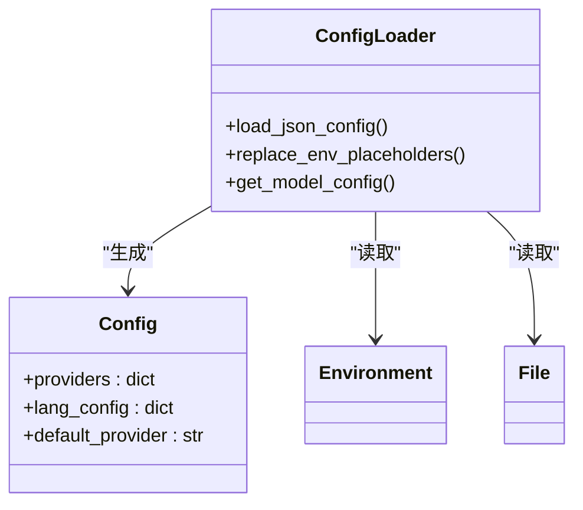
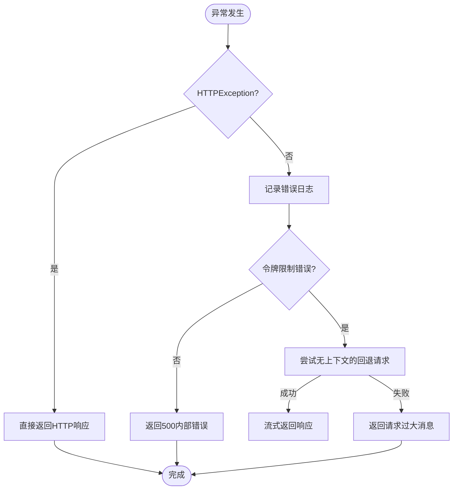

# API接口

<cite>
**Referenced Files in This Document**   
- [api.py](file://api/api.py)
- [simple_chat.py](file://api/simple_chat.py)
- [config.py](file://api/config.py)
- [websocket_wiki.py](file://api/websocket_wiki.py)
- [prompts.py](file://api/prompts.py)
</cite>

## 目录
1. [简介](#简介)
2. [API端点概览](#api端点概览)
3. [流式响应机制](#流式响应机制)
4. [身份验证检查逻辑](#身份验证检查逻辑)
5. [缓存查询接口](#缓存查询接口)
6. [客户端调用示例](#客户端调用示例)
7. [FastAPI依赖注入应用](#fastapi依赖注入应用)
8. [错误处理与速率限制](#错误处理与速率限制)

## 简介
本文档详细描述了`api/api.py`文件中定义的所有API端点。这些端点构成了DeepWiki系统的核心功能，包括流式聊天响应、身份验证状态检查、模型配置获取、维基缓存管理以及健康检查等。API基于FastAPI框架构建，支持异步处理和流式传输，为用户提供实时的代码分析和问答服务。

**Section sources**
- [api.py](file://api/api.py#L1-L100)

## API端点概览
系统提供了多个RESTful API端点，每个端点都有特定的功能和访问路径。以下是主要端点的汇总表：

| 端点路径 | HTTP方法 | 功能描述 | 认证要求 |
|--------|--------|--------|--------|
| `/chat/completions/stream` | POST | 流式聊天完成，返回SSE响应 | 无 |
| `/auth/status` | GET | 检查身份验证是否启用 | 无 |
| `/auth/validate` | POST | 验证提供的授权码 | 无 |
| `/models/config` | GET | 获取可用的模型提供商和模型配置 | 无 |
| `/api/wiki_cache` | GET/POST/DELETE | 获取、存储和删除维基缓存数据 | 条件性 |
| `/export/wiki` | POST | 导出维基内容为Markdown或JSON格式 | 无 |
| `/local_repo/structure` | GET | 获取本地仓库的文件树和README内容 | 无 |
| `/health` | GET | 健康检查端点 | 无 |
| `/` | GET | 根端点，列出所有可用端点 | 无 |
| `/api/processed_projects` | GET | 列出所有已处理的项目缓存 | 无 |

**Section sources**
- [api.py](file://api/api.py#L101-L634)

## 流式响应机制
### `/chat/completions/stream` 端点
该端点是系统的核心功能，提供服务器发送事件（SSE）流式响应，允许客户端实时接收大语言模型的响应。



**Diagram sources**
- [api.py](file://api/api.py#L380-L382)
- [simple_chat.py](file://api/simple_chat.py#L75-L683)

#### 实现细节
1. **请求处理**：接收包含仓库URL、消息历史、文件路径等信息的POST请求。
2. **RAG准备**：根据仓库URL和令牌准备检索增强生成（RAG）系统。
3. **上下文构建**：从RAG系统检索相关文档，并将其与对话历史、系统提示和用户查询结合。
4. **流式响应**：使用`StreamingResponse`返回`text/event-stream`媒体类型，实现SSE流式传输。

**Section sources**
- [api.py](file://api/api.py#L380-L382)
- [simple_chat.py](file://api/simple_chat.py#L75-L683)

## 身份验证检查逻辑
### `/auth/status` 端点
该端点用于检查系统是否启用了身份验证模式。



**Diagram sources**
- [api.py](file://api/api.py#L158-L164)
- [config.py](file://api/config.py#L25-L28)

#### 实现细节
1. **环境变量读取**：从`DEEPWIKI_AUTH_MODE`环境变量读取认证模式。
2. **布尔值解析**：将字符串值（如'true', '1', 't'）解析为布尔值。
3. **状态返回**：返回一个包含`auth_required`字段的JSON对象，指示是否需要身份验证。

### `/auth/validate` 端点
该端点用于验证用户提供的授权码是否正确。



**Diagram sources**
- [api.py](file://api/api.py#L166-L172)
- [config.py](file://api/config.py#L29-L30)

**Section sources**
- [api.py](file://api/api.py#L158-L172)
- [config.py](file://api/config.py#L25-L30)

## 缓存查询接口
### `/api/wiki_cache` 端点
该端点提供对维基缓存数据的CRUD操作，支持获取、存储和删除缓存。



**Diagram sources**
- [api.py](file://api/api.py#L308-L378)

#### 实现细节
1. **缓存路径生成**：根据仓库所有者、名称、类型和语言生成唯一的缓存文件路径。
2. **数据读取**：异步读取JSON文件并反序列化为`WikiCacheData`模型。
3. **数据写入**：将`WikiCacheRequest`数据序列化为JSON并写入文件。
4. **删除保护**：在删除缓存时，如果启用了认证模式，则需要提供有效的授权码。

**Section sources**
- [api.py](file://api/api.py#L308-L378)

## 客户端调用示例
### 流式聊天调用
```python
import requests
import json

def stream_chat_completion():
    url = "http://localhost:8000/chat/completions/stream"
    headers = {"Content-Type": "application/json"}
    
    data = {
        "repo_url": "https://github.com/owner/repo",
        "messages": [
            {"role": "user", "content": "这个项目是做什么的？"}
        ],
        "provider": "google",
        "model": "gemini-pro"
    }
    
    try:
        with requests.post(url, json=data, headers=headers, stream=True, timeout=30) as response:
            for line in response.iter_lines():
                if line:
                    # 处理SSE事件
                    event_data = line.decode('utf-8')
                    if event_data.startswith('data:'):
                        content = event_data[5:].strip()
                        if content != '[DONE]':
                            print(content, end='', flush=True)
    except requests.exceptions.Timeout:
        print("请求超时")
    except requests.exceptions.RequestException as e:
        print(f"请求错误: {e}")
```

### 缓存查询调用
```python
import requests

def get_wiki_cache():
    url = "http://localhost:8000/api/wiki_cache"
    params = {
        "owner": "AsyncFuncAI",
        "repo": "deepwiki-open",
        "repo_type": "github",
        "language": "en"
    }
    
    try:
        response = requests.get(url, params=params, timeout=10)
        response.raise_for_status()
        
        cache_data = response.json()
        if cache_data:
            print("找到缓存数据")
            # 处理缓存数据
        else:
            print("未找到缓存")
            
    except requests.exceptions.HTTPError as e:
        if response.status_code == 404:
            print("缓存未找到")
        else:
            print(f"HTTP错误: {e}")
    except requests.exceptions.RequestException as e:
        print(f"请求错误: {e}")
```

**Section sources**
- [api.py](file://api/api.py#L380-L382)
- [simple_chat.py](file://api/simple_chat.py#L75-L683)

## FastAPI依赖注入应用
系统通过自定义函数实现了类似FastAPI依赖注入的功能，虽然没有直接使用`Depends()`，但通过配置和工具函数实现了类似的效果。

### `get_current_user` 应用
尽管在代码中没有直接找到`get_current_user`函数，但系统通过环境变量和配置实现了用户认证逻辑。



**Diagram sources**
- [api.py](file://api/api.py#L158-L172)
- [config.py](file://api/config.py#L25-L30)

### `get_config` 应用
`get_config`功能通过`config.py`文件中的配置加载系统实现，为整个应用提供统一的配置管理。



**Diagram sources**
- [config.py](file://api/config.py#L1-L387)

#### 配置加载流程
1. **环境变量读取**：从环境变量中读取API密钥和配置选项。
2. **配置文件加载**：从`config/`目录下的JSON文件加载配置。
3. **占位符替换**：将配置中的`${ENV_VAR}`占位符替换为实际的环境变量值。
4. **配置合并**：将不同来源的配置合并到全局`configs`字典中。

**Section sources**
- [config.py](file://api/config.py#L1-L387)

## 错误处理与速率限制
### 错误处理策略
系统实现了多层次的错误处理机制：



**Diagram sources**
- [simple_chat.py](file://api/simple_chat.py#L550-L630)

### 速率限制与超时
虽然代码中没有显式的速率限制实现，但客户端应遵循以下最佳实践：

1. **超时设置**：为所有请求设置合理的超时时间（建议10-30秒）。
2. **重试机制**：对5xx错误实现指数退避重试。
3. **并发控制**：限制并发请求数量，避免服务器过载。
4. **输入大小检查**：避免发送过大的请求体，系统对超过8000令牌的请求会发出警告。

**Section sources**
- [simple_chat.py](file://api/simple_chat.py#L550-L630)