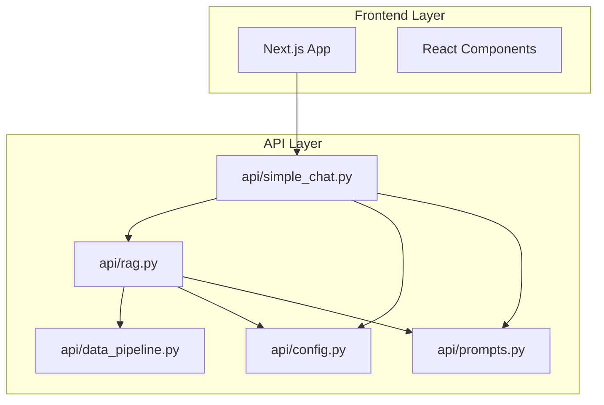
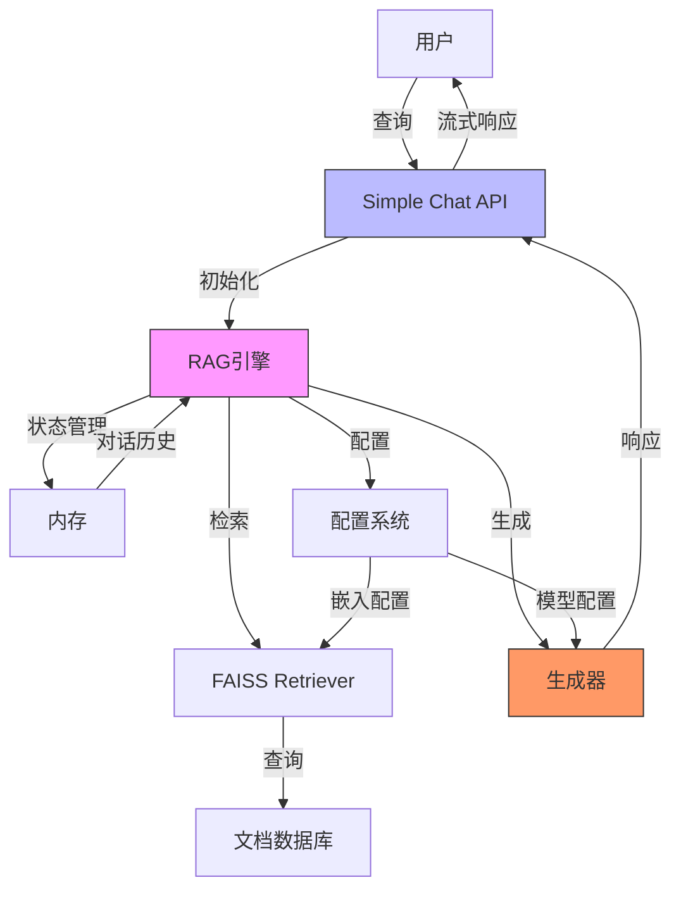
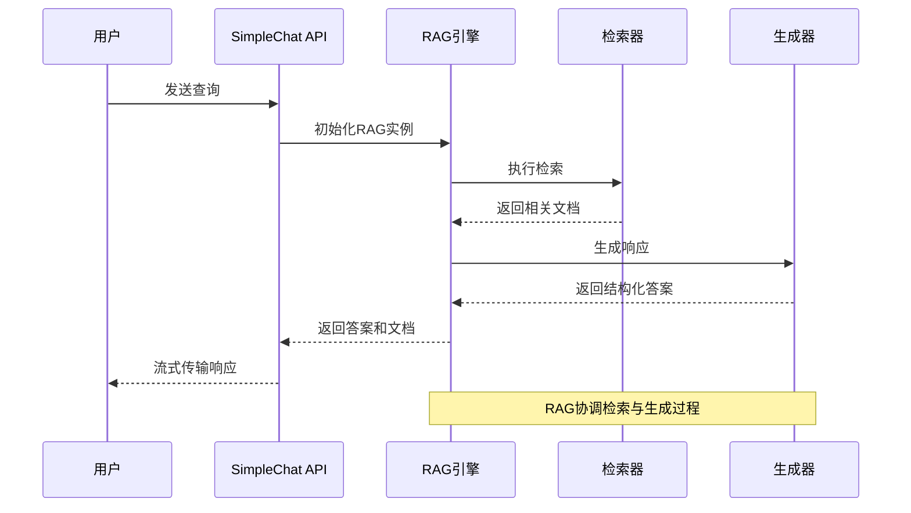
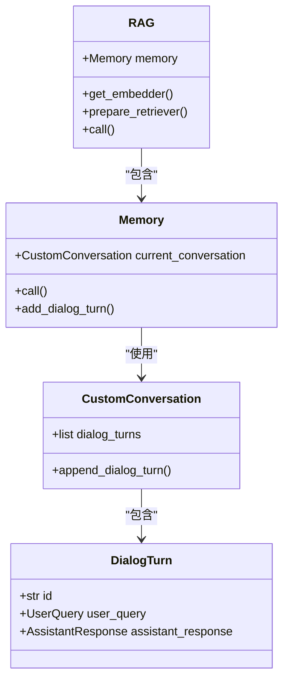
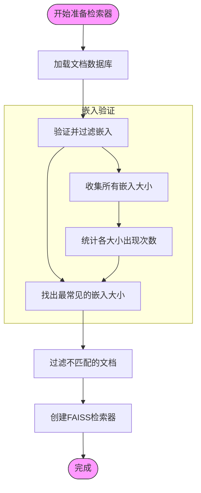
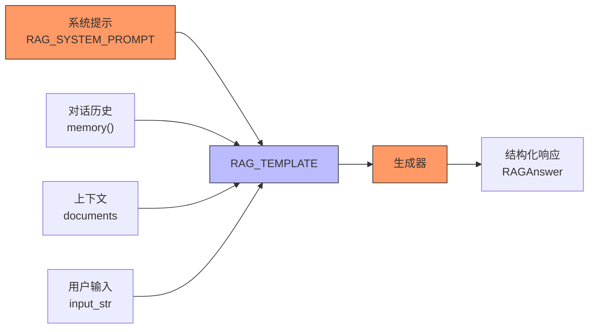
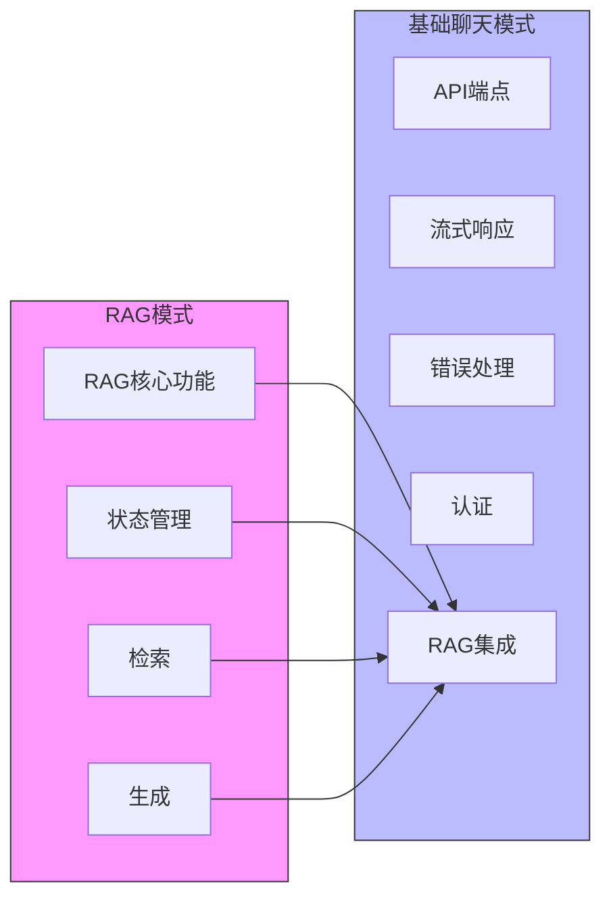
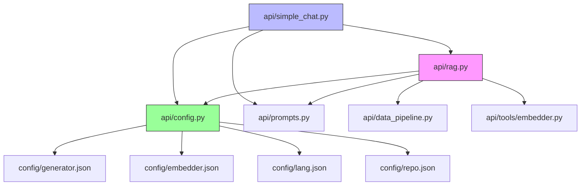
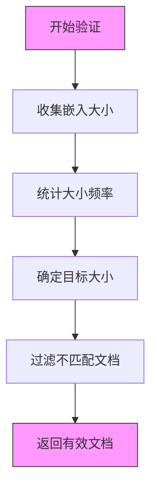
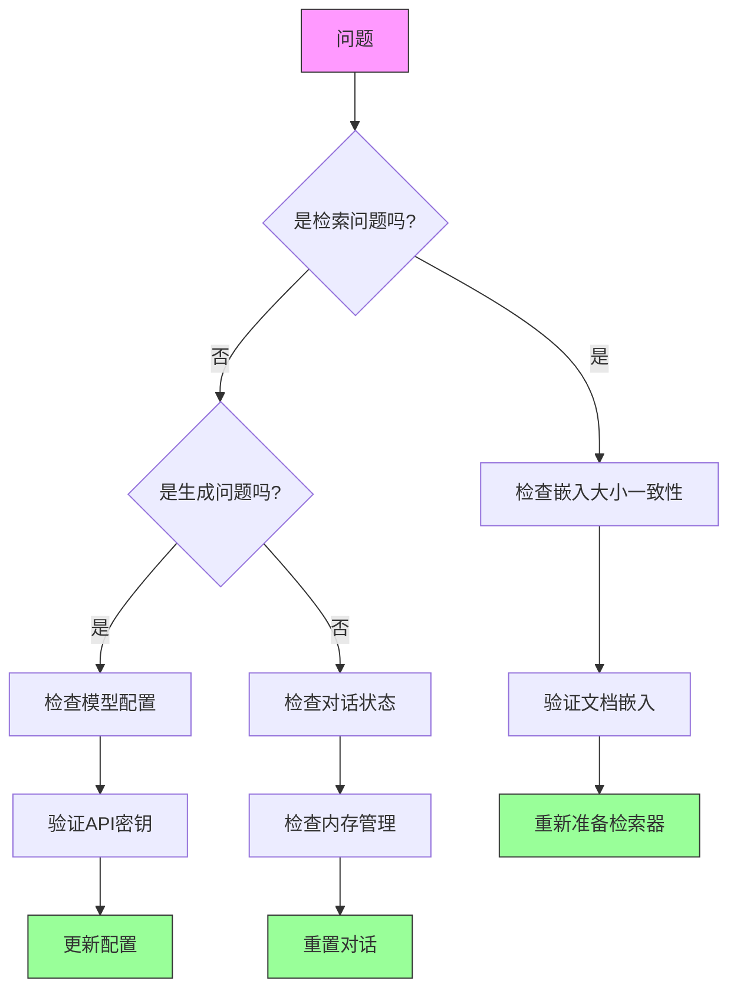

# RAG引擎

<cite>
**Referenced Files in This Document**   
- [api/rag.py](file://api/rag.py)
- [api/simple_chat.py](file://api/simple_chat.py)
- [api/prompts.py](file://api/prompts.py)
- [api/config.py](file://api/config.py)
</cite>

## 目录
1. [引言](#引言)
2. [项目结构](#项目结构)
3. [核心组件](#核心组件)
4. [架构概述](#架构概述)
5. [详细组件分析](#详细组件分析)
6. [依赖分析](#依赖分析)
7. [性能考虑](#性能考虑)
8. [故障排除指南](#故障排除指南)
9. [结论](#结论)

## 引言
本文档深入解析`api/rag.py`中的检索增强生成（RAG）系统实现。详细说明其`generate_response`方法如何协调检索器与生成器的工作流程，包括查询重写、上下文检索、提示工程和答案生成。阐述`RAGPipeline`类的状态管理与组件协作机制。结合`simple_chat.py`说明基础聊天模式与RAG模式的区别。提供性能优化建议，如缓存策略、检索精度调优和延迟控制。

## 项目结构
本项目是一个基于FastAPI的代码分析系统，核心功能围绕检索增强生成（RAG）技术构建。系统主要分为API层和前端应用层，其中API层实现了RAG引擎和基础聊天功能。

**Diagram sources**
- [api/rag.py](file://api/rag.py)
- [api/simple_chat.py](file://api/simple_chat.py)

**Section sources**
- [api/rag.py](file://api/rag.py)
- [api/simple_chat.py](file://api/simple_chat.py)

## 核心组件
`api/rag.py`文件实现了RAG系统的核心组件，包括`RAG`类、`Memory`类和`RAGAnswer`数据类。`RAG`类负责协调检索器与生成器的工作流程，`Memory`类管理对话历史，`RAGAnswer`定义了答案的结构。`api/simple_chat.py`实现了基于RAG的流式聊天API，将RAG功能暴露给前端应用。

**Section sources**
- [api/rag.py](file://api/rag.py#L1-L445)
- [api/simple_chat.py](file://api/simple_chat.py#L1-L689)

## 架构概述
RAG系统的架构采用模块化设计，各组件职责分明。系统通过`RAG`类协调检索器与生成器，利用`Memory`类管理对话状态，并通过`DataPipeline`处理文档。

**Diagram sources**
- [api/rag.py](file://api/rag.py#L1-L445)
- [api/simple_chat.py](file://api/simple_chat.py#L1-L689)

## 详细组件分析

### RAG系统工作流程分析
`RAG`类的`call`方法实现了检索增强生成的核心工作流程。该流程首先通过检索器获取相关文档，然后将文档内容与用户查询、对话历史结合，最后通过生成器产生最终答案。

**Diagram sources**
- [api/rag.py](file://api/rag.py#L300-L350)
- [api/simple_chat.py](file://api/simple_chat.py#L200-L400)

### 状态管理与组件协作机制
`RAG`类通过`Memory`组件管理对话状态，确保多轮对话的上下文一致性。`Memory`类使用自定义的`CustomConversation`实现来避免列表赋值索引越界错误。

**Diagram sources**
- [api/rag.py](file://api/rag.py#L50-L150)

### 查询重写与上下文检索机制
系统通过`_validate_and_filter_embeddings`方法确保嵌入向量的一致性，过滤掉嵌入大小不匹配的文档。`prepare_retriever`方法负责准备检索器，加载文档数据库并处理嵌入验证。

**Diagram sources**
- [api/rag.py](file://api/rag.py#L250-L300)

### 提示工程与答案生成
系统使用`adalflow`框架的模板系统进行提示工程。`RAG_TEMPLATE`定义了提示的结构，包括系统提示、对话历史、上下文和用户查询。

**Diagram sources**
- [api/rag.py](file://api/rag.py#L20-L30)
- [api/prompts.py](file://api/prompts.py#L1-L50)

### 基础聊天模式与RAG模式对比
`simple_chat.py`实现了基础聊天模式，该模式在RAG模式的基础上增加了流式响应、错误处理和API接口。两种模式的主要区别在于交互方式和功能复杂度。

**Diagram sources**
- [api/rag.py](file://api/rag.py)
- [api/simple_chat.py](file://api/simple_chat.py)

## 依赖分析
RAG系统依赖多个外部组件和配置文件，这些依赖关系确保了系统的灵活性和可扩展性。

**Diagram sources**
- [api/rag.py](file://api/rag.py)
- [api/simple_chat.py](file://api/simple_chat.py)
- [api/config.py](file://api/config.py)

**Section sources**
- [api/rag.py](file://api/rag.py)
- [api/simple_chat.py](file://api/simple_chat.py)
- [api/config.py](file://api/config.py)

## 性能考虑
RAG系统的性能优化主要集中在以下几个方面：嵌入验证、检索效率、内存管理和错误恢复。

### 嵌入验证优化
系统通过`_validate_and_filter_embeddings`方法优化嵌入验证过程，避免因嵌入大小不一致导致的检索器创建失败。

**Diagram sources**
- [api/rag.py](file://api/rag.py#L250-L300)

### 检索效率优化
系统通过FAISS向量数据库实现高效的相似性搜索，同时利用Ollama嵌入器的单字符串查询优化提高检索速度。

**Diagram sources**
- [api/rag.py](file://api/rag.py#L150-L200)

## 故障排除指南
当RAG系统出现问题时，可以按照以下步骤进行排查：

**Section sources**
- [api/rag.py](file://api/rag.py)
- [api/simple_chat.py](file://api/simple_chat.py)

## 结论
本文档详细解析了`api/rag.py`中的检索增强生成（RAG）系统实现。系统通过模块化设计实现了高效的代码分析功能，`RAG`类协调检索器与生成器的工作流程，`Memory`类确保对话状态的一致性。结合`simple_chat.py`的流式API，系统为前端应用提供了强大的代码分析能力。通过嵌入验证、检索优化和错误处理等机制，系统具有良好的性能和可靠性。