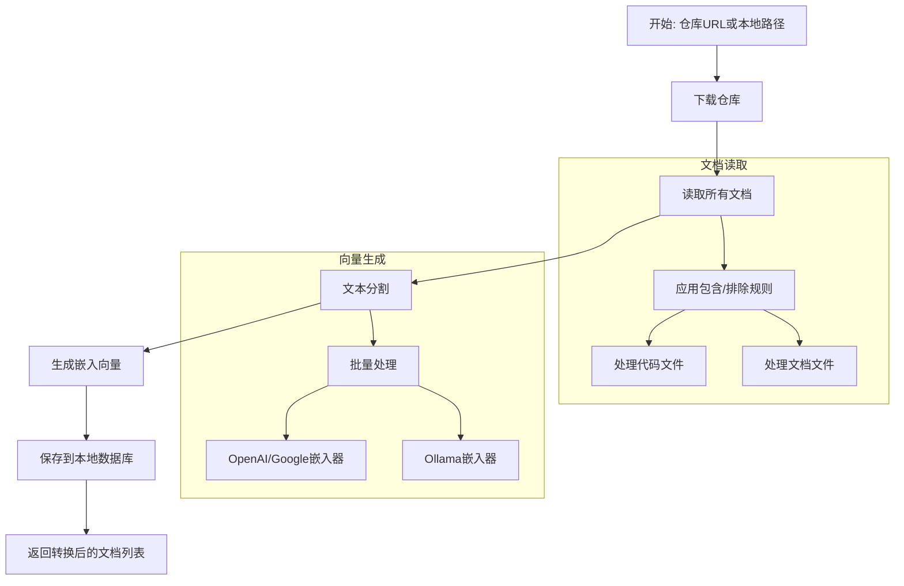
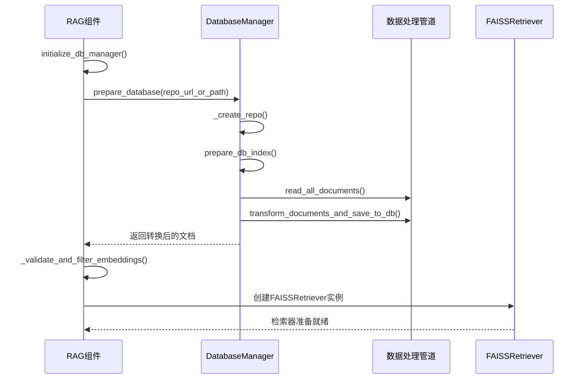

# 检索系统

<cite>
**Referenced Files in This Document**  
- [rag.py](file://api/rag.py)
- [data_pipeline.py](file://api/data_pipeline.py)
</cite>

## 目录
1. [检索子系统概述](#检索子系统概述)
2. [文档预处理管道](#文档预处理管道)
3. [向量数据库初始化](#向量数据库初始化)
4. [嵌入向量验证与过滤](#嵌入向量验证与过滤)
5. [检索性能优化建议](#检索性能优化建议)

## 检索子系统概述

检索子系统是RAG引擎的核心组件，负责从代码库中提取、处理和索引文档，以便进行高效的语义检索。该系统通过`prepare_retriever`方法初始化FAISS向量数据库，并利用`_validate_and_filter_embeddings`方法确保嵌入向量的一致性。文档预处理管道在`data_pipeline.py`中实现，负责将原始代码和文档转换为可用于检索的向量表示。

**Section sources**
- [rag.py](file://api/rag.py#L344-L413)
- [data_pipeline.py](file://api/data_pipeline.py#L701-L880)

## 文档预处理管道

文档预处理管道负责从代码库中提取文档、分割文本并生成嵌入向量。该管道由`data_pipeline.py`文件中的多个函数和类组成，形成了一个完整的数据处理流程。

**Diagram sources**  
- [data_pipeline.py](file://api/data_pipeline.py#L701-L880)

**Section sources**
- [data_pipeline.py](file://api/data_pipeline.py#L701-L880)

## 向量数据库初始化

`prepare_retriever`方法负责初始化FAISS向量数据库，该过程包括仓库准备、文档加载、嵌入验证和检索器创建四个主要步骤。

**Diagram sources**  
- [rag.py](file://api/rag.py#L344-L413)
- [data_pipeline.py](file://api/data_pipeline.py#L701-L880)

**Section sources**
- [rag.py](file://api/rag.py#L344-L413)

## 嵌入向量验证与过滤

`_validate_and_filter_embeddings`方法确保所有文档的嵌入向量具有相同的尺寸，防止因混合使用不同嵌入器导致的运行时错误。该方法通过两阶段处理：首先收集所有嵌入向量的尺寸统计信息，然后过滤出与最常见尺寸匹配的文档。

```mermaid
flowchart TD
Start["开始: 文档列表"] --> CheckEmpty["检查文档列表是否为空"]
CheckEmpty --> |是| ReturnEmpty["返回空列表"]
CheckEmpty --> |否| FirstPass["第一阶段: 收集尺寸统计"]
FirstPass --> Loop1["遍历每个文档"]
Loop1 --> HasVector["文档是否有向量?"]
HasVector --> |否| Skip1["跳过文档"]
HasVector --> |是| GetSize["获取向量尺寸"]
GetSize --> ValidSize["尺寸有效?"]
ValidSize --> |否| Skip1
ValidSize --> |是| RecordSize["记录尺寸统计"]
RecordSize --> Loop1
Loop1 --> |完成| FindTarget["找到目标尺寸"]
FindTarget --> SecondPass["第二阶段: 过滤文档"]
SecondPass --> Loop2["遍历每个文档"]
Loop2 --> HasVector2["文档是否有向量?"]
HasVector2 --> |否| Skip2["跳过文档"]
HasVector2 --> |是| GetSize2["获取向量尺寸"]
GetSize2 --> MatchTarget["尺寸匹配目标?"]
MatchTarget --> |是| Keep["保留文档"]
MatchTarget --> |否| FilterOut["过滤出文档"]
FilterOut --> LogFilter["记录过滤原因"]
Keep --> Loop2
FilterOut --> Loop2
Loop2 --> |完成| ReturnValid["返回有效文档列表"]
```

**Diagram sources**  
- [rag.py](file://api/rag.py#L250-L342)

**Section sources**
- [rag.py](file://api/rag.py#L250-L342)

## 检索性能优化建议

为了提高检索系统的性能和可靠性，建议实施以下优化措施：

### 索引持久化
系统已实现索引持久化机制，通过将处理后的数据库保存到本地文件系统（`~/.adalflow/databases/{repo_name}.pkl`），避免重复处理相同的代码库。当调用`prepare_database`时，系统首先检查是否存在已保存的数据库文件，如果存在则直接加载，否则创建新的数据库。

### 查询重写
虽然当前实现中未直接包含查询重写功能，但可以通过扩展`RAG.call`方法来实现。建议在查询传递给检索器之前，添加查询分析和重写逻辑，例如：
- 识别查询中的技术术语并扩展为同义词
- 将自然语言查询转换为更精确的技术表述
- 根据上下文添加相关的限定词

### 相似度阈值调优
当前FAISS检索器使用默认的相似度计算方法。建议通过配置参数调整相似度阈值，以平衡检索的精确度和召回率。可以在`configs["retriever"]`中添加`similarity_threshold`参数，并在检索后过滤掉相似度低于阈值的结果。

### 其他优化建议
1. **批量处理优化**：对于OpenAI和Google嵌入器，使用批量处理（batch processing）来提高效率；对于Ollama嵌入器，使用单文档处理以避免内存问题。
2. **文件过滤规则**：通过`excluded_dirs`、`excluded_files`、`included_dirs`和`included_files`参数灵活控制要处理的文件范围，避免处理不必要的大文件或测试文件。
3. **日志监控**：系统包含详细的日志记录，可用于监控处理过程中的性能瓶颈和错误情况。

**Section sources**
- [rag.py](file://api/rag.py#L344-L413)
- [data_pipeline.py](file://api/data_pipeline.py#L701-L880)