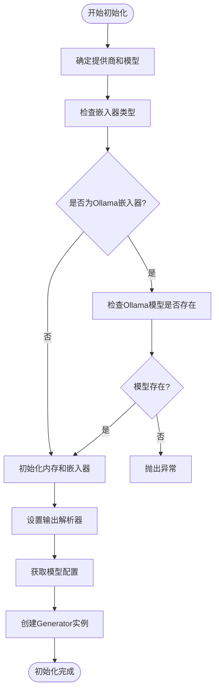
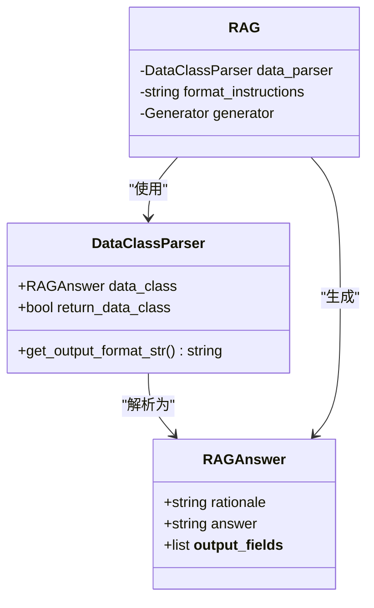
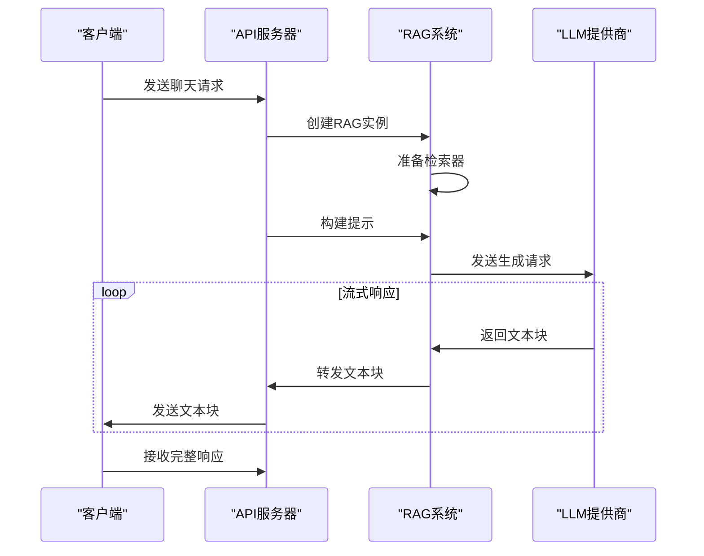
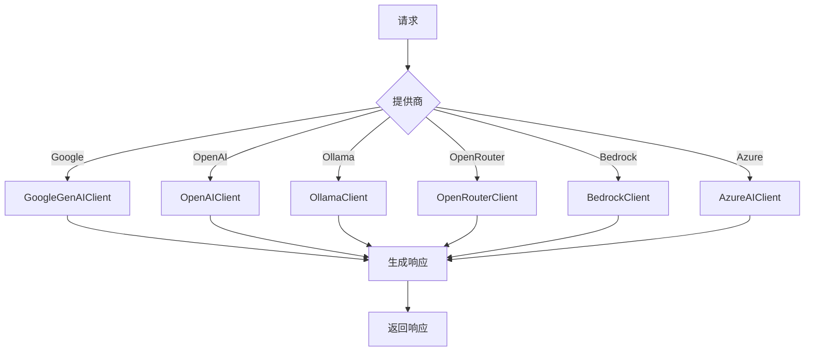
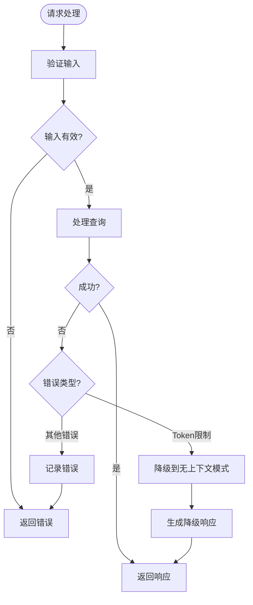
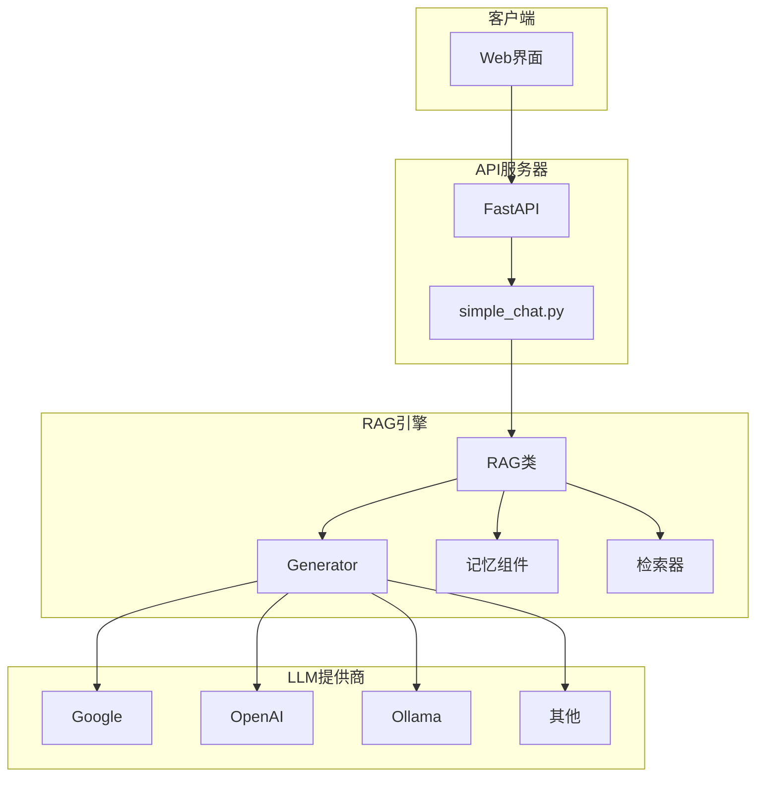

# 生成系统

<cite>
**Referenced Files in This Document**   
- [rag.py](file://api/rag.py)
- [simple_chat.py](file://api/simple_chat.py)
- [prompts.py](file://api/prompts.py)
- [config.py](file://api/config.py)
</cite>

## 目录
1. [生成子系统概述](#生成子系统概述)
2. [Generator组件初始化](#generator组件初始化)
3. [提示模板与输出解析](#提示模板与输出解析)
4. [流式响应生成逻辑](#流式响应生成逻辑)
5. [多LLM提供商支持](#多llm提供商支持)
6. [错误处理与降级策略](#错误处理与降级策略)
7. [系统架构图](#系统架构图)

## 生成子系统概述

生成子系统是RAG引擎的核心组件，负责将检索到的上下文与对话历史整合，并通过不同LLM提供商生成最终回答。该系统主要由`RAG`类中的`Generator`组件和`simple_chat.py`中的流式响应逻辑构成，实现了从查询处理到答案生成的完整流程。

**Section sources**
- [rag.py](file://api/rag.py#L152-L444)
- [simple_chat.py](file://api/simple_chat.py#L0-L689)

## Generator组件初始化

`Generator`组件的初始化过程在`RAG`类的构造函数中完成，通过配置参数确定使用的模型提供商和模型名称。初始化过程首先确定嵌入器类型，然后检查Ollama模型是否存在，最后创建生成器实例。

**Diagram sources**
- [rag.py](file://api/rag.py#L152-L200)

**Section sources**
- [rag.py](file://api/rag.py#L152-L250)

## 提示模板与输出解析

生成系统使用`RAG_TEMPLATE`提示模板和`DataClassParser`输出解析器来确保生成的回答格式正确。提示模板定义了系统提示、对话历史、上下文和用户查询的结构，而输出解析器则确保生成的回答符合`RAGAnswer`数据类的格式要求。

**Diagram sources**
- [rag.py](file://api/rag.py#L146-L150)
- [prompts.py](file://api/prompts.py#L0-L191)

**Section sources**
- [rag.py](file://api/rag.py#L202-L230)
- [prompts.py](file://api/prompts.py#L0-L191)

## 流式响应生成逻辑

`simple_chat.py`文件实现了流式响应生成逻辑，通过FastAPI的`StreamingResponse`将生成的回答逐步发送给客户端。该逻辑首先验证请求，然后准备RAG实例，构建包含上下文和对话历史的提示，最后通过选定的LLM提供商生成流式响应。

**Diagram sources**
- [simple_chat.py](file://api/simple_chat.py#L0-L689)

**Section sources**
- [simple_chat.py](file://api/simple_chat.py#L0-L689)

## 多LLM提供商支持

生成系统支持多种LLM提供商，包括Google、OpenAI、Ollama等。通过`get_model_config`函数，系统可以根据提供商和模型名称获取相应的配置，包括模型客户端和参数。不同提供商的配置在`generator.json`文件中定义，系统在运行时动态加载这些配置。

**Diagram sources**
- [config.py](file://api/config.py#L333-L386)

**Section sources**
- [config.py](file://api/config.py#L0-L387)

## 错误处理与降级策略

生成系统实现了完善的错误处理和降级策略。当遇到错误时，系统会记录错误日志并返回友好的错误信息。对于输入过大的情况，系统会尝试降级到无上下文模式，仅使用系统提示和对话历史生成回答。此外，系统还会验证嵌入向量的大小一致性，确保检索过程的稳定性。

**Diagram sources**
- [simple_chat.py](file://api/simple_chat.py#L0-L689)
- [rag.py](file://api/rag.py#L152-L444)

**Section sources**
- [simple_chat.py](file://api/simple_chat.py#L0-L689)
- [rag.py](file://api/rag.py#L152-L444)

## 系统架构图

**Diagram sources**
- [rag.py](file://api/rag.py#L152-L444)
- [simple_chat.py](file://api/simple_chat.py#L0-L689)

**Section sources**
- [rag.py](file://api/rag.py#L152-L444)
- [simple_chat.py](file://api/simple_chat.py#L0-L689)