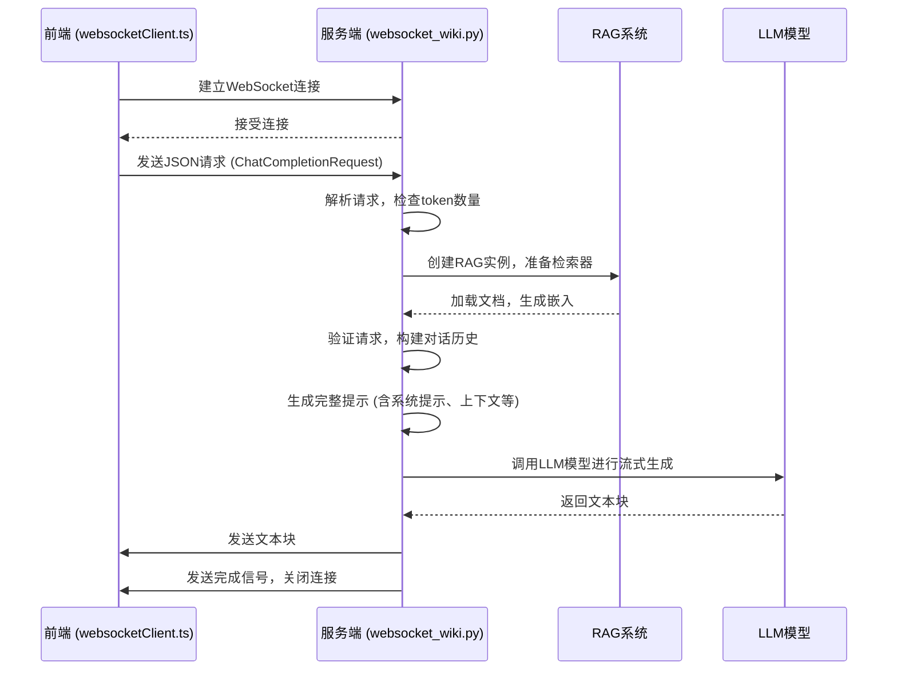
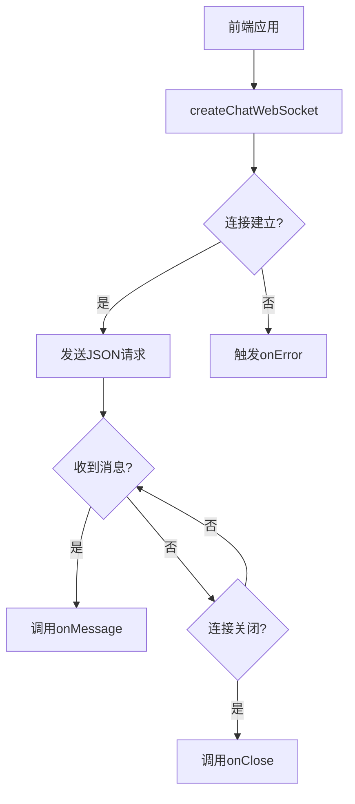

# WebSocket通信

<cite>
**本文档引用的文件**   
- [websocket_wiki.py](file://api/websocket_wiki.py)
- [websocketClient.ts](file://src/utils/websocketClient.ts)
- [rag.py](file://api/rag.py)
- [data_pipeline.py](file://api/data_pipeline.py)
- [config.py](file://api/config.py)
</cite>

## 目录
1. [引言](#引言)
2. [WebSocket服务端逻辑](#websocket服务端逻辑)
3. [前端WebSocket客户端交互](#前端websocket客户端交互)
4. [消息类型与数据格式](#消息类型与数据格式)
5. [并发连接处理](#并发连接处理)
6. [心跳检测与连接恢复](#心跳检测与连接恢复)
7. [性能监控与压力测试建议](#性能监控与压力测试建议)
8. [异常处理机制](#异常处理机制)
9. [会话状态维护](#会话状态维护)
10. [结论](#结论)

## 引言
WebSocket通信机制为`deepwiki-open`项目提供了实时、双向的通信能力，替代了传统的HTTP流式传输。该系统通过`api/websocket_wiki.py`实现服务端逻辑，与前端`src/utils/websocketClient.ts`建立连接，支持高效的聊天完成请求。本文档详细说明了WebSocket服务端的连接管理、消息路由、会话状态维护和异常处理，并阐述了与前端的交互协议、并发处理、心跳检测及性能优化建议。

## WebSocket服务端逻辑
`api/websocket_wiki.py`中的`handle_websocket_chat`函数是WebSocket服务端的核心，负责处理来自前端的连接和消息。当WebSocket连接建立后，服务端首先接收并解析JSON格式的请求数据，该数据由`ChatCompletionRequest`模型定义，包含仓库URL、消息列表、文件路径、令牌、仓库类型、提供者、模型、语言及文件过滤规则等参数。

服务端通过`count_tokens`函数检查请求大小，若输入超过8000个token，则标记为过大请求。随后，创建`RAG`实例并准备检索器，加载仓库文档并进行嵌入处理。服务端验证请求的合法性，确保消息列表非空且最后一条消息来自用户。通过遍历消息列表，构建对话历史并存储在`Memory`中，以支持上下文感知的响应生成。

对于“深度研究”请求，服务端通过检测消息内容中的`[DEEP RESEARCH]`标签来识别，并根据迭代次数调整系统提示，以提供连贯的研究过程。服务端根据请求的提供者（如Google、OpenAI、Ollama等）配置相应的模型客户端和参数，生成包含系统提示、对话历史、文件内容和检索上下文的完整提示，最后通过流式响应将生成的文本逐块发送回客户端。

**Diagram sources**
- [websocket_wiki.py](file://api/websocket_wiki.py#L51-L768)
- [websocketClient.ts](file://src/utils/websocketClient.ts#L1-L85)

**Section sources**
- [websocket_wiki.py](file://api/websocket_wiki.py#L51-L768)

## 前端WebSocket客户端交互
前端通过`src/utils/websocketClient.ts`中的`createChatWebSocket`函数与后端建立WebSocket连接。该函数接收`ChatCompletionRequest`请求、消息回调、错误回调和关闭回调作为参数。它首先根据环境变量`SERVER_BASE_URL`构建WebSocket URL（将`http://`替换为`ws://`），然后创建WebSocket实例。

连接建立后（`onopen`事件），客户端立即将请求数据以JSON格式发送给服务端。当收到服务端消息时（`onmessage`事件），调用`onMessage`回调函数处理接收到的文本。`onerror`和`onclose`事件分别处理连接错误和关闭情况。`closeWebSocket`函数用于安全地关闭WebSocket连接。

**Diagram sources**
- [websocketClient.ts](file://src/utils/websocketClient.ts#L1-L85)

**Section sources**
- [websocketClient.ts](file://src/utils/websocketClient.ts#L1-L85)

## 消息类型与数据格式
WebSocket通信基于`ChatCompletionRequest`模型定义的JSON数据格式。主要消息类型包括：
- **query**: 由前端发送，包含用户查询、上下文和配置的请求消息。
- **response**: 由服务端发送，包含LLM模型生成的文本块的响应消息。
- **error**: 由服务端发送，包含错误信息的错误消息。

`ChatCompletionRequest`模型定义了详细的字段：
- `repo_url`: 仓库的URL。
- `messages`: 消息列表，每个消息包含`role`（'user'或'assistant'）和`content`。
- `filePath`: 可选的文件路径。
- `token`: 用于私有仓库的个人访问令牌。
- `type`: 仓库类型（如'github', 'gitlab'）。
- `provider`: 模型提供者（如'google', 'openai'）。
- `model`: 模型名称。
- `language`: 内容生成的语言。
- `excluded_dirs/files`: 排除的目录/文件列表。
- `included_dirs/files`: 包含的目录/文件列表。

**Section sources**
- [websocket_wiki.py](file://api/websocket_wiki.py#L31-L49)
- [websocketClient.ts](file://src/utils/websocketClient.ts#L21-L32)

## 并发连接处理
系统通过FastAPI的异步特性天然支持并发连接。每个WebSocket连接在独立的异步任务中处理，`handle_websocket_chat`函数使用`async/await`语法确保非阻塞I/O操作。当多个客户端同时连接时，事件循环会交替处理每个连接的I/O事件，如接收消息、调用外部API和发送响应。

RAG系统的`prepare_retriever`方法在处理每个请求时都会被调用，但`DatabaseManager`会检查本地存储中是否已存在数据库，若存在则直接加载，避免了重复的仓库克隆和文档处理，从而优化了并发性能。此外，嵌入模型（如Ollama）的批处理能力也通过`ToEmbeddings`转换器得到利用，进一步提升了处理效率。

**Section sources**
- [websocket_wiki.py](file://api/websocket_wiki.py#L51-L768)
- [rag.py](file://api/rag.py#L344-L413)
- [data_pipeline.py](file://api/data_pipeline.py#L679-L799)

## 心跳检测与连接恢复
当前实现中，WebSocket协议本身提供了连接的可靠性，但未显式实现应用层的心跳检测（ping/pong）机制。连接的健康状态主要依赖于底层TCP连接。当网络中断或客户端关闭时，会触发`WebSocketDisconnect`异常，服务端会记录日志并安全地关闭连接。

对于连接恢复，前端`websocketClient.ts`在`onclose`回调中被通知连接已关闭，可以在此处实现重连逻辑。然而，由于聊天会话的状态（`Memory`）存储在服务端的单个`RAG`实例中，一旦连接断开，该状态即丢失。因此，真正的连接恢复需要前端在重连时重新发送包含完整对话历史的`ChatCompletionRequest`，以重建会话上下文。

**Section sources**
- [websocket_wiki.py](file://api/websocket_wiki.py#L750-L768)
- [websocketClient.ts](file://src/utils/websocketClient.ts#L1-L85)

## 性能监控与压力测试建议
### 性能监控
1. **日志分析**: 利用`logging`模块记录关键事件，如连接建立、请求大小、RAG检索耗时、模型调用和错误。通过分析日志，可识别性能瓶颈。
2. **指标收集**: 可集成Prometheus等监控系统，暴露自定义指标，如：
   - `websocket_connections_active`: 当前活跃连接数。
   - `request_duration_seconds`: 请求处理耗时（从接收请求到发送完成）。
   - `rag_retrieval_duration_seconds`: RAG检索耗时。
   - `token_count`: 单个请求的token数量。
3. **外部服务监控**: 监控Ollama、OpenAI等外部模型服务的可用性和延迟。

### 压力测试建议
1. **工具选择**: 使用`k6`或`Artillery`等工具模拟大量并发WebSocket连接。
2. **测试场景**:
   - **连接风暴**: 瞬间建立数千个连接，测试服务端的连接处理能力。
   - **长对话测试**: 模拟包含多轮对话的长请求，测试内存和上下文管理。
   - **大文件处理**: 发送包含大型文件内容的请求，测试token计数和流式处理性能。
   - **高频率请求**: 在单个连接上快速发送连续查询，测试服务端的响应能力。
3. **监控资源**: 在压力测试期间，监控CPU、内存、网络I/O和磁盘I/O，以确定系统瓶颈。
4. **优化方向**:
   - **缓存**: 优化`DatabaseManager`的缓存策略，减少重复的仓库处理。
   - **连接池**: 为外部API（如OpenAI）实现连接池。
   - **异步优化**: 确保所有I/O操作（如文件读取、API调用）都是异步的。

**Section sources**
- [websocket_wiki.py](file://api/websocket_wiki.py#L23-L23)
- [data_pipeline.py](file://api/data_pipeline.py#L22-L22)
- [config.py](file://api/config.py#L15-L15)

## 异常处理机制
系统实现了多层次的异常处理：
1. **WebSocket断开**: `WebSocketDisconnect`异常被捕获，服务端记录信息并安全退出。
2. **通用异常**: 外层`try-except`块捕获所有未处理的异常，尝试发送错误信息后关闭连接。
3. **RAG准备异常**: 在准备检索器时，捕获`ValueError`（如无有效嵌入）和通用异常，并向客户端发送具体的错误消息（如嵌入大小不一致）。
4. **模型调用异常**: 在流式响应过程中，针对不同提供者（OpenRouter, OpenAI, Azure）捕获特定异常，并发送包含API密钥配置提示的错误消息。
5. **Token限制异常**: 当遇到模型上下文长度限制时，系统会自动降级，创建一个不包含检索上下文的简化提示，并尝试再次生成响应，为用户提供降级服务。

**Section sources**
- [websocket_wiki.py](file://api/websocket_wiki.py#L750-L768)

## 会话状态维护
会话状态通过`RAG`类中的`Memory`组件在单个WebSocket连接的生命周期内维护。`Memory`使用`CustomConversation`存储对话轮次（`DialogTurn`），每个轮次包含用户查询和助手响应。在处理请求时，服务端遍历`messages`列表，将成对的用户和助手消息添加到`Memory`中，从而重建对话历史。

该状态是**连接绑定**的，即它仅存在于处理当前WebSocket请求的`RAG`实例中。一旦连接关闭，该`RAG`实例和其`Memory`就会被销毁。因此，这不是一个持久化的跨会话状态。如果需要持久化会话，必须由前端在每次请求时提供完整的对话历史。

**Section sources**
- [websocket_wiki.py](file://api/websocket_wiki.py#L51-L768)
- [rag.py](file://api/rag.py#L189-L189)

## 结论
`deepwiki-open`项目的WebSocket通信系统通过`api/websocket_wiki.py`和`src/utils/websocketClient.ts`实现了高效、实时的聊天功能。服务端逻辑清晰，涵盖了连接管理、消息路由、上下文构建和错误处理。系统利用RAG技术提供基于仓库内容的智能响应，并通过异步处理支持并发。虽然当前实现缺乏应用层心跳和持久化会话状态，但其架构为未来的优化（如连接恢复、性能监控和状态持久化）奠定了坚实的基础。遵循文档中的性能监控和压力测试建议，可以确保系统在高负载下的稳定性和可扩展性。