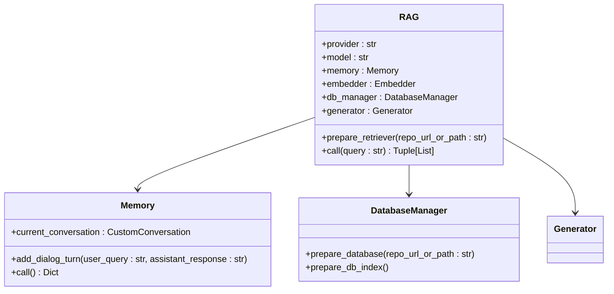
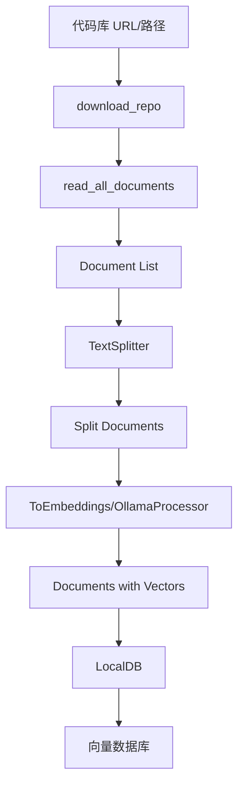
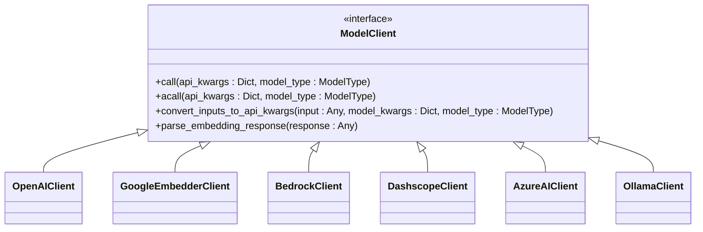
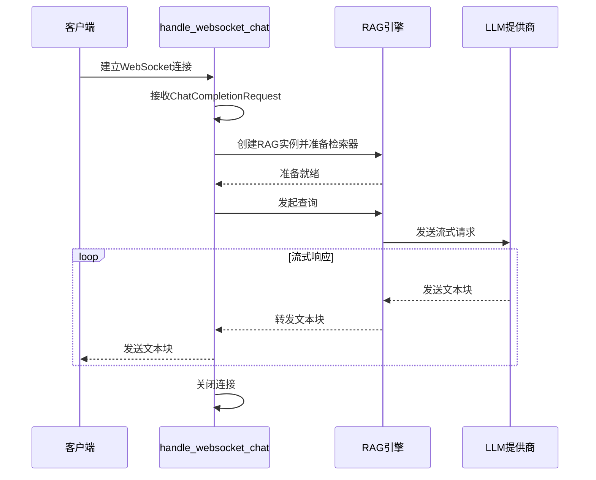

# 后端目录结构

<cite>
**本文档引用的文件**   
- [api.py](file://api/api.py)
- [rag.py](file://api/rag.py)
- [data_pipeline.py](file://api/data_pipeline.py)
- [websocket_wiki.py](file://api/websocket_wiki.py)
- [openai_client.py](file://api/openai_client.py)
- [google_embedder_client.py](file://api/google_embedder_client.py)
- [bedrock_client.py](file://api/bedrock_client.py)
- [dashscope_client.py](file://api/dashscope_client.py)
- [azureai_client.py](file://api/azureai_client.py)
- [config.py](file://api/config.py)
- [prompts.py](file://api/prompts.py)
- [ollama_patch.py](file://api/ollama_patch.py)
</cite>

## 目录
1. [项目结构概览](#项目结构概览)
2. [FastAPI主应用与路由定义](#fastapi主应用与路由定义)
3. [检索增强生成引擎核心逻辑](#检索增强生成引擎核心逻辑)
4. [数据处理流程](#数据处理流程)
5. [LLM客户端实现与适配策略](#llm客户端实现与适配策略)
6. [实时聊天WebSocket通信机制](#实时聊天websocket通信机制)

## 项目结构概览

`api/`目录是后端服务的核心，包含FastAPI应用、RAG引擎、数据处理管道和多种LLM客户端。主要模块包括：
- `api.py`: FastAPI主应用，定义了所有HTTP路由和依赖注入。
- `rag.py`: 检索增强生成（RAG）引擎，负责知识检索和回答生成。
- `data_pipeline.py`: 数据处理流程，负责文件读取、文本分割和向量化。
- `websocket_wiki.py`: WebSocket通信处理，支持实时聊天和SSE流式响应。
- `config.py`: 配置管理，集中处理环境变量和JSON配置文件。
- `prompts.py`: 所有系统提示词模板。
- `tools/embedder.py`: 嵌入模型（Embedder）的工厂函数。
- `clients/*.py`: 各大LLM提供商的客户端适配器。

**Section sources**
- [api.py](file://api/api.py#L1-L634)
- [rag.py](file://api/rag.py#L1-L445)
- [data_pipeline.py](file://api/data_pipeline.py#L1-L799)
- [websocket_wiki.py](file://api/websocket_wiki.py#L1-L769)
- [config.py](file://api/config.py#L1-L387)

## FastAPI主应用与路由定义

`api.py`文件是整个后端服务的入口点，使用FastAPI框架构建。它通过`FastAPI`类初始化应用，并配置了CORS中间件以允许跨域请求。

### 路由定义
应用定义了多个API端点，每个端点通过装饰器（如`@app.get`和`@app.post`）绑定到特定的HTTP方法和URL路径。关键端点包括：

- **`/models/config`**: 返回可用的模型提供商和模型列表。该端点读取`config/generator.json`配置文件，动态构建`ModelConfig`响应模型。
- **`/chat/completions/stream`**: 流式聊天完成端点，通过`simple_chat.py`模块实现。
- **`/ws/chat`**: WebSocket聊天端点，通过`websocket_wiki.py`模块实现。
- **`/api/wiki_cache`**: 用于获取和存储维基缓存的端点，支持CRUD操作。
- **`/export/wiki`**: 将维基内容导出为Markdown或JSON格式。

### 依赖注入机制
FastAPI的依赖注入机制在`api.py`中被充分利用。例如，`get_model_config`函数通过`response_model=ModelConfig`参数声明了响应模型，FastAPI会自动进行序列化和验证。此外，`WikiCacheRequest`等Pydantic模型作为请求体，实现了自动的数据验证和解析。

```mermaid
graph TD
A[FastAPI App] --> B[/models/config]
A --> C[/chat/completions/stream]
A --> D[/ws/chat]
A --> E[/api/wiki_cache]
A --> F[/export/wiki]
B --> G[ModelConfig]
C --> H[ChatCompletionRequest]
D --> I[ChatCompletionRequest]
E --> J[WikiCacheRequest]
F --> K[WikiExportRequest]
```

**Diagram sources**
- [api.py](file://api/api.py#L1-L634)

**Section sources**
- [api.py](file://api/api.py#L1-L634)

## 检索增强生成引擎核心逻辑

`rag.py`文件实现了检索增强生成（RAG）的核心逻辑，其核心类是`RAG`，它继承自`adal.Component`。

### 核心组件
`RAG`类在初始化时会创建以下关键组件：
- **Memory**: 一个自定义的对话管理类，用于存储和管理对话历史。
- **Embedder**: 通过`get_embedder`工厂函数获取，用于将文本转换为向量。
- **DatabaseManager**: 用于管理本地数据库的创建、加载和转换。
- **Generator**: 使用`adal.Generator`构建，负责生成最终的回答。

### 工作流程
1.  **准备检索器 (`prepare_retriever`)**: 当用户发起查询时，首先调用此方法。它会使用`DatabaseManager`从本地存储加载或创建一个包含文档向量的数据库。
2.  **验证嵌入 (`_validate_and_filter_embeddings`)**: 在创建检索器之前，会验证所有文档的嵌入向量大小是否一致，以避免FAISS索引创建失败。
3.  **创建检索器**: 使用`FAISSRetriever`和经过验证的文档创建一个检索器。
4.  **处理查询 (`call`)**: 接收用户查询，使用检索器从数据库中检索最相关的文档，然后将这些文档作为上下文传递给`Generator`来生成回答。



**Diagram sources**
- [rag.py](file://api/rag.py#L152-L444)

**Section sources**
- [rag.py](file://api/rag.py#L1-L445)

## 数据处理流程

`data_pipeline.py`文件定义了从原始代码库到向量数据库的完整数据处理流程。

### 文件读取 (`read_all_documents`)
该函数递归地读取指定路径下的所有文档。它支持多种代码和文档文件扩展名，并根据配置文件`config/repo.json`中的`file_filters`规则排除特定的目录和文件。读取的每个文件都被封装成一个`Document`对象，其中包含文件内容和元数据（如文件路径、类型、token数）。

### 文本分割与向量化 (`prepare_data_pipeline`, `transform_documents_and_save_to_db`)
1.  **文本分割**: 使用`TextSplitter`将长文档分割成较小的块，以适应嵌入模型的最大输入长度。
2.  **向量化**: 使用`ToEmbeddings`或`OllamaDocumentProcessor`（针对Ollama）将文本块转换为向量。`OllamaDocumentProcessor`是专门为Ollama设计的，因为Ollama不支持批量嵌入，需要逐个处理文档。
3.  **存储**: 处理后的文档（包含向量）被保存到一个本地数据库（`LocalDB`）中，以便后续快速检索。

### 数据库管理 (`DatabaseManager`)
`DatabaseManager`类是整个流程的协调者。它负责：
- 下载或定位代码库。
- 调用`read_all_documents`读取文件。
- 调用`prepare_data_pipeline`和`transform_documents_and_save_to_db`来处理和存储数据。
- 提供`prepare_database`和`prepare_retriever`方法供`RAG`引擎调用。



**Diagram sources**
- [data_pipeline.py](file://api/data_pipeline.py#L701-L880)

**Section sources**
- [data_pipeline.py](file://api/data_pipeline.py#L1-L799)

## LLM客户端实现与适配策略

项目通过实现`ModelClient`接口来适配不同的LLM提供商，如OpenAI、Google Gemini、Ollama、AWS Bedrock、Azure AI和阿里云通义千问（DashScope）。

### 统一接口 (`ModelClient`)
所有客户端都继承自`adal.core.model_client.ModelClient`基类，实现了`call`和`acall`方法。这使得上层应用（如`Generator`）可以无缝切换不同的模型提供商。

### 适配策略
- **`OpenAIClient`**: 适配标准的OpenAI API，支持流式响应和非流式响应。对于非流式请求，它会模拟流式行为以保证接口一致性。
- **`GoogleEmbedderClient`**: 专门用于Google的嵌入模型（如`text-embedding-004`），实现了`convert_inputs_to_api_kwargs`和`parse_embedding_response`方法。
- **`BedrockClient`**: 适配AWS Bedrock，支持多种基础模型（如Claude）。它根据模型ID（如`anthropic.claude-3-sonnet`）动态格式化请求体。
- **`DashscopeClient`**: 适配阿里云通义千问，其API与OpenAI兼容，因此复用了`OpenAI`客户端库，但增加了对`enable_thinking`等特定参数的支持。
- **`AzureAIClient`**: 适配Azure OpenAI服务，支持API密钥和Azure AD令牌两种认证方式。

### 配置驱动 (`config.py`)
`config.py`是客户端配置的核心。它通过`generator.json`和`embedder.json`文件定义了每个提供商的默认模型、参数和客户端类。`get_model_config`函数根据请求的`provider`和`model`参数，返回正确的`model_client`和`model_kwargs`。



**Diagram sources**
- [openai_client.py](file://api/openai_client.py#L119-L586)
- [google_embedder_client.py](file://api/google_embedder_client.py#L1-L230)
- [bedrock_client.py](file://api/bedrock_client.py#L1-L317)
- [dashscope_client.py](file://api/dashscope_client.py#L1-L799)
- [azureai_client.py](file://api/azureai_client.py#L1-L487)
- [config.py](file://api/config.py#L1-L387)

**Section sources**
- [openai_client.py](file://api/openai_client.py#L1-L629)
- [google_embedder_client.py](file://api/google_embedder_client.py#L1-L230)
- [bedrock_client.py](file://api/bedrock_client.py#L1-L317)
- [dashscope_client.py](file://api/dashscope_client.py#L1-L799)
- [azureai_client.py](file://api/azureai_client.py#L1-L487)
- [config.py](file://api/config.py#L1-L387)

## 实时聊天WebSocket通信机制

`websocket_wiki.py`文件实现了基于WebSocket的实时聊天功能，支持SSE（Server-Sent Events）流式响应。

### WebSocket处理 (`handle_websocket_chat`)
该函数是WebSocket的主处理程序，它：
1.  **接收请求**: 接收来自客户端的JSON格式的`ChatCompletionRequest`。
2.  **初始化RAG**: 根据请求中的`provider`和`model`参数创建`RAG`实例，并准备检索器。
3.  **构建提示词**: 根据用户查询、对话历史、文件内容和检索到的上下文，动态构建一个复杂的提示词。
4.  **流式响应**: 根据所选的`provider`，调用相应的`acall`方法获取流式响应，并通过`websocket.send_text`将每个文本块实时发送给客户端。

### 流式响应处理
对于不同的提供商，流式响应的处理方式不同：
- **Ollama, OpenRouter**: 响应是字符串流，直接发送。
- **OpenAI, Azure AI**: 响应是`ChatCompletionChunk`对象流，需要提取`delta.content`。
- **Google Gemini**: 响应是`Content`对象流，需要提取`text`属性。

### 错误处理与降级
该模块实现了强大的错误处理机制。当遇到token限制等错误时，它会自动降级，尝试使用一个简化版的提示词（不包含检索上下文）重新发起请求，以确保用户能获得部分响应。



**Diagram sources**
- [websocket_wiki.py](file://api/websocket_wiki.py#L1-L769)

**Section sources**
- [websocket_wiki.py](file://api/websocket_wiki.py#L1-L769)