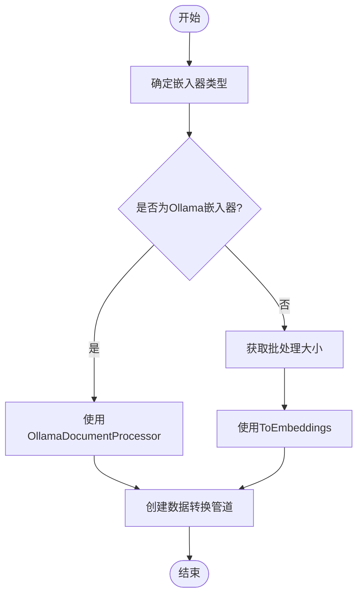
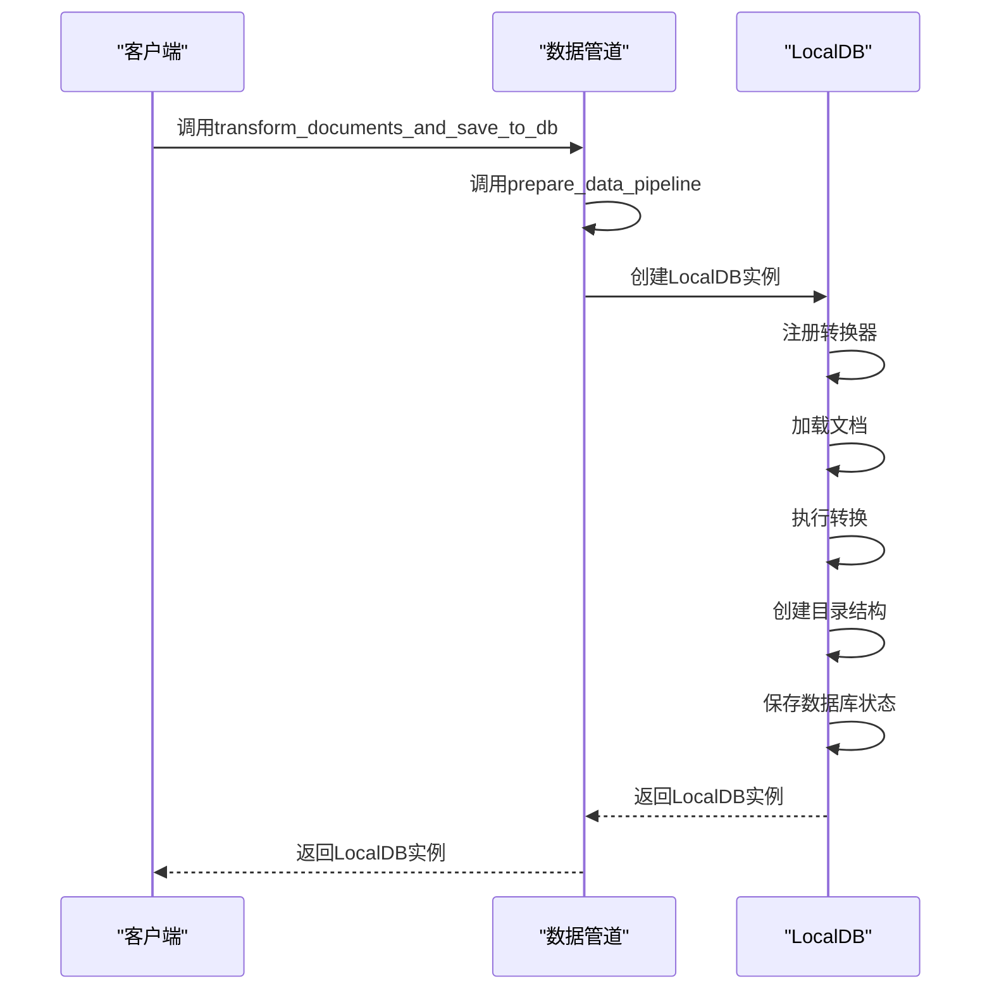
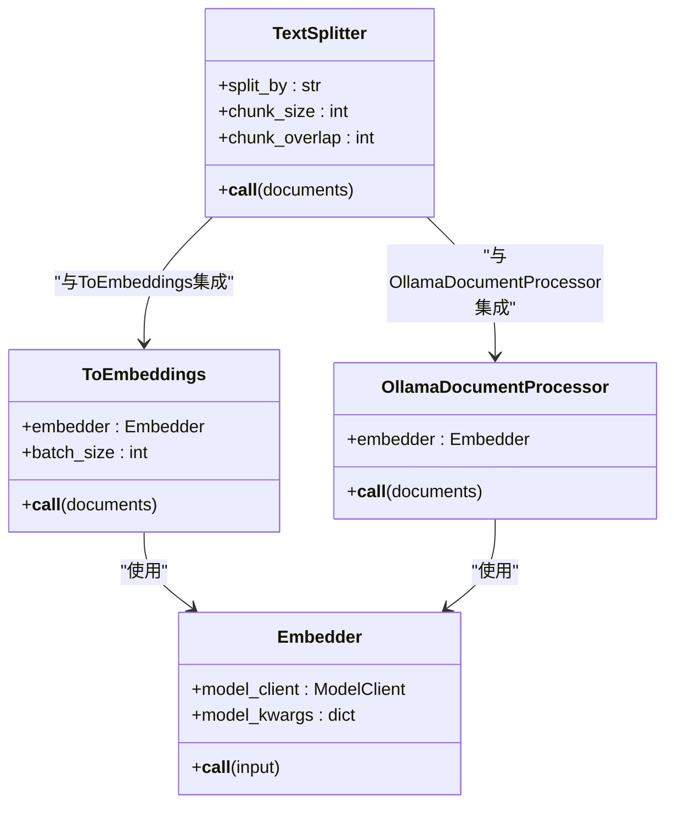

# 向量化管道

<cite>
**本文档中引用的文件**  
- [api/data_pipeline.py](file://api/data_pipeline.py)
- [api/tools/embedder.py](file://api/tools/embedder.py)
- [api/config/embedder.json](file://api/config/embedder.json)
- [api/ollama_patch.py](file://api/ollama_patch.py)
- [api/config.py](file://api/config.py)
</cite>

## 目录
1. [向量化管道概述](#向量化管道概述)
2. [数据管道初始化](#数据管道初始化)
3. [文档转换与持久化](#文档转换与持久化)
4. [文本分割与嵌入集成](#文本分割与嵌入集成)
5. [嵌入器类型对比与批处理差异](#嵌入器类型对比与批处理差异)
6. [配置与性能优化实践](#配置与性能优化实践)

## 向量化管道概述

向量化管道是`deepwiki-open`项目中用于将代码库文档转换为向量表示的核心组件。该管道通过`api/data_pipeline.py`中的`prepare_data_pipeline`和`transform_documents_and_save_to_db`函数实现，支持多种嵌入模型（OpenAI、Google、Ollama）并利用`adal.Sequential`链式执行分割和嵌入操作。管道首先从GitHub、GitLab或Bitbucket等源代码仓库读取文档，然后根据配置对文档进行递归分割，并使用指定的嵌入模型生成向量表示，最终将结果持久化到FAISS向量数据库中。

**Section sources**
- [api/data_pipeline.py](file://api/data_pipeline.py#L0-L882)

## 数据管道初始化

`prepare_data_pipeline`函数负责创建和返回数据转换管道。该函数根据配置选择适当的嵌入器类型（OpenAI、Google或Ollama），并构建一个由`TextSplitter`和嵌入转换器组成的序列化管道。对于Ollama嵌入器，由于其不支持批量嵌入，系统使用`OllamaDocumentProcessor`逐个处理文档；而对于OpenAI和Google嵌入器，则使用`ToEmbeddings`组件进行批量处理。管道的批处理大小由嵌入器配置中的`batch_size`参数决定，其中OpenAI和Google嵌入器的默认批处理大小分别为500和100。

**Diagram sources**
- [api/data_pipeline.py](file://api/data_pipeline.py#L372-L414)
- [api/tools/embedder.py](file://api/tools/embedder.py#L0-L54)

**Section sources**
- [api/data_pipeline.py](file://api/data_pipeline.py#L372-L414)
- [api/tools/embedder.py](file://api/tools/embedder.py#L0-L54)

## 文档转换与持久化

`transform_documents_and_save_to_db`函数负责将文档列表转换为向量表示并保存到本地数据库。该函数首先调用`prepare_data_pipeline`获取数据转换器，然后创建一个`LocalDB`实例，注册转换器，并加载文档进行转换。转换完成后，系统会创建必要的目录结构并将数据库状态保存到指定路径。`LocalDB`的使用包括文档注册、转换和持久化三个主要步骤，确保了向量数据的可靠存储和快速检索。

**Diagram sources**
- [api/data_pipeline.py](file://api/data_pipeline.py#L416-L440)
- [api/config.py](file://api/config.py#L0-L387)

**Section sources**
- [api/data_pipeline.py](file://api/data_pipeline.py#L416-L440)
- [api/config.py](file://api/config.py#L0-L387)

## 文本分割与嵌入集成

`TextSplitter`组件根据`config.json`中的配置对文档进行递归分割，确保每个文本块的大小符合嵌入模型的要求。分割策略由`split_by`、`chunk_size`和`chunk_overlap`等参数控制，支持按单词、句子或段落进行分割。`ToEmbeddings`或`OllamaDocumentProcessor`组件与`api/tools/embedder.py`中的嵌入模型集成，通过`get_embedder`函数获取配置的嵌入器实例。对于Ollama嵌入器，系统会验证模型是否存在，并在处理过程中检查嵌入向量的一致性，确保数据质量。

**Diagram sources**
- [api/data_pipeline.py](file://api/data_pipeline.py#L815-L866)
- [api/ollama_patch.py](file://api/ollama_patch.py#L61-L104)
- [api/tools/embedder.py](file://api/tools/embedder.py#L0-L54)

**Section sources**
- [api/data_pipeline.py](file://api/data_pipeline.py#L815-L866)
- [api/ollama_patch.py](file://api/ollama_patch.py#L61-L104)
- [api/tools/embedder.py](file://api/tools/embedder.py#L0-L54)

## 嵌入器类型对比与批处理差异

不同嵌入器在批处理能力上存在显著差异。OpenAI和Google嵌入器支持批量处理，能够同时处理多个文档，提高效率；而Ollama嵌入器由于不支持批量嵌入，需要逐个处理文档，导致处理速度较慢。批处理大小由嵌入器配置中的`batch_size`参数控制，OpenAI嵌入器的默认批处理大小为500，Google嵌入器为100。`adal.Sequential`组件通过链式执行分割和嵌入操作，确保了数据处理的流畅性和一致性。

| 嵌入器类型 | 批处理支持 | 默认批处理大小 | 处理方式 |
| --- | --- | --- | --- |
| OpenAI | 是 | 500 | 批量处理 |
| Google | 是 | 100 | 批量处理 |
| Ollama | 否 | 1 | 逐个处理 |

**Section sources**
- [api/config/embedder.json](file://api/config/embedder.json#L0-L33)
- [api/data_pipeline.py](file://api/data_pipeline.py#L372-L414)

## 配置与性能优化实践

配置嵌入器类型和优化性能的关键在于合理设置环境变量和配置文件。通过设置`DEEPWIKI_EMBEDDER_TYPE`环境变量，可以指定使用的嵌入器类型（openai、google或ollama）。在`embedder.json`配置文件中，可以调整`batch_size`、`model`等参数以优化性能。对于大型代码库，建议使用支持批量处理的嵌入器（如OpenAI或Google），并适当增加批处理大小以提高处理效率。此外，通过排除不必要的目录和文件（如`node_modules`、`dist`等），可以减少处理时间和资源消耗。

**Section sources**
- [api/config.py](file://api/config.py#L0-L387)
- [api/config/embedder.json](file://api/config/embedder.json#L0-L33)