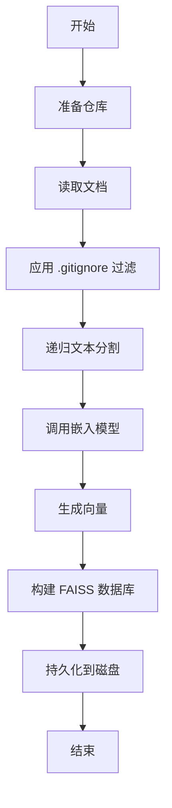
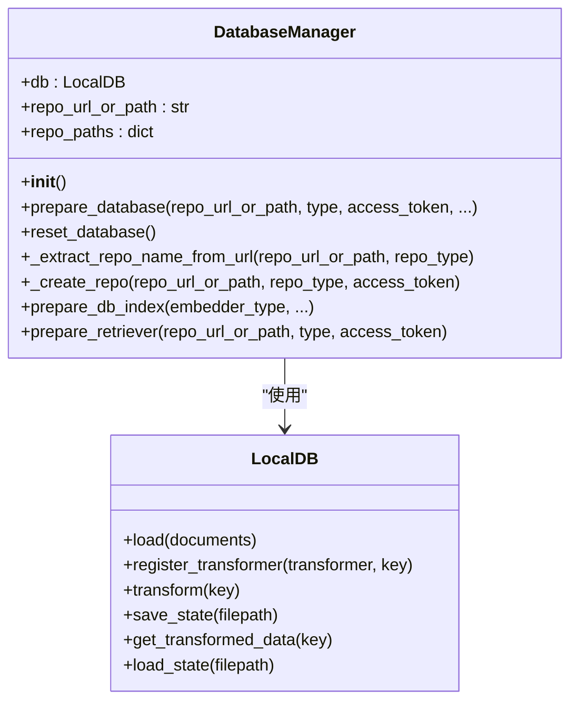
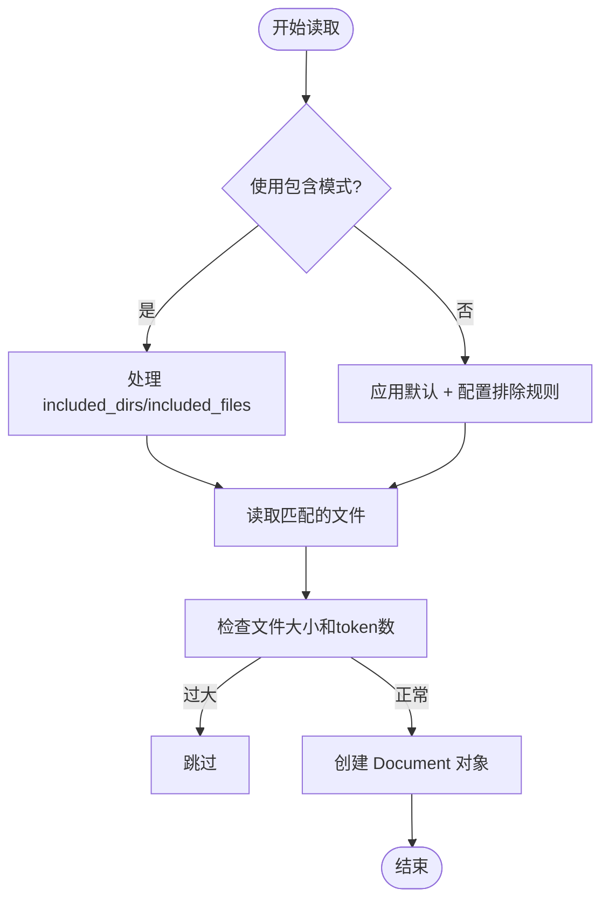
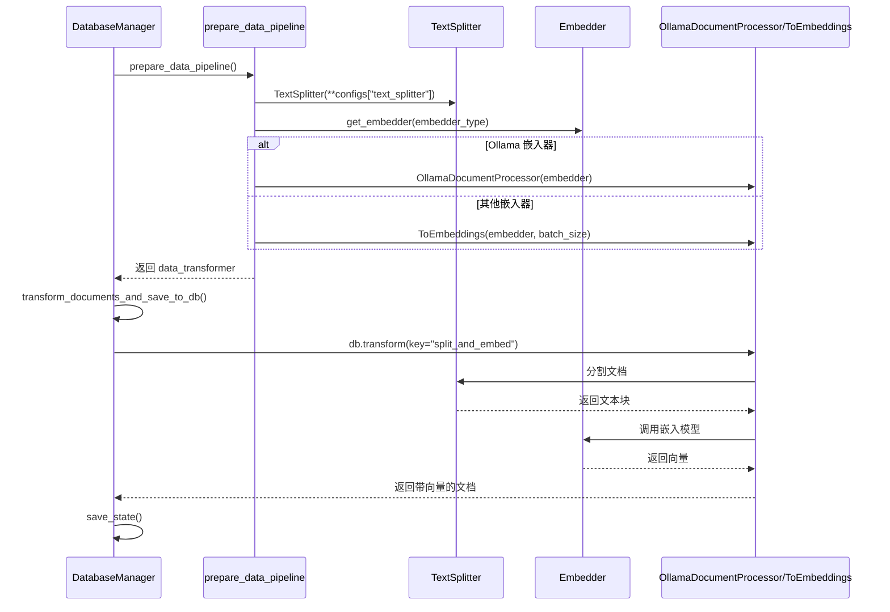

# 数据管道

<cite>
**本文档中引用的文件**   
- [data_pipeline.py](file://api/data_pipeline.py)
- [embedder.py](file://api/tools/embedder.py)
- [embedder.json](file://api/config/embedder.json)
- [repo.json](file://api/config/repo.json)
- [bedrock_client.py](file://api/bedrock_client.py)
</cite>

## 更新摘要
**变更内容**   
- 新增对AWS Bedrock嵌入器的支持
- 更新`download_repo`函数以对访问令牌进行URL编码，防止认证失败
- 在`count_tokens`函数中增加对Bedrock嵌入器的token估算支持
- 更新嵌入模型集成部分以包含Bedrock客户端
- 更新配置与性能调优部分以包含Bedrock相关配置

## 目录
1. [简介](#简介)
2. [数据处理流程概览](#数据处理流程概览)
3. [核心组件分析](#核心组件分析)
4. [文件读取与过滤机制](#文件读取与过滤机制)
5. [文本分割与向量化](#文本分割与向量化)
6. [嵌入模型集成](#嵌入模型集成)
7. [配置与性能调优](#配置与性能调优)
8. [持久化机制](#持久化机制)

## 简介
本文件全面阐述了`api/data_pipeline.py`定义的数据处理管道架构。该系统负责从代码仓库读取源码文件，应用过滤规则，进行文本分割，并通过嵌入模型生成向量表示，最终构建可检索的知识库。文档详细说明了`DataProcessor`（由`DatabaseManager`实现）如何协调整个流程，包括与`tools/embedder.py`的集成方式、FAISS向量数据库的构建与持久化机制。

## 数据处理流程概览



**图示来源**
- [data_pipeline.py](file://api/data_pipeline.py#L701-L880)

## 核心组件分析

`DatabaseManager`是数据管道的核心协调者，负责管理数据库的创建、加载、转换和持久化。



**图示来源**
- [data_pipeline.py](file://api/data_pipeline.py#L701-L880)

**本节来源**
- [data_pipeline.py](file://api/data_pipeline.py#L701-L880)

## 文件读取与过滤机制

数据管道通过`read_all_documents`函数实现文件的递归读取和智能过滤。

### 过滤模式
系统支持两种过滤模式：
- **排除模式**：默认模式，基于`DEFAULT_EXCLUDED_DIRS`、`DEFAULT_EXCLUDED_FILES`以及`repo.json`中的配置排除特定目录和文件。
- **包含模式**：当指定了`included_dirs`或`included_files`时激活，仅处理指定的目录和文件。

### 支持的文件类型
- **代码文件**：`.py`, `.js`, `.ts`, `.java`, `.cpp`, `.c`, `.h`, `.hpp`, `.go`, `.rs`, `.jsx`, `.tsx`, `.html`, `.css`, `.php`, `.swift`, `.cs`
- **文档文件**：`.md`, `.txt`, `.rst`, `.json`, `.yaml`, `.yml`

### 过滤规则来源
`repo.json`文件定义了详细的排除规则，包括虚拟环境、包管理器、版本控制、编译产物、日志文件等。



**图示来源**
- [data_pipeline.py](file://api/data_pipeline.py#L143-L370)
- [repo.json](file://api/config/repo.json#L1-L128)

**本节来源**
- [data_pipeline.py](file://api/data_pipeline.py#L143-L370)
- [repo.json](file://api/config/repo.json#L1-L128)

## 文本分割与向量化

数据管道使用`adalflow`框架的`TextSplitter`和`ToEmbeddings`组件进行文本处理。



**图示来源**
- [data_pipeline.py](file://api/data_pipeline.py#L372-L440)
- [data_pipeline.py](file://api/data_pipeline.py#L701-L880)
- [ollama_patch.py](file://api/ollama_patch.py#L61-L104)

**本节来源**
- [data_pipeline.py](file://api/data_pipeline.py#L372-L440)
- [ollama_patch.py](file://api/ollama_patch.py#L61-L104)

## 嵌入模型集成

`tools/embedder.py`模块提供了`get_embedder`函数，用于根据配置创建相应的嵌入模型实例。

### 集成方式
1.  **配置驱动**：`get_embedder`函数根据`embedder_type`参数或环境变量`DEEPWIKI_EMBEDDER_TYPE`从`embedder.json`中加载对应的配置。
2.  **模型选择**：支持`openai`、`google`、`ollama`和`bedrock`四种嵌入模型。
3.  **客户端初始化**：根据配置中的`client_class`（如`OllamaClient`、`GoogleEmbedderClient`、`BedrockClient`）动态创建客户端实例。

### 处理器适配
- **Ollama**：由于`adalflow`的`OllamaClient`不支持批量嵌入，系统使用`OllamaDocumentProcessor`对每个文档进行单独处理。
- **OpenAI/Google/Bedrock**：使用`ToEmbeddings`组件进行批量处理，效率更高。

### AWS Bedrock 集成
新增对AWS Bedrock嵌入器的支持，通过`BedrockClient`与AWS Bedrock服务集成。配置在`embedder.json`中定义，支持`amazon.titan-embed-text-v2:0`等模型。

**本节来源**
- [embedder.py](file://api/tools/embedder.py#L5-L53)
- [embedder.json](file://api/config/embedder.json#L1-L33)
- [bedrock_client.py](file://api/bedrock_client.py#L1-L467)

## 配置与性能调优

系统的分块策略和性能参数均通过配置文件进行管理。

### 分块策略配置
在`embedder.json`中定义，通过`configs["text_splitter"]`传递给`TextSplitter`。

| 配置项 | 默认值 | 说明 |
| :--- | :--- | :--- |
| `split_by` | `word` | 分割单位（按单词） |
| `chunk_size` | `350` | 每个文本块的大小 |
| `chunk_overlap` | `100` | 相邻文本块的重叠大小 |

### 性能调优参数
| 参数 | 配置位置 | 说明 |
| :--- | :--- | :--- |
| `batch_size` | `embedder.json` | 批量处理大小，Ollama为500，Google和Bedrock为100 |
| `MAX_EMBEDDING_TOKENS` | `data_pipeline.py` | 单个文件的最大token限制（8192） |
| `OLLAMA_HOST` | 环境变量 | Ollama服务的主机地址 |
| `AWS_ACCESS_KEY_ID` | 环境变量 | AWS访问密钥ID |
| `AWS_SECRET_ACCESS_KEY` | 环境变量 | AWS密钥访问密钥 |
| `AWS_REGION` | 环境变量 | AWS区域 |

### Bedrock 配置
在`embedder.json`中，`embedder_bedrock`配置项包含Bedrock嵌入器的配置：
```json
"embedder_bedrock": {
    "client_class": "BedrockClient",
    "batch_size": 100,
    "model_kwargs": {
      "model": "amazon.titan-embed-text-v2:0",
      "dimensions": 256
    }
}
```

**本节来源**
- [embedder.json](file://api/config/embedder.json#L1-L33)
- [data_pipeline.py](file://api/data_pipeline.py#L69-L138)
- [config.py](file://api/config.py#L1-L416)

## 持久化机制

数据管道利用`adalflow`的`LocalDB`类实现向量数据库的持久化。

### 工作流程
1.  **路径生成**：`_create_repo`方法根据仓库URL生成唯一的存储路径（`~/.adalflow/repos/{owner}_{repo}` 和 `~/.adalflow/databases/{owner}_{repo}.pkl`）。
2.  **状态检查**：`prepare_db_index`方法首先检查`.pkl`文件是否存在。若存在，则直接加载已处理的向量数据，避免重复计算。
3.  **保存状态**：处理完成后，调用`db.save_state(filepath)`将包含文档、分割块和向量的完整`LocalDB`对象序列化并保存到`.pkl`文件中。

此机制确保了处理结果的持久化，并支持后续的快速加载和检索。

### 访问令牌URL编码
在`download_repo`函数中，对访问令牌进行URL编码以防止认证失败：
```python
if access_token:
    parsed = urlparse(repo_url)
    # URL-encode the token to handle special characters
    encoded_token = quote(access_token, safe='')
```

**本节来源**
- [data_pipeline.py](file://api/data_pipeline.py#L701-L880)
- [data_pipeline.py](file://api/data_pipeline.py#L416-L440)
- [data_pipeline.py](file://api/data_pipeline.py#L71-L147)