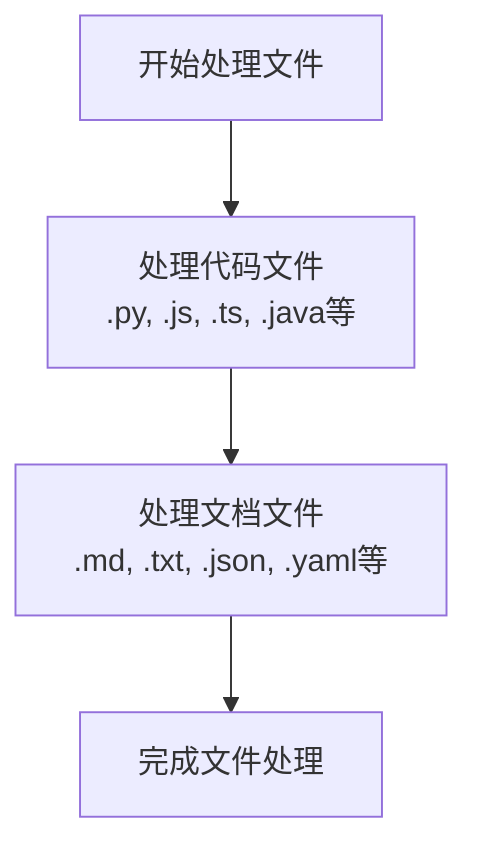
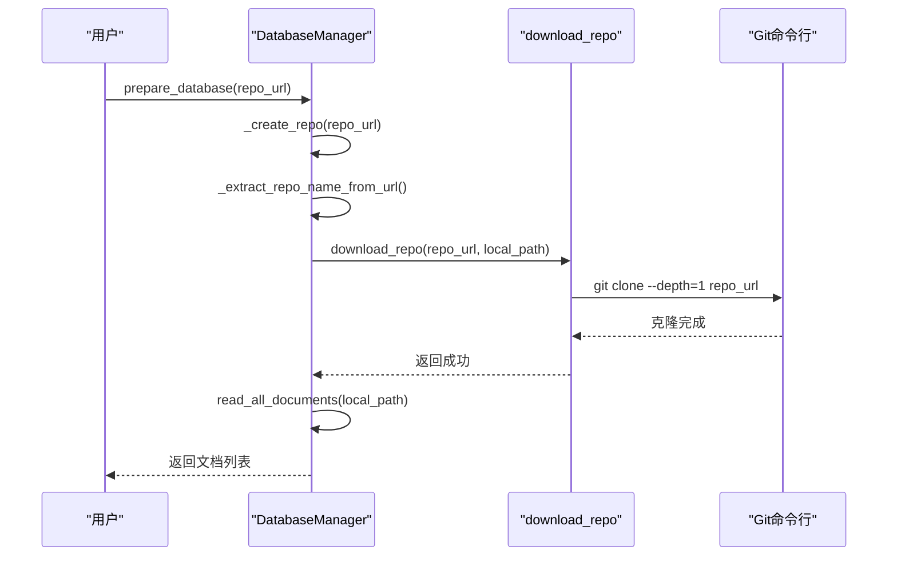
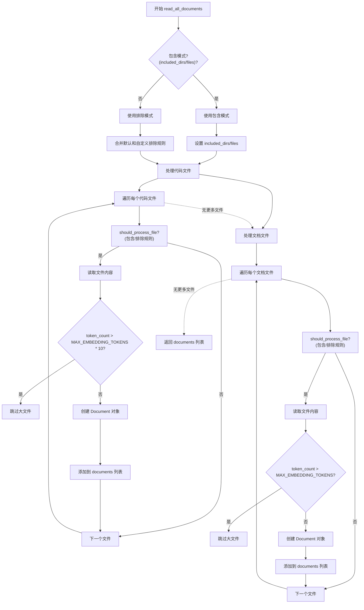

# 文件处理

<cite>
**Referenced Files in This Document**   
- [data_pipeline.py](file://api/data_pipeline.py)
- [config.py](file://api/config.py)
- [logging_config.py](file://api/logging_config.py)
</cite>

## 目录
1. [引言](#引言)
2. [文件处理机制概述](#文件处理机制概述)
3. [核心函数分析](#核心函数分析)
4. [文件过滤与优先级处理](#文件过滤与优先级处理)
5. [远程仓库处理](#远程仓库处理)
6. [配置与常量](#配置与常量)
7. [性能与限制](#性能与限制)
8. [决策流程图](#决策流程图)

## 引言
本文档详细阐述了`api/data_pipeline.py`模块中的文件处理机制，重点分析了`read_all_documents`函数如何递归读取代码库中的文件，并根据配置的包含/排除规则进行过滤。文档解释了对不同文件类型的优先级处理逻辑，以及如何通过`.gitignore`规则和自定义配置（`DEFAULT_EXCLUDED_DIRS`、`DEFAULT_EXCLUDED_FILES`）进行过滤。同时，文档描述了`should_process_file`函数的决策流程，并结合`download_repo`函数说明了远程仓库的克隆与本地路径处理机制。

## 文件处理机制概述
`data_pipeline.py`模块提供了完整的文件处理流水线，用于从本地或远程代码库中提取文档内容，为后续的嵌入和检索做准备。该机制的核心是`read_all_documents`函数，它实现了递归遍历目录、文件过滤、内容读取和文档对象创建的完整流程。

文件处理流程遵循以下主要步骤：
1. 根据配置确定使用包含模式还是排除模式
2. 递归搜索指定路径下的所有文件
3. 应用包含/排除规则过滤文件
4. 按优先级顺序处理不同类型的文件
5. 创建包含元数据的文档对象
6. 返回文档列表供后续处理

该机制设计灵活，支持通过参数动态调整过滤规则，同时提供了默认的排除列表以避免处理不必要的文件。

**Section sources**
- [data_pipeline.py](file://api/data_pipeline.py#L143-L370)

## 核心函数分析

### read_all_documents 函数
`read_all_documents`函数是文件处理的核心，负责递归读取指定路径下的所有文档。该函数支持多种配置选项，包括嵌入器类型、排除目录/文件列表以及包含目录/文件列表。

函数首先根据参数确定使用包含模式还是排除模式。当提供了`included_dirs`或`included_files`参数时，启用包含模式，仅处理指定的目录和文件；否则使用排除模式，排除指定的目录和文件。

函数内部定义了`should_process_file`嵌套函数，用于判断单个文件是否应该被处理。该函数根据包含/排除规则进行决策，确保只有符合条件的文件才会被读取。

**Section sources**
- [data_pipeline.py](file://api/data_pipeline.py#L143-L370)

### should_process_file 决策逻辑
`should_process_file`函数实现了文件处理的决策逻辑，根据包含/排除模式和相应的规则列表判断文件是否应该被处理。

在包含模式下，函数检查文件路径是否包含在`included_dirs`列表中，或者文件名是否匹配`included_files`列表中的模式。只要满足任一条件，文件就会被处理。

在排除模式下，函数检查文件路径是否包含在`excluded_dirs`列表中，或者文件名是否完全匹配`excluded_files`列表中的条目。如果文件匹配任何排除规则，则不会被处理。

该函数通过`os.path.normpath`和`os.sep`确保路径分隔符的跨平台兼容性，并使用`strip("./")`和`rstrip("/")`规范化目录路径，确保规则匹配的准确性。

**Section sources**
- [data_pipeline.py](file://api/data_pipeline.py#L208-L289)

### download_repo 函数
`download_repo`函数负责从远程Git仓库（GitHub、GitLab或Bitbucket）克隆代码库到本地指定路径。该函数支持通过访问令牌进行身份验证，适用于私有仓库。

函数首先检查Git是否已安装，然后创建目标目录。如果提供了访问令牌，函数会根据仓库类型（GitHub、GitLab或Bitbucket）构造包含认证信息的克隆URL。克隆操作使用`--depth=1`和`--single-branch`选项以提高效率，只克隆最新版本的主分支。

错误处理机制完善，能够捕获并处理各种异常情况，包括克隆失败、网络错误等。敏感信息（如访问令牌）在错误消息中会被屏蔽，确保安全性。

**Section sources**
- [data_pipeline.py](file://api/data_pipeline.py#L69-L138)

## 文件过滤与优先级处理

### 文件类型优先级
文件处理机制对不同类型的文件设置了明确的优先级。代码文件（如`.py`、`.js`、`.ts`等）被赋予最高优先级，首先被处理；文档文件（如`.md`、`.txt`、`.json`等）其次被处理。

这种优先级设置确保了核心代码内容优先被索引，而文档和配置文件作为补充信息。代码文件列表包括常见的编程语言扩展名，如Python、JavaScript、TypeScript、Java、C++、Go等，覆盖了大多数开发场景。

**Diagram sources**
- [data_pipeline.py](file://api/data_pipeline.py#L170-L171)

### 包含与排除模式
文件处理支持两种过滤模式：包含模式和排除模式。包含模式通过`included_dirs`和`included_files`参数指定需要处理的目录和文件，仅处理匹配的项目。排除模式通过`excluded_dirs`和`excluded_files`参数指定需要排除的目录和文件，处理所有不匹配的项目。

默认情况下使用排除模式，结合`DEFAULT_EXCLUDED_DIRS`和`DEFAULT_EXCLUDED_FILES`常量提供的默认排除列表。用户可以通过参数覆盖或扩展这些默认值，实现灵活的文件过滤。

## 远程仓库处理
远程仓库处理机制通过`download_repo`函数和`DatabaseManager`类协同工作。当用户提供远程仓库URL时，系统会自动下载仓库到本地缓存目录（`~/.adalflow/repos/`），然后对本地副本进行文件处理。

`DatabaseManager`类的`_create_repo`方法负责管理仓库的本地存储。它首先解析仓库URL，提取所有者和仓库名称作为唯一标识符，然后调用`download_repo`函数进行克隆。如果本地已存在非空的仓库目录，则直接使用现有副本，避免重复下载。

这种机制确保了远程仓库的高效处理，同时通过本地缓存提高了后续访问的性能。

**Diagram sources**
- [data_pipeline.py](file://api/data_pipeline.py#L69-L138)
- [data_pipeline.py](file://api/data_pipeline.py#L598-L638)

## 配置与常量

### 默认排除列表
系统定义了两个重要的默认排除列表：`DEFAULT_EXCLUDED_DIRS`和`DEFAULT_EXCLUDED_FILES`，位于`api/config.py`文件中。这些列表包含了常见的不需要处理的目录和文件模式。

`DEFAULT_EXCLUDED_DIRS`包括虚拟环境目录（如`.venv`、`node_modules`）、版本控制目录（如`.git`）、构建输出目录（如`dist`、`build`）和IDE配置目录（如`.vscode`、`.idea`）。

`DEFAULT_EXCLUDED_FILES`包括锁定文件（如`package-lock.json`、`yarn.lock`）、环境文件（如`.env`）、编译文件（如`.pyc`、`.class`）和各种配置文件（如`.gitignore`、`.editorconfig`）。

这些默认排除列表可以通过`configs`配置对象中的`file_filters`字段进行扩展或覆盖，提供了灵活的配置能力。

**Section sources**
- [config.py](file://api/config.py#L262-L300)

### 配置加载机制
配置系统通过`load_json_config`函数从JSON文件中加载配置，并支持环境变量占位符替换。主要配置文件包括`embedder.json`、`generator.json`、`repo.json`和`lang.json`。

`configs`全局变量聚合了所有配置，包括嵌入器配置、生成器配置、仓库配置和语言配置。这种集中式的配置管理简化了配置的访问和使用。

## 性能与限制

### Token计数限制
系统通过`MAX_EMBEDDING_TOKENS`常量（值为8192）限制单个文件的最大token数量。该限制适用于嵌入模型的输入大小约束。

`count_tokens`函数使用`tiktoken`库精确计算文本的token数量。对于Ollama和Google嵌入器，使用`cl100k_base`编码；对于OpenAI嵌入器，使用`text-embedding-3-small`模型的编码。

当文件的token数量超过限制时，系统会跳过该文件并记录警告。代码文件的限制是文档文件的10倍（`MAX_EMBEDDING_TOKENS * 10`），允许处理更大的源代码文件。

### 大文件处理
对于超过token限制的大文件，系统会跳过处理并记录警告信息。这种设计避免了内存溢出和嵌入模型的超限错误，确保了系统的稳定性。

文件读取使用UTF-8编码，确保了对各种字符集的支持。错误处理机制能够捕获文件读取过程中的各种异常，如权限错误、编码错误等，并记录相应的错误信息。

**Section sources**
- [data_pipeline.py](file://api/data_pipeline.py#L20-L67)

## 决策流程图
以下流程图展示了文件处理的完整决策流程，从路径遍历到文件过滤再到文档创建的全过程。

**Diagram sources**
- [data_pipeline.py](file://api/data_pipeline.py#L143-L370)