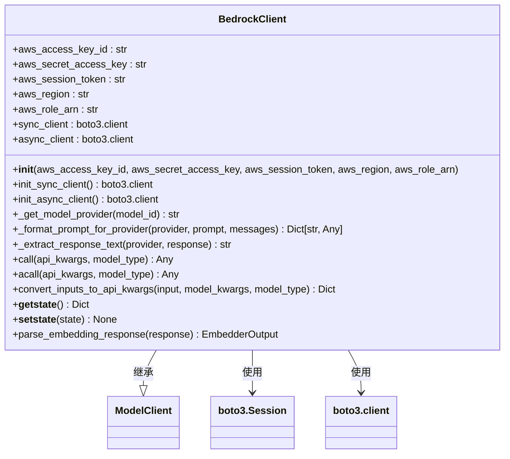
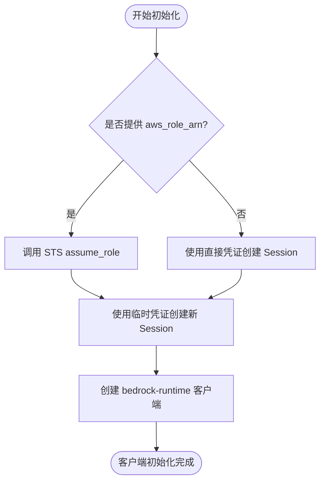
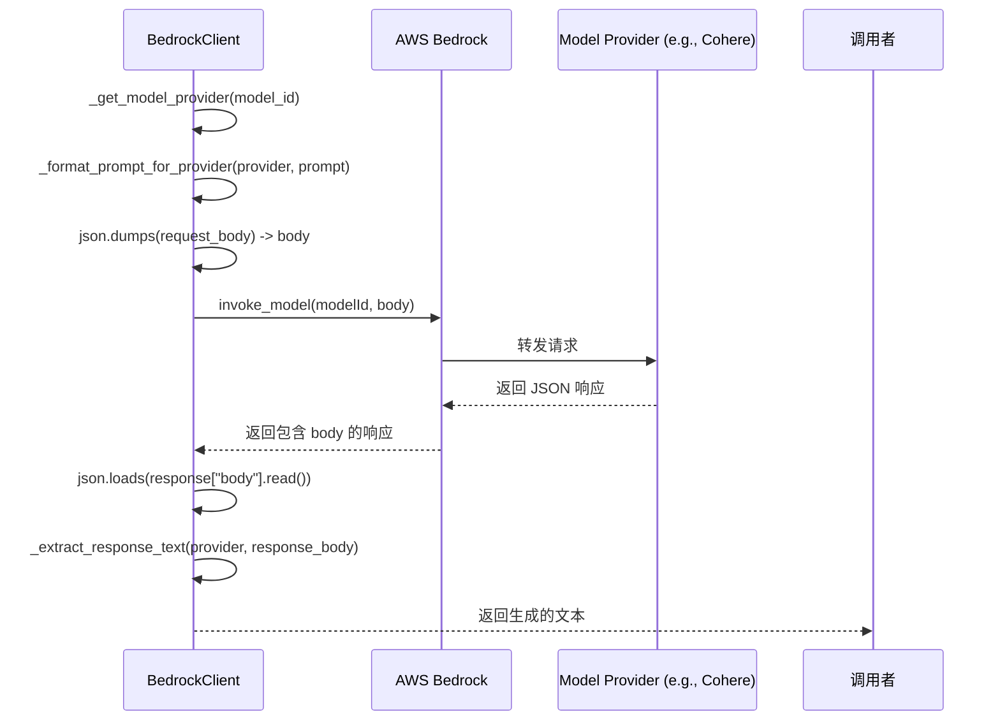

# Bedrock客户端

<cite>
**Referenced Files in This Document**   
- [bedrock_client.py](file://api/bedrock_client.py)
- [config.py](file://api/config.py)
- [logging_config.py](file://api/logging_config.py)
</cite>

## 更新摘要
**变更内容**   
- 新增对嵌入模型（Amazon Titan, Cohere）的全面支持
- 新增对picklable序列化的支持说明
- 新增AWS会话令牌的配置说明
- 更新身份验证与初始化流程以包含会话令牌和序列化机制
- 扩展模型调用机制以涵盖嵌入模型处理
- 更新请求与响应处理以包含嵌入模型的请求构建和响应解析

## 目录
1. [简介](#简介)
2. [核心功能与架构](#核心功能与架构)
3. [身份验证与初始化](#身份验证与初始化)
4. [模型调用机制](#模型调用机制)
5. [请求与响应处理](#请求与响应处理)
6. [错误处理与重试](#错误处理与重试)
7. [配置与环境变量](#配置与环境变量)
8. [结论](#结论)

## 简介

`BedrockClient` 是一个用于与 Amazon Bedrock 服务进行交互的 Python 客户端封装。它作为 `adalflow` 框架的一部分，提供了一个统一的接口来访问多种基础模型（Foundation Models），包括 Amazon 自身的模型以及第三方模型，如 Anthropic 的 Claude 系列和 Cohere 的嵌入与生成模型。本文档深入解析了该客户端的实现，重点说明其如何通过 AWS SDK（boto3）与 Amazon Bedrock 服务进行交互。

**Section sources**
- [bedrock_client.py](file://api/bedrock_client.py#L1-L318)

## 核心功能与架构

`BedrockClient` 类继承自 `ModelClient` 基类，实现了与 AWS Bedrock 服务通信所需的核心方法。其主要功能包括：
- **初始化客户端**：根据提供的 AWS 凭证创建 `boto3` 会话和 `bedrock-runtime` 客户端。
- **模型调用**：通过 `call` 方法同步调用模型，通过 `acall` 方法提供异步调用支持。
- **输入转换**：将框架的输入和模型参数转换为 Bedrock API 所需的 `api_kwargs` 格式。
- **多提供商支持**：能够根据模型 ID 自动识别模型提供商（如 `anthropic`, `cohere`），并相应地格式化请求体。
- **嵌入模型支持**：新增对 `ModelType.EMBEDDER` 的支持，可调用 Amazon Titan 和 Cohere 的嵌入模型。
- **序列化支持**：实现 `__getstate__` 和 `__setstate__` 方法，确保客户端对象可被正确序列化和反序列化。

该客户端的架构设计清晰，将初始化、请求构建、API 调用和响应解析等职责分离到不同的私有方法中，提高了代码的可维护性和可扩展性。

**Diagram sources**
- [bedrock_client.py](file://api/bedrock_client.py#L19-L465)

**Section sources**
- [bedrock_client.py](file://api/bedrock_client.py#L19-L465)

## 身份验证与初始化

`BedrockClient` 支持多种 AWS 身份验证方式，确保了灵活性和安全性。

### 凭证来源
客户端的初始化方法 `__init__` 接受以下可选参数：
- `aws_access_key_id`
- `aws_secret_access_key`
- `aws_session_token`
- `aws_region`
- `aws_role_arn`

如果未在初始化时提供这些参数，客户端会尝试从 `api.config` 模块中导入的环境变量（如 `AWS_ACCESS_KEY_ID`, `AWS_SECRET_ACCESS_KEY`, `AWS_SESSION_TOKEN`）获取。这强调了正确配置环境变量的重要性。

### 初始化流程
`init_sync_client` 方法负责创建底层的 `boto3` 客户端。其流程如下：
1.  使用提供的或从环境变量获取的凭证（包括会话令牌）创建一个 `boto3.Session`。
2.  如果指定了 `aws_role_arn`，客户端会使用 `sts_client.assume_role` 方法来承担指定的 IAM 角色，从而获取临时的安全凭证。
3.  使用最终的凭证（无论是直接提供的还是通过角色扮演获得的）创建一个 `service_name='bedrock-runtime'` 的客户端。

这种设计允许应用程序使用长期凭证来扮演一个具有更精细权限的 IAM 角色，符合最小权限原则。

### Picklable序列化支持
`BedrockClient` 实现了 `__getstate__` 和 `__setstate__` 方法，以支持对象的序列化和反序列化。在序列化时，`__getstate__` 方法会移除 `sync_client` 和 `async_client` 这些不可序列化的客户端实例。在反序列化时，`__setstate__` 方法会重新调用 `init_sync_client` 来重建客户端连接，确保对象在反序列化后仍能正常工作。

**Diagram sources**
- [bedrock_client.py](file://api/bedrock_client.py#L37-L110)
- [config.py](file://api/config.py#L10-L22)

**Section sources**
- [bedrock_client.py](file://api/bedrock_client.py#L37-L110)
- [config.py](file://api/config.py#L10-L22)

## 模型调用机制

`BedrockClient` 通过 `call` 方法与 Amazon Bedrock 服务进行交互。该方法现在全面支持 `ModelType.LLM`（大型语言模型）和 `ModelType.EMBEDDER`（嵌入模型）。

### 模型类型支持
`call` 方法明确检查 `model_type` 参数。对于 `ModelType.LLM`，它会继续执行生成模型的调用流程；对于 `ModelType.EMBEDDER`，它会执行嵌入模型的调用流程；对于其他类型，会抛出 `ValueError`。

### 特定模型支持
客户端通过 `_get_model_provider` 方法从 `model_id`（如 `co:here.command-r-plus` 或 `co:here.embed-english-v3`）中提取提供商名称（如 `cohere`）。然后，`_format_prompt_for_provider` 方法会根据这个提供商名称来构建符合其 API 规范的请求体。

### 嵌入模型支持
对于 `ModelType.EMBEDDER`，客户端支持以下提供商：
- **Amazon (`amazon`)**：支持 `amazon.titan-embed-text-v1` 和 `amazon.titan-embed-text-v2:0` 等模型。由于Titan嵌入模型不支持批量处理，客户端会为每个输入文本单独发送请求。
- **Cohere (`cohere`)**：支持 `co:here.embed-english-v3` 等模型。Cohere支持批量处理，客户端会将所有输入文本一次性发送。

**Section sources**
- [bedrock_client.py](file://api/bedrock_client.py#L296-L426)
- [bedrock_client.py](file://api/bedrock_client.py#L114-L125)
- [bedrock_client.py](file://api/bedrock_client.py#L127-L192)

## 请求与响应处理

`BedrockClient` 的核心在于如何构建请求和解析响应。

### 请求体构建
`_format_prompt_for_provider` 方法是构建请求体的关键。它为不同的模型提供商生成特定格式的 JSON 对象：
- **Cohere (`cohere`)**：对于 `co:here.command-r-plus` 这样的 LLM，它会生成包含 `prompt`, `max_tokens`, `temperature`, `p` (top_p) 等字段的 JSON。
- **Anthropic (`anthropic`)**：对于 Claude 模型，它会生成包含 `anthropic_version`, `messages` (对话历史) 和 `max_tokens` 的 JSON。
- **Amazon (`amazon`)**：对于 Titan 模型，它会生成包含 `inputText` 和 `textGenerationConfig` 的 JSON。

对于嵌入模型，请求体构建如下：
- **Amazon Titan**：构建包含 `inputText`、可选的 `dimensions` 和 `normalize` 参数的 JSON 对象。
- **Cohere**：构建包含 `texts` 和 `input_type` 参数的 JSON 对象。

`call` 方法随后将这个字典通过 `json.dumps()` 序列化为字符串，并作为 `invoke_model` API 的 `body` 参数传递。

### 响应解析
`_extract_response_text` 方法负责从 API 的 JSON 响应中提取生成的文本。它同样根据提供商进行区分：
- **Cohere**：从 `response['generations'][0]['text']` 中提取。
- **Anthropic**：从 `response['content'][0]['text']` 中提取。
- **Amazon**：从 `response['results'][0]['outputText']` 中提取。

对于嵌入模型的响应，`call` 方法会直接返回包含所有嵌入向量和原始响应的字典。`parse_embedding_response` 方法可以将Bedrock的嵌入响应解析为框架标准的 `EmbedderOutput` 格式。

**Diagram sources**
- [bedrock_client.py](file://api/bedrock_client.py#L127-L192)
- [bedrock_client.py](file://api/bedrock_client.py#L194-L218)
- [bedrock_client.py](file://api/bedrock_client.py#L296-L426)

**Section sources**
- [bedrock_client.py](file://api/bedrock_client.py#L127-L218)
- [bedrock_client.py](file://api/bedrock_client.py#L296-L426)

## 错误处理与重试

`BedrockClient` 实现了稳健的错误处理机制。

### 初始化错误
在 `init_sync_client` 方法中，任何初始化失败（如凭证无效、网络问题）都会被捕获，记录错误日志，并返回 `None`。`call` 方法在执行前会检查 `self.sync_client` 是否为 `None`，如果是，则返回一个错误消息。

### API 调用错误
`call` 方法被 `@backoff.on_exception` 装饰器修饰。该装饰器会在遇到 `botocore.exceptions.ClientError` 或 `botocore.exceptions.BotoCoreError` 时自动进行指数退避重试，最长总时间为 5 秒。这有助于处理临时的网络抖动或服务限流。

在 `try-except` 块中，任何未被 `backoff` 捕获的异常都会被记录并返回一个包含错误信息的字符串。

**Section sources**
- [bedrock_client.py](file://api/bedrock_client.py#L65-L103)
- [bedrock_client.py](file://api/bedrock_client.py#L296-L426)

## 配置与环境变量

`BedrockClient` 的行为高度依赖于正确的环境变量配置。关键的环境变量包括：
- `AWS_ACCESS_KEY_ID`: AWS 访问密钥 ID。
- `AWS_SECRET_ACCESS_KEY`: AWS 秘密访问密钥。
- `AWS_SESSION_TOKEN`: AWS 会话令牌，用于临时安全凭证。
- `AWS_REGION`: AWS 区域（如 `us-east-1`）。
- `AWS_ROLE_ARN`: （可选）要承担的 IAM 角色的 ARN。

这些变量在 `api.config` 模块中被读取，并作为客户端初始化的默认值。确保这些环境变量在运行时可用是成功使用 `BedrockClient` 的前提。

**Section sources**
- [config.py](file://api/config.py#L10-L22)

## 结论

`BedrockClient` 是一个功能完备的 AWS Bedrock 服务客户端。它通过 `boto3` SDK 与服务交互，支持多种模型提供商，并通过精心设计的内部方法处理请求的构建和响应的解析。现在，该客户端已全面支持 `ModelType.EMBEDDER` 和 `ModelType.LLM`，特别是对 `co:here.embed-english-v3` 和 `co:here.command-r-plus` 等模型的封装。其依赖 AWS IAM 进行身份验证的设计，确保了与 AWS 安全最佳实践的兼容性。开发者在使用时，应确保正确配置 `AWS_ACCESS_KEY_ID`、`AWS_SECRET_ACCESS_KEY` 和 `AWS_SESSION_TOKEN` 等环境变量，并注意处理可能的 API 限流和错误。新增的picklable序列化支持使得客户端对象可以在分布式环境中安全地传递和存储。