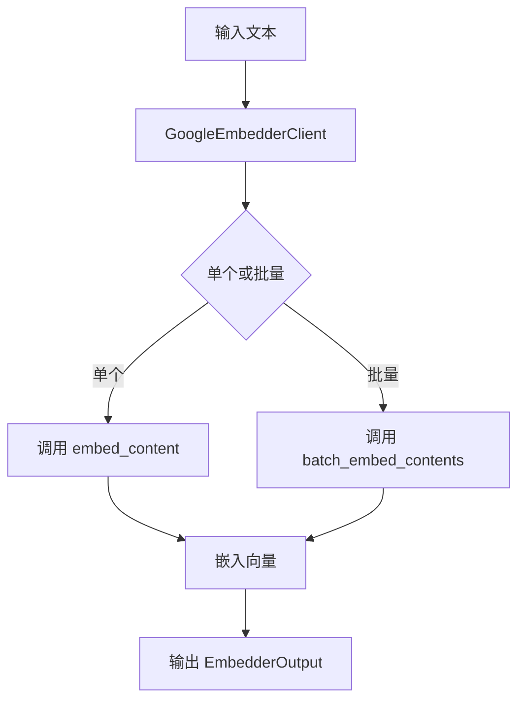
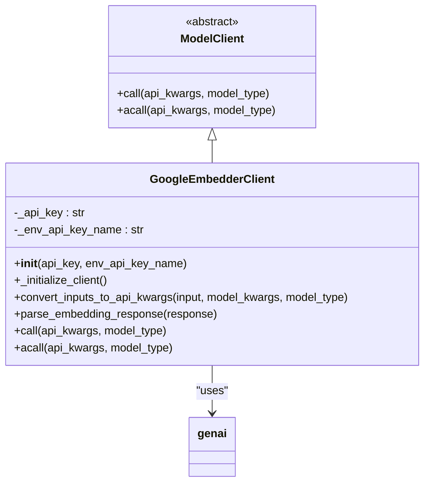
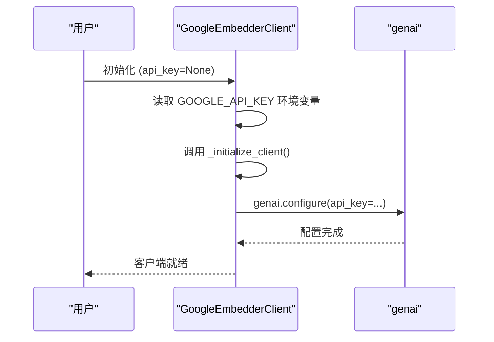
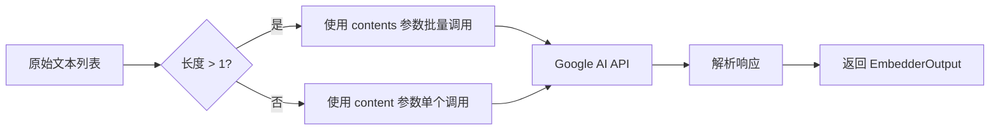

# Google嵌入器客户端

<cite>
**本文档引用的文件**
- [google_embedder_client.py](file://api/google_embedder_client.py)
- [embedder.json](file://api/config/embedder.json)
- [config.py](file://api/config.py)
- [test_google_embedder.py](file://tests/unit/test_google_embedder.py)
</cite>

## 目录
1. [简介](#简介)
2. [核心职责与功能](#核心职责与功能)
3. [架构与集成](#架构与集成)
4. [配置与初始化](#配置与初始化)
5. [输入处理与API调用](#输入处理与api调用)
6. [响应解析](#响应解析)
7. [批处理与性能](#批处理与性能)
8. [测试与验证](#测试与验证)

## 简介
`GoogleEmbedderClient` 是一个专用于生成文本嵌入的客户端组件，封装了 Google Generative AI SDK（`genai` 库）的嵌入功能。该组件不支持聊天补全功能，专注于为语义检索、相似性计算和分类等任务提供高质量的文本向量表示。

**Section sources**
- [google_embedder_client.py](file://api/google_embedder_client.py#L19-L50)

## 核心职责与功能
`GoogleEmbedderClient` 的核心职责是作为 Google AI 嵌入 API 的封装层，专门处理文本嵌入生成任务。其主要功能包括：

- **文本嵌入生成**：通过调用 Google AI API 的 `embed_content` 和 `batch_embed_contents` 方法，将输入文本转换为高维向量。
- **模型类型限制**：仅支持 `ModelType.EMBEDDER` 类型，明确排除了聊天补全等其他功能。
- **任务类型支持**：支持多种嵌入任务类型，如语义相似性（`SEMANTIC_SIMILARITY`）、文档检索（`retrieval_document`）和查询检索（`retrieval_query`）。

**Diagram sources**
- [google_embedder_client.py](file://api/google_embedder_client.py#L190-L221)

**Section sources**
- [google_embedder_client.py](file://api/google_embedder_client.py#L140-L183)

## 架构与集成
`GoogleEmbedderClient` 继承自 `ModelClient` 基类，遵循统一的模型客户端接口规范。它通过 `genai` 库与 Google AI API 进行交互，实现了 `call` 和 `acall` 方法以支持同步和异步调用。

该组件与项目中的配置系统紧密集成，通过 `config.py` 中的 `CLIENT_CLASSES` 映射和 `get_embedder_config` 函数动态加载配置。`embedder.json` 配置文件定义了 `embedder_google` 的具体参数，包括模型名称和任务类型。

**Diagram sources**
- [google_embedder_client.py](file://api/google_embedder_client.py#L19-L230)
- [config.py](file://api/config.py#L144-L183)

**Section sources**
- [google_embedder_client.py](file://api/google_embedder_client.py#L19-L230)
- [config.py](file://api/config.py#L144-L183)

## 配置与初始化
`GoogleEmbedderClient` 的配置主要涉及 API 密钥和模型名称的管理。

- **API 密钥**：通过 `api_key` 参数或 `GOOGLE_API_KEY` 环境变量提供。在 `__init__` 方法中，如果未直接传入密钥，则会尝试从环境变量中读取。`_initialize_client` 方法负责使用密钥配置 `genai` 客户端。
- **模型名称**：在 `convert_inputs_to_api_kwargs` 方法中，如果 `model_kwargs` 中未指定模型名称，则默认使用 `text-embedding-004`。该配置也可在 `embedder.json` 中全局设置。

**Diagram sources**
- [google_embedder_client.py](file://api/google_embedder_client.py#L52-L66)
- [google_embedder_client.py](file://api/google_embedder_client.py#L68-L75)

**Section sources**
- [google_embedder_client.py](file://api/google_embedder_client.py#L52-L75)
- [embedder.json](file://api/config/embedder.json#L20-L25)

## 输入处理与API调用
`convert_inputs_to_api_kwargs` 方法负责将输入数据转换为 Google AI API 所需的格式。

- **输入处理**：接受字符串或字符串序列作为输入。如果是单个字符串，则包装为列表；如果是序列，则转换为列表。
- **API 参数构建**：根据输入长度决定使用 `content`（单个）还是 `contents`（批量）参数。同时，为 `task_type` 和 `model` 设置默认值。
- **API 调用**：`call` 方法根据 `api_kwargs` 中的参数选择调用 `genai.embed_content`。它支持指数退避重试机制，以提高 API 调用的稳定性。

**Section sources**
- [google_embedder_client.py](file://api/google_embedder_client.py#L140-L183)
- [google_embedder_client.py](file://api/google_embedder_client.py#L190-L221)

## 响应解析
`parse_embedding_response` 方法负责将 Google AI API 的原始响应解析为统一的 `EmbedderOutput` 格式。

- **响应结构处理**：能够处理多种响应格式，包括单个嵌入（`{'embedding': [float, ...]}`）、批量嵌入（`{'embedding': [[float, ...], ...]}`）和替代格式（`{'embeddings': [{'embedding': [float, ...]}, ...]}`）。
- **错误处理**：对空数据、无效结构或异常类型进行日志记录，并返回带有错误信息的 `EmbedderOutput`。
- **输出标准化**：将解析后的嵌入数据封装为 `Embedding` 对象列表，并包含原始响应和可能的错误信息。

**Section sources**
- [google_embedder_client.py](file://api/google_embedder_client.py#L77-L138)

## 批处理与性能
`GoogleEmbedderClient` 原生支持批量嵌入，通过 `contents` 参数一次性处理多个文本。

- **输入长度限制**：虽然文档未明确说明，但 Google AI API 对输入文本长度和批量大小有限制。建议在实际使用中进行测试和验证。
- **批处理最佳实践**：为了优化性能，应尽可能使用批量调用。`embedder.json` 配置文件中的 `batch_size` 参数（设置为 100）为批处理提供了指导。
- **异步支持**：`acall` 方法目前是同步 `call` 方法的包装，因为 `genai` 客户端尚不支持原生异步。未来升级后可实现真正的异步调用。

**Diagram sources**
- [embedder.json](file://api/config/embedder.json#L20-L25)

**Section sources**
- [google_embedder_client.py](file://api/google_embedder_client.py#L190-L221)

## 测试与验证
项目提供了全面的测试用例来验证 `GoogleEmbedderClient` 的功能。

- **单元测试**：`test_google_embedder.py` 文件包含对客户端的直接测试，验证单个和批量嵌入的功能。
- **集成测试**：`test_all_embedders.py` 和 `test_full_integration.py` 测试了嵌入器工厂函数 `get_embedder` 如何根据配置正确选择和初始化 `GoogleEmbedderClient`。
- **配置测试**：测试用例验证了 `is_google_embedder` 和 `get_embedder_type` 等配置检测函数的正确性。

**Section sources**
- [test_google_embedder.py](file://tests/unit/test_google_embedder.py#L22-L73)
- [config.py](file://api/config.py#L185-L199)