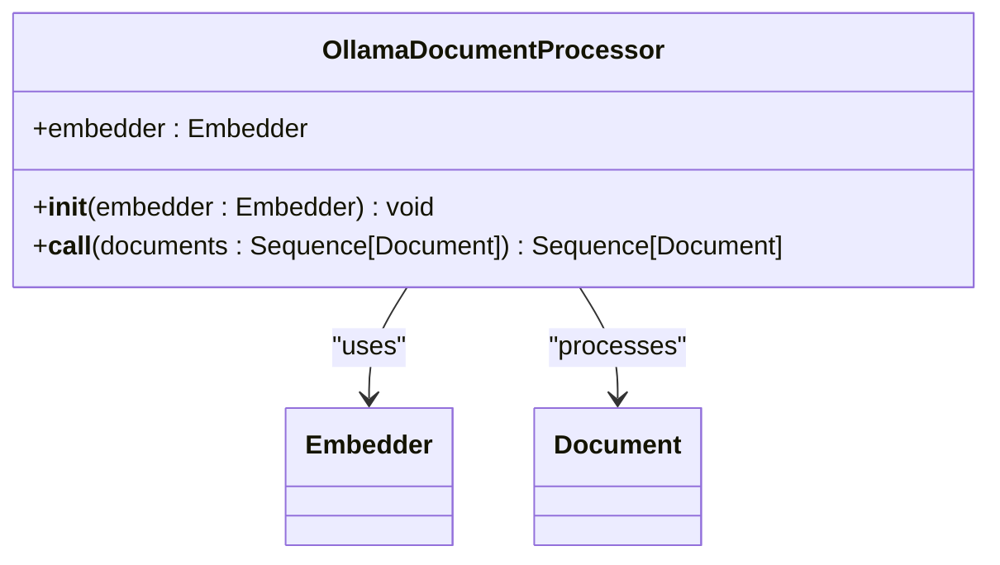
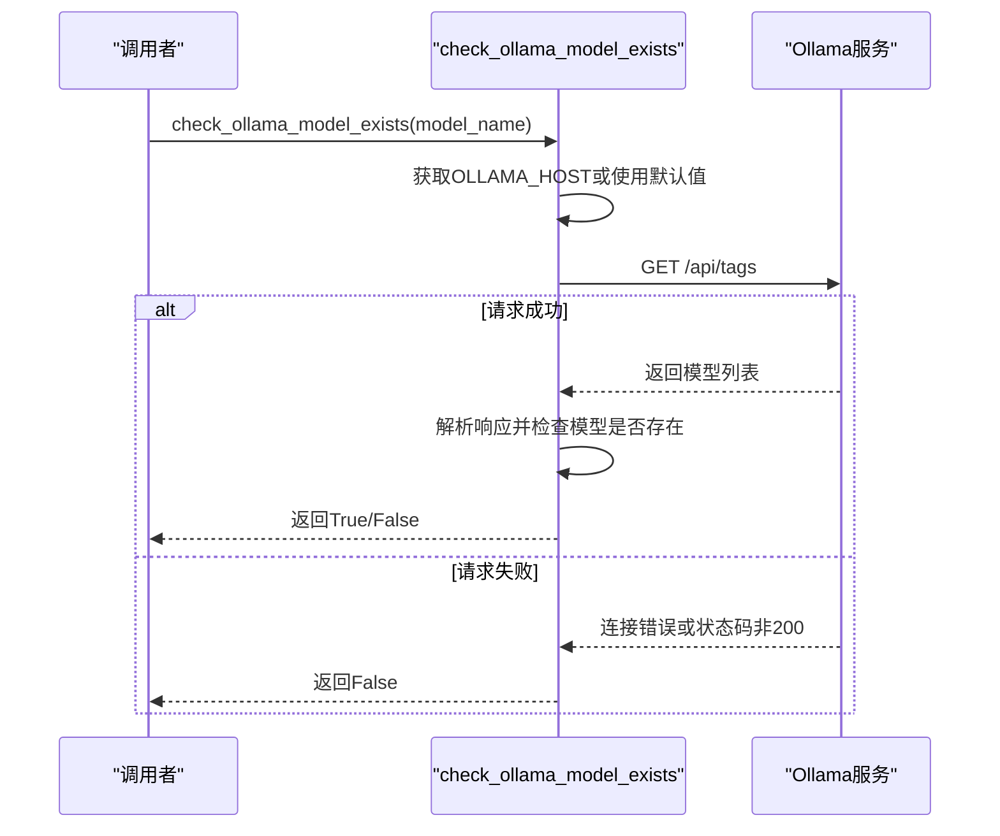
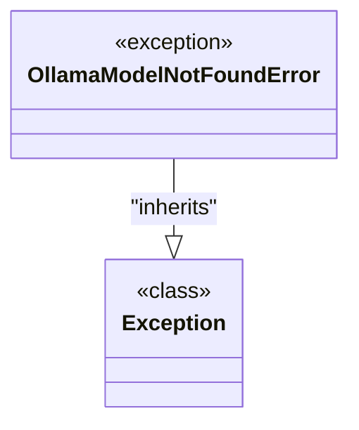
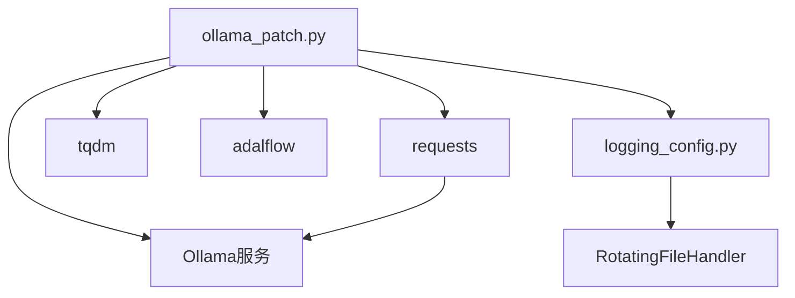

# Ollama补丁与兼容层

<cite>
**Referenced Files in This Document**   
- [ollama_patch.py](file://api/ollama_patch.py)
- [logging_config.py](file://api/logging_config.py)
- [data_pipeline.py](file://api/data_pipeline.py)
</cite>

## 目录
1. [简介](#简介)
2. [核心组件](#核心组件)
3. [OllamaDocumentProcessor类分析](#ollamadocumentprocessor类分析)
4. [模型存在性检查机制](#模型存在性检查机制)
5. [自定义异常处理](#自定义异常处理)
6. [依赖关系分析](#依赖关系分析)
7. [结论](#结论)

## 简介
`ollama_patch.py`模块是为解决AdalFlow框架中Ollama客户端不支持批量嵌入功能而设计的兼容层。该模块通过实现逐个处理文档的策略，确保了系统能够稳定地与本地Ollama服务集成。它不仅提供了文档处理的替代方案，还增强了对模型可用性的预检查能力，从而提升了整个系统的健壮性和用户体验。

**Section sources**
- [ollama_patch.py](file://api/ollama_patch.py#L1-L20)

## 核心组件
本模块包含三个核心组件：`OllamaDocumentProcessor`类用于处理文档嵌入，`check_ollama_model_exists`函数用于验证模型存在性，以及`OllamaModelNotFoundError`自定义异常类用于错误处理。这些组件共同构成了一个完整的Ollama兼容解决方案，允许系统在不修改上游库的情况下，安全、高效地使用本地Ollama模型进行嵌入处理。

**Section sources**
- [ollama_patch.py](file://api/ollama_patch.py#L16-L104)

## OllamaDocumentProcessor类分析
`OllamaDocumentProcessor`类继承自`DataComponent`，其主要职责是作为AdalFlow框架中Ollama客户端的补丁，解决原生客户端不支持批量嵌入的问题。该类通过`__call__`方法接收文档序列，并逐个调用嵌入器获取向量表示。

**Diagram sources**
- [ollama_patch.py](file://api/ollama_patch.py#L61-L104)

在处理过程中，该类会深拷贝输入文档，使用`tqdm`库提供进度反馈，并确保所有成功处理的文档具有相同的嵌入向量维度。如果检测到维度不一致，相关文档将被跳过以保证数据一致性。此外，该处理器还会记录详细的日志信息，包括处理进度和遇到的任何问题。

**Section sources**
- [ollama_patch.py](file://api/ollama_patch.py#L61-L104)
- [data_pipeline.py](file://api/data_pipeline.py#L376-L409)

## 模型存在性检查机制
`check_ollama_model_exists`函数通过向Ollama服务的`/api/tags`端点发送HTTP GET请求来验证指定模型是否存在。该函数首先从环境变量`OLLAMA_HOST`获取主机地址，若未设置则默认使用`http://localhost:11434`。在发送请求前，函数会清理可能存在的重复`/api`前缀以确保URL正确。

**Diagram sources**
- [ollama_patch.py](file://api/ollama_patch.py#L20-L59)

函数解析返回的JSON数据，提取所有可用模型的名称（去除标签部分），并与请求的模型名称进行比较。此预检查机制能有效防止因模型缺失导致的运行时错误，提高系统的容错能力。同时，函数具备完善的异常处理机制，能够应对网络连接问题等各种潜在故障。

**Section sources**
- [ollama_patch.py](file://api/ollama_patch.py#L20-L59)

## 自定义异常处理
`OllamaModelNotFoundError`是一个继承自Python内置`Exception`类的自定义异常，专门用于标识Ollama模型不存在的情况。尽管当前实现中该异常尚未被直接抛出，但其存在为未来的错误处理机制扩展提供了基础。通过定义特定领域的异常类型，代码的可读性和可维护性得到提升，调用者可以更精确地捕获和处理与Ollama模型相关的错误。

**Diagram sources**
- [ollama_patch.py](file://api/ollama_patch.py#L16-L18)

这种设计模式遵循了Python的异常处理最佳实践，即为特定错误情况创建专门的异常类型。这使得错误处理逻辑更加清晰，有助于构建更加健壮的应用程序。

**Section sources**
- [ollama_patch.py](file://api/ollama_patch.py#L16-L18)

## 依赖关系分析
`ollama_patch.py`模块依赖于多个外部库和内部组件。它使用`requests`库进行HTTP通信，`tqdm`提供进度显示，`adalflow`作为核心框架集成。日志功能通过`logging_config.py`中的`setup_logging`函数配置，确保了统一的日志格式和输出策略。

**Diagram sources**
- [ollama_patch.py](file://api/ollama_patch.py#L1-L104)
- [logging_config.py](file://api/logging_config.py#L1-L85)

在应用层面，`OllamaDocumentProcessor`被`data_pipeline.py`中的`prepare_data_pipeline`函数调用，当嵌入器类型为'ollama'时被实例化。这种设计实现了不同嵌入器之间的无缝切换，体现了良好的模块化架构。

**Section sources**
- [ollama_patch.py](file://api/ollama_patch.py#L1-L104)
- [data_pipeline.py](file://api/data_pipeline.py#L376-L409)
- [logging_config.py](file://api/logging_config.py#L1-L85)

## 结论
`ollama_patch.py`模块成功地解决了AdalFlow框架与Ollama服务之间的兼容性问题，通过实现文档的逐个处理机制弥补了批量嵌入功能的缺失。其内置的模型存在性检查功能显著提高了系统的稳定性和用户体验。该模块的设计体现了良好的软件工程实践，包括清晰的关注点分离、适当的错误处理和详尽的日志记录。作为一个非侵入式的补丁层，它在不修改上游库的前提下增强了系统功能，展示了如何通过适配器模式有效集成第三方服务。