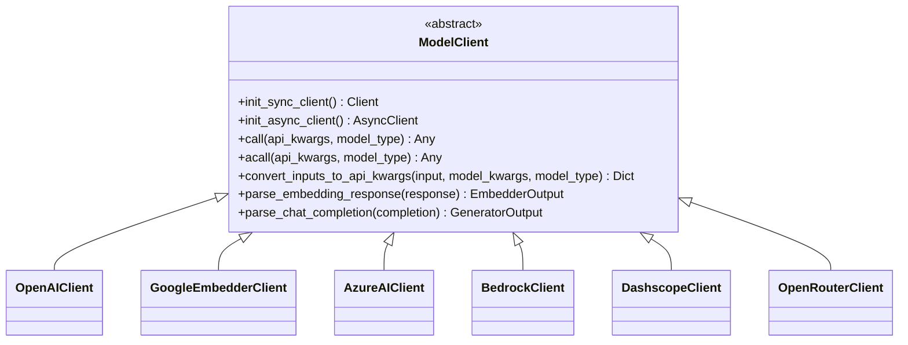
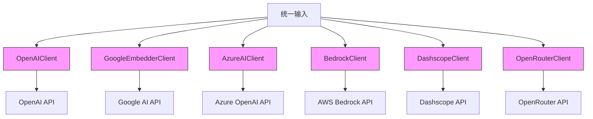
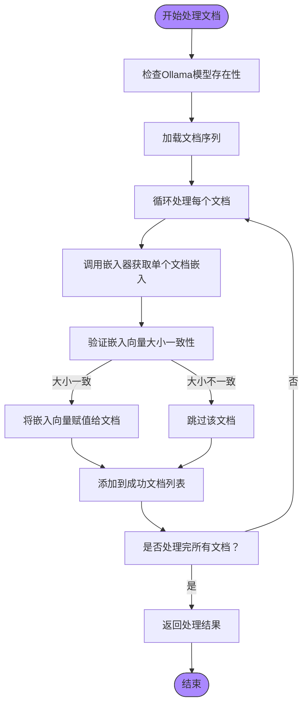
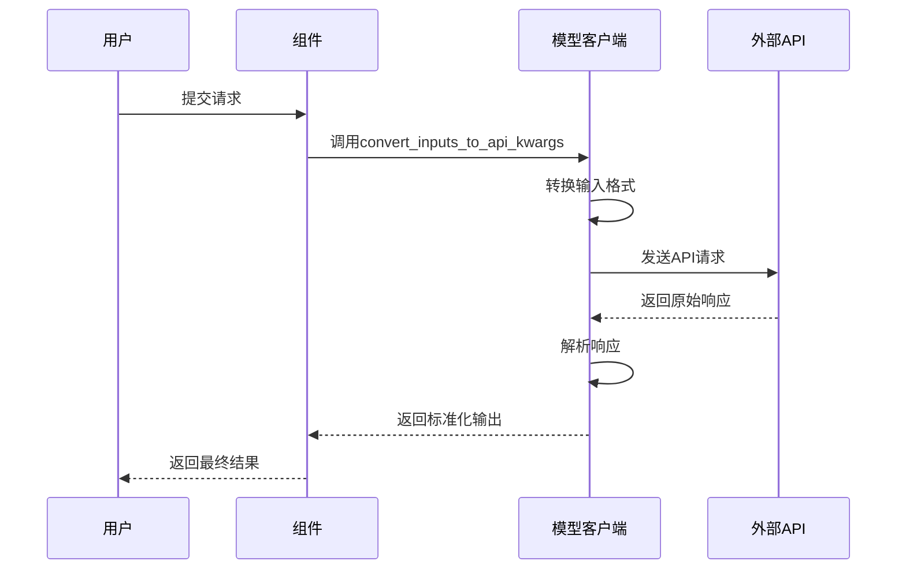

# 模型客户端

<cite>
**本文档引用的文件**   
- [openai_client.py](file://api/openai_client.py)
- [google_embedder_client.py](file://api/google_embedder_client.py)
- [ollama_patch.py](file://api/ollama_patch.py)
- [azureai_client.py](file://api/azureai_client.py)
- [bedrock_client.py](file://api/bedrock_client.py)
- [dashscope_client.py](file://api/dashscope_client.py)
- [openrouter_client.py](file://api/openrouter_client.py)
- [config.py](file://api/config.py)
- [logging_config.py](file://api/logging_config.py)
</cite>

## 目录
1. [引言](#引言)
2. [客户端抽象层设计](#客户端抽象层设计)
3. [接口一致性与实现差异分析](#接口一致性与实现差异分析)
4. [Ollama API兼容性修复策略](#ollama-api兼容性修复策略)
5. [核心功能实现](#核心功能实现)
6. [扩展指南](#扩展指南)
7. [配置管理](#配置管理)

## 引言

本项目实现了多个大型语言模型（LLM）和嵌入模型（Embedding Model）提供商的客户端，旨在为不同AI服务提供统一的接口抽象。这些客户端封装了与OpenAI、Google、Azure、AWS Bedrock、阿里云百炼（Dashscope）、OpenRouter以及Ollama等平台的API交互逻辑，使上层应用能够以一致的方式调用不同的模型服务。

所有客户端均继承自`ModelClient`基类，遵循统一的接口规范，支持同步和异步调用、错误重试、请求超时处理、API密钥管理和流式响应解析等核心功能。通过这种设计，系统实现了模型提供商的可插拔性，便于用户根据需求灵活切换后端服务。

## 客户端抽象层设计

模型客户端的抽象层设计基于`ModelClient`基类，定义了一套标准化的接口，确保所有具体实现保持一致的行为模式。该设计的核心组件包括：

- **统一接口**：所有客户端必须实现`call`和`acall`方法，分别用于同步和异步调用模型API。
- **输入转换**：通过`convert_inputs_to_api_kwargs`方法，将组件的标准输入转换为特定API所需的格式。
- **响应解析**：提供`parse_embedding_response`和`parse_chat_completion`等方法，将原始API响应解析为系统内部统一的数据结构。
- **生命周期管理**：通过`init_sync_client`和`init_async_client`方法初始化同步和异步客户端实例。



**图示来源**
- [openai_client.py](file://api/openai_client.py#L119-L586)
- [google_embedder_client.py](file://api/google_embedder_client.py#L19-L230)
- [azureai_client.py](file://api/azureai_client.py#L100-L487)
- [bedrock_client.py](file://api/bedrock_client.py#L50-L317)
- [dashscope_client.py](file://api/dashscope_client.py#L150-L799)
- [openrouter_client.py](file://api/openrouter_client.py#L50-L525)

**本节来源**
- [openai_client.py](file://api/openai_client.py#L119-L586)
- [google_embedder_client.py](file://api/google_embedder_client.py#L19-L230)

## 接口一致性与实现差异分析

尽管所有客户端都遵循相同的抽象接口，但由于不同提供商的API设计存在差异，各实现类在具体细节上有所不同。以下是对`OpenAIClient`和`GoogleEmbedderClient`的对比分析：

### 接口一致性

| 特性 | OpenAIClient | GoogleEmbedderClient |
|------|--------------|---------------------|
| 基类继承 | ModelClient | ModelClient |
| 同步调用 | call() | call() |
| 异步调用 | acall() | acall() |
| 输入转换 | convert_inputs_to_api_kwargs() | convert_inputs_to_api_kwargs() |
| 响应解析 | parse_embedding_response() | parse_embedding_response() |
| 错误重试 | @backoff装饰器 | @backoff装饰器 |

### 实现差异

**OpenAIClient**支持多种模型类型，包括文本嵌入、聊天补全和图像生成。它能够处理多模态输入，支持通过`model_kwargs["images"]`参数传递图像路径或URL。对于非流式调用，该客户端会模拟流式响应以确保接口一致性。

**GoogleEmbedderClient**专注于嵌入模型，仅支持`ModelType.EMBEDDER`类型。其`acall`方法目前是同步调用的简单封装，因为Google AI Python客户端尚未提供原生的异步支持。



**图示来源**
- [openai_client.py](file://api/openai_client.py#L119-L586)
- [google_embedder_client.py](file://api/google_embedder_client.py#L19-L230)
- [azureai_client.py](file://api/azureai_client.py#L100-L487)
- [bedrock_client.py](file://api/bedrock_client.py#L50-L317)
- [dashscope_client.py](file://api/dashscope_client.py#L150-L799)
- [openrouter_client.py](file://api/openrouter_client.py#L50-L525)

**本节来源**
- [openai_client.py](file://api/openai_client.py#L119-L586)
- [google_embedder_client.py](file://api/google_embedder_client.py#L19-L230)

## Ollama API兼容性修复策略

由于Adalflow的Ollama客户端不支持批量嵌入，系统通过`OllamaDocumentProcessor`类实现了兼容性修复。该策略的核心是逐个处理文档，确保与现有批量处理流程的兼容。

### 核心组件

`OllamaDocumentProcessor`是一个数据组件，它接收一个嵌入器实例，并在调用时逐个处理文档序列。其主要功能包括：

- **逐个处理**：使用`tqdm`进度条逐个处理文档，提供可视化反馈。
- **一致性验证**：检查每个文档生成的嵌入向量大小是否一致，避免因模型输出不稳定导致的问题。
- **错误处理**：捕获并记录处理过程中的异常，确保部分失败不会中断整个流程。

### 模型存在性检查

`check_ollama_model_exists`函数用于在使用前检查指定模型是否存在于Ollama服务器上。它通过向`/api/tags`端点发送GET请求获取可用模型列表，并验证目标模型是否在其中。



**图示来源**
- [ollama_patch.py](file://api/ollama_patch.py#L50-L104)

**本节来源**
- [ollama_patch.py](file://api/ollama_patch.py#L50-L104)

## 核心功能实现

### 错误重试机制

所有客户端均使用`backoff`库实现指数退避重试策略。当遇到API超时、内部服务器错误、速率限制等异常时，系统会自动进行重试，最大等待时间为5秒。

```python
@backoff.on_exception(
    backoff.expo,
    (
        APITimeoutError,
        InternalServerError,
        RateLimitError,
        UnprocessableEntityError,
        BadRequestError,
    ),
    max_time=5,
)
def call(self, api_kwargs: Dict = {}, model_type: ModelType = ModelType.UNDEFINED):
    # API调用逻辑
    pass
```

### 请求超时处理

客户端通过`requests`库的`timeout`参数实现请求超时控制。例如，在检查Ollama模型存在性时，设置了5秒的超时限制，防止因网络问题导致长时间阻塞。

### API密钥管理

API密钥优先从环境变量中读取，如`OPENAI_API_KEY`、`GOOGLE_API_KEY`等。如果未设置环境变量，则允许通过构造函数参数传入。这种设计既保证了安全性，又提供了灵活性。

### 流式响应解析

对于支持流式响应的API（如OpenAI），客户端提供了`handle_streaming_response`生成器函数，能够逐块处理响应数据。对于不支持流式响应的API，则通过模拟流式行为保持接口一致性。

## 扩展指南

要新增一个模型提供商，需要遵循以下步骤：

1. **创建客户端类**：继承`ModelClient`基类，实现必要的方法。
2. **实现API调用**：在`call`和`acall`方法中封装具体的API调用逻辑。
3. **处理输入输出**：重写`convert_inputs_to_api_kwargs`和响应解析方法，确保数据格式正确转换。
4. **添加错误处理**：使用适当的装饰器或异常处理机制管理API调用中的错误。
5. **更新配置**：在`config.py`中添加新的客户端类到`CLIENT_CLASSES`映射中。



**图示来源**
- [openai_client.py](file://api/openai_client.py#L119-L586)
- [google_embedder_client.py](file://api/google_embedder_client.py#L19-L230)

**本节来源**
- [openai_client.py](file://api/openai_client.py#L119-L586)
- [google_embedder_client.py](file://api/google_embedder_client.py#L19-L230)

## 配置管理

系统的配置管理通过`config.py`文件实现，主要功能包括：

- **环境变量加载**：从环境变量中读取API密钥和其他配置参数。
- **JSON配置文件**：支持从`generator.json`、`embedder.json`等文件中加载模型配置。
- **占位符替换**：支持在配置文件中使用`${ENV_VAR}`语法引用环境变量。
- **动态配置**：提供`get_model_config`函数，根据指定的提供商和模型名称返回相应的配置。

配置文件的结构遵循分层设计，将生成器、嵌入器、仓库等不同模块的配置分离，便于维护和扩展。

**本节来源**
- [config.py](file://api/config.py#L1-L387)
- [logging_config.py](file://api/logging_config.py#L1-L85)