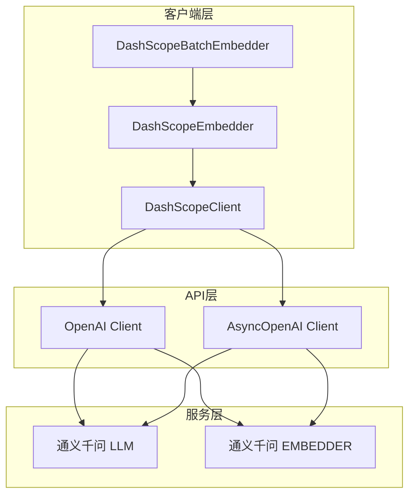
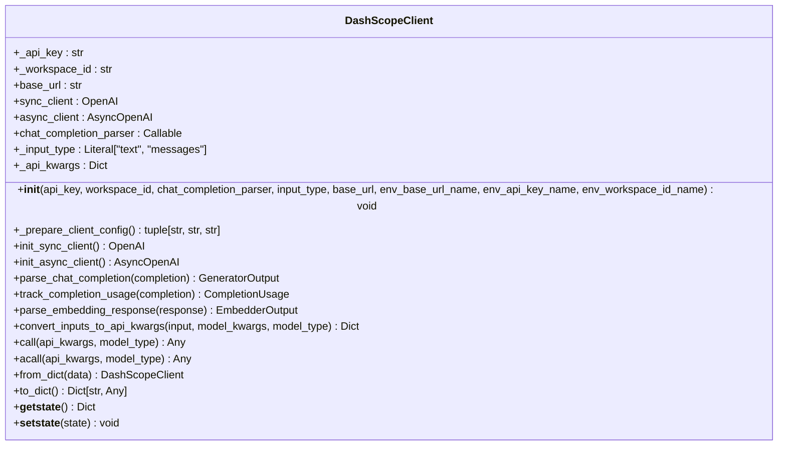
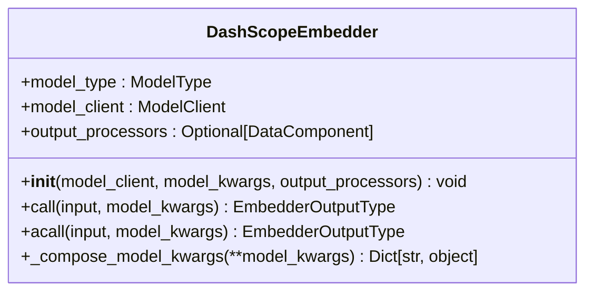
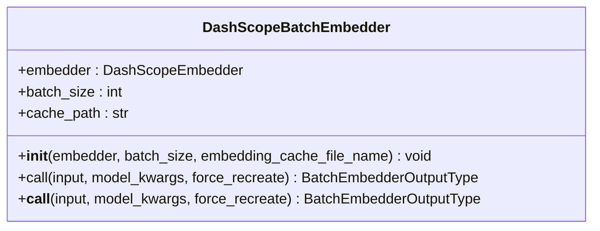
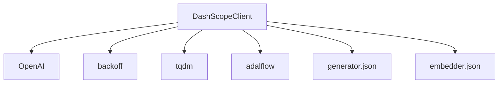

# 通义千问客户端

<cite>
**Referenced Files in This Document**   
- [dashscope_client.py](file://api/dashscope_client.py)
- [generator.json](file://api/config/generator.json)
- [embedder.json](file://api/config/embedder.json)
</cite>

## 更新摘要
**已更改内容**   
- 在“详细组件分析”部分新增了关于异步流式响应处理的说明
- 更新了`acall`方法的文档，以反映`async_stream_generator`的实现
- 增加了对异步流式响应生成器功能的描述

## 目录
1. [简介](#简介)
2. [核心组件](#核心组件)
3. [架构概述](#架构概述)
4. [详细组件分析](#详细组件分析)
5. [依赖分析](#依赖分析)
6. [性能考虑](#性能考虑)
7. [故障排除指南](#故障排除指南)
8. [结论](#结论)

## 简介
`DashScopeClient` 是一个用于集成阿里云通义千问大模型服务的客户端组件。该文档详细说明了其如何支持聊天模型（LLM）和嵌入模型（EMBEDDER），以及其核心功能的实现细节。客户端通过 `dashscope` Python SDK 与阿里云服务进行交互，需要配置 `DASHSCOPE_API_KEY` 环境变量来完成身份验证。它能够根据 `model_type` 参数在 `call` 方法中路由到不同的API端点，并灵活地构造 `api_kwargs` 参数以适配不同的模型需求。

## 核心组件
`DashScopeClient` 的核心功能围绕着与通义千问API的通信展开。它实现了 `ModelClient` 接口，提供了同步和异步的调用方式。该客户端支持两种主要的模型类型：聊天模型（LLM）和嵌入模型（EMBEDDER）。对于聊天模型，它处理消息列表并返回生成的文本；对于嵌入模型，它将文本输入转换为向量表示。客户端还包含了对流式响应的处理，以及通过指数退避算法来处理API调用中的常见错误（如超时、内部服务器错误、速率限制等）。

**Section sources**
- [dashscope_client.py](file://api/dashscope_client.py#L1-L914)

## 架构概述
`DashScopeClient` 的架构设计遵循了模块化和可扩展的原则。它利用了 `OpenAI` 兼容的API模式，通过 `OpenAI` 和 `AsyncOpenAI` 客户端库与阿里云的API进行通信。客户端的初始化过程会从环境变量中读取API密钥和工作区ID，并据此配置同步和异步客户端实例。`convert_inputs_to_api_kwargs` 方法负责将不同类型的输入（如字符串或消息列表）转换为API调用所需的参数字典。`call` 和 `acall` 方法则根据 `model_type` 路由到相应的API端点，并处理响应。

**Diagram sources**
- [dashscope_client.py](file://api/dashscope_client.py#L1-L914)

## 详细组件分析
本节将深入分析 `DashScopeClient` 及其相关组件的实现细节。

### DashScopeClient 分析
`DashScopeClient` 是整个集成的核心。它的 `__init__` 方法负责初始化配置，包括从环境变量中获取API密钥和工作区ID。`_prepare_client_config` 方法是私有辅助方法，用于准备客户端配置，确保在缺少必要信息时抛出适当的错误。`init_sync_client` 和 `init_async_client` 方法分别创建同步和异步的OpenAI客户端实例，并将工作区ID存储在客户端对象中以备后续使用。

#### 聊天完成解析

**Diagram sources**
- [dashscope_client.py](file://api/dashscope_client.py#L1-L914)

#### API参数转换
`convert_inputs_to_api_kwargs` 方法是实现模型类型路由的关键。当 `model_type` 为 `ModelType.LLM` 时，它将输入（字符串或消息列表）转换为符合聊天API要求的 `messages` 字典。当 `model_type` 为 `ModelType.EMBEDDER` 时，它将输入（字符串、文档对象列表等）提取为纯文本列表，并将其放入 `input` 字段中。此方法还负责将工作区ID添加到请求头中。

#### 调用方法
`call` 方法是主要的同步调用入口。它根据 `model_type` 决定调用聊天API还是嵌入API。对于聊天模型，它会创建 `chat.completions.create` 调用；对于嵌入模型，它会创建 `embeddings.create` 调用。该方法还实现了错误处理和重试机制。`acall` 方法提供了异步版本的相同功能，特别地，当启用流式传输时，`acall` 方法会返回一个名为 `async_stream_generator` 的异步生成器，该生成器负责解析来自通义千问API的流式文本块，并逐个产生解析后的文本内容。

### DashScopeEmbedder 分析
`DashScopeEmbedder` 是一个面向用户的组件，它封装了 `DashScopeClient` 以提供更高级别的嵌入功能。它简化了嵌入模型的调用过程，用户只需提供输入文本和模型参数即可。

**Diagram sources**
- [dashscope_client.py](file://api/dashscope_client.py#L635-L717)

### DashScopeBatchEmbedder 分析
`DashScopeBatchEmbedder` 组件专门用于处理批量嵌入任务。它利用缓存机制来避免重复计算，并将大批次的输入分割成符合API限制的小批次进行处理。

**Diagram sources**
- [dashscope_client.py](file://api/dashscope_client.py#L720-L815)

## 依赖分析
`DashScopeClient` 的实现依赖于多个外部库和内部组件。其主要依赖包括 `dashscope` Python SDK（通过 `OpenAI` 兼容模式）、`backoff` 库用于错误重试、`tqdm` 用于进度条显示，以及 `adalflow` 框架的核心组件。配置文件 `generator.json` 和 `embedder.json` 定义了可用的模型及其参数，这些文件被系统用来动态配置客户端。

**Diagram sources**
- [dashscope_client.py](file://api/dashscope_client.py#L1-L914)
- [generator.json](file://api/config/generator.json)
- [embedder.json](file://api/config/embedder.json)

**Section sources**
- [dashscope_client.py](file://api/dashscope_client.py#L1-L914)
- [generator.json](file://api/config/generator.json)
- [embedder.json](file://api/config/embedder.json)

## 性能考虑
`DashScopeClient` 在性能方面进行了多项优化。`DashScopeBatchEmbedder` 组件通过缓存机制显著减少了对API的重复调用，提高了处理大量文本时的效率。同时，该组件将批次大小限制为25，以遵守通义千问API的限制。对于流式响应，客户端提供了 `handle_streaming_response` 函数来逐块处理数据，这对于实时应用非常有用。错误重试机制也确保了在网络不稳定情况下的调用成功率。

## 故障排除指南
使用 `DashScopeClient` 时可能遇到的常见问题包括API密钥未设置、工作区ID缺失、输入文本为空或无效、以及API调用速率限制。日志记录功能可以帮助诊断这些问题。例如，如果 `DASHSCOPE_API_KEY` 环境变量未设置，`_prepare_client_config` 方法会抛出 `ValueError`。在调用嵌入API时，客户端会过滤掉空或无效的文本，并记录警告信息。对于速率限制错误，`backoff` 装饰器会自动进行重试。

**Section sources**
- [dashscope_client.py](file://api/dashscope_client.py#L1-L914)

## 结论
`DashScopeClient` 是一个功能强大且设计良好的客户端，它成功地将阿里云通义千问大模型服务集成到应用程序中。通过清晰的架构和模块化的设计，它支持聊天和嵌入两种主要的模型类型，并提供了同步、异步和批量处理等多种调用方式。其对错误处理、缓存和配置管理的考虑，使得该客户端既健壮又易于使用。开发者可以基于此客户端轻松地构建各种基于大模型的应用。