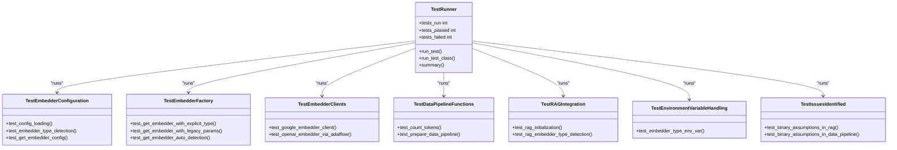
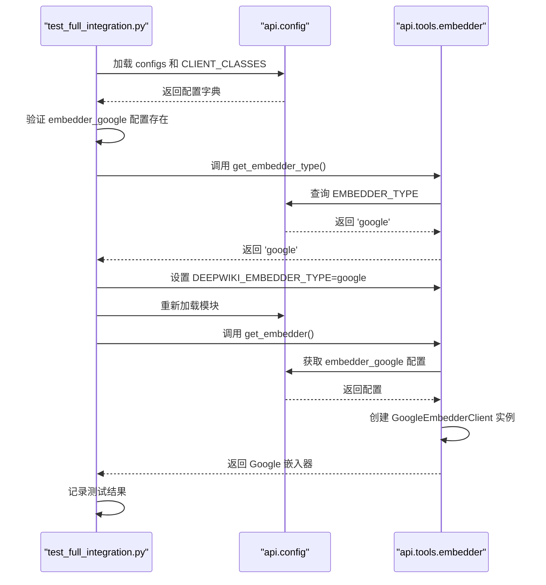
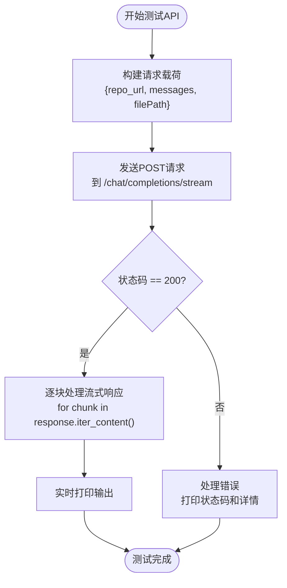
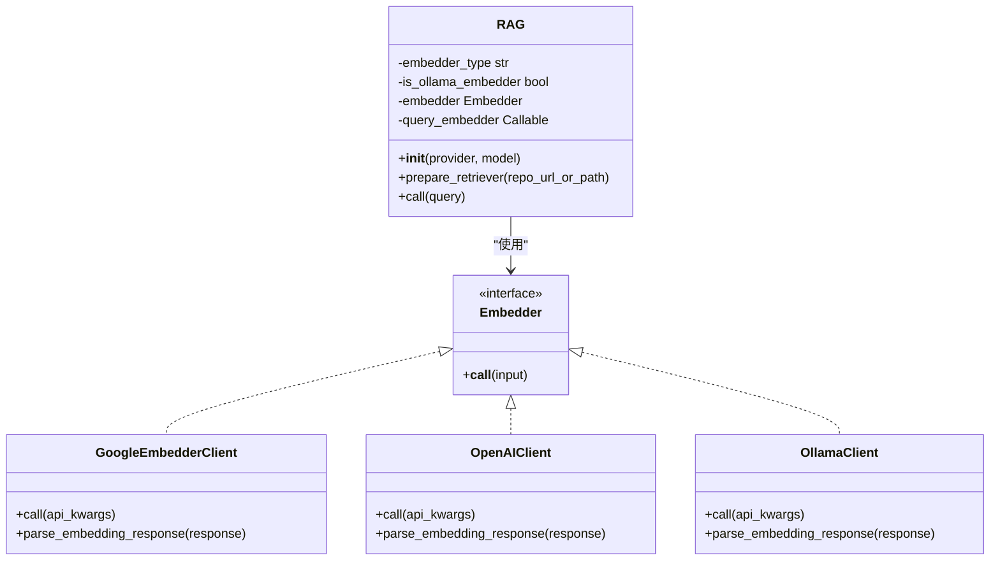

# 测试目录结构

<cite>
**本文档中引用的文件**  
- [tests/unit/test_all_embedders.py](file://tests/unit/test_all_embedders.py)
- [tests/unit/test_google_embedder.py](file://tests/unit/test_google_embedder.py)
- [tests/integration/test_full_integration.py](file://tests/integration/test_full_integration.py)
- [tests/api/test_api.py](file://tests/api/test_api.py)
- [tests/run_tests.py](file://tests/run_tests.py)
- [pytest.ini](file://pytest.ini)
- [test/test_extract_repo_name.py](file://test/test_extract_repo_name.py)
- [api/tools/embedder.py](file://api/tools/embedder.py)
- [api/rag.py](file://api/rag.py)
- [api/data_pipeline.py](file://api/data_pipeline.py)
- [api/google_embedder_client.py](file://api/google_embedder_client.py)
</cite>

## 目录

1. [测试目录结构概述](#测试目录结构概述)
2. [单元测试分析](#单元测试分析)
3. [集成测试分析](#集成测试分析)
4. [API测试分析](#api测试分析)
5. [测试运行脚本与配置](#测试运行脚本与配置)
6. [核心测试用例解析](#核心测试用例解析)
7. [结论](#结论)

## 测试目录结构概述

项目包含两个测试目录：`test/` 和 `tests/`，其中 `tests/` 是主要的测试目录，采用分层结构组织不同类型的测试。`test/` 目录仅包含一个基础测试文件，用于提取仓库名称的工具函数验证。

`tests/` 目录下包含以下子目录：
- **unit/**：存放单元测试，主要针对核心组件如嵌入器（embedder）进行细粒度验证。
- **integration/**：存放集成测试，验证端到端的系统流程和组件间的协作。
- **api/**：存放API测试，直接调用FastAPI端点，校验其功能和响应。

此外，`tests/` 根目录包含 `run_tests.py` 测试运行脚本和 `__init__.py` 初始化文件。

**Section sources**
- [test/test_extract_repo_name.py](file://test/test_extract_repo_name.py)
- [tests/__init__.py](file://tests/__init__.py)

## 单元测试分析

单元测试位于 `tests/unit/` 目录下，主要目标是验证核心函数的正确性，特别是嵌入器（embedder）系统的各个组件。`test_all_embedders.py` 是核心单元测试文件，它通过一个自定义的 `TestRunner` 类来组织和执行测试，确保在不依赖 `pytest` 的情况下也能全面覆盖。

该测试文件验证了以下关键逻辑：
- **配置加载**：确认 `api/config` 模块能正确加载 OpenAI、Google 和 Ollama 三种嵌入器的配置。
- **工厂模式**：通过 `get_embedder()` 函数（位于 `api/tools/embedder.py`）测试嵌入器的创建逻辑，支持通过 `embedder_type` 参数显式指定类型，或通过环境变量自动检测。
- **客户端功能**：直接测试 `GoogleEmbedderClient` 和 `OpenAIClient` 等客户端，验证其 `call()` 和 `parse_embedding_response()` 方法能否正确处理API请求和响应。
- **数据管道**：测试 `data_pipeline.py` 中的 `count_tokens()` 和 `prepare_data_pipeline()` 函数，确保它们能根据不同的嵌入器类型（如 Ollama）正确处理文本分块和嵌入。

`test_google_embedder.py` 是一个更专注的单元测试，旨在复现和修复 Google 嵌入器返回的响应中 `list` 对象没有 `embedding` 属性的错误。它通过直接调用客户端、AdalFlow 嵌入器和文档处理流程来验证修复方案。

**Diagram sources**
- [tests/unit/test_all_embedders.py](file://tests/unit/test_all_embedders.py#L1-L464)
- [tests/unit/test_google_embedder.py](file://tests/unit/test_google_embedder.py#L1-L183)

**Section sources**
- [tests/unit/test_all_embedders.py](file://tests/unit/test_all_embedders.py#L1-L464)
- [tests/unit/test_google_embedder.py](file://tests/unit/test_google_embedder.py#L1-L183)
- [api/tools/embedder.py](file://api/tools/embedder.py#L5-L53)
- [api/data_pipeline.py](file://api/data_pipeline.py#L27-L67)

## 集成测试分析

集成测试位于 `tests/integration/` 目录下，以 `test_full_integration.py` 为核心，旨在验证从配置加载到嵌入器选择的整个端到端流程。与单元测试不同，集成测试关注的是组件间的协作和系统在真实环境下的行为。

该测试文件执行了以下关键流程：
1.  **配置加载验证**：检查 `api/config` 模块是否能正确加载 `embedder_google` 配置和 `GoogleEmbedderClient` 类。
2.  **嵌入器选择机制**：测试 `get_embedder_type()` 和 `is_google_embedder()` 函数，验证系统能否正确识别当前配置的嵌入器类型。
3.  **环境变量驱动**：通过临时设置 `DEEPWIKI_EMBEDDER_TYPE=google` 环境变量，测试系统能否根据环境变量动态选择并创建 Google 嵌入器。这模拟了生产环境中通过 `.env` 文件或部署配置来切换服务的实际场景。

这些测试确保了当用户更改配置或环境变量时，整个系统能够无缝地切换到相应的嵌入器服务，而不会出现配置错误或服务不可用的情况。

**Diagram sources**
- [tests/integration/test_full_integration.py](file://tests/integration/test_full_integration.py#L1-L152)

**Section sources**
- [tests/integration/test_full_integration.py](file://tests/integration/test_full_integration.py#L1-L152)
- [api/config.py](file://api/config.py)
- [api/tools/embedder.py](file://api/tools/embedder.py#L5-L53)

## API测试分析

API测试位于 `tests/api/` 目录下，由 `test_api.py` 文件实现。这类测试直接与FastAPI应用的HTTP端点交互，验证其对外暴露的API功能是否符合预期。

`test_api.py` 主要测试 `/chat/completions/stream` 这个流式响应端点。其工作流程如下：
1.  **构建请求**：使用 `requests` 库向 `http://localhost:8000/chat/completions/stream` 发送POST请求。
2.  **准备载荷**：请求体（payload）包含 `repo_url`（目标GitHub仓库地址）、`messages`（用户查询）和可选的 `filePath`。
3.  **处理流式响应**：由于端点返回的是流式数据（stream=True），测试脚本会逐块（chunk）读取响应内容并实时打印，模拟客户端接收流式输出的过程。
4.  **错误处理**：检查HTTP状态码，并在出错时打印详细的错误信息。

这种测试方式确保了API端点能够正确接收输入、调用后端RAG引擎，并以正确的格式返回流式响应，是验证系统整体功能完整性的最后一道防线。

**Diagram sources**
- [tests/api/test_api.py](file://tests/api/test_api.py#L1-L71)

**Section sources**
- [tests/api/test_api.py](file://tests/api/test_api.py#L1-L71)
- [api/main.py](file://api/main.py)

## 测试运行脚本与配置

### `run_tests.py` 测试运行脚本

`tests/run_tests.py` 是一个统一的测试运行脚本，提供了运行所有或特定类别测试的便捷方式。其主要功能包括：
- **环境检查**：通过 `check_environment()` 函数检查 `.env` 文件、必要的API密钥（如 `GOOGLE_API_KEY`）和Python依赖项（如 `adalflow`）是否已正确配置。
- **灵活运行**：支持通过命令行参数选择运行特定类型的测试：
  - `--unit`：仅运行单元测试。
  - `--integration`：仅运行集成测试。
  - `--api`：仅运行API测试。
  - `--check-env`：仅检查环境，不运行测试。
- **执行与汇总**：使用 `subprocess` 模块逐一执行每个测试文件，捕获其输出和错误，并在最后生成一个包含总测试数、通过数和失败数的汇总报告。

### `pytest.ini` 配置文件

尽管项目主要使用自定义测试框架，但根目录下的 `pytest.ini` 文件表明项目也兼容 `pytest`。该配置文件定义了：
- **测试路径**：`testpaths = test` 指定 `pytest` 默认在 `test/` 目录下查找测试。
- **测试文件模式**：`python_files = test_*.py *_test.py` 定义了哪些文件会被识别为测试文件。
- **标记（Markers）**：定义了 `unit`、`integration`、`slow` 和 `network` 等标记，可用于对测试进行分类和筛选，例如 `pytest -m "unit"` 可以只运行标记为单元测试的用例。

**Section sources**
- [tests/run_tests.py](file://tests/run_tests.py#L1-L163)
- [pytest.ini](file://pytest.ini#L1-L16)

## 核心测试用例解析

为了确保RAG引擎和数据管道的可靠性，测试用例从多个维度进行了验证。

### RAG引擎的可靠性测试

在 `test_all_embedders.py` 的 `TestRAGIntegration` 类中，测试了 `RAG` 类的初始化和嵌入器类型检测。关键点在于 `RAG` 类的 `__init__` 方法会根据配置自动确定 `embedder_type`，并据此创建相应的嵌入器。测试用例验证了这一自动检测逻辑的正确性，确保了无论配置如何，RAG引擎都能使用正确的嵌入器进行初始化。

**Diagram sources**
- [api/rag.py](file://api/rag.py#L152-L444)
- [api/tools/embedder.py](file://api/tools/embedder.py#L5-L53)
- [api/google_embedder_client.py](file://api/google_embedder_client.py#L19-L230)

### 数据管道的可靠性测试

数据管道的可靠性通过 `TestDataPipelineFunctions` 类中的测试来保证。`test_count_tokens()` 函数验证了 `count_tokens()` 函数能根据 `embedder_type` 参数选择合适的分词器（如 Ollama 使用 `cl100k_base`）。`test_prepare_data_pipeline()` 函数则验证了 `prepare_data_pipeline()` 函数能根据嵌入器类型选择不同的处理策略：对于 Ollama，使用 `OllamaDocumentProcessor`；对于 OpenAI 和 Google，则使用支持批量处理的 `ToEmbeddings`。

这些测试确保了数据在进入RAG系统之前，能够被正确地分割、分词和嵌入，是保证最终检索和生成质量的基础。

**Section sources**
- [tests/unit/test_all_embedders.py](file://tests/unit/test_all_embedders.py#L300-L350)
- [api/data_pipeline.py](file://api/data_pipeline.py#L372-L414)
- [api/data_pipeline.py](file://api/data_pipeline.py#L27-L67)

## 结论

该项目的测试结构清晰，层次分明。通过 `tests/` 目录下的单元测试、集成测试和API测试，形成了一个完整的质量保障体系。单元测试深入到嵌入器和数据管道的核心逻辑，确保了组件的正确性；集成测试验证了配置与服务选择的端到端流程；API测试则从用户视角确认了系统功能的完整性。配合 `run_tests.py` 脚本和 `pytest.ini` 配置，开发者可以高效地运行和管理测试，从而确保RAG引擎和数据管道的稳定与可靠。